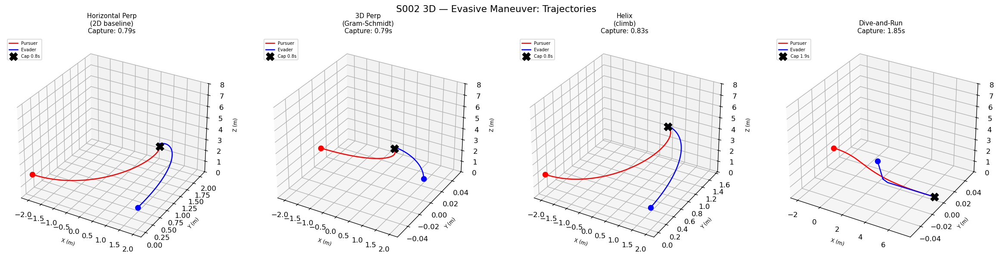
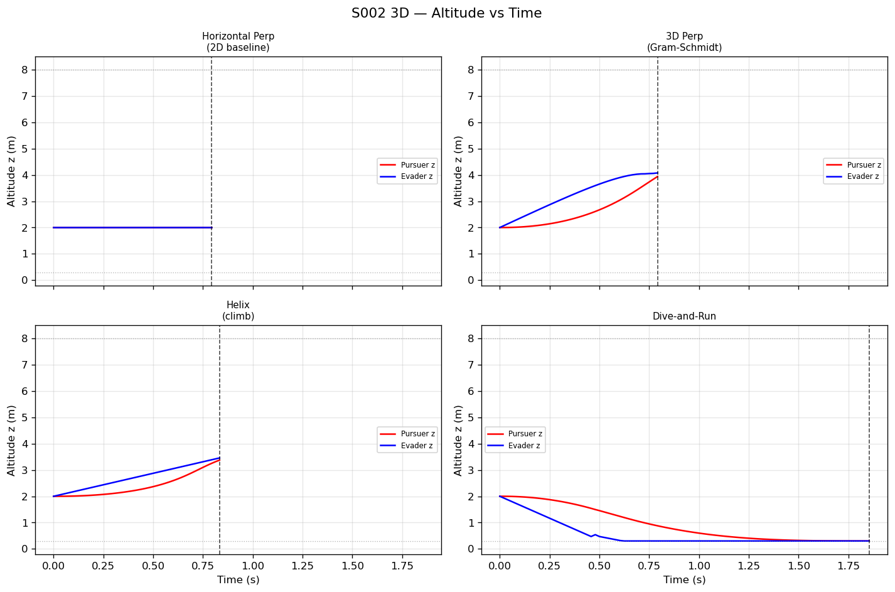
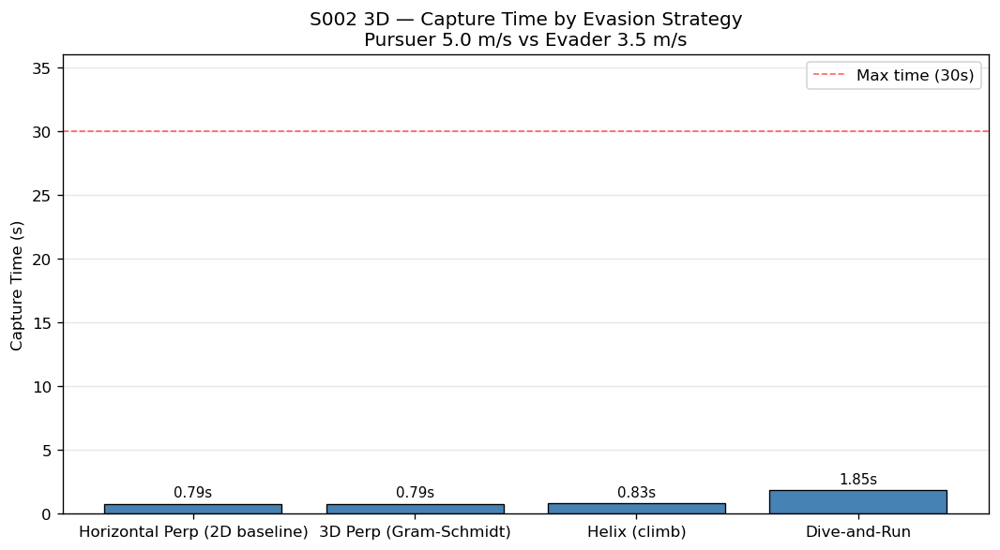
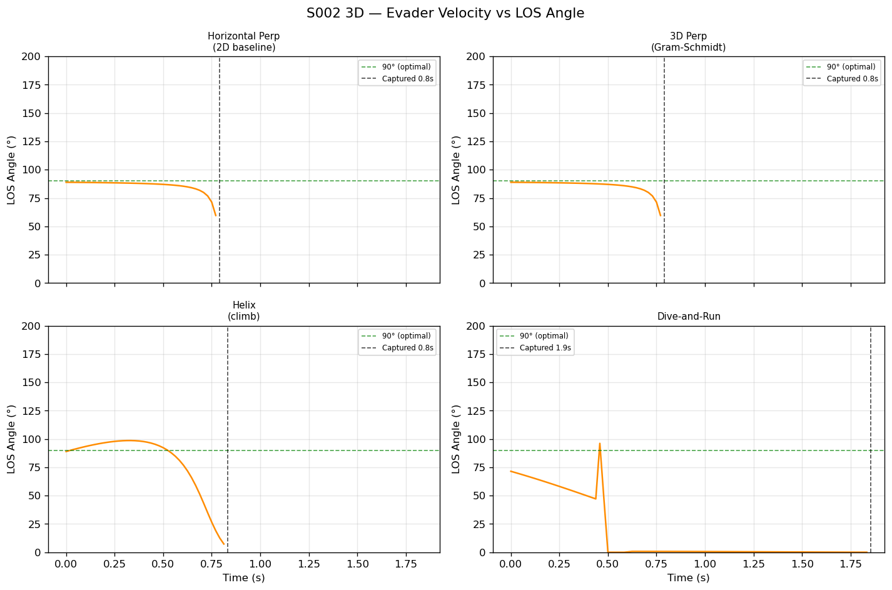
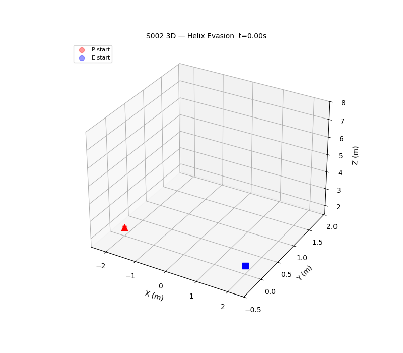

# S002 3D Upgrade — Evasive Maneuver

**Domain**: Pursuit & Evasion | **Difficulty**: ⭐⭐⭐ | **Status**: ✅ Completed

---

## Problem Definition

Pursuer (Pure Pursuit, full 3D) vs Evader using 4 different 3D evasion strategies.
Both drones operate in a bounded arena [-8, 8]³ m with altitude limits z ∈ [0.3, 8] m.
The pursuer speed (5 m/s) exceeds the evader speed (3.5 m/s), so capture is guaranteed — the question is which strategy maximally delays it.

---

## Key Parameters

| Parameter | Value |
|-----------|-------|
| Pursuer speed | 5.0 m/s |
| Evader speed | 3.5 m/s |
| Initial pursuer position | (-2, 0, 2) m |
| Initial evader position | (2, 0, 2) m |
| Capture radius | 0.15 m |
| Helix radius R_helix | 1.5 m |
| Helix pitch angle α | 30° |
| Altitude bounds | [0.3, 8] m |
| Arena | [-8, 8]³ m |
| Control frequency | 48 Hz |
| Max simulation time | 30 s |

---

## Evasion Strategies

| Strategy | Description |
|----------|-------------|
| `horizontal_perp` | Perpendicular in x-y plane only — 2D baseline, z=const |
| `perp_3d` | Gram-Schmidt: e_perp = z_hat − (z_hat·r_hat)·r_hat, normalised; fallback to x_hat if near-singular |
| `helix` | v_E = v_E · [-sin(ωt), cos(ωt), vz/vE], ω = v_E·cos(α)/R_helix, α=30° |
| `dive_and_run` | z drops to 0.5 m in first 0.5 s, then straight escape away from pursuer |

---

## Results

| Strategy | Capture Time | Notes |
|----------|-------------|-------|
| horizontal_perp | 0.79 s | 2D baseline — fastest capture |
| perp_3d | 0.79 s | Gram-Schmidt 3D perp — similar to 2D at close range |
| helix | 0.83 s | Slight improvement via helical path curvature |
| dive_and_run | 1.85 s | **Best** — altitude change creates largest vertical separation |

The dive_and_run strategy provides a ~2.3× extension of survival time vs the 2D baseline by exploiting vertical separation that requires the pursuer to track in 3D. At a starting distance of only 4 m with speed ratio k=5/3.5≈1.43, capture is always fast — but the relative ranking demonstrates the 3D advantage.

---

## Plots

## Animation (Helix Strategy)

---

## Related Scenarios

- Original: [S002](../../../scenarios/01_pursuit_evasion/S002_evasive_maneuver.md)
- 3D Card: [S002 3D](../../../scenarios/01_pursuit_evasion/3d/S002_3d_evasive_maneuver.md)
