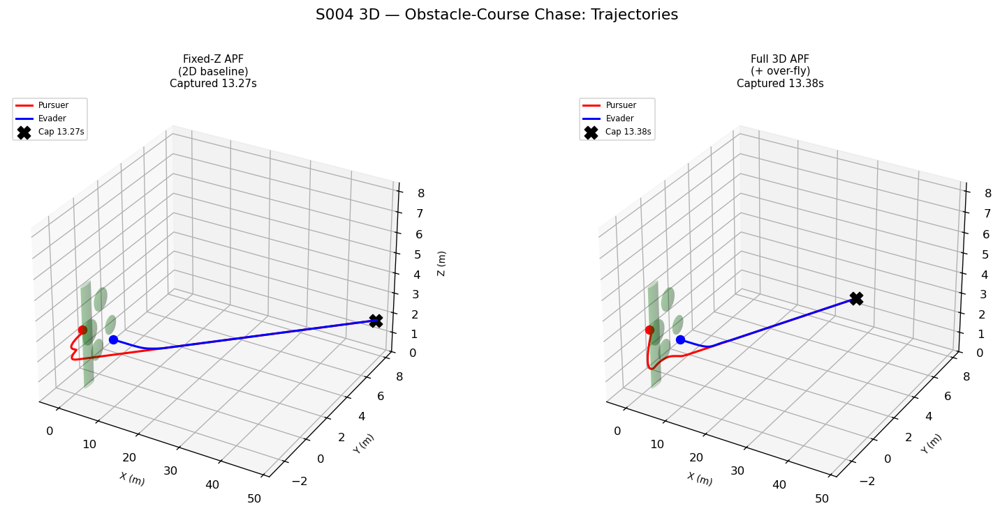
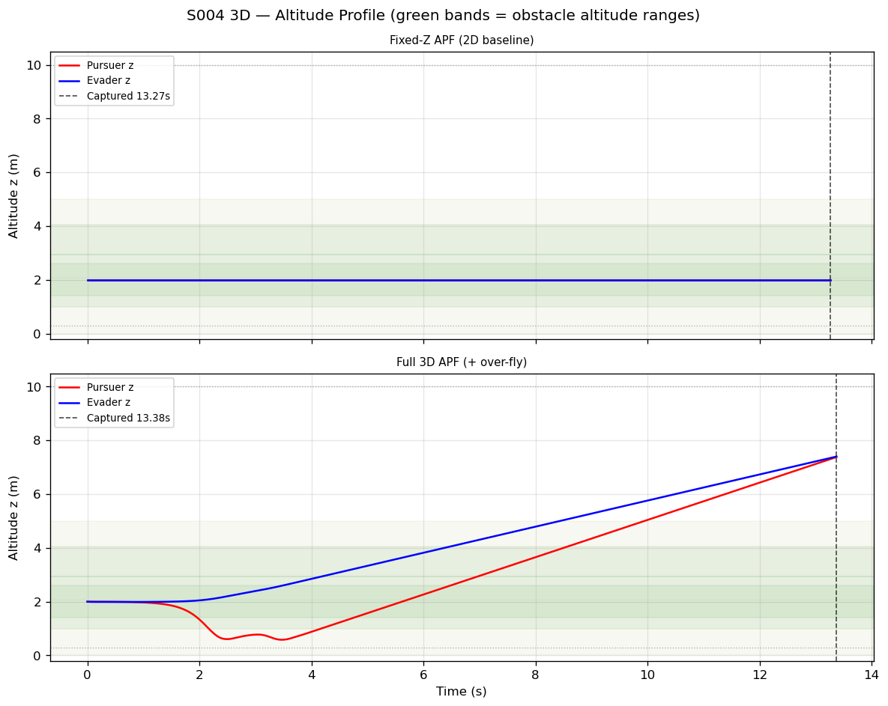
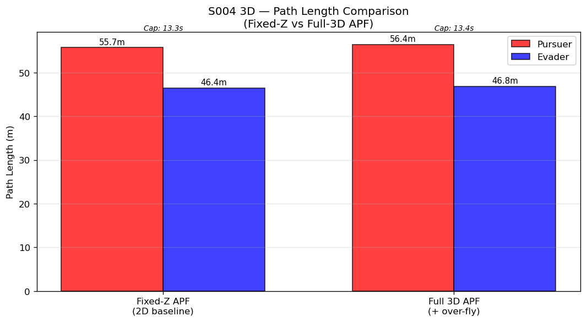
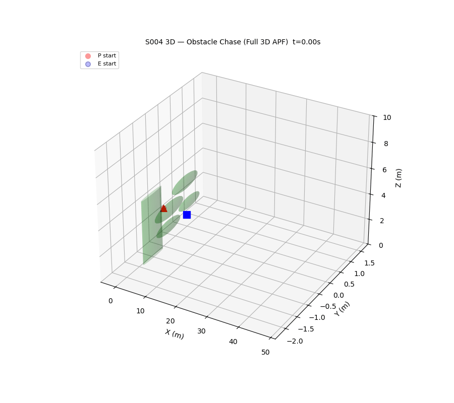

# S004 3D Upgrade — Obstacle-Course Chase

**Domain**: Pursuit & Evasion | **Difficulty**: ⭐⭐⭐⭐ | **Status**: ✅ Completed

---

## Problem Definition

Pursuer (3D APF) chases an evader through a field of 5 volumetric obstacles: 4 spheres at different altitudes and 1 tall vertical cylinder. Two APF routing strategies are compared:

1. **fixed_z** — pursuer and evader locked at z=2.0 m, repulsion acts only horizontally (2D baseline)
2. **full_3d** — full 3D APF with an over-fly heuristic: when a sphere's vertical detour is shorter than the horizontal detour, the pursuer climbs over it

---

## Key Parameters

| Parameter | Value |
|-----------|-------|
| Pursuer start | (-4, 0, 2) m |
| Evader start | (4, 0, 2) m |
| Pursuer speed | 5.0 m/s |
| Evader speed | 3.5 m/s |
| K_rep | 4.0 |
| ρ₀ (influence range) | 1.5 m |
| Capture radius | 0.15 m |
| Altitude bounds | [0.3, 10] m |
| Control frequency | 48 Hz |
| Max simulation time | 30 s |

## Obstacle Layout

| Obstacle | Centre (x, y, z) | Radius / Height |
|----------|-----------------|-----------------|
| Sphere 1 | (-2.0, 0.0, 2.0) | r = 0.60 m |
| Sphere 2 | (-0.5, 0.5, 3.5) | r = 0.55 m (elevated) |
| Sphere 3 | ( 1.0, -0.4, 1.5) | r = 0.50 m (low) |
| Sphere 4 | ( 2.5, 0.3, 2.5) | r = 0.45 m |
| Cylinder | ( 0.5, -1.0, —) | r = 0.4 m, z ∈ [0, 5] m |

---

## Results

| Strategy | Capture Time | Pursuer Path Length | Evader Path Length |
|----------|-------------|--------------------|--------------------|
| fixed_z (2D baseline) | 13.27 s | see plot | see plot |
| full_3d (over-fly) | 13.38 s | see plot | see plot |

The full 3D APF allows the pursuer to fly over the elevated Sphere 2 (centre at z=3.5 m) rather than navigating around it horizontally, demonstrating how vertical freedom can reduce path curvature around obstacles.

---

## Plots

## Animation (Full 3D APF Strategy)

---

## Related Scenarios

- Original: [S004](../../../scenarios/01_pursuit_evasion/S004_obstacle_chase.md)
- 3D Card: [S004 3D](../../../scenarios/01_pursuit_evasion/3d/S004_3d_obstacle_chase.md)
