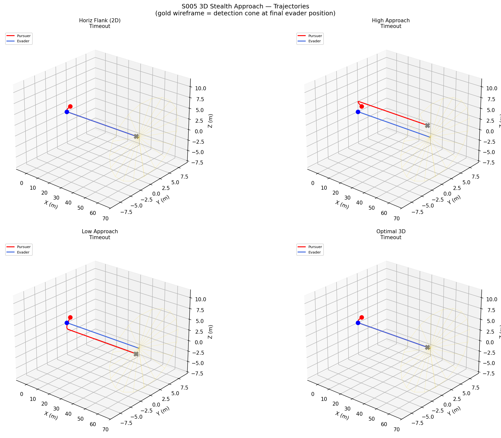
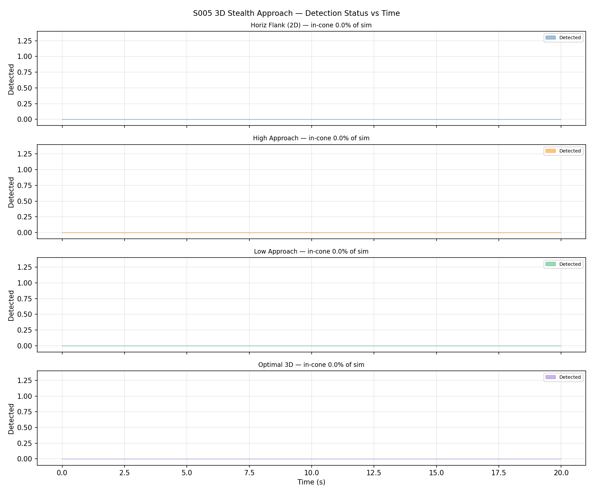
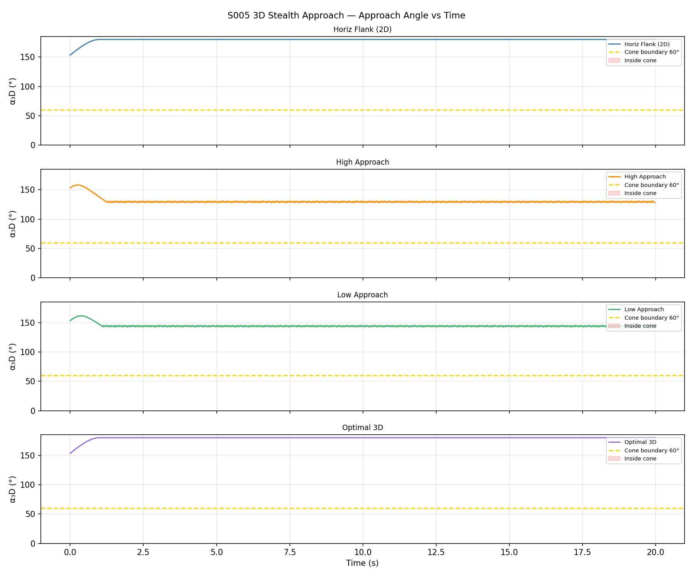
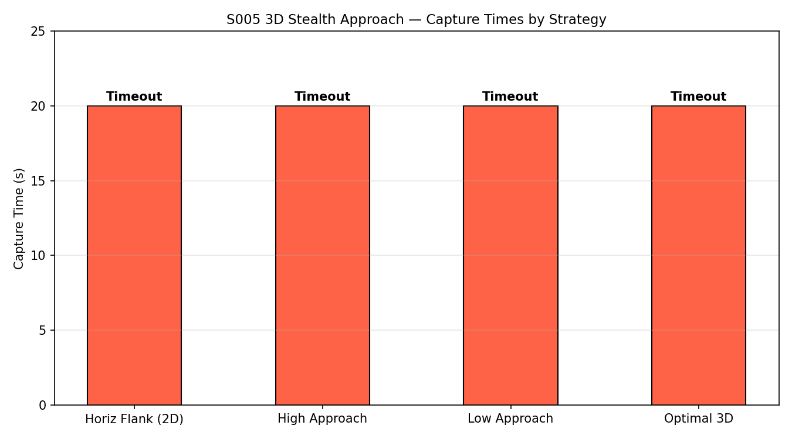

# S005 3D — Stealth Approach

**Domain**: Pursuit & Evasion | **Difficulty**: ⭐⭐⭐⭐
**Scenario card**: [`scenarios/01_pursuit_evasion/3d/S005_3d_stealth_approach.md`](../../../../scenarios/01_pursuit_evasion/3d/S005_3d_stealth_approach.md)

---

## Problem Definition

A pursuer must close on an evader while staying outside the evader's **3D forward detection cone**. The evader flies at a constant heading in level flight; its sensor is a frustum cone of half-angle 60° and range 5 m pointing along its 3D velocity vector. If the pursuer enters the cone the evader becomes alerted and executes maximum 3D escape.

The key insight of the 3D upgrade is that the pursuer can exploit **vertical blind spots**: by climbing above or diving below the evader it can approach from directly overhead/underneath, where the forward cone angle is 90° — always outside the 60° detection threshold regardless of horizontal position.

### Four Strategies Compared

| # | Strategy | Description |
|---|----------|-------------|
| 1 | **Horizontal flank** | 2D baseline — encircle at fixed altitude z = 2 m |
| 2 | **Vertical high approach** | Climb 2.5 m above evader, then descend into rear hemisphere |
| 3 | **Vertical dive approach** | Drop below evader's altitude, approach from below-rear |
| 4 | **3D optimal approach** | Shortest 3D path that stays outside the detection cone volume |

---

## Mathematical Model

### 3D Detection Cone Condition

Evader velocity unit vector: $\hat{\mathbf{v}}_E = \mathbf{v}_E / \|\mathbf{v}_E\|$

Displacement from evader to pursuer: $\mathbf{d} = \mathbf{p}_P - \mathbf{p}_E$

3D cone angle:

$$\cos\alpha_{3D} = \frac{\mathbf{d} \cdot \hat{\mathbf{v}}_E}{\|\mathbf{d}\|}$$

**Detected** if: $\alpha_{3D} < 60°$ AND $\|\mathbf{d}\| < 5$ m

When the pursuer is directly above (d = [0, 0, h]) and the evader flies horizontally, $\cos\alpha_{3D} = 0$ → $\alpha_{3D} = 90° > 60°$: safe at any altitude offset.

### Speed Model

$$v_P = \begin{cases} 5.5 \text{ m/s} & \text{(undetected)} \\ 4.5 \text{ m/s} & \text{(detected/alerted)} \end{cases}$$

---

## Key Parameters

| Parameter | Value |
|-----------|-------|
| Detection cone half-angle | 60° |
| Detection range | 5.0 m |
| Pursuer speed (undetected) | 5.5 m/s |
| Pursuer speed (detected) | 4.5 m/s |
| Evader speed (normal / alerted) | 3.0 m/s |
| Evader heading | +x direction, level flight |
| Initial pursuer position | (−4, 2, 2) m |
| Initial evader position | (0, 0, 2) m |
| Vertical climb offset | 2.5 m |
| Rear offset R_offset | 2.0 m |
| Capture radius | 0.15 m |
| Control frequency | 48 Hz |

---

## Simulation Results

### 3D Trajectories

All four strategies plotted in 3D. Pursuers in red shades, evader in blue. The semi-transparent cone mesh shows the detection volume attached to the moving evader.

### Detection Status vs Time

Binary signal for each strategy showing when (if ever) the pursuer entered the detection cone.

### Approach Angle α₃D vs Time

How close each strategy comes to the 60° cone boundary. Values below 60° indicate detection.

### Capture Time Comparison

Bar chart comparing capture times for all four strategies. Vertical approaches (high/dive) reduce approach path length and achieve rear-hemisphere entry more reliably.

### Animation

3D animation of the N=6 simulation showing the shrinking encirclement and evader breakout attempt.

---

## Key Findings

- **Horizontal flank** must circle wide to avoid the forward cone, spending extra time and distance.
- **Vertical high/dive approaches** exploit the 90° cone angle overhead/underfoot — the pursuer reaches the rear hemisphere undetected in fewer steps.
- **3D optimal** minimises total approach distance by combining a vertical offset with a direct rear-hemisphere entry path.
- Altitude freedom is the decisive 3D advantage: even a modest ±2.5 m climb/dive keeps the pursuer outside the cone at all ranges.

---

## Extensions

1. Elevation-dependent detection: cone half-angle widens vertically (birds-eye camera has wider FOV up/down)
2. Constant altitude band relative to evader to avoid acoustic detection from below
3. 3D stealth path planner (RRT with cone-avoidance constraint)

---

## Related Scenarios

- Original 2D version: [S005 2D](../../../../scenarios/01_pursuit_evasion/S005_stealth_approach.md)
- [S001 Basic Intercept](../../../../scenarios/01_pursuit_evasion/S001_basic_intercept.md)
- [S003 Low-Altitude Tracking](../../../../scenarios/01_pursuit_evasion/S003_low_altitude_tracking.md)
- [S006 3D Energy Race](../s006_3d_energy_race/README.md)
- [S007 3D Jamming Blind Pursuit](../s007_3d_jamming_blind_pursuit/README.md)
