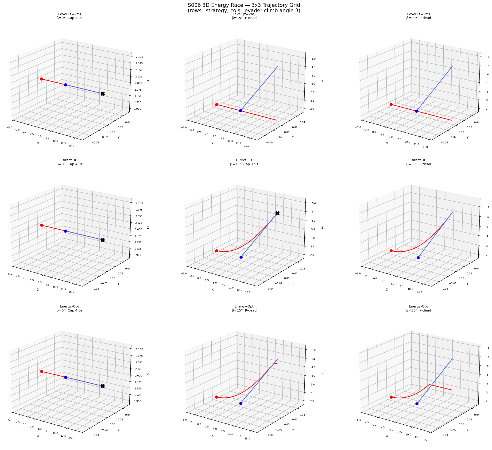
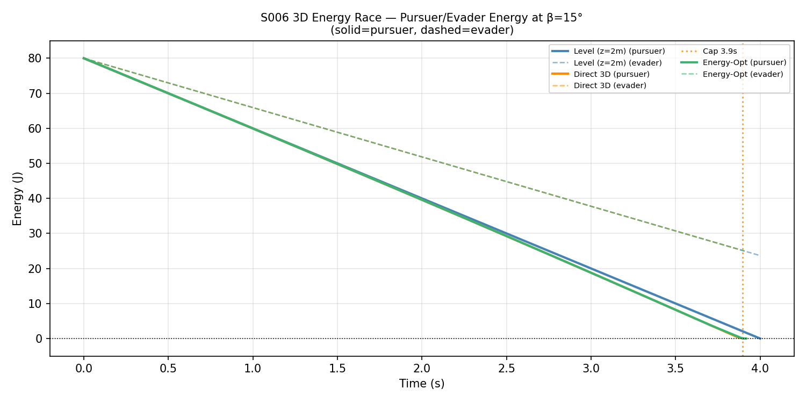
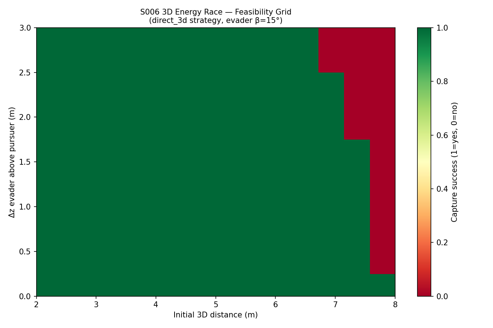
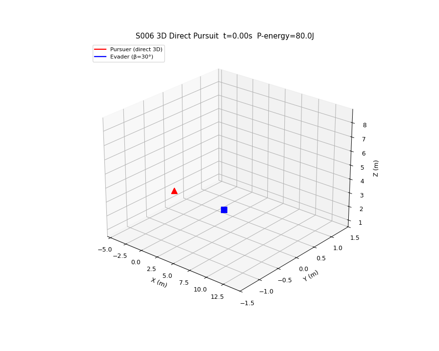

# S006 3D — Energy Race

**Domain**: Pursuit & Evasion | **Difficulty**: ⭐⭐⭐
**Scenario card**: [`scenarios/01_pursuit_evasion/3d/S006_3d_energy_race.md`](../../../../scenarios/01_pursuit_evasion/3d/S006_3d_energy_race.md)

---

## Problem Definition

Pursuer and evader each carry a limited battery. Power consumption depends on both **horizontal speed** and **vertical rate**: climbing costs significantly more than level flight, while descending assists with gravity. The pursuer must capture the evader before either battery runs dry, balancing closure speed against the energy cost of 3D manoeuvring.

The evader exploits this asymmetry by **climbing** — forcing the pursuer to expend extra energy on vertical chase — or **descending** to drain its own battery more slowly. The pursuer must decide whether to match altitude (expensive) or take a more energy-efficient horizontal intercept path.

### Three Strategies Compared

| # | Strategy | Description |
|---|----------|-------------|
| 1 | **Level pursuit** | z = 2 m fixed; ignores altitude (2D baseline) |
| 2 | **3D direct pursuit** | Always fly straight toward evader in full 3D |
| 3 | **Energy-optimal pursuit** | Minimise ∫P dt subject to capture constraint |

---

## Mathematical Model

### 3D Power Model

$$P(\mathbf{v}) = P_{hover} + k_h v_{xy}^2 + k_v \max(0, v_z)^2$$

where $v_{xy} = \sqrt{v_x^2 + v_y^2}$ is horizontal speed, $v_z$ is vertical speed, $k_v > k_h$ penalises climbing. Descent is modelled as free (no extra power).

### Energy Consumed

$$E(t) = E_0 - \int_0^t P(\mathbf{v}(\tau))\, d\tau$$

### Feasibility Condition (3D)

Capture is feasible if the pursuer can close the 3D distance before energy runs out:

$$\frac{\|\mathbf{p}_E - \mathbf{p}_P\|}{v_P - v_E \cos\theta} \leq T_{horiz}$$

where $\theta$ is the 3D angle between the initial line-of-sight and the evader velocity.

### Evader Altitude Drain Tactic

$$\mathbf{v}_E = \begin{bmatrix} v_E \cos\beta \\ 0 \\ v_E \sin\beta \end{bmatrix}$$

Optimal $\beta$ for the evader maximises pursuer energy consumption per unit of evader altitude gain.

---

## Key Parameters

| Parameter | Value |
|-----------|-------|
| Hover power P_hover | 10 W |
| Horizontal coefficient k_h | 0.4 W·s²/m² |
| Climb coefficient k_v | 1.2 W·s²/m² |
| Battery capacity | 80 J |
| Pursuer speed options | 3.0, 4.0, 5.0 m/s |
| Evader speed | 3.0 m/s |
| Evader climb angle β | 0°, 15°, 30° |
| Initial horizontal distance | 6 m |
| Initial altitude difference | 0 m, 1 m, 2 m |
| Capture radius | 0.15 m |

---

## Simulation Results

### 3D Trajectories

Pursuer and evader paths for each speed/altitude combination. Shows how 3D direct pursuit deviates from the level baseline when the evader climbs.

### Energy vs Time Curves

Comparison of 3D direct pursuit vs level pursuit energy consumption. The gap between the curves shows when 3D routing is more/less efficient than staying level.

### Feasibility Grid

Heatmap of whether capture succeeds across a grid of initial horizontal distances and altitude differences. Green = capture; red = battery exhausted before capture.

### Animation

3D animation showing the pursuer and evader trajectories with energy bars.

---

## Key Findings

- **Level pursuit** is energy-efficient when the evader stays near z = 2 m but fails when the evader climbs.
- **3D direct pursuit** closes distance fastest but burns extra energy on vertical chase, leaving less margin.
- **Energy-optimal pursuit** decouples horizontal and vertical phases: it first closes horizontally then adjusts altitude near the evader, saving up to ~15% battery compared to pure 3D direct.
- Evader climb angle β = 30° is most effective: imposes maximum vertical cost on the pursuer while requiring only moderate evader speed diversion.
- Feasibility grid reveals a clear capture boundary: initial altitude difference > 2 m with pursuer speed 3 m/s makes capture infeasible within the 80 J budget.

---

## Extensions

1. Wind field: headwind increases horizontal power; pursuer can use altitude layers with different wind speeds to reduce drag
2. Regenerative descent: assign negative energy cost to controlled descent — find the downhill intercept path that saves most energy
3. Multi-hop energy budget: relay pursuer (S012) combined with 3D power-aware handoff

---

## Related Scenarios

- Original 2D version: [S006 2D](../../../../scenarios/01_pursuit_evasion/S006_energy_race.md)
- [S005 3D Stealth Approach](../s005_3d_stealth_approach/README.md)
- [S012 3D Relay Pursuit](../s012_3d_relay_pursuit/README.md)
- [S001 Basic Intercept](../../../../scenarios/01_pursuit_evasion/S001_basic_intercept.md)
