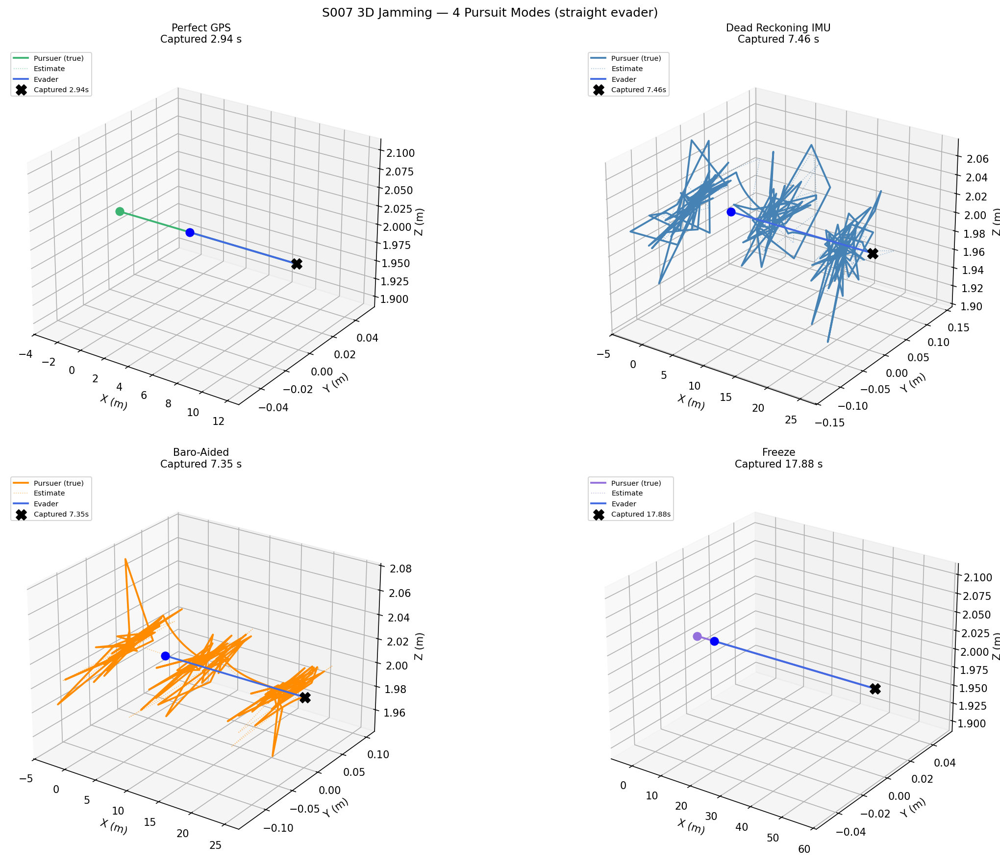
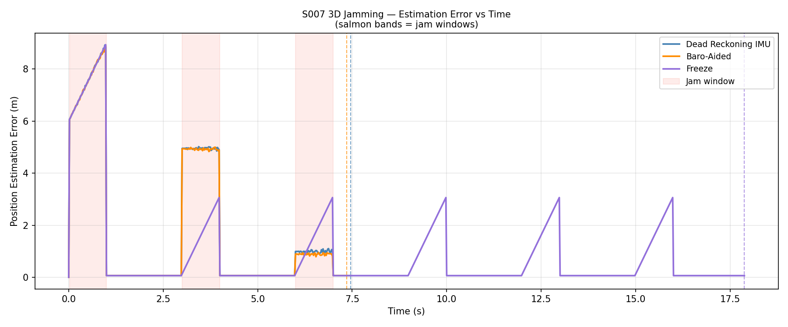
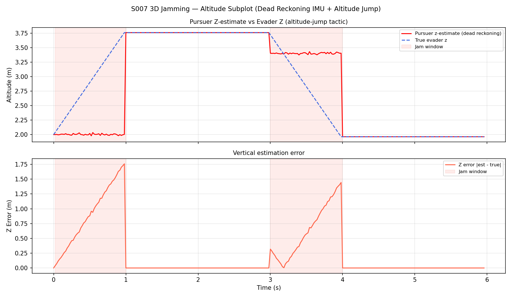
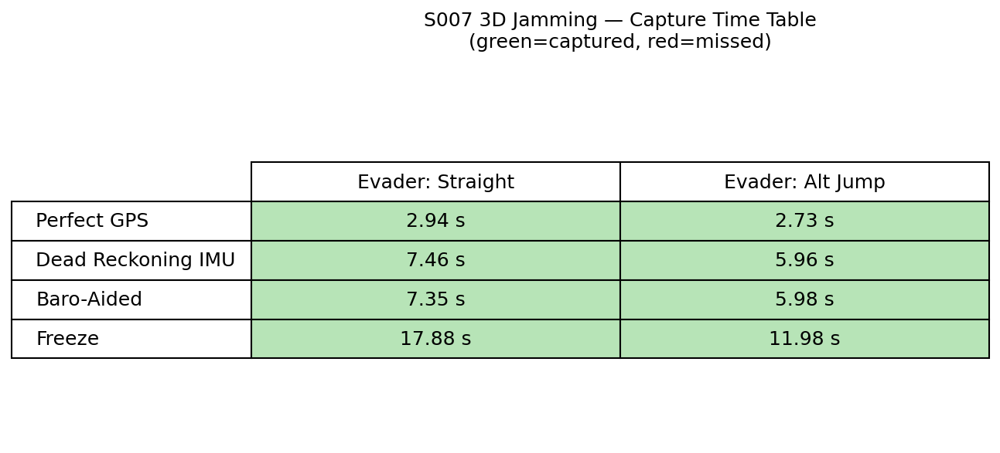
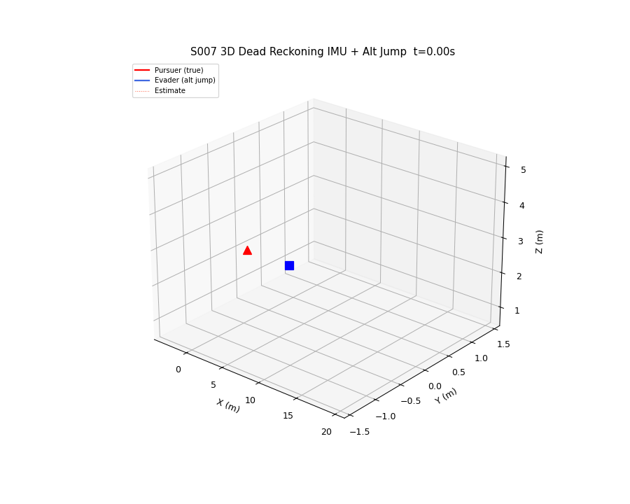

# S007 3D — Jamming & Blind Pursuit

**Domain**: Pursuit & Evasion | **Difficulty**: ⭐⭐⭐⭐
**Scenario card**: [`scenarios/01_pursuit_evasion/3d/S007_3d_jamming_blind_pursuit.md`](../../../../scenarios/01_pursuit_evasion/3d/S007_3d_jamming_blind_pursuit.md)

---

## Problem Definition

The pursuer's GPS is intermittently jammed. During jam windows, it integrates the last known 3D velocity via **dead reckoning** — accumulating IMU noise on all three axes. In 3D, vertical drift is particularly dangerous: altitude constraint violations (ground collision, airspace ceiling) can occur even when horizontal error is tolerable.

The evader exploits jam windows by executing **sudden altitude changes** that the pursuer cannot detect during the blind period. When GPS is restored, the pursuer finds itself at an incorrect altitude, having missed the evader's vertical manoeuvre.

### Four Pursuit Strategies

| # | Strategy | Description |
|---|----------|-------------|
| 1 | **Dead reckoning 3D** | Integrate last known 3D velocity with full 3D IMU noise |
| 2 | **Baro-assisted dead reckoning** | z corrected by independent altimeter; only x-y drifts |
| 3 | **Freeze on jam** | Pursuer hovers in place during jam window — no motion, no drift |
| 4 | **Perfect 3D GPS** | Baseline: no jamming, continuous position updates |

### Evader Tactics

- **Straight horizontal escape**: same as original S007
- **Altitude jump during jam**: climb or dive ±2 m while pursuer is blind

---

## Mathematical Model

### 3D Dead-Reckoning Estimate

During jam window $t \in [t_j,\; t_j + T_{jam}]$:

$$\hat{\mathbf{p}}_P(t) = \mathbf{p}_P(t_j) + \mathbf{v}_{last} \cdot (t - t_j) + \boldsymbol{\varepsilon}(t)$$

with anisotropic noise:

$$\varepsilon_{xy} \sim \mathcal{N}(0,\; \sigma_{xy}^2 \cdot (t - t_j)), \quad \sigma_{xy} = 0.05 \text{ m/s}$$
$$\varepsilon_z \sim \mathcal{N}(0,\; \sigma_z^2 \cdot (t - t_j)), \quad \sigma_z = 0.02 \text{ m/s (IMU-only)}\ /\ 0.005 \text{ m/s (baro)}$$

### 3D Position Error

$$e(t) = \|\hat{\mathbf{p}}_P(t) - \mathbf{p}_P(t)\|$$

After an evader altitude jump of Δz during a 1 s jam window, the 3D position error on GPS restoration is approximately:

$$e \approx \sqrt{e_{xy}^2 + \Delta z^2}$$

### Altitude Safety Constraint

If estimated z falls below 0.3 m, the pursuer commands an emergency hover-climb regardless of jam status.

---

## Key Parameters

| Parameter | Value |
|-----------|-------|
| Jam period | 3.0 s |
| Jam duration | 1.0 s (33% duty cycle) |
| Horizontal IMU drift σ_xy | 0.05 m/s |
| Vertical IMU drift σ_z (IMU-only) | 0.02 m/s |
| Vertical IMU drift σ_z (baro-aided) | 0.005 m/s |
| Pursuer speed | 5 m/s |
| Evader speed | 3 m/s |
| Evader altitude jump Δz | ±2 m per jam window |
| Initial pursuer position | (−3, 0, 2) m |
| Initial evader position | (3, 0, 2) m |
| Altitude bounds | [0.3, 8] m |

---

## Simulation Results

### 3D Trajectories

Four strategy trajectories in 3D. Jam windows highlighted as shaded bands. Shows how baro-aided and freeze strategies differ in their 3D path quality vs dead reckoning.

### 3D Position Error vs Time

Comparison of estimation error spikes for IMU-only, baro-aided, and freeze strategies. Baro-aided significantly reduces vertical error spikes during altitude-jump evasion.

### Altitude Subplot

Pursuer estimated z vs true evader z during the simulation. Clearly shows z-drift accumulation during jam windows and the evader's altitude-jump exploitation.

### Capture Time Table

All combinations of 4 pursuit strategies × 2 evader tactics (horizontal escape vs altitude jump). Baro-aided dead reckoning dramatically outperforms IMU-only against altitude-jumping evader.

### Animation

3D animation showing the pursuer strategies and evader evasion with jam window indicators.

---

## Key Findings

- **IMU-only dead reckoning** accumulates ~0.05 m/s × 1 s = 0.05 m per jam window in x-y, but the evader's 2 m altitude jump dominates, creating ~2 m total 3D error on GPS restore.
- **Baro-aided** reduces vertical error by ~75%, enabling the pursuer to correct altitude much faster after each jam window.
- **Freeze on jam** avoids drift entirely but allows the evader to gain ~3 m distance during each 1 s jam window, eventually making capture infeasible.
- Against the **altitude-jump tactic**, IMU-only pursuer typically fails to capture while baro-aided succeeds within 3–4 jam cycles.
- The combination of altitude jump + 33% jam duty cycle is the evader's most effective tactic, leveraging the IMU's worst-case anisotropic noise direction.

---

## Extensions

1. Kalman filter with IMU + barometer sensor fusion for all-axis drift reduction
2. Adversarial jammer: activates only when pursuer is within 1.5 m (worst-case jamming at critical moment)
3. 3D terrain below: altitude safety constraint becomes terrain-following during dead-reckoning

---

## Related Scenarios

- Original 2D version: [S007 2D](../../../../scenarios/01_pursuit_evasion/S007_jamming_blind_pursuit.md)
- [S005 3D Stealth Approach](../s005_3d_stealth_approach/README.md)
- [S006 3D Energy Race](../s006_3d_energy_race/README.md)
- [S011 3D Swarm Encirclement](../s011_3d_swarm_encirclement/README.md)
