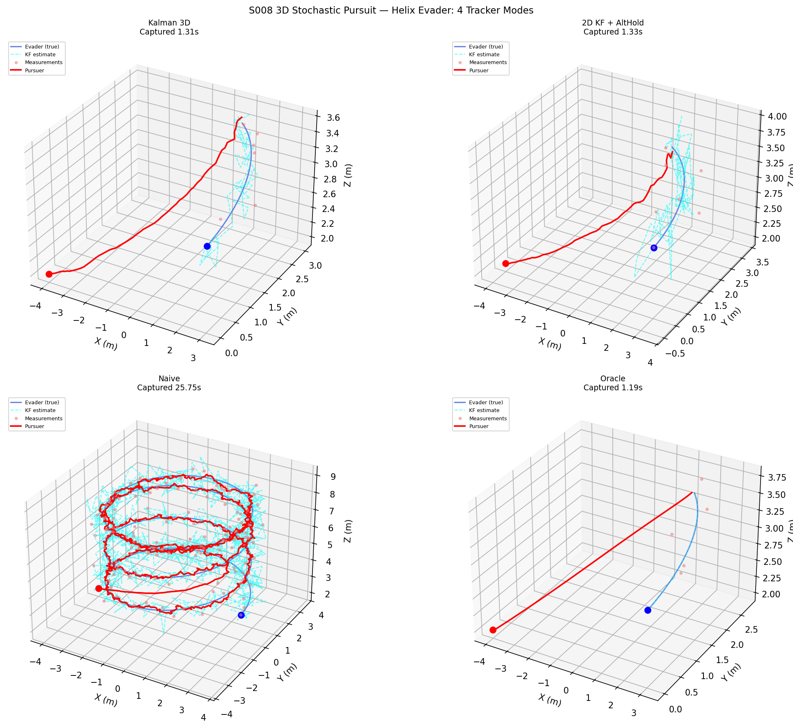
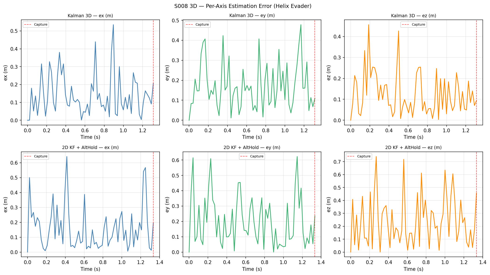
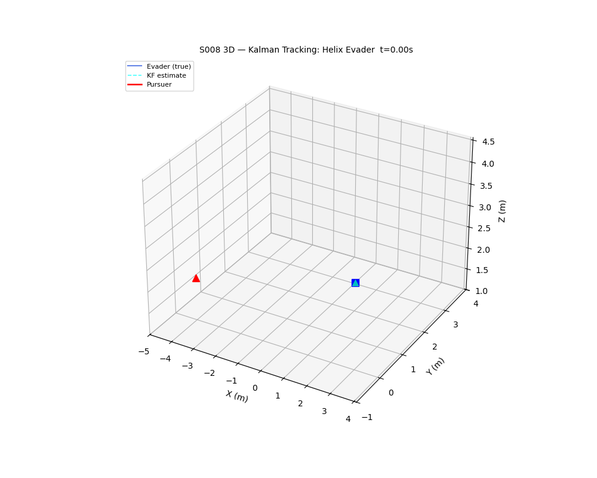

# S008 3D — Stochastic Pursuit (Kalman Filter Tracking)

**Domain**: Pursuit & Evasion | **Difficulty**: ⭐⭐⭐⭐ | **Status**: `[x]` Complete

---

## Problem Definition

The evader moves in true 3D with stochastic acceleration (constant-velocity model + Gaussian noise on all three axes including z). The pursuer receives noisy 3D position measurements (σ = 0.3 m isotropic) and uses one of four tracking modes to estimate the evader's state and command pursuit.

---

## Mathematical Model Summary

### 6-State Kalman Filter

State: `[x, y, z, vx, vy, vz]`

- **Transition matrix**: `F = [[I₃, dt·I₃], [0₃, I₃]]`
- **Process noise**: anisotropic diagonal Q with `q_z = 0.5 × q_xy`
- **Measurement**: noisy 3D position, `H = [I₃ | 0₃]`, `R = σ²·I₃`

### Predictive Pursuit

Pursuer leads the evader using the KF velocity estimate with iterative intercept time prediction (2 passes).

### Covariance Ellipsoid Volume

`V_ellipsoid = (4π/3) × ∏√λᵢ(P_pos)` — tracks filter convergence quality.

---

## Key Parameters

| Parameter | Value |
|-----------|-------|
| DT | 1/48 s |
| Process noise q_xy | 0.1 m²/s³ |
| q_z / q_xy ratio | 0.5 |
| Measurement σ | 0.3 m |
| Pursuer speed | 5.0 m/s |
| Evader speed | 3.0 m/s (mean) |
| Initial pursuer | (-4, 0, 2) m |
| Initial evader | (4, 0, 3) m |
| Capture radius | 0.15 m |
| Max time | 30 s |

---

## Simulation Results

### Capture Time Table (all tracker modes × all evader types)

| Evader Type   | Kalman 3D | 2D KF + AltHold | Naive    | Oracle   |
|---------------|-----------|-----------------|----------|----------|
| random_walk   | 2.35s     | 2.46s           | 2.44s    | 2.31s    |
| helix         | 1.31s     | 1.33s           | 25.75s   | 1.19s    |
| z_hop         | 2.33s     | 2.46s           | 2.44s    | 2.25s    |

Key finding: The **naive tracker** struggles significantly on the helix evader (25.75s vs 1.31s for Kalman 3D), because the helix has strong coupled velocity in all three axes — the raw noisy measurement causes the pursuer to oscillate instead of leading.

---

## Output Files

| File | Description |
|------|-------------|
| `trajectories_3d.png` | 4 tracker modes, helix evader — 3D trajectory plots |
| `per_axis_error.png` | Per-axis estimation errors ex, ey, ez for Kalman 3D and 2D+AltHold |
| `covariance_volume.png` | Kalman 3D covariance ellipsoid volume vs time (log scale) |
| `capture_table.png` | Full capture time table (4 modes × 3 evader types) |
| `animation.gif` | Kalman 3D tracking helix evader in 3D — estimated vs true |

### trajectories_3d.png

### per_axis_error.png

### animation.gif

---

## Extensions

1. Extended Kalman Filter for coordinated-turn model (better helix tracking)
2. Particle filter (500 particles) for multi-modal z uncertainty
3. Sensor fusion: radar range-only + optical bearing-only for 3D triangulation

---

## Related Scenarios

- Original 2D: `src/01_pursuit_evasion/s008_stochastic_pursuit.py`
- Source file: `src/01_pursuit_evasion/3d/s008_3d_stochastic_pursuit.py`
- Scenario card: `scenarios/01_pursuit_evasion/3d/S008_3d_stochastic_pursuit.md`
