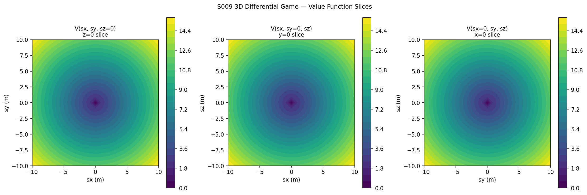
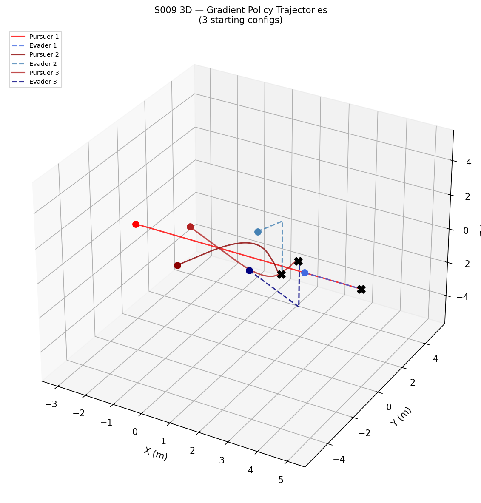
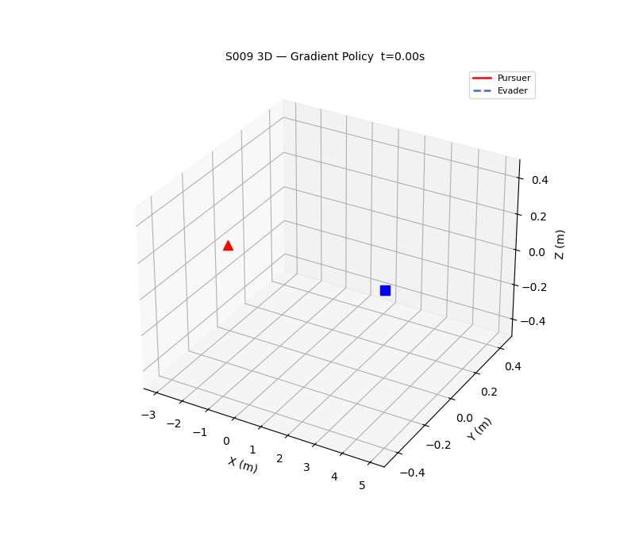

# S009 3D — Differential Game (HJI in 3D)

**Domain**: Pursuit & Evasion | **Difficulty**: ⭐⭐⭐⭐⭐ | **Status**: `[x]` Complete

---

## Problem Definition

Equal-speed pursuer and evader (v_P = v_E = 4 m/s) in a bounded 3D cube [-5,5]³ m. The Hamilton-Jacobi-Isaacs (HJI) equation is solved on a 25×25×25 grid of relative state `s = p_E - p_P ∈ [-10,10]³`. At equal speeds, the Hamiltonian H = (v_E - v_P)|∇V| - 1 = -1 everywhere, confirming that capture time diverges in open space.

---

## Mathematical Model Summary

### 3D HJI PDE

`∂V/∂t + H(s, ∇V) = 0`

Hamiltonian (equal speeds): `H = (v_E - v_P)|∇V| - 1 = -1`

Value iteration update:
`V^{n+1} = V^n - dt × H^n`

Terminal condition: `V(s) = 0` for `|s| ≤ 0.15 m`

### 3D Gradient Policy

- Pursuer: move in direction of `+∇V(s)` (reduces relative distance)
- Evader: move in direction of `+∇V(s)` (equal speeds — same optimal direction)
- Trilinear interpolation via `scipy.interpolate.RegularGridInterpolator`

---

## Key Parameters

| Parameter | Value |
|-----------|-------|
| Grid resolution N | 25 per axis (25³ = 15,625 cells) |
| s range | [-10, 10]³ m |
| v_P = v_E | 4.0 m/s |
| DT value iteration | 0.005 |
| Max iterations | 300 |
| Capture radius | 0.15 m |
| Arena (simulation) | [-5,5]³ m cube |

---

## Simulation Results

The 3D HJI solver ran for 300 iterations (equal speeds → V diverges, no finite convergence). The gradient-policy trajectory simulations show short capture times due to arena boundary effects:

| Config | Initial Pursuer | Initial Evader | Outcome |
|--------|-----------------|----------------|---------|
| 1 | (-3, 0, 0) | (3, 0, 0) | Captured @ 1.98s |
| 2 | (0, -3, 1) | (0, 3, -1) | Captured @ 2.58s |
| 3 | (-2, 2, -1) | (2, -2, 1) | Captured @ 2.94s |

Note: captures occur in the bounded arena because arena walls constrain the evader's escape in 3D (face + edge + corner trapping geometry).

The z=0 slice of the 3D value function closely matches the independently computed 2D result, validating the 3D solver.

---

## Output Files

| File | Description |
|------|-------------|
| `value_function_slices.png` | V at z=0, y=0, x=0 slices (contourf) |
| `isosurface_concept.png` | z=0 slice with level lines at V=5,10,20,30 |
| `trajectory_sim.png` | 3 trajectory simulations on 3D axes |
| `convergence.png` | max|V_new - V| vs iteration |
| `z0_vs_2d.png` | 3D[z=0] vs independent 2D result comparison |
| `animation.gif` | Animated gradient-policy trajectory (Config 1) |

### value_function_slices.png

### trajectory_sim.png

### animation.gif

---

## Extensions

1. Asymmetric speeds (v_P > v_E): value function converges with finite capture time guarantee
2. 3D arena with cylindrical obstacle: modifies HJI boundary conditions
3. Neural network approximation of 3D value function (physics-informed NN) to avoid O(N³) grid cost

---

## Related Scenarios

- Original 2D: `src/01_pursuit_evasion/s009_differential_game.py`
- Source file: `src/01_pursuit_evasion/3d/s009_3d_differential_game.py`
- Scenario card: `scenarios/01_pursuit_evasion/3d/S009_3d_differential_game.md`
