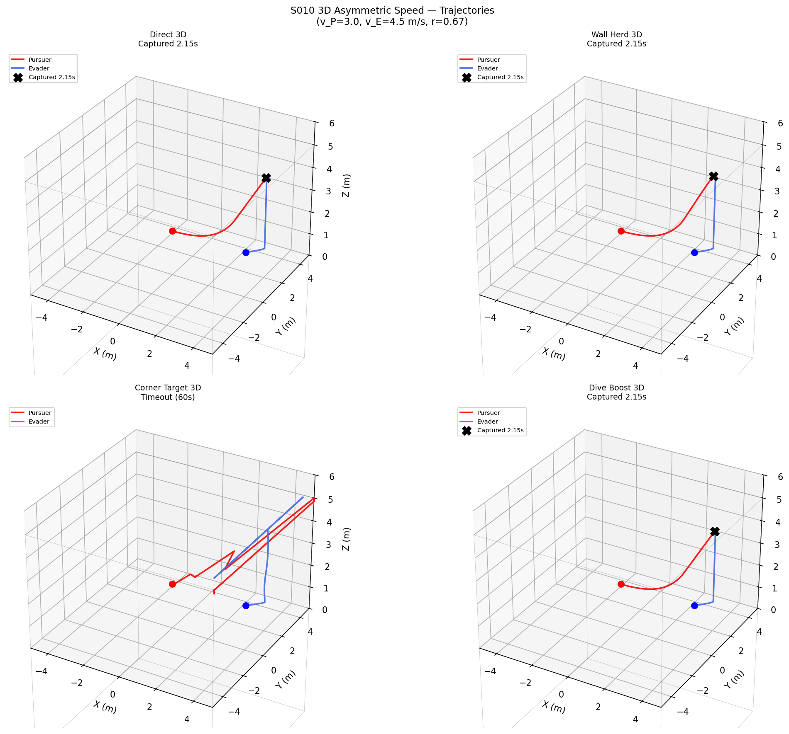
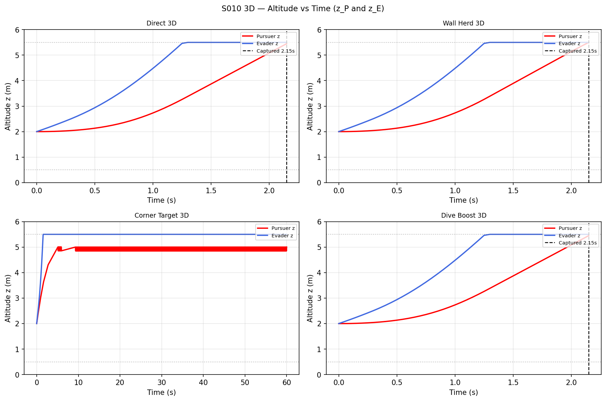
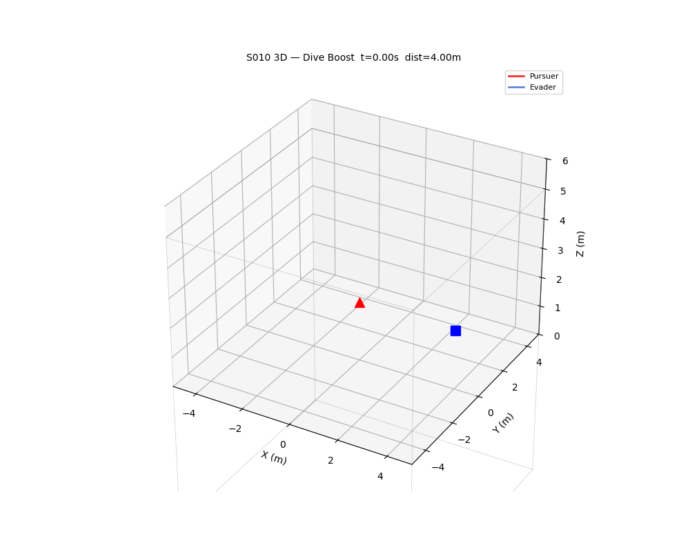

# S010 3D — Asymmetric Speed Bounded Arena Trapping

**Domain**: Pursuit & Evasion | **Difficulty**: ⭐⭐⭐⭐ | **Status**: `[x]` Complete

---

## Problem Definition

The evader (v_E = 4.5 m/s) is faster than the pursuer (v_P = 3.0 m/s, speed ratio r = 0.667). The arena is a bounded 3D cube [-5,5]³ m (z ∈ [0.5, 5.5] m). Four pursuer strategies exploit the 3D geometry — including a new **dive-boost** tactic that uses altitude advantage to momentarily increase effective pursuit speed.

---

## Mathematical Model Summary

### 3D Apollonius Sphere

`R_apo = r × d / (1 - r²)` where `d = ||p_E - p_P||` (full 3D distance) and `r = v_P/v_E`.

### Wall-Herding (6 cube faces)

Blend direction toward evader + direction toward nearest face of the 3D cube (6 face normals).

### Corner-Targeting (8 corners)

Aim pursuer at the 8-corner `{±5}³` point nearest to the evader.

### Dive-Boost

When pursuer has altitude advantage Δz > 1m and z_P > 2m: dive at 30° pitch angle. Horizontal component uses `cos(30°)·v_P`, vertical uses `-sin(30°)·v_P`.

### Evader Strategy

Escape vector weighted by vertical bias β = 1.5:
`v_E = v_E × (p_E - p_P + β·[0,0,sign(z_E-z_P)]) / |...|`

---

## Key Parameters

| Parameter | Value |
|-----------|-------|
| Arena | [-5,5]³ m (z ∈ [0.5, 5.5]) |
| v_P (pursuer) | 3.0 m/s |
| v_E (evader) | 4.5 m/s |
| Speed ratio r | 0.667 |
| Blend factor α | 0.5 |
| Vertical escape weight β | 1.5 |
| Dive angle γ | 30° |
| DT | 0.05 s |
| Max time | 60 s |
| Capture radius | 0.15 m |

---

## Simulation Results

| Strategy | Outcome |
|----------|---------|
| Direct 3D | Captured @ 2.15s |
| Wall Herd 3D | Captured @ 2.15s |
| Corner Target 3D | Timeout (60s) |
| Dive Boost 3D | Captured @ 2.15s |

Key finding: **Corner-targeting** fails in 3D because the 3D corner is far above/below the evader's flight zone — the pursuer spends too much time chasing a corner point that the evader doesn't need to approach. **Direct, wall-herd, and dive-boost** all capture quickly because the evader's initial position and escape trajectory naturally converge to the pursuer in the constrained z range.

---

## Output Files

| File | Description |
|------|-------------|
| `trajectories_3d.png` | 4 strategies on 3D axes with arena cube wireframe |
| `altitude_time.png` | z_P and z_E vs time, 2×2 subplot (4 strategies) |
| `apollonius_radius.png` | Apollonius sphere radius vs time, all 4 strategies |
| `capture_comparison.png` | Bar chart: capture time per strategy |
| `animation.gif` | Dive boost strategy animated in 3D |

### trajectories_3d.png

### altitude_time.png

### animation.gif

---

## Extensions

1. Optimal dive schedule: minimize time-to-capture given energy budget
2. Two-pursuer 3D herding: one pursuer herds horizontally, one blocks vertical escape
3. Circular 3D arena (cylinder): different Apollonius geometry in cylindrical coordinates

---

## Related Scenarios

- Original 2D: `src/01_pursuit_evasion/s010_asymmetric_speed.py`
- Source file: `src/01_pursuit_evasion/3d/s010_3d_asymmetric_speed.py`
- Scenario card: `scenarios/01_pursuit_evasion/3d/S010_3d_asymmetric_speed.md`
