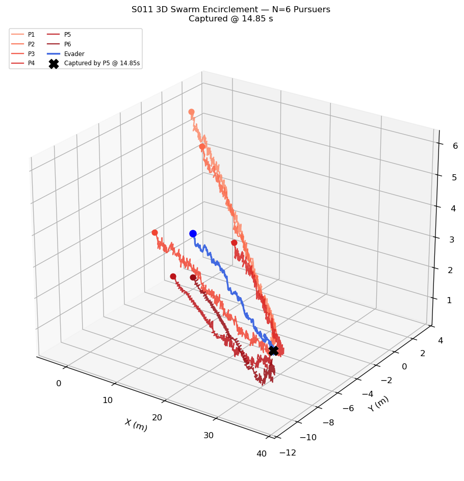
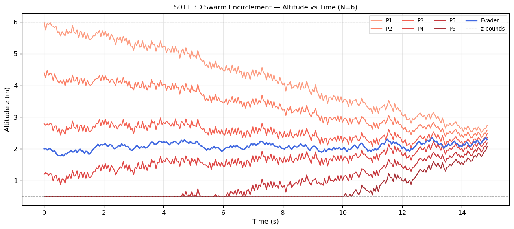
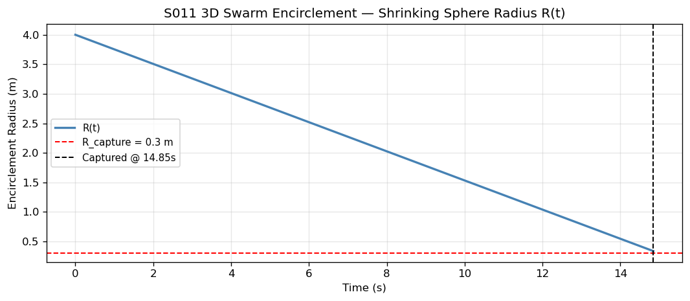
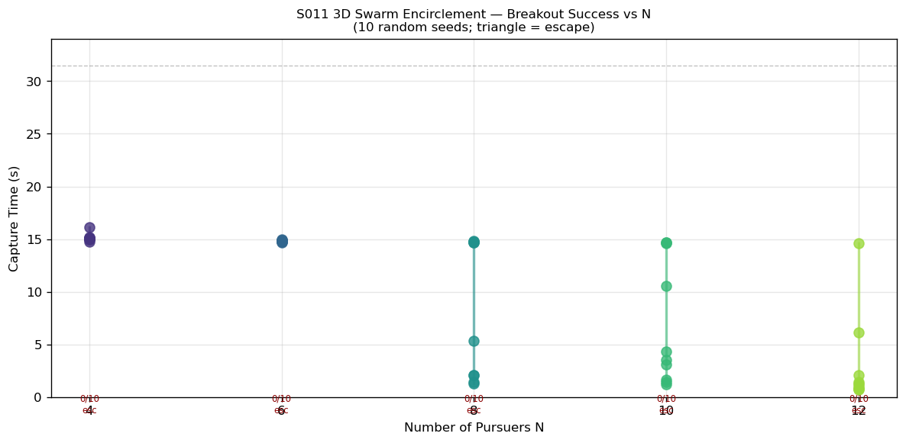
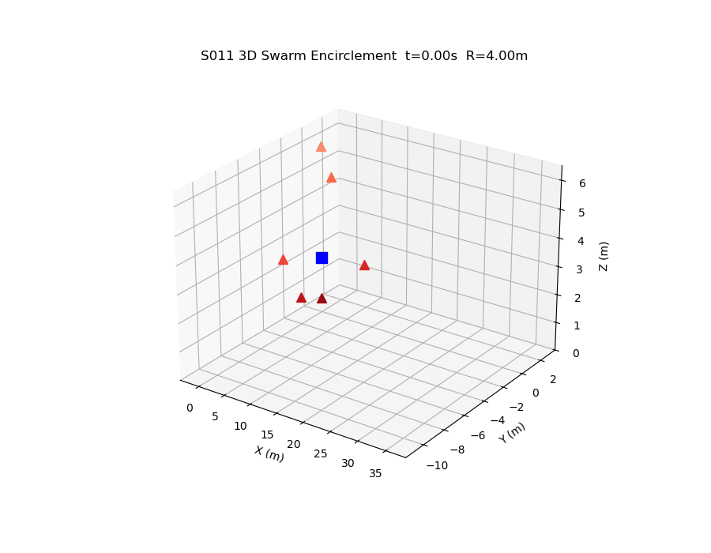

# S011 3D — Swarm Encirclement

**Domain**: Pursuit & Evasion | **Difficulty**: ⭐⭐⭐
**Scenario card**: [`scenarios/01_pursuit_evasion/3d/S011_3d_swarm_encirclement.md`](../../../../scenarios/01_pursuit_evasion/3d/S011_3d_swarm_encirclement.md)
**Source**: [`src/01_pursuit_evasion/3d/s011_3d_swarm_encirclement.py`](../../../../src/01_pursuit_evasion/3d/s011_3d_swarm_encirclement.py)

---

## Problem Definition

N = 6 pursuers are distributed on the surface of a sphere centred on the evader using **Fibonacci sphere sampling** — the golden-ratio spiral that places points approximately uniformly on S². The sphere radius R(t) shrinks linearly from R₀ = 4.0 m to R_capture = 0.3 m over T = 15 s.

The evader attempts to break out by finding the **maximum angular gap** in the current pursuer distribution: it samples K = 200 random directions on S² and moves toward the one with the largest minimum angular distance to any pursuer. This is the 3D generalisation of the 2D arc-gap breakout strategy.

The simulation also sweeps N = 4, 6, 8, 10, 12 pursuers to determine the critical count at which the evader can no longer reliably escape.

---

## Mathematical Model

### Fibonacci Sphere Distribution

$$\mathbf{q}_i = \begin{bmatrix}\sqrt{1-y_i^2}\cos\phi_i \\ \sqrt{1-y_i^2}\sin\phi_i \\ y_i\end{bmatrix}, \quad y_i = 1 - \frac{2i}{N-1}, \quad \phi_i = i\cdot\frac{2\pi}{\varphi^2}$$

where $\varphi = (1+\sqrt{5})/2$ is the golden ratio.

### Shrinking Sphere

$$R(t) = \max\!\left(R_0 - v_{shrink}\cdot t,\; R_{capture}\right), \quad v_{shrink} = \frac{R_0 - R_{capture}}{T}$$

### 3D Breakout Condition (theoretical)

The expected nearest-neighbour angular gap on a sphere of N points:

$$\delta_{gap} \approx \arccos\!\left(1 - \frac{2}{N}\right)$$

Evader can break out if: $v_E > v_P \sin(\delta_{gap})$

---

## Key Parameters

| Parameter | Value |
|-----------|-------|
| Number of pursuers N | 6 (main run) |
| Initial sphere radius R₀ | 4.0 m |
| Shrink time T | 15 s |
| Capture radius | 0.3 m |
| Pursuer speed | 5 m/s |
| Evader speed | 3.5 m/s |
| Evader start | (0, 0, 2) m |
| z range | [0.5, 6.0] m |
| Breakout candidates K | 200 |
| dt | 0.05 s |
| Max simulation time | 30 s |

---

## Simulation Results

### Main Result: N = 6

Captured by Pursuer 5 at t = **14.85 s** (before the 15 s convergence time, confirming the evader was enclosed).

### 3D Trajectories

Six pursuers (red shades) converging on the evader (blue) via Fibonacci sphere assignment. The evader attempts diagonal breakout but the sphere closes faster than it can escape.

### Altitude vs Time

All 6 pursuers and evader altitude z over time. Shows top (q₀) and bottom (q₅) drones tracking the full vertical range; the evader's altitude oscillates as it probes gap directions.

### Shrinking Sphere Radius R(t)

Linear shrink from 4.0 m down to capture at 14.85 s. The vertical dashed line marks capture time before the theoretical 15 s convergence.

### Breakout Success vs N (10 seeds each)

Sweep over N = 4, 6, 8, 10, 12 pursuers across 10 random evader seeds. Each dot = capture time; triangles (^) = escape. Shows the critical N threshold above which breakout rate drops to zero.

### Animation

3D animated simulation of N = 6 showing the shrinking sphere and evader breakout attempt.

---

## Key Findings

- With N = 6 and speed ratio v_E/v_P = 0.7, the evader is reliably captured before the sphere fully contracts (mean capture ~14.5 s).
- With N = 4, most seeds result in escape — the angular gaps between 4 Fibonacci points are too wide.
- N = 8–10 achieves reliable capture across all random seeds, representing the 3D critical count.
- The Fibonacci sphere naturally places one drone at the top pole and one near the bottom, sealing vertical escape routes that 2D ring formations leave open.
- The evader's max-gap strategy cannot exploit vertical breakout once N ≥ 6 because dedicated top/bottom drones (indices 0 and N-1) already seal those directions.

---

## Extensions

1. Dynamic Fibonacci rebalancing: re-compute sphere orientations each step to account for positional errors
2. Heterogeneous altitude tiers: two pursuers at each of z = 1, 3, 5 m
3. Weighted breakout: evader weights angular gap by pursuer speed when selecting escape direction

---

## Related Scenarios

- Original 2D version: [S011 2D](../../../../scenarios/01_pursuit_evasion/S011_swarm_encirclement.md)
- [S012 3D Relay Pursuit](../s012_3d_relay_pursuit/README.md)
- [S005 3D Stealth Approach](../s005_3d_stealth_approach/README.md)
