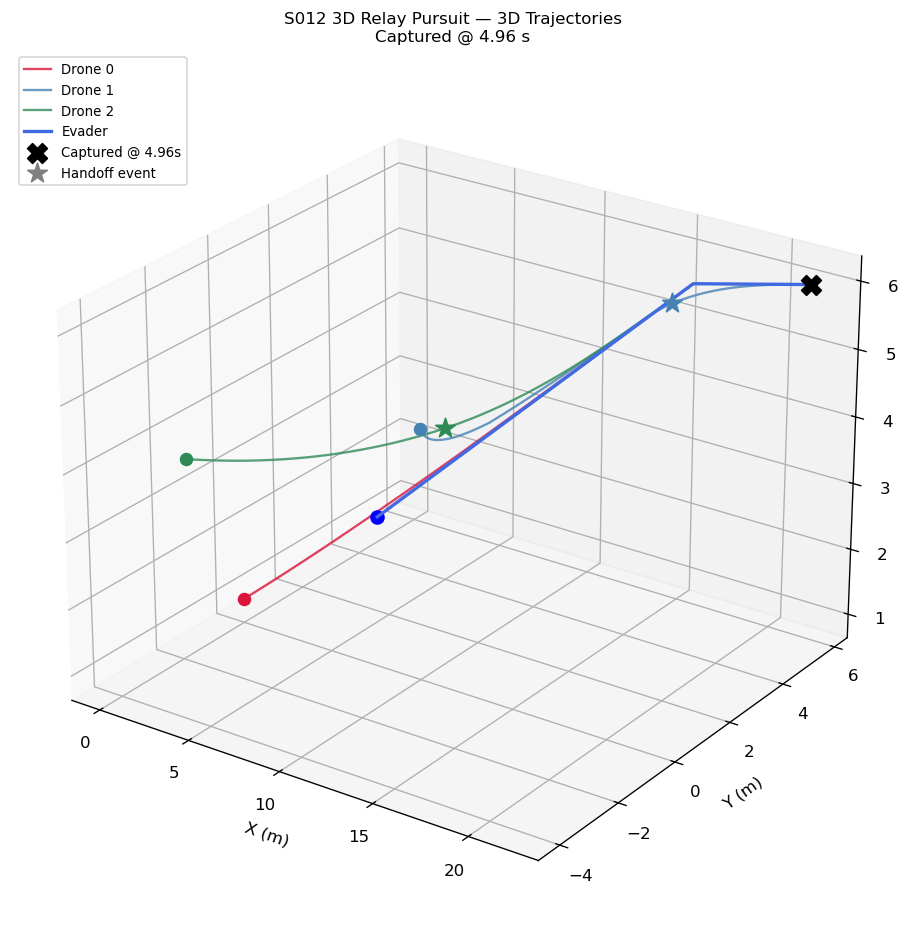
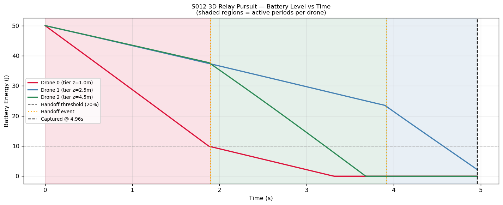
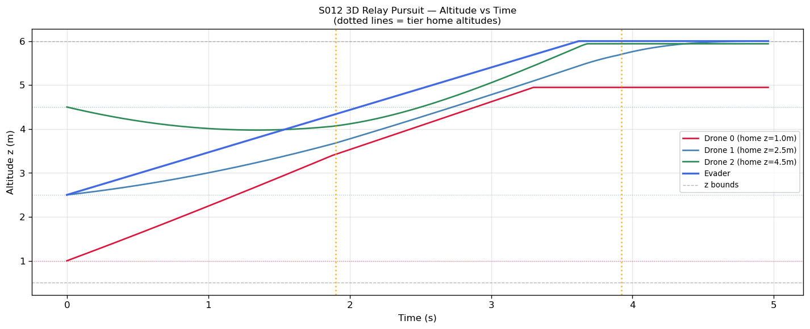
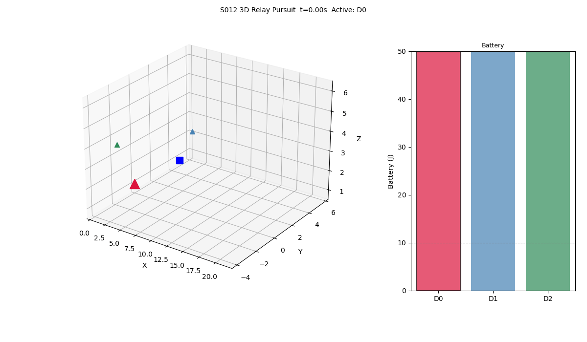

# S012 3D — Relay Pursuit

**Domain**: Pursuit & Evasion | **Difficulty**: ⭐⭐⭐⭐
**Scenario card**: [`scenarios/01_pursuit_evasion/3d/S012_3d_relay_pursuit.md`](../../../../scenarios/01_pursuit_evasion/3d/S012_3d_relay_pursuit.md)
**Source**: [`src/01_pursuit_evasion/3d/s012_3d_relay_pursuit.py`](../../../../src/01_pursuit_evasion/3d/s012_3d_relay_pursuit.py)

---

## Problem Definition

Three relay pursuers are pre-positioned at **different altitude tiers** (z = 1.0, 2.5, 4.5 m). Each carries a 50 J battery. The active pursuer flies Pure Pursuit in 3D toward the evader; when its battery drops below 20%, the standby drone with the best score (energy × proximity) takes over. Standby drones fly toward the predicted intercept position, maintaining altitude-tier hold when idle.

The evader uses straight escape with altitude cycling (climbs to ~4 m then dives to ~1 m, alternating every 10 s) to exploit altitude gaps in the handoff geometry.

### Power Model

$$P(\mathbf{v}) = P_{hover} + k_h v_{xy}^2 + k_v \max(0, v_z)^2$$

At active speed 5 m/s horizontal: P ≈ 10 + 10 = 20 W → battery lasts ~2 s to handoff threshold per drone.

### Handoff Selection

$$j^* = \arg\max_{k \neq active} \left[ w_E \cdot \frac{E_k}{E_0} - w_d \cdot \frac{d_{3D,k}}{d_{max}} \right]$$

with w_E = 0.6, w_d = 0.4 — balances remaining energy against 3D proximity to predicted intercept point.

---

## Key Parameters

| Parameter | Value |
|-----------|-------|
| Number of pursuers | 3 |
| Altitude tiers (home z) | 1.0, 2.5, 4.5 m |
| Battery capacity | 50 J each |
| Hover power P_hover | 10 W |
| Horizontal coefficient k_h | 0.4 W·s²/m² |
| Climb coefficient k_v | 1.2 W·s²/m² |
| Handoff threshold | 20% battery (10 J) |
| Active pursuer speed | 5 m/s |
| Standby pursuer speed | 4 m/s |
| Evader speed | 3.5 m/s |
| Handoff cooldown | 2 s |
| Handoff weights (w_E, w_d) | 0.6, 0.4 |
| z range | [0.5, 6.0] m |
| dt | 0.02 s |

---

## Simulation Results

### Main Result

Captured at t = **4.96 s** with **2 handoffs**: D0 → D2 at t = 1.90 s, D2 → D1 at t = 3.92 s.

The three-drone relay successfully closes the initial ~6 m gap that no single drone (2 s battery at full speed) could cover alone.

### 3D Trajectories

Color-coded trajectories for all 3 pursuers and the evader. Star markers (★) indicate handoff activation points where a new drone takes command.

### Battery Level vs Time

All three battery curves with shaded active periods. Orange dashed lines mark handoff events. The step-wise activation pattern clearly shows each drone's contribution to the relay chain.

### Altitude vs Time

Pursuer altitudes (dotted lines = home tier targets) and evader altitude cycling. Shows how standby drones maintain their tier altitude while the active pursuer closes in.

### Animation

3D animation with live battery bars on the right. Active pursuer shown with larger marker; battery bars update in real time.

---

## Key Findings

- **Relay achieves capture** (4.96 s) that no single 50 J drone could complete — the initial gap requires ~4 s of sustained pursuit, exceeding a single drone's ~2 s active window.
- **Handoff scoring works**: D2 (high tier, closer to predicted intercept) is preferred over D1 at first handoff; D1 takes over second as D2's battery depletes.
- **Altitude tiers** ensure vertical coverage: even as the evader cycles altitude, at least one standby is pre-positioned near each altitude level.
- **Cooldown prevents ping-pong**: without the 2 s cooldown, D1 and D2 oscillate between each other when their scores are similar.
- **3D power asymmetry**: climbing costs 3× more than horizontal flight (k_v/k_h = 3), which matters when the active pursuer must close a vertical gap during altitude-cycling evasion.

---

## Extensions

1. Optimal tier spacing: grid-search over altitude values to minimise average handoff gap
2. 4-drone relay with two drones per tier — simultaneous active + backup at each altitude
3. Evader altitude-dive during handoff gap: exploiting the ~0.5 s transition window before new active drone adjusts

---

## Related Scenarios

- Original 2D version: [S012 2D](../../../../scenarios/01_pursuit_evasion/S012_relay_pursuit.md)
- [S011 3D Swarm Encirclement](../s011_3d_swarm_encirclement/README.md)
- [S006 3D Energy Race](../s006_3d_energy_race/README.md)
- [S005 3D Stealth Approach](../s005_3d_stealth_approach/README.md)
