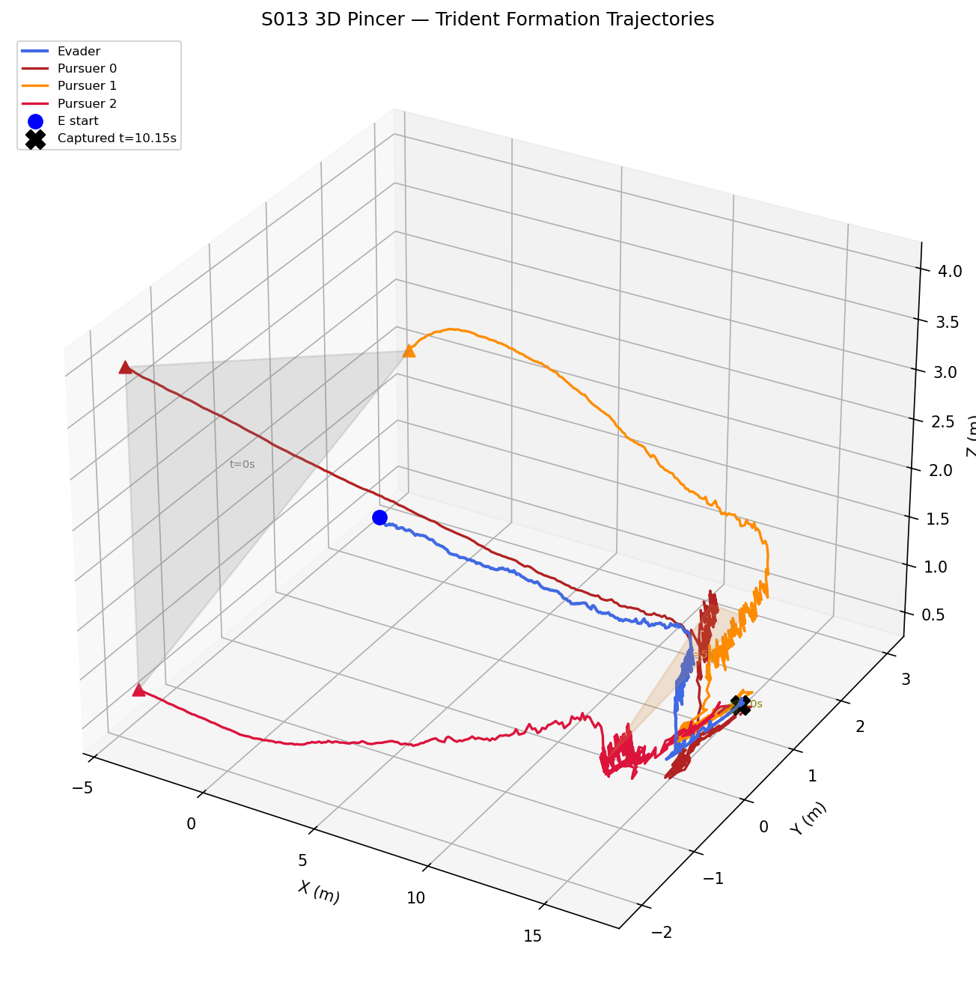
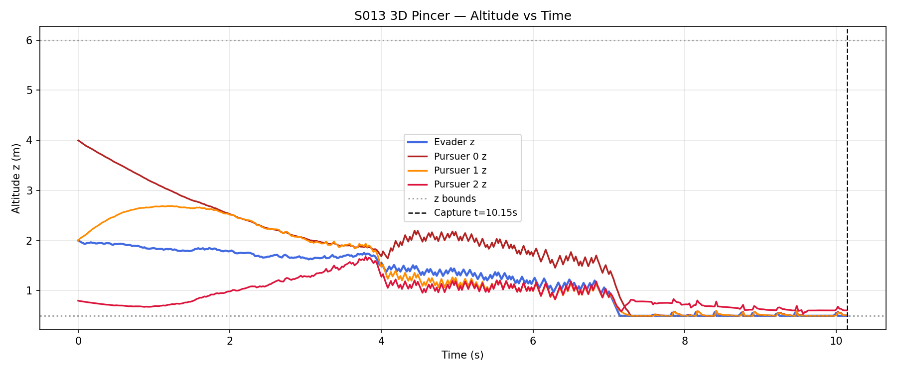
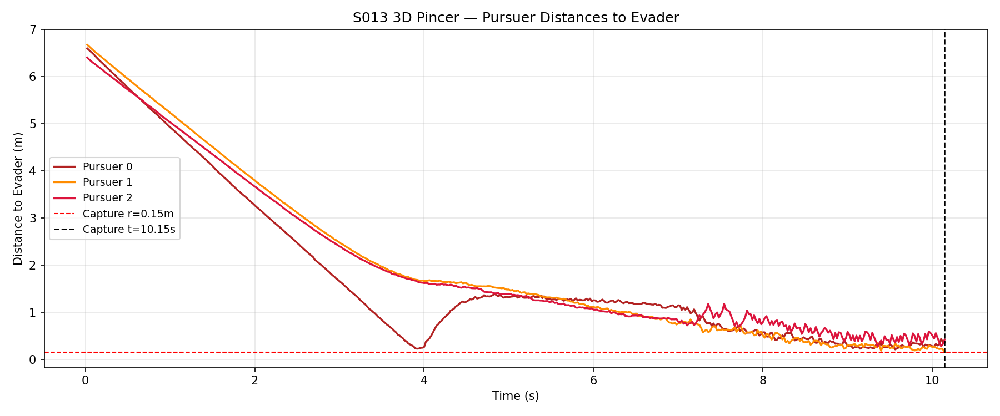
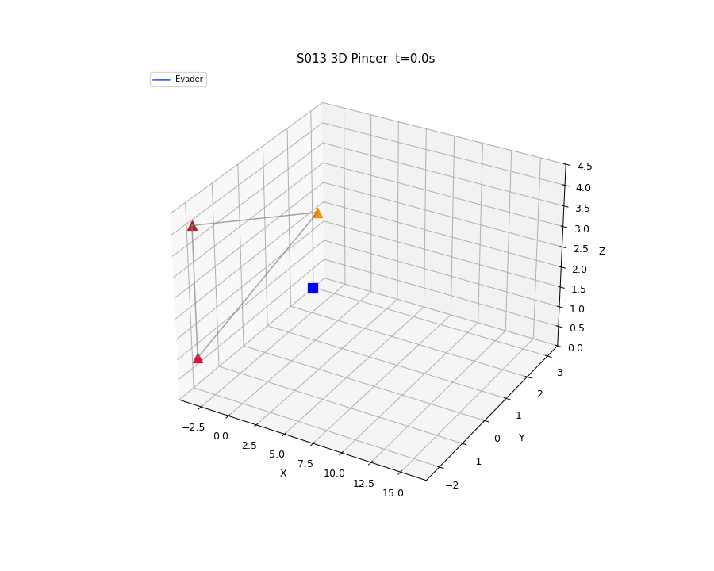

# S013 3D Upgrade — Pincer Movement

**Domain**: Pursuit & Evasion | **Difficulty**: ⭐⭐⭐⭐ | **Status**: Completed

---

## Problem Definition

**Setup**: Three pursuers form a dynamically-tilted equilateral triangle (trident formation) around the evader's predicted position. The triangle centroid leads the evader by 0.5 s; the formation normal tilts continuously to maintain 3D blocking coverage. The evader maximises the solid-angle escape cone using stochastic sphere sampling.

**Objective**: Demonstrate that a 3D trident formation achieves faster capture than a 2D two-pursuer pincer by eliminating vertical escape routes.

---

## Mathematical Model

### Tilted Triangle Targets

Each pursuer $i$ targets a vertex of an equilateral triangle centred on the lead position:

$$\mathbf{p}_{tgt,i} = \mathbf{p}_E + 0.5 \mathbf{v}_E + R(t) \cdot \mathbf{R}_{x}(\psi_{tilt}) \begin{bmatrix}\cos(2\pi i/3) \\ \sin(2\pi i/3) \\ 0\end{bmatrix}$$

### Shrinking Radius

$$R(t) = \max(R_0 - v_{shrink} \cdot t,\; R_{min})$$

### Dynamic Tilt

$$\dot{\psi}_{tilt} = k_{tilt} \left(\arctan2(z_E - \bar{z}_P,\; \|\mathbf{p}_E^{xy} - \bar{\mathbf{p}}_P^{xy}\|) - \psi_{tilt}\right)$$

### Evader Escape (Solid-Angle Maximisation)

Sample $K=200$ candidate unit vectors; choose direction maximising:

$$\arg\max_{\hat{u}} \min_i \arccos(\hat{u} \cdot \hat{d}_{P_i})$$

---

## Key Parameters

| Parameter | Value |
|-----------|-------|
| Pursuer speed | 5.0 m/s |
| Evader speed | 3.5 m/s |
| Initial R₀ | 3.0 m |
| Shrink rate | 0.3 m/s |
| Initial tilt ψ₀ | 45° |
| Tilt gain k_tilt | 0.5 rad/s |
| Lead time | 0.5 s |
| z bounds | [0.5, 6.0] m |
| dt | 1/48 s |
| Capture radius | 0.15 m |
| Evader start | (2, 0, 2) m |
| Pursuers start | (−4,−2,4), (−4,3,2), (−4,−2,0.8) m |

---

## Simulation Results

**Capture time: 10.15 s** — evader captured at formation tilt −23.3°.

The tilt adaptation tracked the evader's downward movement, causing the formation to rotate and eliminate the low-altitude escape route.

---

## Output Plots

**3D Trajectories + Formation Wireframes**

Shows trident formation at t=0, 5, 10 s as wireframe triangles overlaid on the 3D trajectories.

**Altitude vs Time**

Formation tilt dynamically adjusts: when the evader dives, the lower pursuers descend to maintain blocking coverage.

**Distance to Evader**

All three pursuers converge simultaneously — coordinated approach signature of the trident.

**Animation**

Shows triangle edges closing on the evader in 3D.

---

## Extensions

1. Four-drone tetrahedral formation: complete solid-angle coverage
2. Evader ballistic-dive escape (sudden z drop) to break triangle plane
3. Dynamic role reassignment based on current geometry

---

## Related Scenarios

- Original 2D: `src/01_pursuit_evasion/s013_pincer_movement.py`
- S011 3D Swarm Encirclement, S012 3D Relay Pursuit
