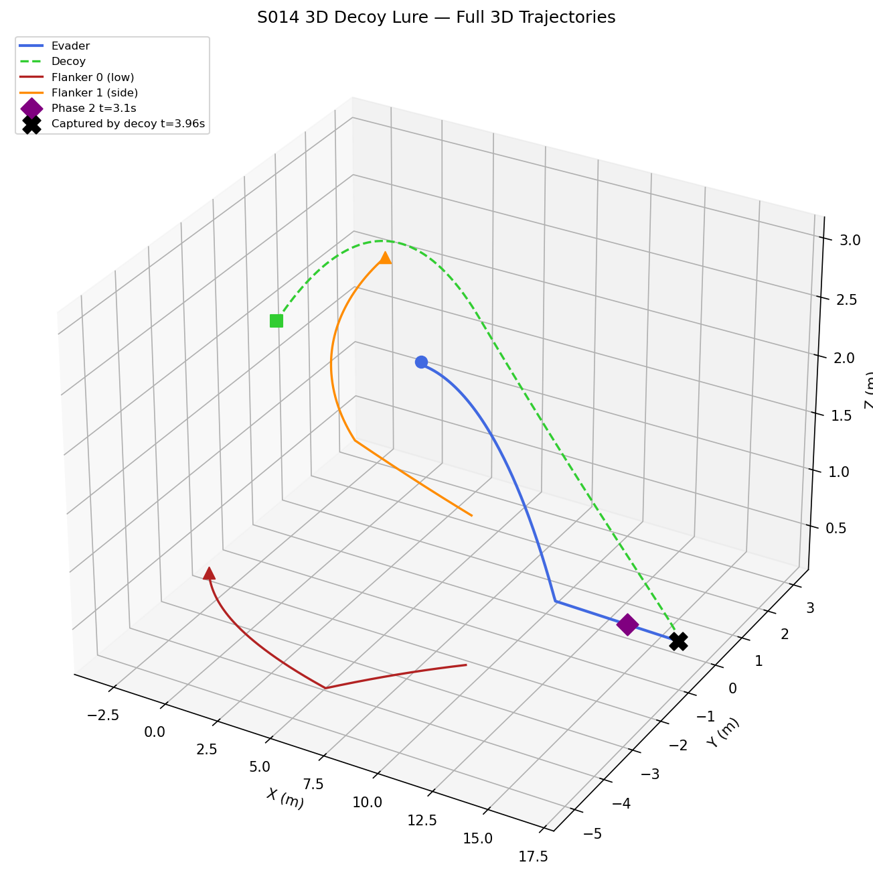
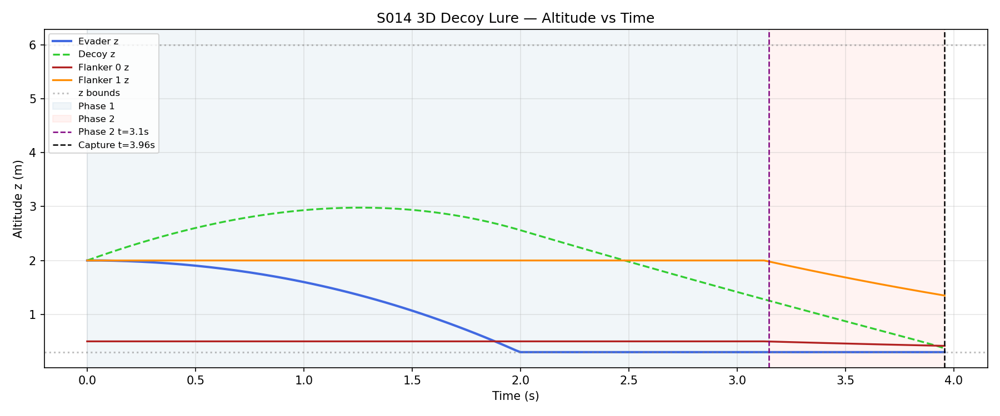
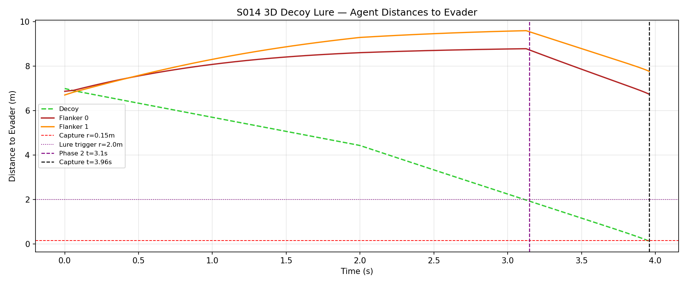
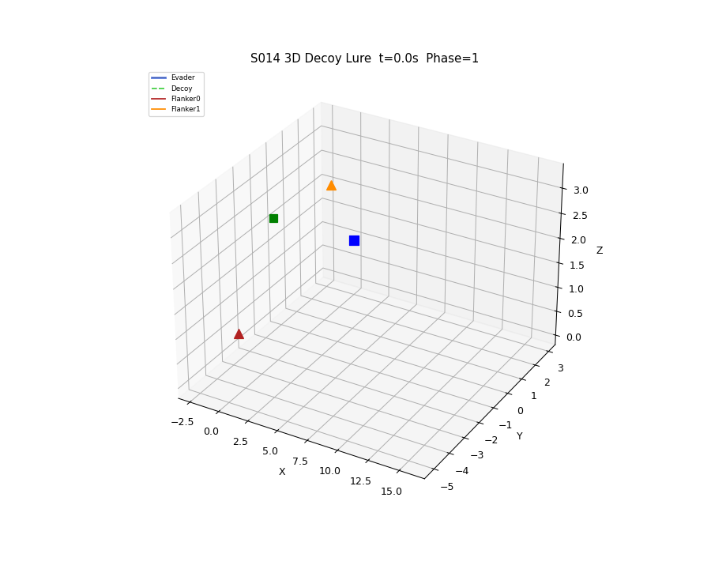

# S014 3D Upgrade — Decoy Lure

**Domain**: Pursuit & Evasion | **Difficulty**: ⭐⭐⭐⭐ | **Status**: Completed

---

## Problem Definition

**Setup**: 1 decoy drone + 2 flanker drones coordinate against 1 evader.

- **Decoy**: advances directly toward the evader while climbing to z=5 m (altitude trap).
- **Evader**: reacts by fleeing away from the nearest agent and clips to z bounds.
- **Flanker 0**: approaches from below (z ≤ 1.5 m — low-altitude tier).
- **Flanker 1**: approaches from the side at mid altitude.
- **Phase 1** (t < 5 s or decoy > 2 m from evader): decoy advances, flankers orbit at 4 m radius.
- **Phase 2** (t ≥ 5 s or decoy within 2 m): all three pursue at full speed.

**Objective**: Demonstrate that the decoy altitude climb lures the evader upward, enabling flankers to pinch from below.

---

## Mathematical Model

### Decoy Velocity

$$\mathbf{v}_{decoy} = v_P \cdot \frac{\mathbf{p}_E - \mathbf{p}_{decoy} + [0, 0, 0.3]^T}{\|\mathbf{p}_E - \mathbf{p}_{decoy} + [0, 0, 0.3]\|}$$

### Flanker Patrol (Phase 1)

Orbit at radius $r_{orbit}=4$ m in XY-plane around evader:

$$\mathbf{v}_F^{xy} = -0.5 \cdot \hat{r}_{xy}(d-r_{orbit}) + 2.0 \cdot \hat{\theta}_{ccw}$$

where $\hat{r}_{xy}$ is the radial unit vector and $\hat{\theta}_{ccw}$ is the CCW tangential direction.

### Evader Escape

$$\mathbf{v}_E = v_E \cdot \frac{\mathbf{p}_E - \mathbf{p}_{nearest}}{\|\mathbf{p}_E - \mathbf{p}_{nearest}\|}$$

---

## Key Parameters

| Parameter | Value |
|-----------|-------|
| Pursuer speed (all) | 5.0 m/s |
| Evader speed | 3.5 m/s |
| Phase 1 duration | 5.0 s |
| Decoy lure trigger dist | 2.0 m |
| Flanker orbit radius | 4.0 m |
| z bounds | [0.3, 6.0] m |
| Flanker 0 max z | 1.5 m |
| dt | 1/48 s |
| Capture radius | 0.15 m |
| Evader start | (4, 0, 2) m |
| Decoy start | (−3, 0, 2) m |
| Flanker 0 start | (−2, −3, 0.5) m |
| Flanker 1 start | (−2, 3, 2) m |

---

## Simulation Results

**Phase 2 triggered**: t = 3.15 s (decoy closed within lure distance).

**Captured by decoy**: t = 3.96 s — the decoy's direct approach from the front (with +z bias) effectively cornered the evader. The flanker orbit slowed their convergence during Phase 1, but once Phase 2 activated the evader had no escape cone.

---

## Output Plots

**3D Trajectories**

Shows purple diamond marking the phase 2 transition on the evader's path.

**Altitude vs Time**

Shaded regions show Phase 1 (blue) and Phase 2 (red). The decoy climbs while approaching.

**Distance to Evader**

Decoy lure distance threshold (2 m dashed line) triggers Phase 2 before the 5 s wall time.

**Animation**

---

## Extensions

1. Adaptive decoy that mirrors evader altitude to defeat z-contrast discrimination
2. Bayesian classifier on the pursuer side to distinguish decoy from real evader
3. Three decoys at different altitude tiers for full 3D confusion

---

## Related Scenarios

- Original 2D: `src/01_pursuit_evasion/s014_decoy_lure.py`
- S013 3D Pincer, S011 3D Swarm Encirclement
