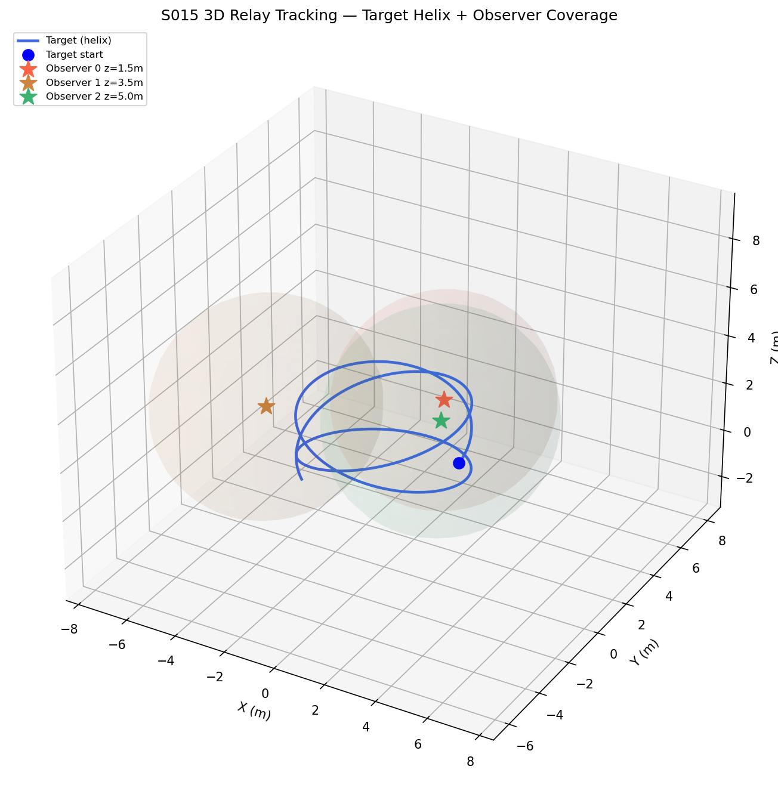
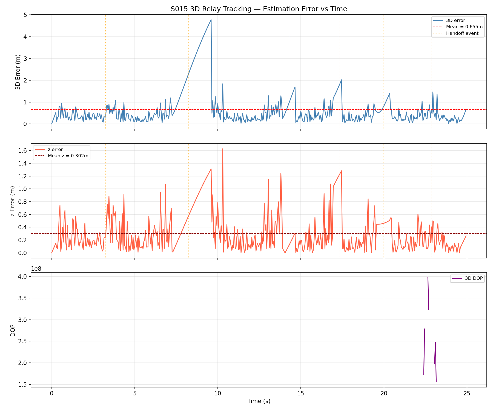
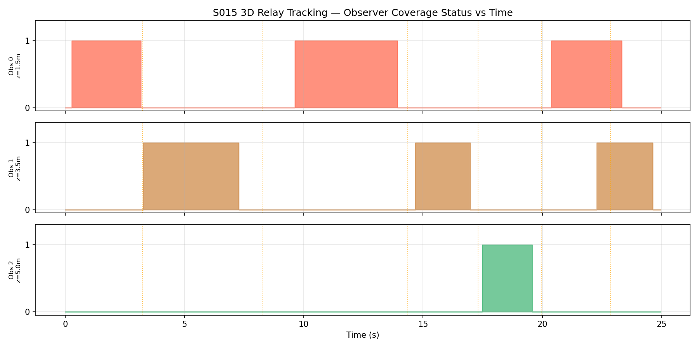
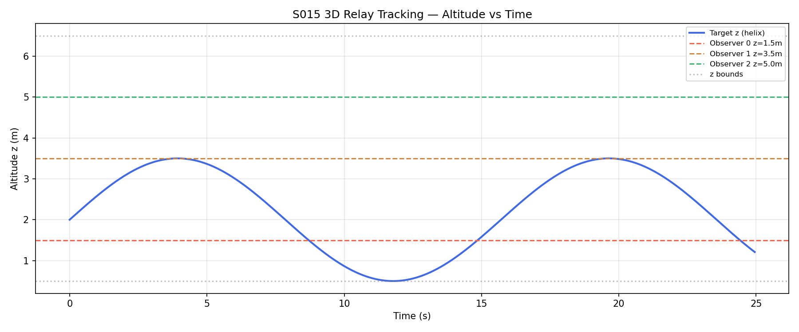
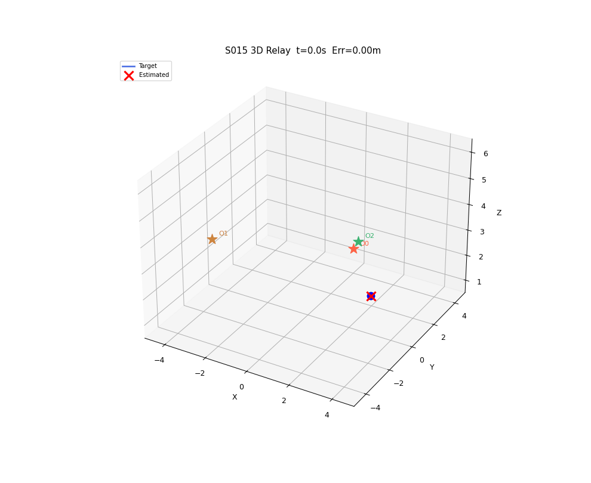

# S015 3D Upgrade — Relay Tracking

**Domain**: Pursuit & Evasion | **Difficulty**: ⭐⭐⭐⭐ | **Status**: Completed

---

## Problem Definition

**Setup**: A target drone follows a helical orbit with altitude oscillation. Three stationary observer drones are placed at altitude tiers (z = 1.5, 3.5, 5.0 m) rather than a single plane, giving non-coplanar bearing vectors.

- Each observer reports azimuth + elevation bearing (full 3D) with Gaussian noise.
- Altitude-weighted SNR selects the two best observers for triangulation.
- 3D closest-approach bearing intersection estimates the full (x, y, z) position.

**Objective**: Demonstrate that altitude-stratified sensors reduce z-estimation error vs all-same-height deployment, and show DOP variation as the helical target changes altitude.

---

## Mathematical Model

### Helical Target

$$\mathbf{p}_T(t) = \begin{bmatrix} 3\cos(\omega t) \\ 3\sin(\omega t) \\ 2 + 1.5\sin(0.4t) \end{bmatrix}, \quad \omega = 2/3 \text{ rad/s}$$

### Altitude-Weighted SNR

$$\text{SNR}_i = \max\!\left(0,\; 1 - \frac{\|\mathbf{p}_T - \mathbf{p}_i\|}{R_{zone}}\right) \cdot \exp\!\left(-\frac{(z_T - z_i)^2}{2\sigma_z^2}\right)$$

### 3D Bearing Triangulation

Closest-approach midpoint between two rays:

$$s_1^* = \frac{be - d}{\text{denom}}, \quad s_2^* = \frac{e - bd}{\text{denom}}, \quad \text{denom} = 1 - (\hat{d}_1 \cdot \hat{d}_2)^2$$

$$\hat{\mathbf{p}}_T = \tfrac{1}{2}\left[(\mathbf{p}_1 + s_1^* \hat{d}_1) + (\mathbf{p}_2 + s_2^* \hat{d}_2)\right]$$

### 3D DOP

$$\mathbf{H} = [\hat{d}_1, \hat{d}_2, \ldots]^T, \quad \text{DOP}_{3D} = \sqrt{\text{tr}[(\mathbf{H}^T\mathbf{H})^{-1}]}$$

---

## Key Parameters

| Parameter | Value |
|-----------|-------|
| Observer 0 position | (0, 4, 1.5) m |
| Observer 1 position | (−3.46, −2, 3.5) m |
| Observer 2 position | (3.46, −2, 5.0) m |
| Zone radius R_zone | 8.0 m |
| Azimuth noise σ_α | 0.05 rad |
| Elevation noise σ_β | 0.07 rad |
| Altitude bandwidth σ_z | 2.0 m |
| Handoff SNR threshold | 0.4 |
| dt | 0.05 s |
| T_max | 25 s |

---

## Simulation Results

- **Handoff events**: 6 (at t ≈ 3.25, 8.25, 14.35, 17.30, 19.95, 22.85 s)
- **Mean 3D error**: 0.655 m
- **Mean z error**: 0.302 m
- **Max 3D error**: 4.78 m (at handoff spikes)

The altitude-stratified placement provides non-coplanar bearing vectors, improving z estimation compared to a flat deployment.

---

## Output Plots

**3D Trajectories + Observer Coverage Spheres**

Shows helical target orbit (blue) and semi-transparent coverage spheres (at 0.5× radius for visual clarity) for each altitude-tiered observer.

**Tracking Error vs Time**

Three panels: 3D position error, z-only error, and 3D DOP. Orange vertical lines mark handoff events where estimation error spikes.

**Observer Coverage Status**

Binary (0/1) coverage per observer over time; shows relay pattern as target traverses the helical orbit.

**Altitude vs Time**

Target z oscillates ±1.5 m around z=2 m; observer altitude tiers shown as dashed lines.

**Animation**

Shows bearing lines from two active observers converging on target estimate in real time.

---

## Extensions

1. Mobile relay drone repositioning to minimise 3D DOP in real time
2. Four sensors: optimise altitude tiers to minimise worst-case DOP over helix trajectory
3. Add range-rate (Doppler) measurement for full 3D tracking fusion

---

## Related Scenarios

- Original 2D: `src/01_pursuit_evasion/s015_relay_tracking.py`
- S012 3D Relay Pursuit, S013 3D Pincer Movement
