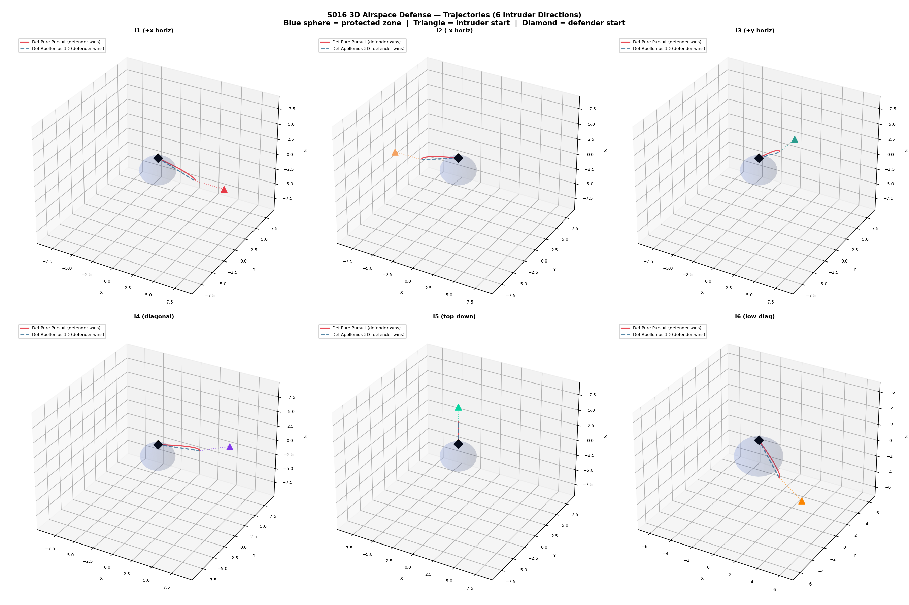
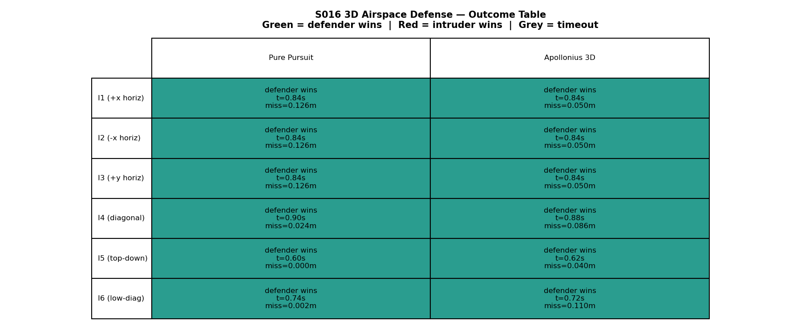
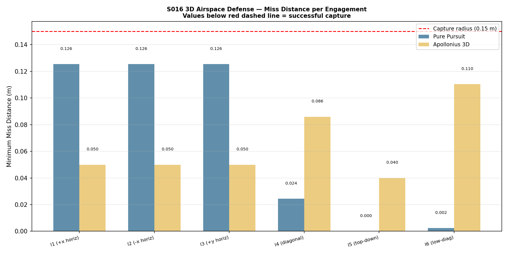
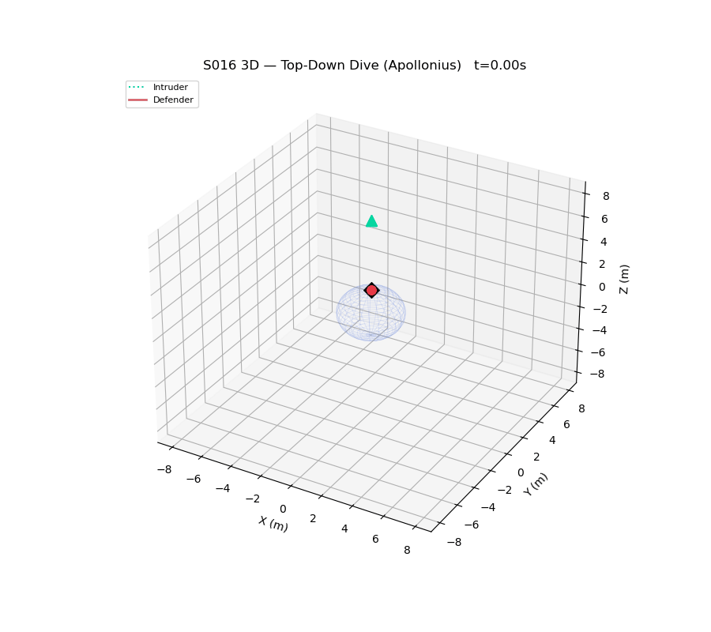

# S016 3D — Airspace Defense

## Problem Definition

A protected zone (sphere of radius 2 m at origin) is threatened by 6 intruders approaching from all 3D directions — horizontal, diagonal, top-down dive, and below-diagonal. A single defender starts at (0, 0, 2) and must intercept each intruder before it crosses the zone boundary. Two guidance strategies are compared: **Pure Pursuit** and **Apollonius 3D** (intercept-point prediction via binary time search).

## Mathematical Model

- **Protected zone**: sphere `||p|| ≤ R_zone = 2.0 m`
- **Pure Pursuit**: defender always moves directly toward current intruder position
- **Apollonius 3D intercept**: binary search on time `t` to find earliest point where `||p_D - p_I(t)|| ≤ v_D * t`; defender steers toward predicted intercept point
- **Intruder motion**: straight line at constant speed toward zone center (0,0,0)

## Key Parameters

| Parameter | Value |
|-----------|-------|
| Protected zone radius | 2.0 m |
| Defender start | (0, 0, 2) m |
| Defender speed | 6.0 m/s |
| Intruder speed | 4.0 m/s |
| Speed ratio | 1.5 |
| Capture radius | 0.15 m |
| dt | 0.02 s |
| T_max | 10.0 s |

## Intruder Start Positions

| ID | Position | Direction |
|----|----------|-----------|
| I1 | (8, 0, 0) | +x horizontal |
| I2 | (-8, 0, 0) | -x horizontal |
| I3 | (0, 8, 0) | +y horizontal |
| I4 | (6, 6, 0) | diagonal |
| I5 | (0, 0, 8) | top-down dive |
| I6 | (4, 0, -4) | below-diagonal |

## Simulation Results

| Intruder | Pure Pursuit | Apollonius 3D |
|----------|-------------|---------------|
| I1 (+x horiz) | defender_wins (t=0.84s) | defender_wins (t=0.84s) |
| I2 (-x horiz) | defender_wins (t=0.84s) | defender_wins (t=0.84s) |
| I3 (+y horiz) | defender_wins (t=0.84s) | defender_wins (t=0.84s) |
| I4 (diagonal) | defender_wins (t=0.90s) | defender_wins (t=0.88s) |
| I5 (top-down) | defender_wins (t=0.60s) | defender_wins (t=0.62s) |
| I6 (low-diag) | defender_wins (t=0.74s) | defender_wins (t=0.72s) |

Both strategies achieve **6/6 defender wins** — the speed ratio of 1.5 gives the defender a strong guarantee across all 3D approach angles.

## Output Files

| File | Description |
|------|-------------|
| `trajectories_3d.png` | 6 subplots (one per intruder), 3D trajectories for both strategies |
| `outcome_table.png` | Outcome table: intruders × strategies with time and miss distance |
| `miss_distance.png` | Bar chart of minimum miss distances per engagement |
| `animation.gif` | Top-down dive (I5) engagement animated in 3D — Apollonius strategy |

### trajectories_3d.png

### outcome_table.png

### miss_distance.png

### animation.gif

## Key Findings

- Speed ratio 1.5 guarantees intercept from all 6 attack directions in 3D
- Top-down dive (z=8m) is intercepted fastest (~0.60s) — defender only needs to move upward
- Apollonius 3D slightly reduces intercept time for diagonal approaches by steering toward predicted intercept point rather than current intruder position
- Both strategies perform equivalently on axis-aligned approaches due to direct geometry

## Extensions

1. Multiple simultaneous intruders — defender must prioritize by time-to-zone
2. Intruder altitude jink during final approach to defeat predictive strategies
3. Two cooperating defenders at different altitude tiers

## Related Scenarios

- Original 2D: `src/01_pursuit_evasion/s016_airspace_defense.py`
- S017 3D Swarm vs Swarm: `src/01_pursuit_evasion/3d/s017_3d_swarm_vs_swarm.py`
