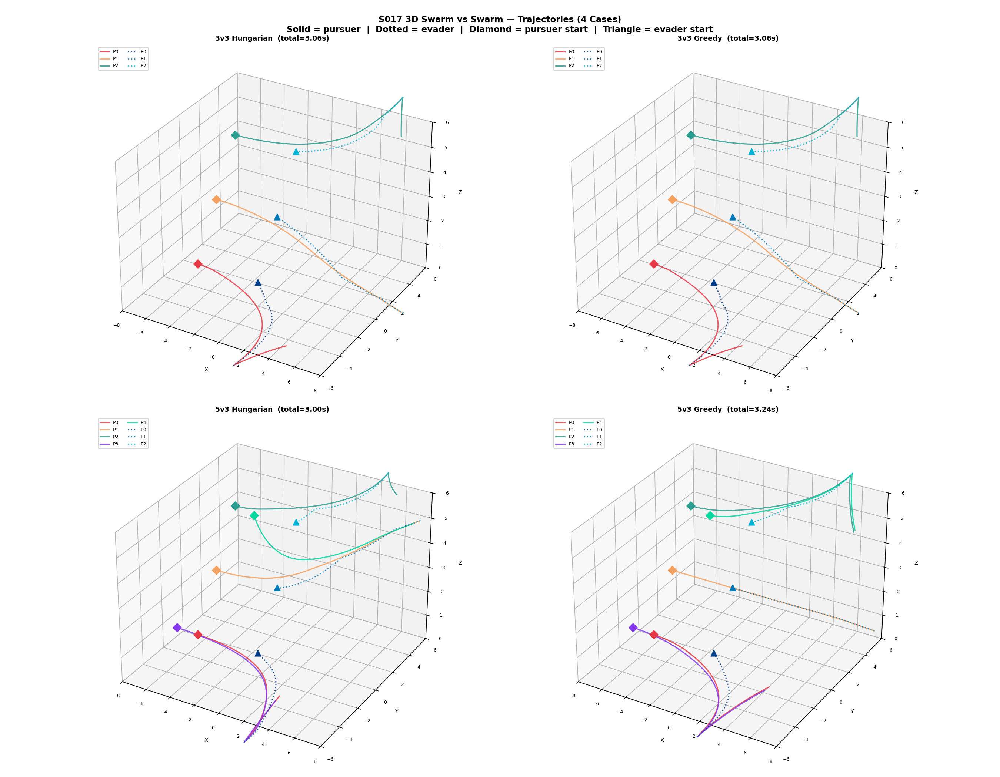
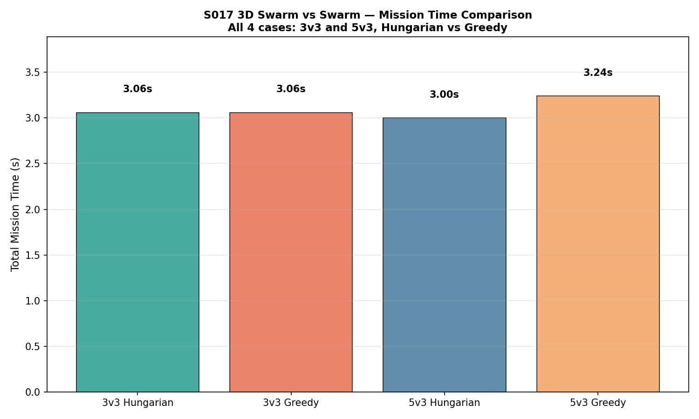
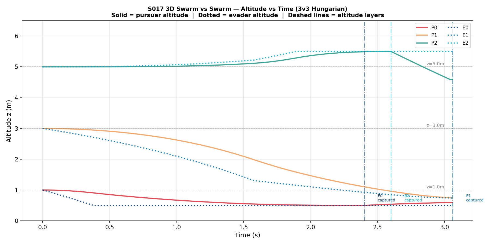
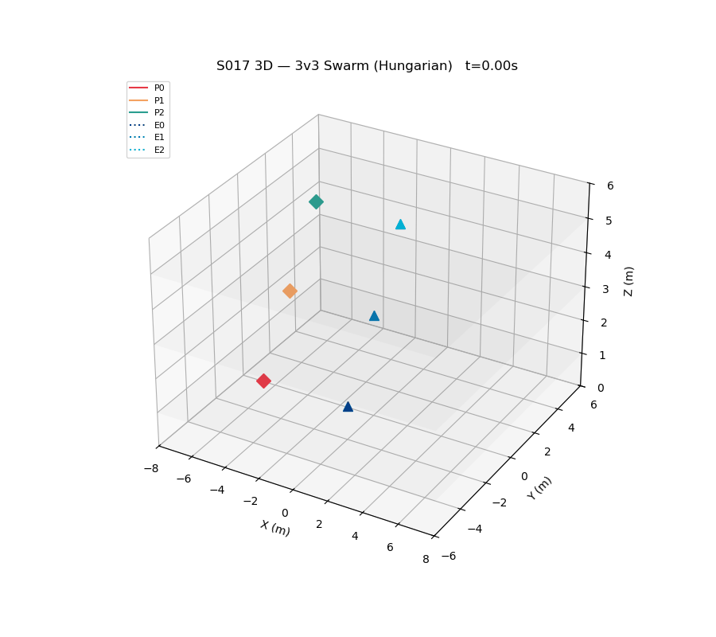

# S017 3D — Swarm vs Swarm

## Problem Definition

3 pursuers vs 3 evaders (NvN swarm confrontation) in a 3D volume, with drones operating at distinct altitude layers (z=1m, z=3m, z=5m). Two assignment strategies are compared — **Hungarian 3D** (optimal assignment with altitude penalty) and **Greedy 3D** (priority-based nearest-evader). Additionally, 5v3 cases are evaluated with two extra pursuers.

## Mathematical Model

- **3D Cost matrix**: `C[i,j] = ||p_Pi - p_Ej||_2 + 2.0 * |z_Pi - z_Ej|` (altitude penalty)
- **Hungarian assignment**: `scipy.optimize.linear_sum_assignment` minimizes total cost
- **Greedy assignment**: each pursuer (sorted by nearest-evader priority) picks closest available evader
- **Pursuer motion**: pure pursuit 3D with dive-speed boost `v_boost = v_P * (1 + η * dz/dist)` when pursuer is above evader
- **Evader strategy**: escape from centroid of all pursuers with altitude bias toward least-covered layer
- **Capture**: `||p_Pi - p_Ej|| < 0.15 m`

## Key Parameters

| Parameter | Value |
|-----------|-------|
| Altitude layers | z = 1.0, 3.0, 5.0 m |
| Pursuer speed | 5.0 m/s |
| Evader speed | 3.5 m/s |
| Dive efficiency η | 0.15 |
| Dive boost max | 1.3 × v_P |
| Vertical escape gain k_z | 0.5 |
| Capture radius | 0.15 m |
| dt | 0.02 s |

## Initial Positions

**3v3**: Pursuers at [(-5,-2,1), (-5,0,3), (-5,2,5)], Evaders at [(0,-2,1), (0,0,3), (0,2,5)]

**5v3**: Extra pursuers added at [(-5,-4,2), (-5,4,4)]

## Simulation Results

| Case | Method | Total Time | Capture Times |
|------|--------|------------|---------------|
| 3v3 | Hungarian | 3.06s | [2.40s, 3.06s, 2.60s] |
| 3v3 | Greedy | 3.06s | [2.40s, 3.06s, 2.60s] |
| 5v3 | Hungarian | 3.00s | [2.48s, 3.00s, 2.38s] |
| 5v3 | Greedy | 3.24s | [2.34s, 3.24s, 2.40s] |

Key observations:
- 5v3 Hungarian is the fastest overall (3.00s), demonstrating the benefit of extra pursuers with optimal assignment
- 5v3 Greedy is actually slower than 3v3 (3.24s), showing that extra pursuers without optimal assignment can cause conflicts
- 3v3 Hungarian and Greedy tie due to initial symmetric positioning

## Output Files

| File | Description |
|------|-------------|
| `trajectories_3d.png` | 2×2 subplots: 3D trajectories for all 4 cases |
| `capture_time_comparison.png` | Bar chart of total mission time for all 4 cases |
| `altitude_layers.png` | Altitude vs time for all agents in 3v3 Hungarian case |
| `animation.gif` | 3v3 Hungarian engagement animated in 3D |

### trajectories_3d.png

### capture_time_comparison.png

### altitude_layers.png

### animation.gif

## Key Findings

- Hungarian assignment + extra pursuers (5v3) achieves fastest mission time
- Greedy 5v3 is slower than Hungarian 5v3 — multiple pursuers contending for same evader waste time
- Dive-speed boost helps pursuers at higher altitude close distance faster
- Evaders' altitude-layer escape strategy forces pursuers to follow vertical evasion

## Extensions

1. Cooperative altitude stacking: lock each pursuer to its initial layer
2. Heterogeneous speeds: climbing slower than level flight
3. MARL (MAPPO) end-to-end training vs rule-based Hungarian

## Related Scenarios

- Original 2D: `src/01_pursuit_evasion/s017_swarm_vs_swarm.py`
- S016 3D Airspace Defense: `src/01_pursuit_evasion/3d/s016_3d_airspace_defense.py`
