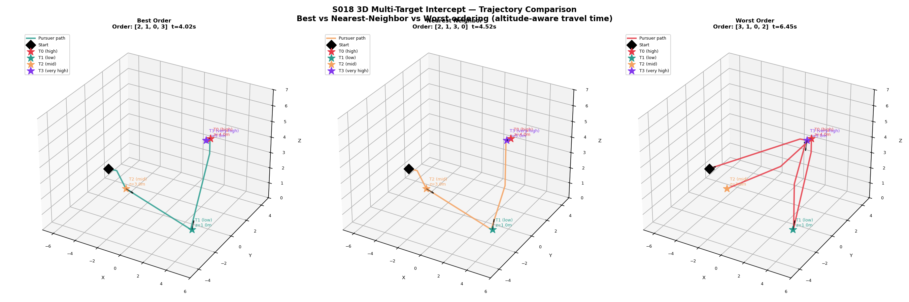
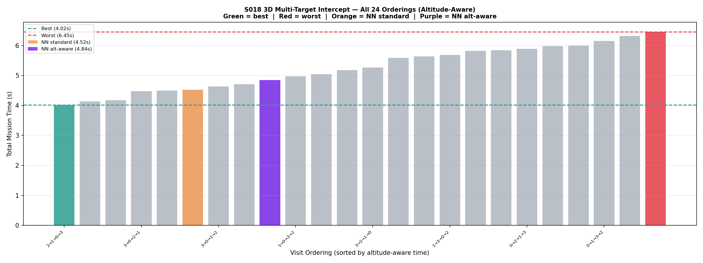
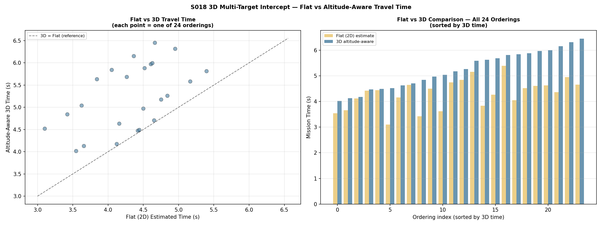
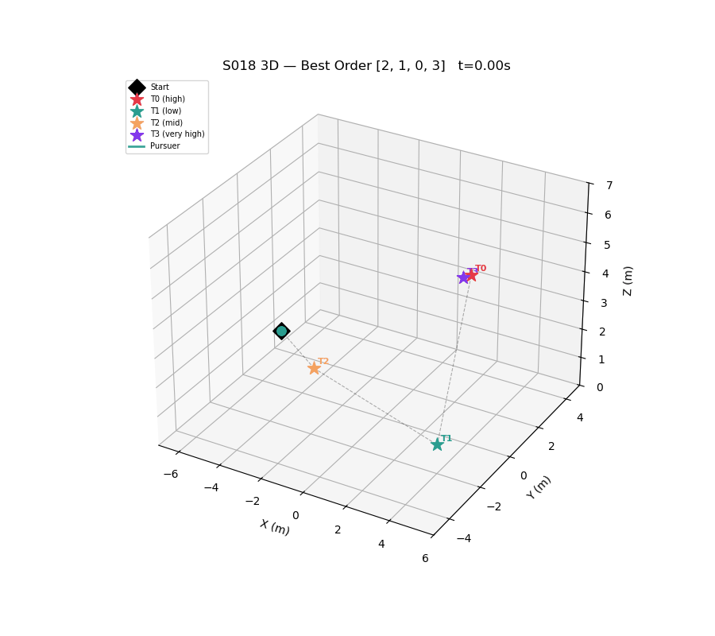

# S018 3D — Multi-Target Intercept

## Problem Definition

A single pursuer must visit 4 static targets at varying altitudes in optimal order. The pursuer has limited vertical speed (v_z=2.0 m/s) vs horizontal speed (v_xy=5.0 m/s), making altitude-aware travel time non-Euclidean. All 24 orderings are evaluated (brute-force TSP), plus nearest-neighbor and altitude-aware nearest-neighbor heuristics.

## Mathematical Model

- **Altitude-aware travel time**: `t(a, b) = max(d_xy / v_xy, |dz| / v_z)` — bottleneck of horizontal vs vertical leg
- **Flat travel time** (reference): `t_flat(a, b) = d_xy / v_xy` — ignores altitude
- **Altitude-aware NN**: weighted distance `d_alt(a,b) = d_xy + W_z * |dz|` where `W_z = v_xy / v_z = 2.5`
- **Pursuer motion**: decoupled XY (full speed) and Z (limited rate) — simulated step-by-step
- **Arrival condition**: `d_xy < 0.2 m AND |dz| < 0.1 m`

## Key Parameters

| Parameter | Value |
|-----------|-------|
| Start position | (-5, 0, 2) m |
| Horizontal speed v_xy | 5.0 m/s |
| Vertical speed v_z | 2.0 m/s |
| Altitude weight W_z | 2.5 |
| XY arrival threshold | 0.2 m |
| Z arrival threshold | 0.1 m |
| dt | 0.05 s |

## Target Positions

| Target | Position | Altitude |
|--------|----------|---------|
| T0 | (2, 3, 4.0) m | high |
| T1 | (4, -2, 1.0) m | low |
| T2 | (-1, -3, 3.0) m | mid |
| T3 | (3, 1, 5.0) m | very high |

## Simulation Results

| Method | Order | Time | Gap vs Best |
|--------|-------|------|-------------|
| Brute-force optimal | (2, 1, 0, 3) | 4.02s | — |
| NN standard (3D Euclidean) | (2, 1, 3, 0) | 4.52s | +12.4% |
| NN altitude-aware | (2, 0, 3, 1) | 4.84s | +20.4% |
| Worst ordering | (3, 1, 0, 2) | 6.45s | +60.4% |

Key observations:
- Optimal order (T2→T1→T0→T3) visits low targets first, then ascends monotonically — minimizing wasted vertical travel
- Standard NN achieves only 12.4% gap by leveraging 3D proximity
- Altitude-aware NN is surprisingly 20.4% worse — the altitude penalty over-weights vertical differences and causes longer horizontal detours
- Worst order (T3→T1→T0→T2) repeatedly oscillates between high and low altitude

## Output Files

| File | Description |
|------|-------------|
| `trajectories_3d.png` | 3 subplots: best, NN, worst ordering in 3D |
| `all_orderings.png` | Bar chart of all 24 orderings sorted by altitude-aware time |
| `flat_vs_3d.png` | Scatter + bar comparison: flat vs altitude-aware time for all 24 orderings |
| `animation.gif` | Best ordering animated in 3D |

### trajectories_3d.png

### all_orderings.png

### flat_vs_3d.png

### animation.gif

## Key Findings

- Altitude sequencing matters significantly — a 60% time difference exists between best and worst orderings
- Flat travel time consistently underestimates true 3D time, especially for altitude-heavy orderings
- The bottleneck metric (max of horizontal/vertical) means that for short horizontal moves to very different altitudes, the vertical leg dominates completely
- Optimal order follows a roughly altitude-monotone pattern (ascending) from start

## Extensions

1. Moving targets at different altitudes — altitude-aware greedy NN still applicable
2. 2-opt local search: swap two visits and check if altitude-aware tour time improves
3. Heterogeneous vertical speeds: climbing slower than descending

## Related Scenarios

- Original 2D: `src/01_pursuit_evasion/s018_multi_target_intercept.py`
- S016 3D Airspace Defense: `src/01_pursuit_evasion/3d/s016_3d_airspace_defense.py`
