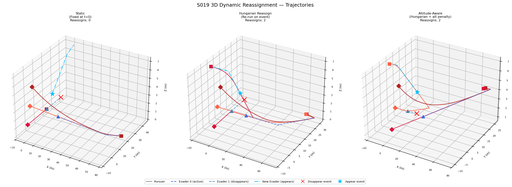
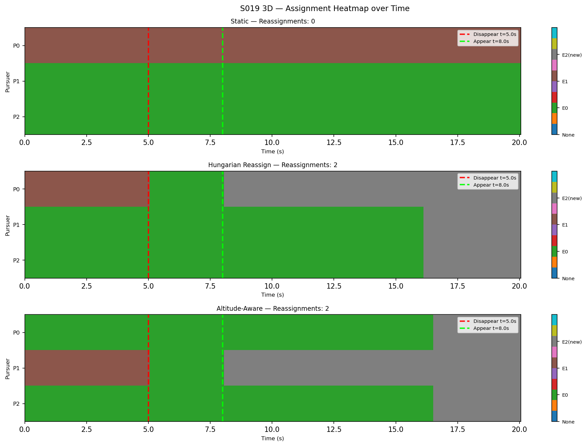
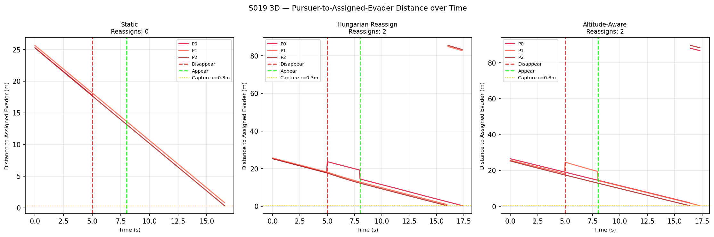
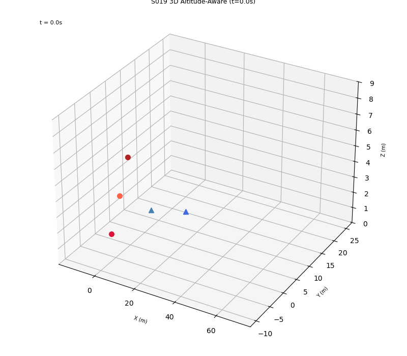

# S019 3D — Dynamic Target Reassignment

**Domain**: Pursuit & Evasion | **Difficulty**: ⭐⭐⭐⭐⭐ | **Status**: `[x]` Complete

---

## Problem Definition

3 pursuers vs 2 evaders in 3D space. One evader disappears at t=5s and a new evader appears at t=8s at a random altitude. Three assignment strategies are compared:

1. **Static** — Hungarian assignment at t=0, never updated (pursuer holds position when target disappears)
2. **Hungarian Reassign** — Re-run Hungarian algorithm after each event (disappear/appear)
3. **Altitude-Aware** — Hungarian with altitude penalty cost matrix `C[i,j] = ||p_i - e_j|| + 2.0 * |z_i - z_j|`

---

## Mathematical Model

### Altitude-Aware Cost Matrix
```
C[i,j] = ||p_i - e_j||₂ + alt_weight * |z_i - z_j|
```
where `alt_weight = 2.0` penalizes large altitude jumps.

### Pursuer Velocity (Pure Pursuit 3D)
```
v_i = V_MAX * (e_j - p_i) / ||e_j - p_i||
```
Speed: 5.0 m/s. Evader escape speed: 3.5 m/s.

---

## Key Parameters

| Parameter | Value |
|-----------|-------|
| Pursuers | 3, at (-5,-3,1.0), (-5,0,3.0), (-5,3,5.0) m |
| Evaders | 2 initially, at (20,6,2.0) and (20,-6,4.0) m |
| Pursuer speed | 5.0 m/s |
| Evader speed | 3.5 m/s |
| Capture radius | 0.30 m |
| dt | 0.05 s |
| T_disappear | 5.0 s |
| T_appear | 8.0 s |
| New evader z range | [0.5, 6.0] m |

---

## Simulation Results

| Strategy | Reassignments | Captures |
|----------|---------------|---------|
| Static | 0 | E0 at 16.6s only |
| Hungarian Reassign | 2 | E0 at 16.0s, E2(new) at 17.4s |
| Altitude-Aware | 2 | E0 at 16.4s, E2(new) at 17.35s |

Key findings:
- Static strategy misses the new evader entirely (no pursuer is reassigned)
- Both reassignment strategies trigger 2 events: one on disappear, one on appear
- Altitude-aware strategy captures the new evader ~0.05s faster than basic Hungarian due to altitude-efficient assignment

---

## Output Files

| File | Description |
|------|-------------|
| `trajectories_3d.png` | 3 subplots (one per strategy) with 3D trajectories, evader disappear/appear events marked |
| `assignment_heatmap.png` | Assignment heatmap over time for each strategy (rows=pursuers, color=evader slot) |
| `distance_time.png` | Pursuer-to-assigned-evader distance over time for all 3 strategies |
| `animation.gif` | 3D animation of altitude_aware strategy |

### trajectories_3d.png


### assignment_heatmap.png


### distance_time.png


### animation.gif


---

## Extensions

1. **Auction algorithm (3D)**: distributed alternative to centralized Hungarian
2. **Altitude-tiered reassignment**: pursuers never cross altitude tiers unless necessary
3. **RL policy for assignment**: replace rule-based switching cost with a learned value function

---

## Related Scenarios

- Original 2D version: S019 Dynamic Reassignment
- 3D pursuit base: S001 3D Basic Intercept
- 3D multi-pursuer: S013 3D Pincer Movement
