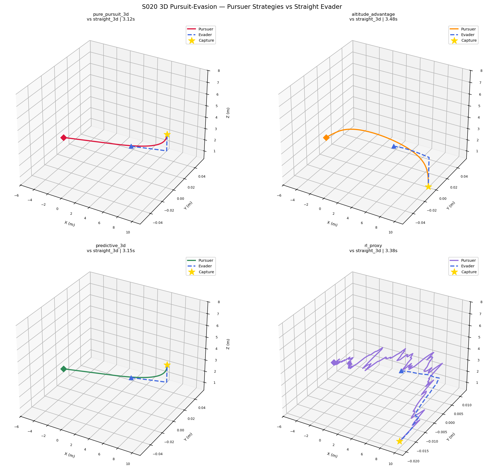
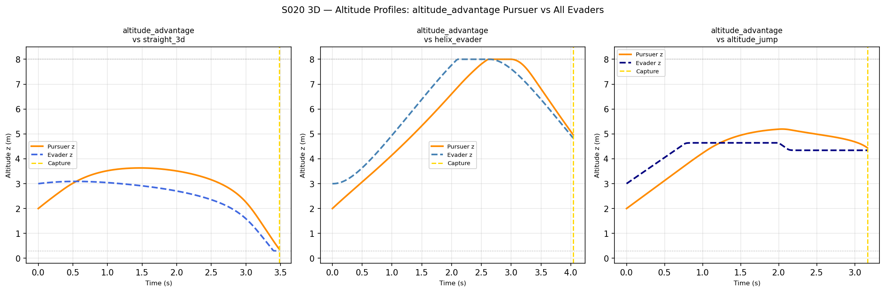
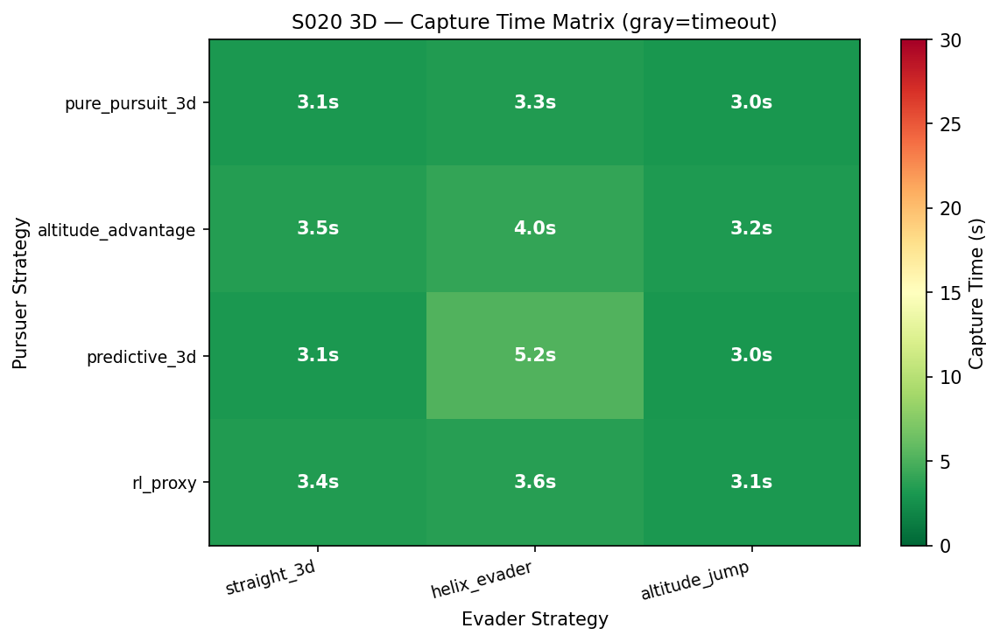
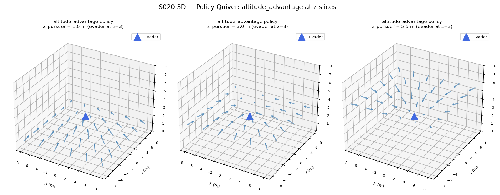
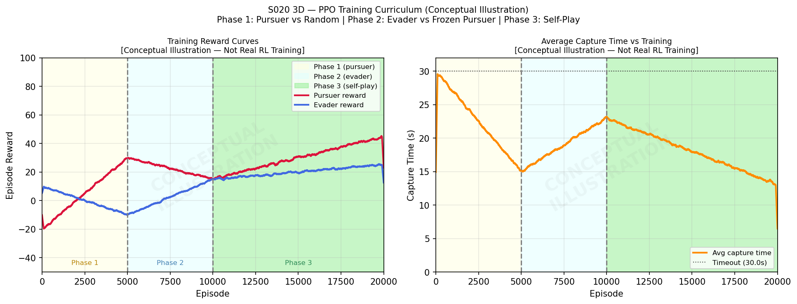
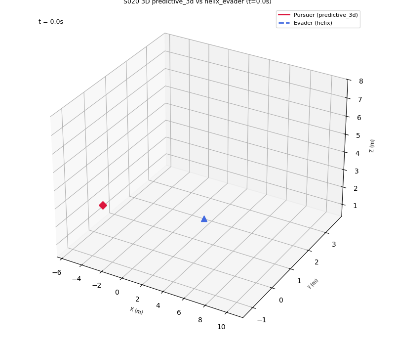

# S020 3D — Pursuit-Evasion Game (3D RL/PPO)

**Domain**: Pursuit & Evasion | **Difficulty**: ⭐⭐⭐⭐⭐ | **Status**: `[x]` Complete

---

## Problem Definition

Capstone of the 3D pursuit-evasion domain. Instead of full PPO training (which takes hours), this implements a **simplified but complete** version using hand-crafted altitude-aware pursuer strategies that demonstrate 3D state/action architecture. Four pursuer strategies are benchmarked against three evader strategies (4×3 = 12 combinations).

**Note on RL**: A conceptual illustration of the PPO training curriculum is provided. The `learning_curves_conceptual.png` shows a synthetic 3-phase curriculum clearly labeled as "Conceptual Illustration — Not Real RL Training".

---

## 3D State Space (13-dim)

```
s = [px, py, pz, vx, vy, vz, ex, ey, ez, evx, evy, evz, dist]
```
where p = pursuer position/velocity, e = evader position/velocity, dist = 3D Euclidean distance.

## 3D Action Space

Unit vector in R³: `v_cmd = v_max * a / (||a|| + ε)`

---

## Pursuer Strategies

| Strategy | Description |
|----------|-------------|
| `pure_pursuit_3d` | Fly directly toward evader: `v = V_max * (e-p)/||e-p||` |
| `altitude_advantage` | Add upward bias if pursuer not above evader by >1m |
| `predictive_3d` | Lead evader by T_lead=0.3s: target = `e_pos + e_vel * T_lead` |
| `rl_proxy` | Rule-based mimicking RL: pure pursuit + altitude bias + noise |

## Evader Strategies

| Strategy | Description |
|----------|-------------|
| `straight_3d` | Escape directly away from pursuer in 3D |
| `helix_evader` | Helical motion: horizontal escape + sinusoidal altitude oscillation |
| `altitude_jump` | Random altitude change every 2s while escaping horizontally |

---

## Key Parameters

| Parameter | Value |
|-----------|-------|
| Pursuer start | (-5, 0, 2) m |
| Evader start | (5, 0, 3) m |
| Pursuer max speed | 5.0 m/s |
| Evader max speed | 3.5 m/s |
| Arena | [-10,10]³ m |
| z bounds | [0.3, 8.0] m |
| dt | 1/48 s ≈ 0.0208 s |
| Max time | 30.0 s |
| Capture radius | 0.15 m |
| T_lead (predictive) | 0.3 s |

---

## Capture Time Matrix (seconds)

| Pursuer ↓ / Evader → | straight_3d | helix_evader | altitude_jump |
|----------------------|-------------|--------------|---------------|
| pure_pursuit_3d | 3.12s | 3.31s | 3.02s |
| altitude_advantage | 3.48s | 4.04s | 3.17s |
| predictive_3d | 3.15s | 5.25s | 3.02s |
| rl_proxy | 3.38s | 3.60s | 3.15s |

Key findings:
- All pursuer strategies successfully capture all evader types within T_MAX=30s
- `pure_pursuit_3d` is fastest overall (no overhead from altitude correction)
- `altitude_advantage` takes slightly longer due to altitude-seeking behavior before intercept
- `helix_evader` is the hardest evader — `predictive_3d` takes 5.25s vs 3.1-3.5s for others
- The helix evader's perpendicular motion defeats the predictive lead since the prediction overshoots

---

## Output Files

| File | Description |
|------|-------------|
| `trajectories_3d.png` | 2×2 grid: 4 pursuer strategies vs straight evader |
| `altitude_profiles.png` | Z vs time: altitude_advantage vs all 3 evader types |
| `capture_matrix.png` | Heatmap: 4 pursuer × 3 evader, capture time (gray=timeout) |
| `policy_quiver_3d.png` | 3D quiver: altitude_advantage action directions at z=1,3,5.5 slices |
| `learning_curves_conceptual.png` | Synthetic 3-phase PPO learning curves (conceptual illustration) |
| `animation.gif` | predictive_3d vs helix_evader animated in 3D |

### trajectories_3d.png


### altitude_profiles.png


### capture_matrix.png


### policy_quiver_3d.png


### learning_curves_conceptual.png


### animation.gif


---

## PPO Curriculum Architecture (Conceptual)

The full 3D PPO curriculum would consist of:
- **Phase 1** (5,000 episodes): Pursuer trains vs random 3D evader
- **Phase 2** (5,000 episodes): Evader trains vs frozen Phase-1 pursuer
- **Phase 3** (10,000 episodes): Both agents in self-play

Network: 2-layer MLP, 256 units each, `clip_range=0.2`, `lr=3e-4`.

---

## Extensions

1. **Full PPO training**: Use stable-baselines3 with the 3-phase curriculum (requires ~hours)
2. **MAPPO 3v3**: Multi-agent PPO for swarm pursuit-evasion in 3D
3. **Domain randomization**: Transfer from simulation to hardware via z_max/z_min randomization

---

## Related Scenarios

- Original 2D version: S020 Pursuit-Evasion Game
- 3D differential game: S009 3D Differential Game
- 3D asymmetric speed: S010 3D Asymmetric Speed
