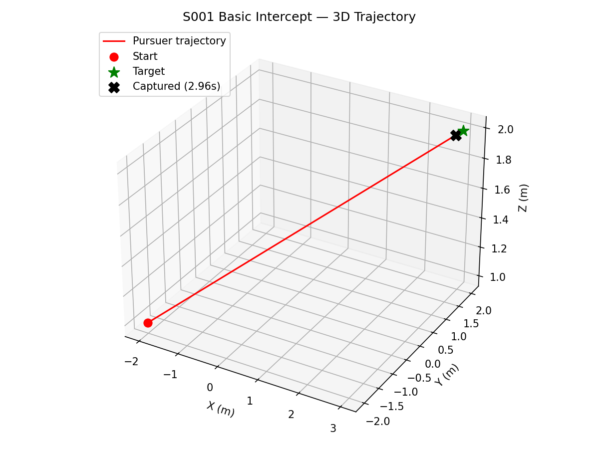
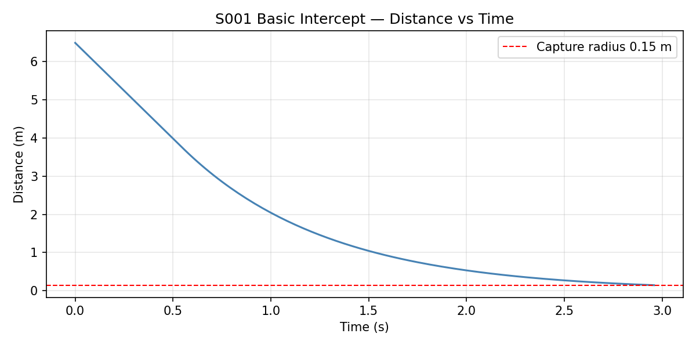
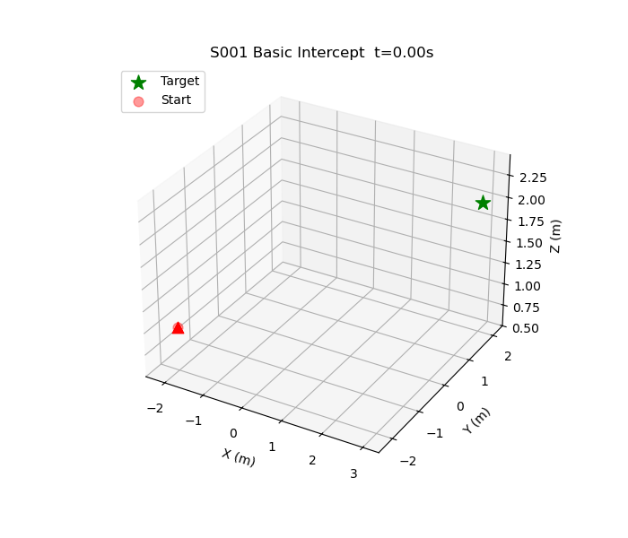

# S001 Basic Intercept

**Domain**: Pursuit & Evasion | **Difficulty**: ⭐ | **Status**: ✅ Completed

---

## Problem Definition

**Setup**: A pursuer drone starts at a given position and intercepts a stationary target.

**Objective**:
- Pursuer: minimize time to reach the target
- Target: stationary (no evasion)

**Constraints**:
- Pursuer max speed: $v_{max} = 5$ m/s
- Battery limit: 30 seconds max flight time
- Arena bounds: $[-5, 5]^3$ m

---

## Mathematical Model

### Proportional Navigation Guidance (PNG) — Simplified as PD Control

Line-of-sight vector:

$$\mathbf{r} = \mathbf{p}_{target} - \mathbf{p}_{pursuer}$$

Velocity command (PD control):

$$\mathbf{v}_{cmd} = K_p \cdot \mathbf{r} + K_d \cdot (-\mathbf{v}_{pursuer})$$

where $K_p = 2.0$, $K_d = 0.5$. The command is clamped to $v_{max} = 5$ m/s.

This is a position-error simplification of the full PNG law:

$$\mathbf{a}_{cmd} = N \cdot |\mathbf{v}_{closing}| \cdot \dot{\lambda} \cdot \hat{\mathbf{n}}, \quad N=3$$

### Capture Condition

$$\|\mathbf{p}_{pursuer} - \mathbf{p}_{target}\| < r_{capture} = 0.15 \text{ m}$$

---

## Key Parameters

| Parameter | Value | Notes |
|-----------|-------|-------|
| Pursuer start | (-2, -2, 1) m | |
| Target position | (3, 2, 2) m | Stationary |
| Max speed | 5 m/s | |
| Capture radius | 0.15 m | |
| Control frequency | 48 Hz | dt = 1/48 s |
| Max simulation time | 30 s | |
| $K_p$ | 2.0 | PD proportional gain |
| $K_d$ | 0.5 | PD derivative gain |

---

## Implementation

```
src/base/drone_base.py               # Point-mass drone base class
src/01_pursuit_evasion/s001_basic_intercept.py  # Main simulation script
```

```bash
conda activate drones
python src/01_pursuit_evasion/s001_basic_intercept.py
```

---

## Results

**Capture time: 2.96 s** ✅ (expected 3–6 s)

**3D Trajectory** — pursuer (red) flies directly toward the stationary target (green star):



**Distance vs Time** — monotonically decreasing, confirming the controller works correctly:



**Animation**:



---

## Extensions

1. **S002**: Let the target start evading → evasive maneuver
2. Implement full PNG algorithm and compare trajectories
3. Monte Carlo simulation over random initial positions
4. Add battery constraint analysis (capture success rate vs. initial distance)

---

## Related Scenarios

- Prerequisites: none (entry-level scenario)
- Next: [S002](../../scenarios/01_pursuit_evasion/S002_evasive_maneuver.md), [S009](../../scenarios/01_pursuit_evasion/S009_differential_game.md)

## References

- Shneydor, N.A. (1998). *Missile Guidance and Pursuit*. Horwood.
- [MATH_FOUNDATIONS.md §4.1](../../MATH_FOUNDATIONS.md)
