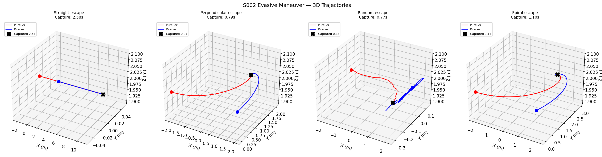
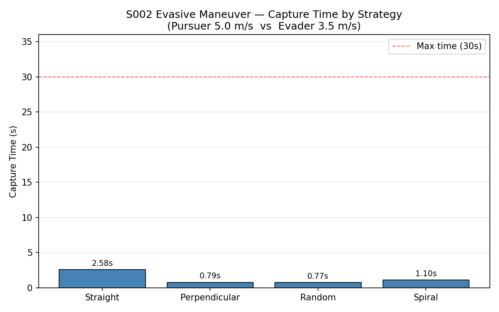
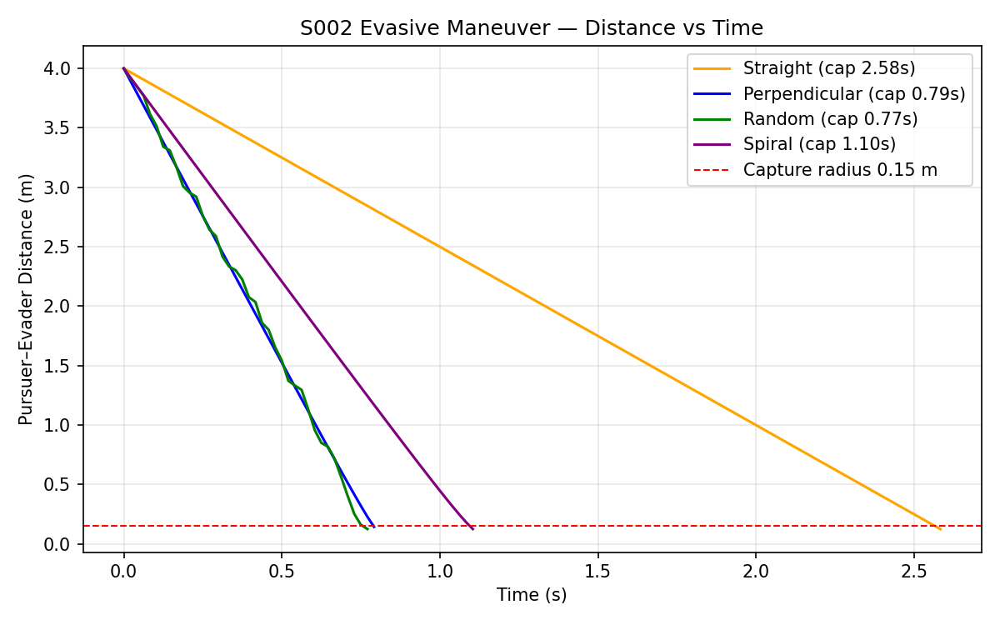

# S002 Evasive Maneuver

**Domain**: Pursuit & Evasion | **Difficulty**: ⭐⭐ | **Status**: ✅ Completed

---

## Problem Definition

**Setup**: Pursuer (Pure Pursuit) vs Evader — 1v1 engagement comparing 4 evasion strategies.

**Roles**:
- **Pursuer**: always aims directly at the evader's current position (Pure Pursuit)
- **Evader**: tests 4 different escape strategies

**Objective**: determine which evasion strategy maximizes survival time against a pure pursuit pursuer.

---

## Mathematical Model

### Pursuer — Pure Pursuit

$$\mathbf{v}_{P} = v_{P,max} \cdot \frac{\mathbf{p}_E - \mathbf{p}_P}{\|\mathbf{p}_E - \mathbf{p}_P\|}$$

### Evader Strategies

**Straight** — fly directly away from pursuer:

$$\mathbf{v}_E = v_{E,max} \cdot \hat{\mathbf{r}}, \quad \hat{\mathbf{r}} = \frac{\mathbf{p}_E - \mathbf{p}_P}{\lVert \mathbf{p}_E - \mathbf{p}_P \rVert}$$

**Perpendicular** — fly perpendicular to line-of-sight in the $xy$ plane:

$$\mathbf{v}_E = v_{E,max} \cdot \mathbf{R}_{90^\circ}\, \hat{\mathbf{r}}_{xy}$$

**Random** — random horizontal direction (seed = 42):

$$\mathbf{v}_E = v_{E,max} \cdot \hat{\mathbf{d}}, \quad \mathbf{d} \sim \mathcal{N}(0, I)$$

**Spiral** — 70% perpendicular + 30% outward:

$$\mathbf{v}_E = v_{E,max} \cdot (0.7\,\hat{\mathbf{r}}_\perp + 0.3\,\hat{\mathbf{r}})$$

### Capture Condition

$$\|\mathbf{p}_P - \mathbf{p}_E\| < r_{capture} = 0.15 \text{ m}$$

---

## Key Parameters

| Parameter | Value |
|-----------|-------|
| Pursuer start | (-2, 0, 2) m |
| Evader start | (2, 0, 2) m |
| Initial distance | 4.0 m |
| Pursuer speed | 5.0 m/s |
| Evader speed | 3.5 m/s |
| Speed ratio $k$ | 1.43 (capture guaranteed) |
| Capture radius | 0.15 m |
| Control frequency | 48 Hz |
| Max simulation time | 30 s |

---

## Implementation

```
src/base/drone_base.py                  # Point-mass drone base class
src/pursuit/s002_evasive_maneuver.py    # Main simulation script
```

```bash
conda activate drones
python src/pursuit/s002_evasive_maneuver.py
```

---

## Results

| Strategy | Capture Time | Effectiveness |
|----------|-------------|---------------|
| **Straight** | **2.58 s** | ✅ Best |
| Spiral | 1.10 s | |
| Perpendicular | 0.79 s | |
| Random | 0.77 s | Worst |

**Key Finding**: Against a Pure Pursuit adversary, **straight escape is optimal** — it directly maximizes opposition to the closing velocity ($v_{close} = v_P - v_E = 1.5$ m/s). The analytical approximation $T \approx r_0 / (v_P - v_E) = 4 / 1.5 = 2.67$ s matches the simulated 2.58 s closely.

> Note: Perpendicular escape is optimal against **Proportional Navigation Guidance (PNG)**, not pure pursuit. Against pure pursuit the evader gains no LOS distance advantage by flying sideways.

**3D Trajectories** — pursuer (red) converges on evader (blue) under each strategy:



**Capture Time Comparison**:



**Distance vs Time** — straight escape keeps the evader alive longest:



---

## Extensions

1. Equal-speed case ($v_P = v_E$) — can perpendicular escape prevent capture indefinitely?
2. Train evasion strategy with RL → [S020](../../scenarios/01_pursuit_evasion/S020_pursuit_evasion_game.md)
3. Replace pure pursuit with PNG and compare optimal evasion strategies
4. 3D evasion — allow z-axis maneuvers

---

## Related Scenarios

- Prerequisites: [S001](../../scenarios/01_pursuit_evasion/S001_basic_intercept.md)
- Next: [S003](../../scenarios/01_pursuit_evasion/S003_low_altitude_tracking.md), [S009](../../scenarios/01_pursuit_evasion/S009_differential_game.md)

## References

- Shneydor, N.A. (1998). *Missile Guidance and Pursuit*. Horwood.
- Isaacs, R. (1965). *Differential Games*. Wiley.
