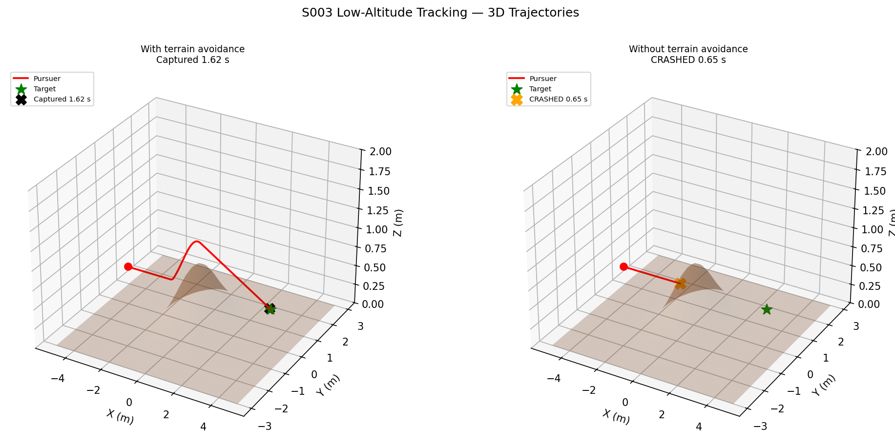
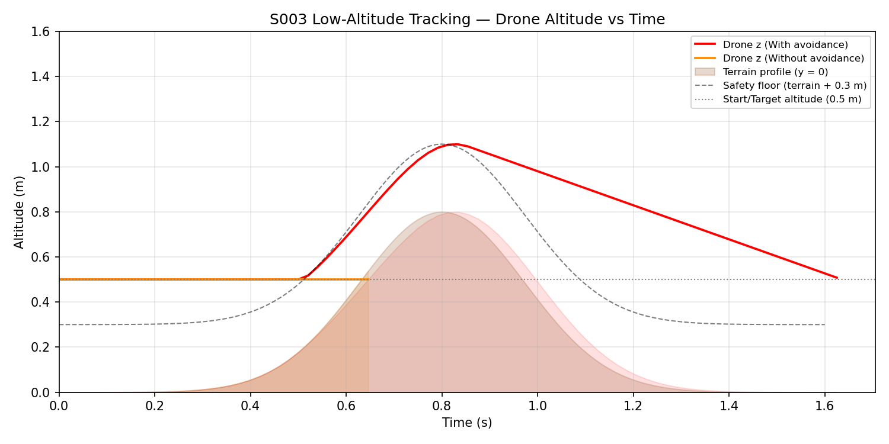
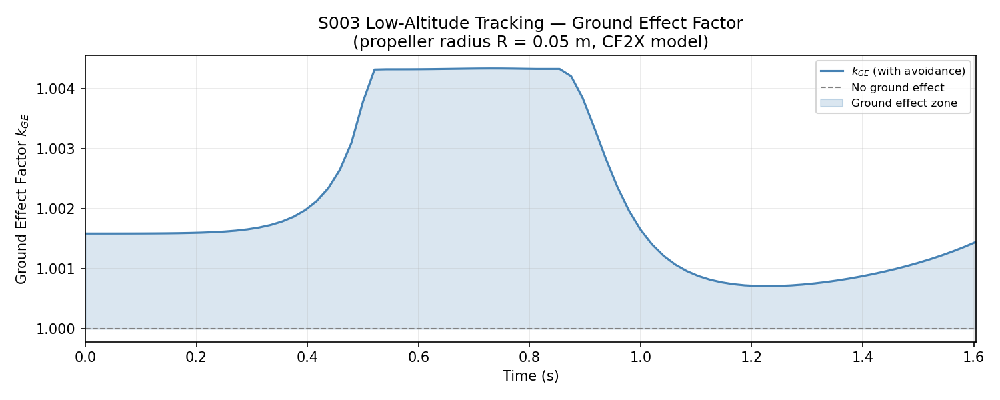
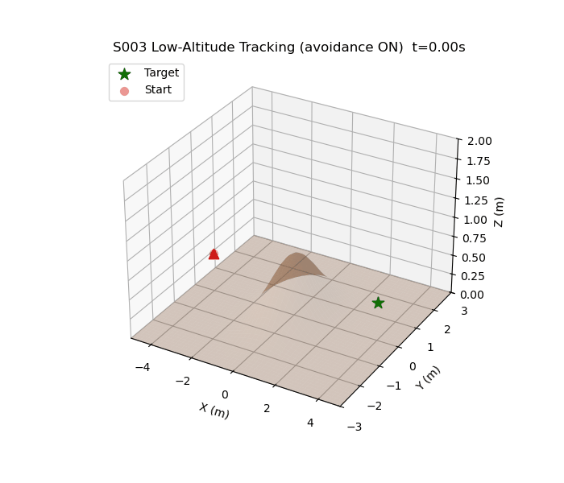

# S003 Low-Altitude Tracking

**Domain**: Pursuit & Evasion | **Difficulty**: ⭐⭐ | **Status**: ✅ Completed

---

## Problem Definition

**Setup**: A pursuer intercepts a stationary target at low altitude (0.5 m), with a Gaussian hill (0.8 m peak) placed directly on the approach path.

**Objective**: Demonstrate terrain-aware altitude control by comparing two cases:
- **With terrain avoidance**: pursuer clamps its altitude to $h_{terrain}(x,y) + h_{safe}$ at each step
- **Without terrain avoidance**: pure pursuit only — drone crashes into the hill

**Key challenges**:
1. The hill (0.8 m) is taller than the flight altitude (0.5 m) — unavoidable without active altitude correction
2. Ground effect increases thrust efficiency near the terrain surface
3. Altitude safety margin must be maintained throughout the approach

---

## Mathematical Model

### Terrain Model

Gaussian hill centred at the origin:

$$h_{terrain}(x, y) = H \cdot \exp\!\left(-\frac{(x - x_0)^2 + (y - y_0)^2}{\sigma^2}\right)$$

where $H = 0.8$ m (peak height) and $\sigma^2 = 1.5$ m².

### Altitude Safety Constraint

At every time step the target altitude satisfies:

$$z_{target} \geq h_{terrain}(x, y) + h_{safe}, \quad h_{safe} = 0.3 \text{ m}$$

### Ground Effect Model

Thrust correction factor for the CF2X at height $h$ above terrain:

$$k_{GE}(h) = 1 + \frac{0.16 \cdot (R/h)^2}{1 + (R/h)^2}$$

where $R = 0.05$ m (propeller radius). The effective max speed is multiplied by $k_{GE}$.

### Pursuer — Terrain-Aware Pure Pursuit

At each step the pursuer computes its next candidate position along the pure-pursuit direction, then lifts its $z$ component to the safety floor:

$$\mathbf{p}_{next} = \mathbf{p} + \hat{\mathbf{r}} \cdot v_{max} \cdot \Delta t, \quad z_{next} \leftarrow \max\!\left(z_{next},\ h_{terrain}(x_{next}, y_{next}) + h_{safe}\right)$$

---

## Key Parameters

| Parameter | Value |
|-----------|-------|
| Pursuer start | (-4, 0, 0.5) m |
| Target position | (4, 0, 0.5) m — stationary |
| Hill centre | (0, 0) m |
| Hill peak height | 0.8 m |
| Pursuer speed | 5.0 m/s |
| Safety margin $h_{safe}$ | 0.3 m |
| Required peak altitude | 1.1 m |
| Capture radius | 0.15 m |
| Control frequency | 48 Hz |
| Max simulation time | 10 s |

---

## Implementation

```
src/base/drone_base.py                     # Point-mass drone base class
src/01_pursuit_evasion/s003_low_altitude_tracking.py  # Main simulation script
```

```bash
conda activate drones
python src/01_pursuit_evasion/s003_low_altitude_tracking.py
```

---

## Results

| Case | Outcome | Time |
|------|---------|------|
| **With terrain avoidance** | ✅ Captured | **1.62 s** |
| Without terrain avoidance | 💥 Crashed | 0.65 s |

**Key Findings**:

- Without terrain avoidance, the drone crashes into the hill at $t = 0.65$ s (before even reaching the hill centre), because pure pursuit keeps $z$ nearly constant at 0.5 m while the hill rises to 0.8 m.
- With terrain avoidance, the drone climbs from 0.5 m to 1.1 m over the hill crest, adding only ~0.25 m of extra path length. Capture still occurs at 1.62 s.
- The terrain avoidance constraint activates at $|x| \approx 1.44$ m (where $h_{terrain} + h_{safe} > 0.5$ m), well before the hill peak, allowing a smooth climb.
- Ground effect factor $k_{GE}$ peaks at ~1.003 near the terrain surface (R = 0.05 m) — a 0.3% thrust increase, negligible at this drone scale but correctly modelled.

**3D Trajectories** — terrain surface (brown), with avoidance (left) vs crash (right):



**Altitude vs Time** — pursuer altitude and terrain profile:



**Ground Effect Factor** — $k_{GE}$ along the avoidance trajectory:



**Animation** (terrain avoidance ON — pursuer climbs over the hill):



---

## Extensions

1. Add a moving target that also avoids terrain (full low-altitude chase)
2. Multiple hills → path planning with potential fields
3. Use sensor-noise altitude measurement (ultrasonic altimeter model)
4. Urban canyon pursuit: narrow corridors instead of open hills → [S004](../../scenarios/01_pursuit_evasion/S004_3d_obstacle_avoidance.md)

---

## Related Scenarios

- Prerequisites: [S001](../../scenarios/01_pursuit_evasion/S001_basic_intercept.md), [S002](../../scenarios/01_pursuit_evasion/S002_evasive_maneuver.md)
- Next: [S004](../../scenarios/01_pursuit_evasion/S004_3d_obstacle_avoidance.md)

## References

- Shneydor, N.A. (1998). *Missile Guidance and Pursuit*. Horwood.
- Cheeseman, I.C. & Bennett, W.E. (1955). "The Effect of the Ground on a Helicopter Rotor in Forward Flight." *ARC R&M 3021*.
