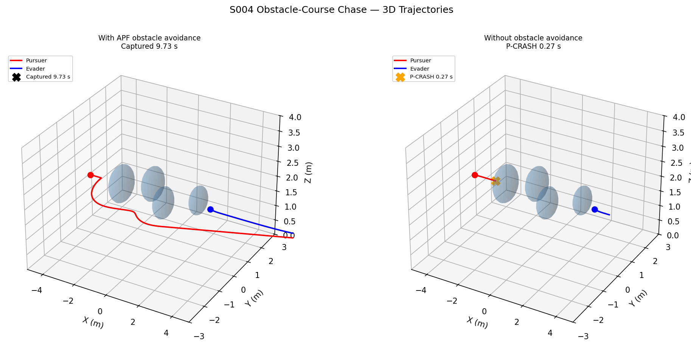
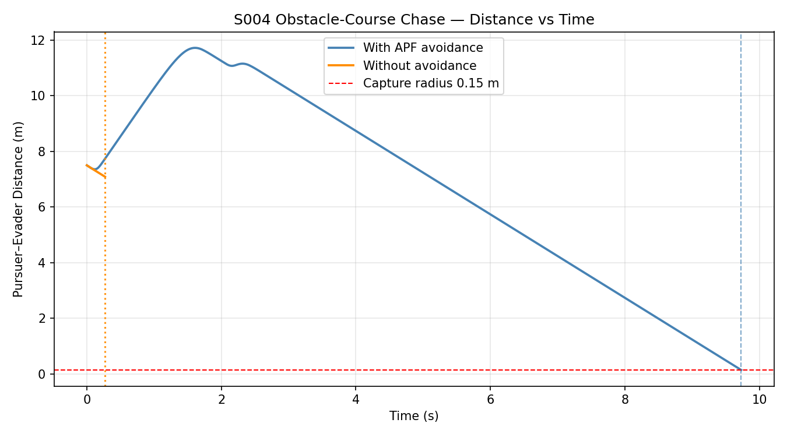
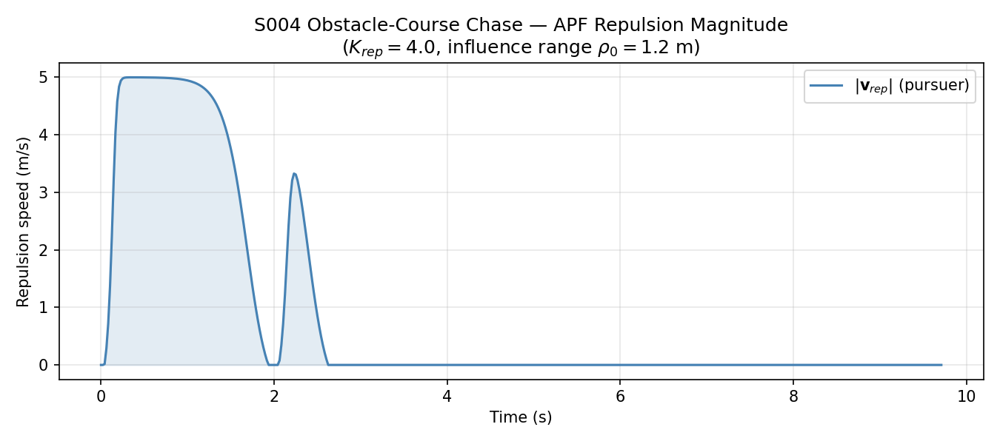

# S004 Obstacle-Course Chase

**Domain**: Pursuit & Evasion | **Difficulty**: ⭐⭐⭐ | **Status**: ✅ Completed

---

## Problem Definition

**Setup**: Pursuer chases an evader through 4 spherical obstacles placed along the approach path.

**Roles**:
- **Pursuer**: Attractive-Repulsive Potential Field (APF) — pulled toward evader, pushed away from obstacles
- **Evader**: straight escape + APF obstacle repulsion

**Comparison**: pursuer with APF vs. pursuer with pure pursuit only (crashes on first obstacle).

---

## Mathematical Model

### Attractive-Repulsive Potential Field (APF)

Total velocity command:

$$\mathbf{v}_{cmd} = \mathbf{v}_{att} + \mathbf{v}_{rep}$$

**Attraction** toward evader:

$$\mathbf{v}_{att} = v_{max} \cdot \frac{\mathbf{p}_E - \mathbf{p}_P}{\|\mathbf{p}_E - \mathbf{p}_P\|}$$

**Repulsion** from obstacles:

$$\mathbf{v}_{rep} = \sum_{i} K_{rep} \left(\frac{1}{\rho_i} - \frac{1}{\rho_0}\right) \frac{1}{\rho_i^2} \, \hat{\mathbf{n}}_i \quad (\rho_i < \rho_0)$$

where $\rho_i = \|\mathbf{p} - \mathbf{c}_i\| - r_i$ is the distance to obstacle surface $i$.

---

## Key Parameters

| Parameter | Value |
|-----------|-------|
| Pursuer start | (-4, 0, 2) m |
| Evader start | (3.5, 0, 2) m |
| Initial distance | 7.5 m |
| Pursuer speed | 5.0 m/s |
| Evader speed | 3.5 m/s |
| $K_{rep}$ | 4.0 |
| Influence range $\rho_0$ | 1.2 m |
| Capture radius | 0.15 m |
| Control frequency | 48 Hz |
| 4 obstacles | radii 0.45–0.60 m |

---

## Implementation

```
src/base/drone_base.py               # Point-mass drone base class
src/pursuit/s004_obstacle_chase.py   # Main simulation script
```

```bash
conda activate drones
python src/pursuit/s004_obstacle_chase.py
```

---

## Results

| Case | Outcome | Time |
|------|---------|------|
| **With APF obstacle avoidance** | ✅ Captured | **9.73 s** |
| Without obstacle avoidance | 💥 Crashed | 0.27 s |

**Key Findings**:

- Without obstacle avoidance, the pursuer crashes into the first obstacle at $t = 0.27$ s — pure pursuit points directly at the evader regardless of obstacles.
- With APF, the pursuer weaves around all 4 obstacles and captures the evader at $t = 9.73$ s. The detour adds ~2.7 s vs. the obstacle-free minimum (~7 s for a 7.5 m gap at 1.5 m/s closing speed).
- The repulsion magnitude peaks sharply each time the pursuer passes within $\rho_0 = 1.2$ m of an obstacle surface, then drops to zero in open space.
- APF can suffer from **local minima** when obstacles surround the goal; this fixed layout was chosen to avoid that pathological case.

**3D Trajectories** — pursuer (red) and evader (blue) through obstacles (blue spheres):



**Distance vs Time** — APF case closes in steadily; no-avoidance case terminates at crash:



**APF Repulsion Magnitude** — four peaks corresponding to the four obstacles:



---

## Extensions

1. Replace spheres with cylinders for urban canyon pursuit
2. Dynamic obstacles (moving) — reactive APF still applies
3. Global path planner (A\* or RRT) to escape local minima
4. Multi-pursuer cooperative APF → S005

---

## Related Scenarios

- Prerequisites: [S001](../../scenarios/01_pursuit_evasion/S001_basic_intercept.md), [S003](../../scenarios/01_pursuit_evasion/S003_low_altitude_tracking.md)
- Next: [S005](../../scenarios/01_pursuit_evasion/S005_multi_pursuer.md)

## References

- Khatib, O. (1986). "Real-Time Obstacle Avoidance for Manipulators and Mobile Robots." *IJRR* 5(1).
- Goodarzi, F.A. et al. (2015). "Geometric Adaptive Tracking Control of a Quadrotor UAV." *JDC*.
