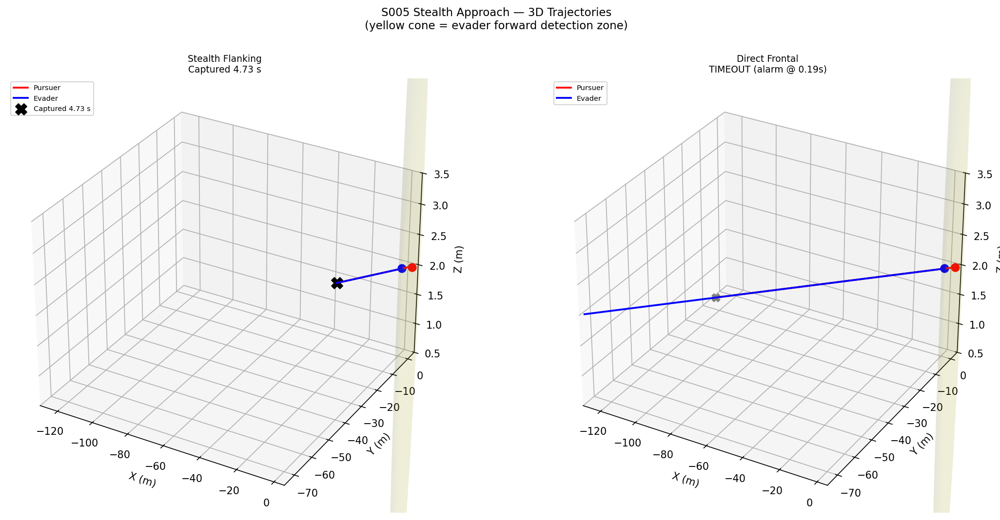
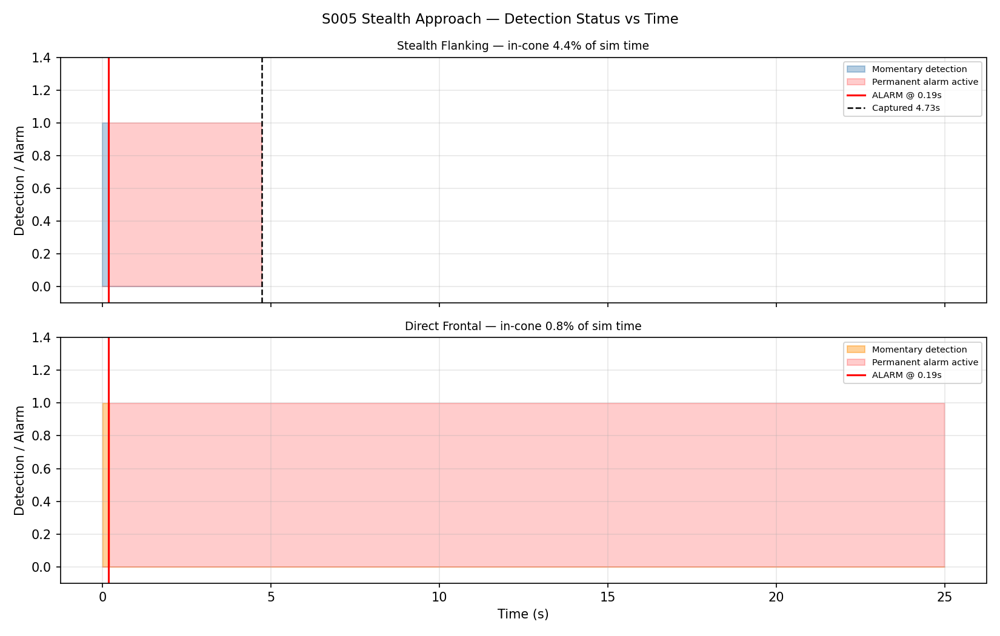
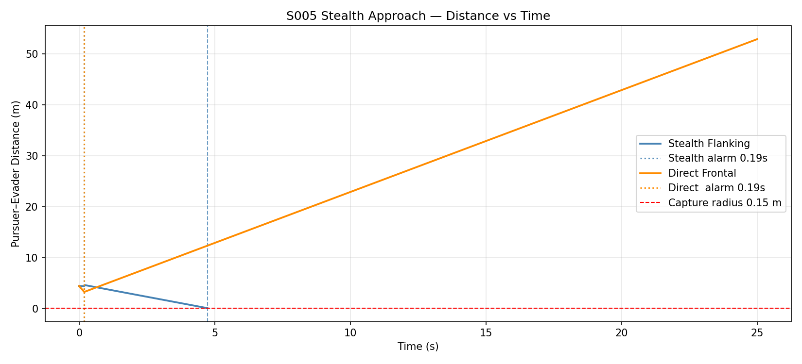
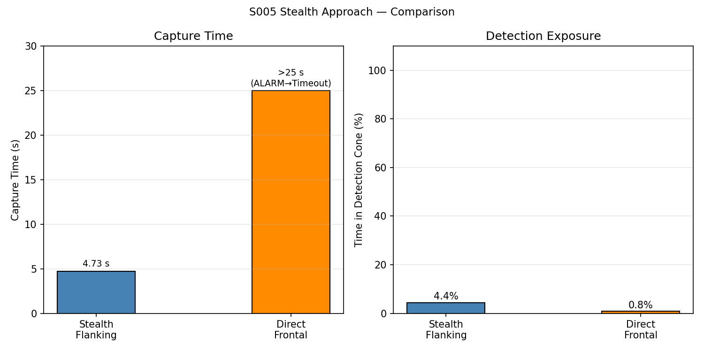
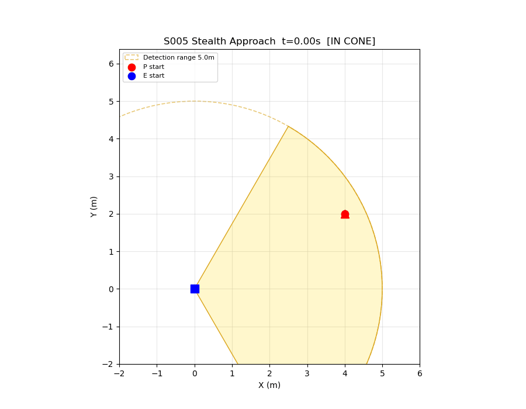

# S005 Stealth Approach

**Domain**: Pursuit & Evasion | **Difficulty**: ⭐⭐⭐ | **Status**: ✅ Completed

---

## Problem Definition

**Setup**: Pursuer starts inside the evader's forward detection cone and must maneuver
laterally to escape the cone, then approach from the blind-spot rear.

**Roles**:
- **Evader**: flies at constant heading (+x); forward-facing detection cone (half-angle 60°, range 5 m); once the pursuer is inside the cone for ≥ 10 consecutive steps (~0.2 s), a **permanent alarm** latches and the evader sprints away at 6 m/s (faster than the detected pursuer's 4 m/s) — forever.
- **Pursuer**: two strategies compared below.

**Comparison**:

| Strategy | Logic | Outcome |
|----------|-------|---------|
| **Stealth flanking** | When in-cone → sidestep laterally; when clear → approach from behind at 7 m/s | ✅ Captured |
| **Direct frontal** | Always aim straight at evader at 4 m/s | ❌ Alarm → Timeout |

---

## Mathematical Model

### Detection Cone Condition

$$\alpha = \arccos\!\left(\frac{(\mathbf{p}_P - \mathbf{p}_E) \cdot \hat{\mathbf{v}}_E}{\|\mathbf{p}_P - \mathbf{p}_E\|}\right)$$

Detected if:  $\alpha < \theta_{cone}$ **AND** $\|\mathbf{p}_P - \mathbf{p}_E\| < R_{detect}$

### Stealth Pursuer Control

**When detected** (sidestep phase): move perpendicular to evader heading to exit the cone

$$\mathbf{v}_{cmd} = v_P \cdot \text{sgn}\!\left[(\mathbf{p}_P - \mathbf{p}_E) \cdot \hat{\mathbf{n}}\right] \cdot \hat{\mathbf{n}}, \quad \hat{\mathbf{n}} \perp \hat{\mathbf{v}}_E$$

**When clear** (rear approach phase):

$$\mathbf{v}_{cmd} = v_{clear} \cdot \frac{\mathbf{p}_{target} - \mathbf{p}_P}{\|\mathbf{p}_{target} - \mathbf{p}_P\|}, \quad \mathbf{p}_{target} = \mathbf{p}_E - R_{offset} \hat{\mathbf{v}}_E$$

### Alarm Debounce (Detection Threshold)

$$\text{alarm} = \begin{cases} \text{True (permanent)} & \text{if } \sum_{\text{consec}} \mathbf{1}[\text{detected}] \geq N_{thr} \\ \text{False} & \text{otherwise} \end{cases}$$

with $N_{thr} = 10$ steps ($\approx 0.2$ s at 48 Hz).

---

## Key Parameters

| Parameter | Value |
|-----------|-------|
| Detection cone half-angle | 60° |
| Detection range | 5.0 m |
| Detection threshold | 10 consecutive steps (≈ 0.2 s) |
| Pursuer speed (clear) | 7.0 m/s |
| Pursuer speed (detected) | 4.0 m/s |
| Evader speed (patrol) | 2.5 m/s |
| Evader speed (alerted) | 6.0 m/s (faster than detected pursuer!) |
| Pursuer start | (4, 2, 2) m — inside cone |
| Evader start | (0, 0, 2) m heading +x |
| Behind-waypoint offset | 3.0 m |
| Capture radius | 0.15 m |
| Control frequency | 48 Hz |
| Max simulation time | 25 s |

---

## Implementation

```
src/base/drone_base.py                  # Point-mass drone base class
src/pursuit/s005_stealth_approach.py    # Main simulation script
```

```bash
conda activate drones
python src/pursuit/s005_stealth_approach.py
```

---

## Results

| Strategy | Alarm Triggered | Capture Time | In-Cone (%) |
|----------|----------------|--------------|-------------|
| **Stealth Flanking** | ❌ No | **4.73 s** | **4.4%** |
| Direct Frontal | ✅ Yes (0.19 s) | ❌ Timeout (>25 s) | 0.8% |

**Key Findings**:

- The direct pursuer stays in the detection cone for the full alarm threshold (~0.19 s), permanently alerting the evader. The evader then flees at 6 m/s vs. the pursuer's 4 m/s — distance grows indefinitely and capture is impossible.
- The stealth pursuer sidestepped laterally upon initial detection and exited the 5 m detection range in ~3 steps (< 10-step threshold) — **no alarm triggered**. It then curved around to the rear blind-spot and closed at 7 m/s vs. the evader's 2.5 m/s patrol speed, capturing at 4.73 s.
- The lateral sidestep works because pursuer (+y) and evader (−x flee) velocities diverge at ~7.8 m/s, rapidly pushing the pursuer out of detection range before the alarm latches.

**3D Trajectories** — stealth pursuer (red) flanks outside the yellow detection cone; direct pursuer triggers alarm immediately:



**Detection Status vs Time** — stealth briefly in-cone then clear; direct triggers permanent alarm at 0.19 s:



**Distance vs Time** — stealth closes steadily from the rear; direct diverges after alarm:



**Capture Time Comparison**:



**Animation** (stealth case — pursuer sidesteps then approaches from blind-spot rear):



---

## Extensions

1. Multiple detection cones (front + two lateral at ±90°) — pursuer must find a smaller blind spot
2. Time-varying evader heading (scanning/turning) — pursuer must predict heading to aim behind-waypoint correctly
3. Acoustic noise model: speed above threshold increases detection range proportionally
4. 3D stealth: cone has 3D solid angle, pursuer must also adjust altitude

---

## Related Scenarios

- Prerequisites: [S001](../../scenarios/01_pursuit_evasion/S001_basic_intercept.md), [S002](../../scenarios/01_pursuit_evasion/S002_evasive_maneuver.md)
- Follow-ups: [S006](../../scenarios/01_pursuit_evasion/S006_energy_race.md), [S016](../../scenarios/01_pursuit_evasion/S016_airspace_defense.md)
