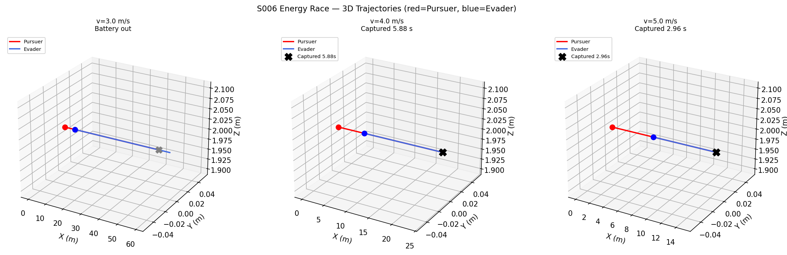
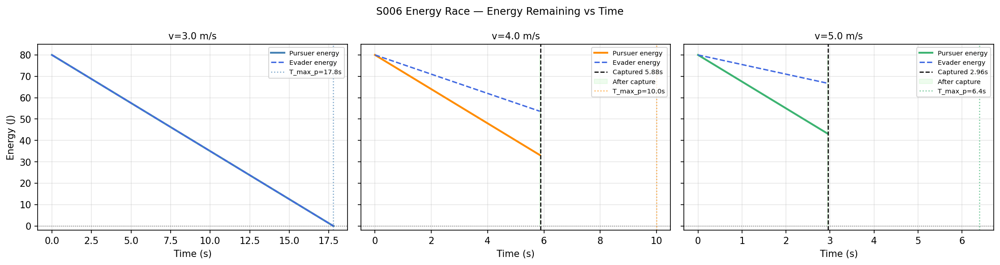
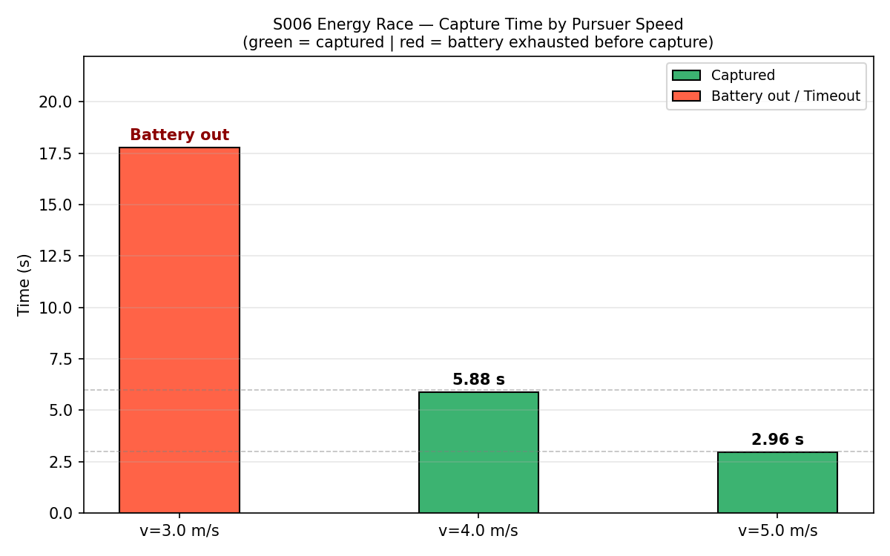
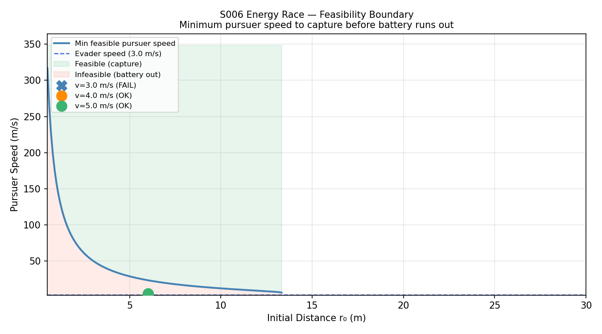
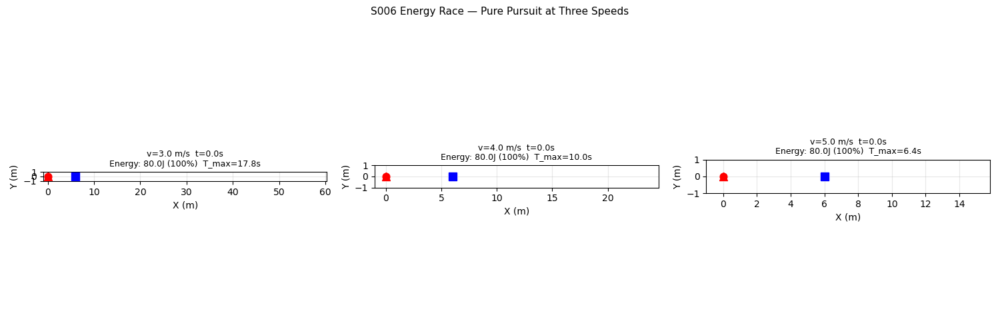

# S006 Energy Race

**Domain**: Pursuit & Evasion | **Difficulty**: ⭐⭐ | **Status**: ✅ Completed

---

## Problem Definition

**Setup**: Pursuer and evader both carry limited batteries (80 J each). Power consumption scales as P = k·v² (k = 0.5 W·s²/m²). The pursuer must capture the evader before its battery runs dry.

**Roles**:
- **Evader**: constant straight flight in +x at 3 m/s; starts 6 m ahead of pursuer.
- **Pursuer**: pure pursuit at one of three fixed speeds — 3, 4, or 5 m/s.

**Question**: Which pursuer speed minimises capture time while remaining within the energy budget?

---

## Mathematical Model

### Energy Consumption

$$E(t) = E_0 - \int_0^t k \cdot v^2 \, d\tau = E_0 - k \cdot v^2 \cdot t$$

Maximum flight time at constant speed:

$$T_{max}(v) = \frac{E_0}{k \cdot v^2}$$

### Approximate Capture Time (Pure Pursuit)

$$T_{cap} \approx \frac{r_0}{v_P - v_E}$$

### Feasibility Condition

Capture is achievable only if $T_{cap} \leq T_{max}(v_P)$:

$$\frac{r_0}{v_P - v_E} \leq \frac{E_0}{k \cdot v_P^2}$$

### Feasibility Boundary (minimum pursuer speed vs initial distance)

Setting $T_{cap} = T_{max}$ and solving for $v_P$:

$$k \cdot r_0 \cdot v_P^2 - E_0 \cdot v_P + E_0 \cdot v_E = 0$$

$$v_{P,min} = \frac{E_0 + \sqrt{E_0^2 - 4 k r_0 E_0 v_E}}{2 k r_0}$$

---

## Key Parameters

| Parameter | Value |
|-----------|-------|
| Initial distance r₀ | 6 m |
| Pursuer speed options | 3.0, 4.0, 5.0 m/s |
| Evader speed | 3.0 m/s |
| Battery capacity (both) | 80 J |
| Energy coefficient k | 0.5 W·s²/m² |
| Capture radius | 0.15 m |
| Control frequency | 48 Hz |
| Max simulation time | 30 s |

---

## Implementation

```
src/base/drone_base.py               # Point-mass drone base class
src/pursuit/s006_energy_race.py      # Main simulation script
```

```bash
conda activate drones
python src/pursuit/s006_energy_race.py
```

---

## Results

| Speed | T_cap (analytical) | T_max (battery) | Outcome | Actual Cap. Time | Energy Left |
|-------|-------------------|-----------------|---------|-----------------|-------------|
| **3 m/s** | ∞ (equal speeds) | 17.78 s | ❌ Battery out | — | 0 J |
| **4 m/s** | 6.00 s | 10.00 s | ✅ Captured | **5.88 s** | 33.2 J |
| **5 m/s** | 3.00 s | 6.40 s | ✅ Captured | **2.96 s** | 43.3 J |

**Key Findings**:

- At **v=3 m/s** the pursuer matches the evader's speed exactly; pure pursuit never closes the gap when the evader flees straight ahead — the battery depletes after 17.78 s with 6 m still separating them.
- At **v=4 m/s** capture occurs at 5.88 s (within the 10 s budget), leaving 33.2 J (41%) of battery to spare.
- At **v=5 m/s** capture is fastest at 2.96 s, but higher speed costs more energy quadratically — only 43.3 J (54%) remains, and the budget shrinks to 6.4 s.
- The **optimal speed** (fastest capture within budget) is 5 m/s for this initial distance; however the feasibility boundary shows that as r₀ increases, higher speeds become infeasible first due to quadratic energy costs.

**3D Trajectories** — pursuer (red) closes on straight-flying evader (blue) at each speed:



**Energy Remaining vs Time** — pursuer energy (solid) and evader energy (dashed); green shading after capture:



**Capture Time by Speed** — green = successful capture, red = battery exhausted:



**Feasibility Boundary** — minimum pursuer speed needed to capture before battery runs out vs initial distance (our scenario points marked):



**Animation** (all three speeds side-by-side):



---

## Extensions

1. Variable-speed pursuer: adapt speed dynamically based on remaining energy
2. Evader also optimises its energy — slower when far, sprint when close
3. Wind field: directional energy cost (tailwind vs headwind)

---

## Related Scenarios

- Prerequisites: [S001](../../scenarios/01_pursuit_evasion/S001_basic_intercept.md)
- Follow-ups: [S010](../../scenarios/01_pursuit_evasion/S010_asymmetric_speed.md), [S012](../../scenarios/01_pursuit_evasion/S012_relay_pursuit.md)
