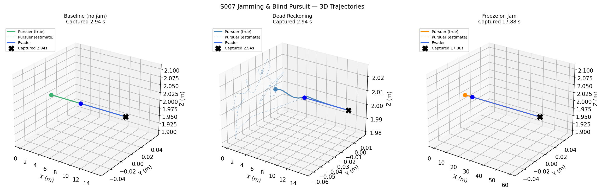
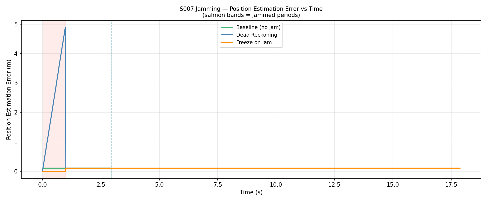
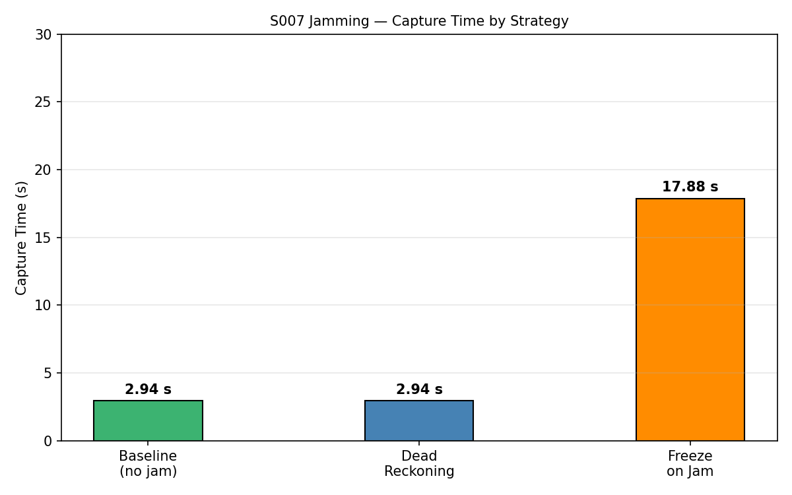
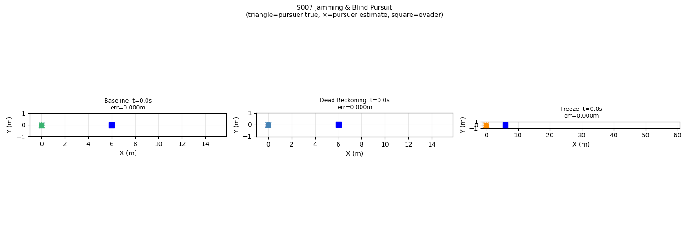

# S007 Jamming & Blind Pursuit

**Domain**: Pursuit & Evasion | **Difficulty**: ⭐⭐⭐ | **Status**: ✅ Completed

---

## Problem Definition

**Setup**: The pursuer's GPS is periodically jammed (33% duty cycle: 1 s jam every 3 s). During blackout the pursuer estimates its own position using dead reckoning (last known velocity + Gaussian IMU drift noise σ=0.05 m/s). The evader flies a straight escape at 3 m/s.

**Strategies compared**:

| Strategy | GPS blackout behaviour | Outcome |
|----------|----------------------|---------|
| **Baseline** | No jamming — perfect GPS always | ✅ Captured |
| **Dead Reckoning** | Continue at last known velocity + drift | ✅ Captured |
| **Freeze on Jam** | Stop moving until GPS returns | ✅ Captured (slower) |

---

## Mathematical Model

### GPS-Available Phase

$$\mathbf{v}_{cmd} = v_P \cdot \frac{\mathbf{p}_E - \hat{\mathbf{p}}_P}{\|\mathbf{p}_E - \hat{\mathbf{p}}_P\|}$$

### Dead-Reckoning Phase

$$\hat{\mathbf{p}}_P(t) = \hat{\mathbf{p}}_P(t_j) + \mathbf{v}_{last}(t - t_j) + \boldsymbol{\varepsilon}(t)$$

$$\boldsymbol{\varepsilon}(t) \sim \mathcal{N}\!\left(\mathbf{0},\; \sigma_{drift}^2 (t-t_j) \mathbf{I}\right)$$

### Position Estimation Error Growth

$$e(t) = \mathcal{O}\!\left(\sigma_{drift}\sqrt{t - t_j}\right)$$

---

## Key Parameters

| Parameter | Value |
|-----------|-------|
| Jam period | 3 s |
| Jam duration | 1 s (33% duty cycle) |
| IMU drift σ | 0.05 m/s |
| Pursuer speed | 5 m/s |
| Evader speed | 3 m/s |
| Initial distance | 6 m |
| Capture radius | 0.15 m |
| Control frequency | 48 Hz |

---

## Implementation

```
src/base/drone_base.py                       # Point-mass drone base
src/pursuit/s007_jamming_blind_pursuit.py    # Main simulation
```

```bash
conda activate drones
python src/pursuit/s007_jamming_blind_pursuit.py
```

---

## Results

| Strategy | Capture Time | Notes |
|----------|-------------|-------|
| **Baseline** | **2.94 s** | No jamming — fastest |
| **Dead Reckoning** | **2.94 s** | Drift small (short jam windows) → no appreciable deviation |
| **Freeze on Jam** | **17.88 s** | Pursuer idles 33% of the time → capture takes 6× longer |

**Key Findings**:
- At 33% duty cycle and σ=0.05 m/s drift, dead reckoning accumulates only ~0.05 m of position error per 1-second jam window — negligible compared to the 6 m initial gap. Capture time matches baseline.
- Freezing is far more costly: the pursuer spends 1 s of every 3 s stationary while the evader continues escaping. The gap alternately closes (during GPS windows) and widens (during jams).
- IMU drift becomes harmful only at longer jam durations or higher σ; a Kalman filter would further reduce the residual error.

**3D Trajectories** — dotted line = position estimate during jam:



**Position Estimation Error vs Time** — spikes at each jam onset (salmon bands):



**Capture Time by Strategy**:



**Animation** (triangle=pursuer true, ×=estimate, square=evader):



---

## Extensions

1. Kalman filter with IMU: reduce dead-reckoning drift significantly
2. Adversarial jammer: activate only when pursuer is within 1 m of capture
3. Pursuer reduces speed during jam to limit divergence

---

## Related Scenarios

- Prerequisites: [S001](../../scenarios/01_pursuit_evasion/S001_basic_intercept.md), [S002](../../scenarios/01_pursuit_evasion/S002_evasive_maneuver.md)
- Follow-up: [S008](../../scenarios/01_pursuit_evasion/S008_stochastic_pursuit.md)
