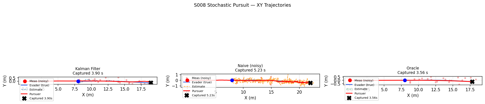
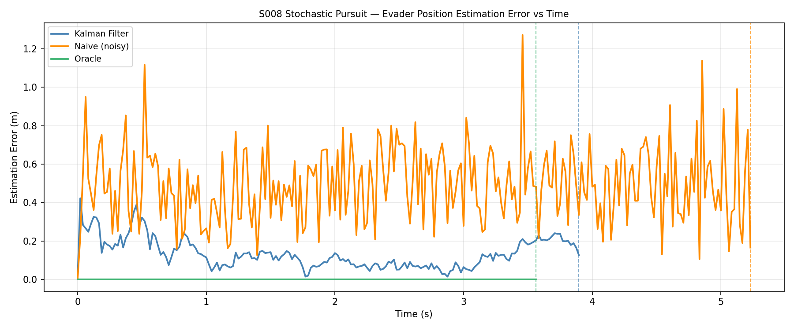
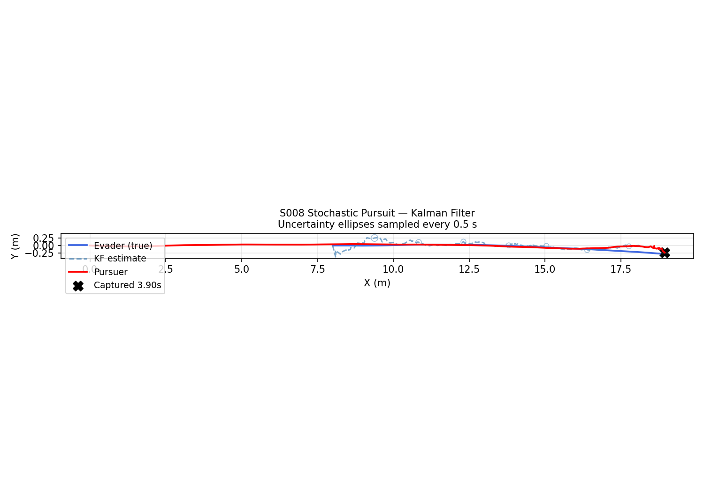
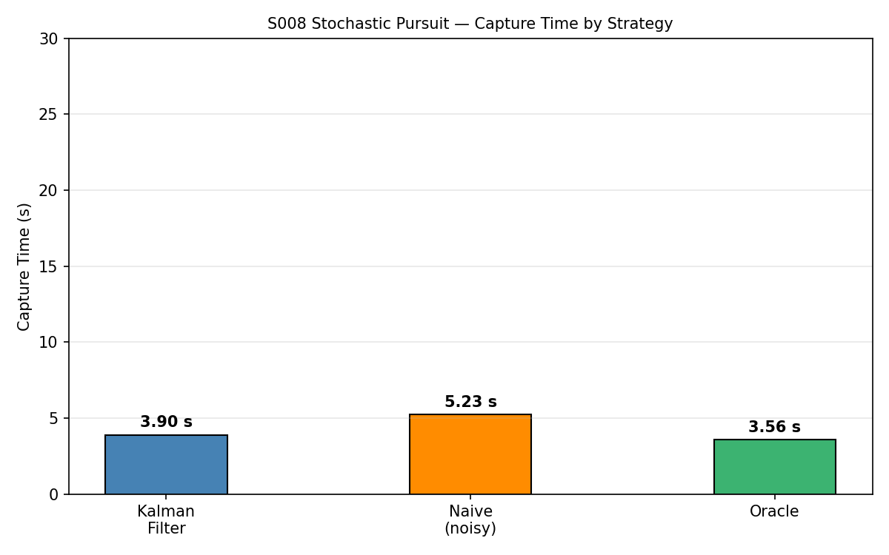
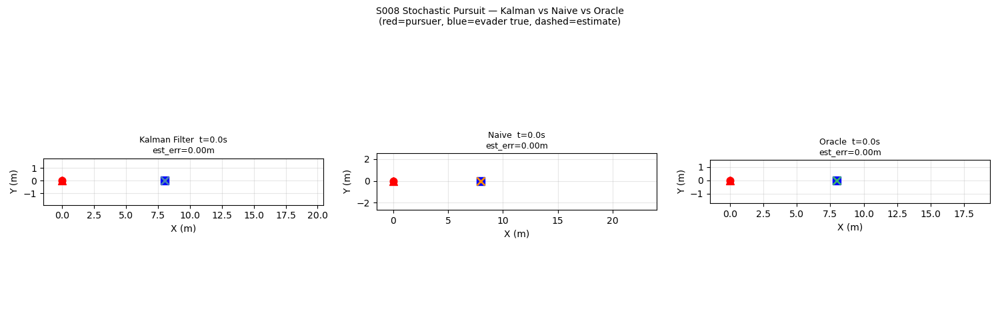

# S008 Stochastic Pursuit — Kalman Filter Tracking

**Domain**: Pursuit & Evasion | **Difficulty**: ⭐⭐⭐ | **Status**: ✅ Completed

---

## Problem Definition

**Setup**: Evader undergoes constant-velocity motion with stochastic acceleration noise (σ_a=0.5 m/s²). Pursuer receives noisy position measurements (σ=0.3 m) and uses a Kalman Filter to estimate the evader's state (position + velocity). The filtered estimate drives the pursuit law.

**Strategies compared**:

| Strategy | Estimation method | Outcome |
|----------|------------------|---------|
| **Kalman Filter** | Linear KF (position + velocity) | ✅ Captured |
| **Naive** | Aim directly at raw noisy measurement | ✅ Captured (slower) |
| **Oracle** | Perfect state knowledge (upper bound) | ✅ Captured (fastest) |

---

## Mathematical Model

### Evader Process Model (6-D state)

$$\mathbf{x}_E(k+1) = \mathbf{F}\mathbf{x}_E(k) + \mathbf{w}_k, \quad \mathbf{w}_k \sim \mathcal{N}(\mathbf{0}, \mathbf{Q})$$

$$\mathbf{F} = \begin{bmatrix}\mathbf{I} & \Delta t\mathbf{I} \\ \mathbf{0} & \mathbf{I}\end{bmatrix}, \quad \mathbf{Q} = q\begin{bmatrix}\tfrac{\Delta t^3}{3}\mathbf{I} & \tfrac{\Delta t^2}{2}\mathbf{I} \\ \tfrac{\Delta t^2}{2}\mathbf{I} & \Delta t\mathbf{I}\end{bmatrix}$$

### Measurement Model

$$\mathbf{z}_k = \mathbf{H}\mathbf{x}_E(k) + \mathbf{n}_k, \quad \mathbf{n}_k \sim \mathcal{N}(\mathbf{0}, \sigma^2\mathbf{I}_3)$$

### Kalman Recursion

**Predict:** $\hat{\mathbf{x}}^- = \mathbf{F}\hat{\mathbf{x}}$, $\mathbf{P}^- = \mathbf{F}\mathbf{P}\mathbf{F}^T + \mathbf{Q}$

**Update:** $\mathbf{K} = \mathbf{P}^-\mathbf{H}^T(\mathbf{H}\mathbf{P}^-\mathbf{H}^T + \mathbf{R})^{-1}$, $\hat{\mathbf{x}} \mathrel{+}= \mathbf{K}(\mathbf{z}_k - \mathbf{H}\hat{\mathbf{x}}^-)$

---

## Key Parameters

| Parameter | Value |
|-----------|-------|
| Process noise q | 0.1 m²/s³ |
| Measurement noise σ | 0.3 m |
| Evader acceleration std | 0.5 m/s² |
| Pursuer speed | 5 m/s |
| Evader mean speed | 3 m/s |
| Initial distance | 8 m |
| Control frequency | 48 Hz |

---

## Implementation

```
src/base/drone_base.py                  # Point-mass drone base
src/01_pursuit_evasion/s008_stochastic_pursuit.py  # Main simulation + KF
```

```bash
conda activate drones
python src/01_pursuit_evasion/s008_stochastic_pursuit.py
```

---

## Results

| Strategy | Capture Time | Mean Estimation Error |
|----------|--------------|-----------------------|
| **Oracle** | **3.56 s** | 0.000 m |
| **Kalman Filter** | **3.90 s** | 0.133 m |
| **Naive** | **5.23 s** | 0.491 m |

**Key Findings**:
- The Kalman Filter achieves 3.7× lower estimation error than naive tracking (0.133 vs 0.491 m) by fusing noisy measurements with the constant-velocity prediction model.
- KF capture time (3.90 s) is only 9% slower than the oracle (3.56 s), while naive tracking is 47% slower.
- The KF's velocity estimate allows predictive lead, reducing the heading lag that causes naive pursuit to oscillate around the noisy measurement.

**XY Trajectories** — red=pursuer, blue=evader, dashed=estimate, dots=noisy measurements:



**Estimation Error vs Time** — KF (blue) consistently lower than naive (orange):



**KF Uncertainty Ellipses** — covariance reduces as the filter converges:



**Capture Time Comparison**:



**Animation**:



---

## Extensions

1. Extended Kalman Filter (EKF) for nonlinear evader dynamics
2. Particle filter for non-Gaussian / multi-modal uncertainty
3. IMM filter: multiple models handle evaders that switch strategies mid-flight

---

## Related Scenarios

- Prerequisites: [S001](../../scenarios/01_pursuit_evasion/S001_basic_intercept.md), [S007](../../scenarios/01_pursuit_evasion/S007_jamming_blind_pursuit.md)
- Follow-ups: [S009](../../scenarios/01_pursuit_evasion/S009_differential_game.md), [S019](../../scenarios/01_pursuit_evasion/S019_dynamic_reassignment.md)
