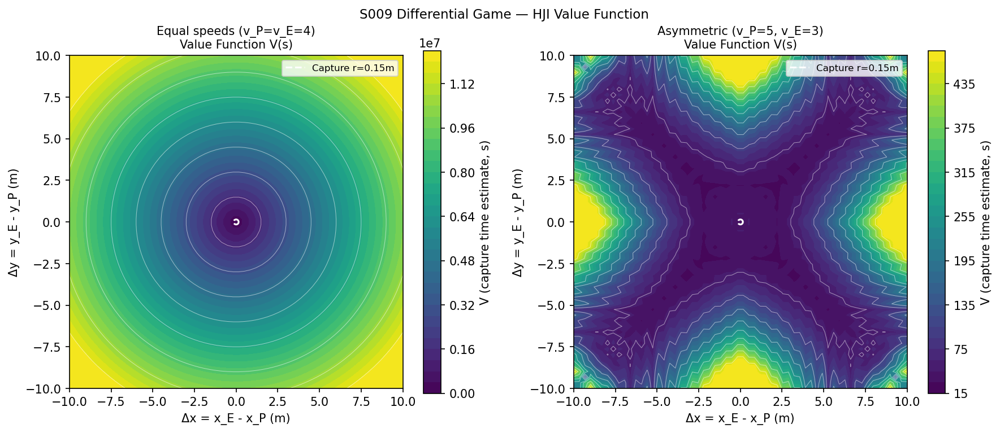
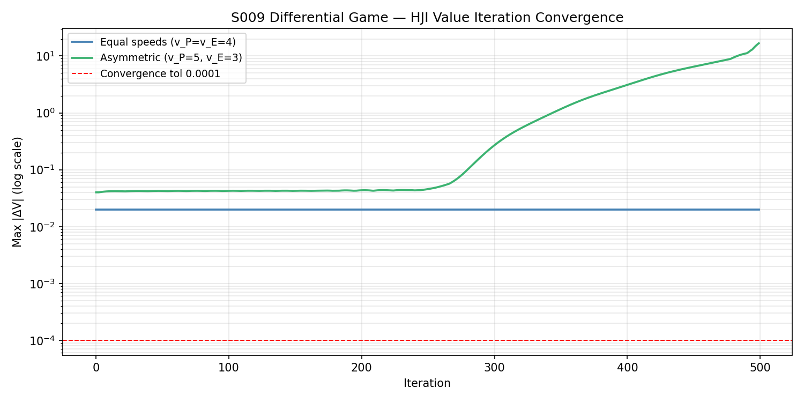
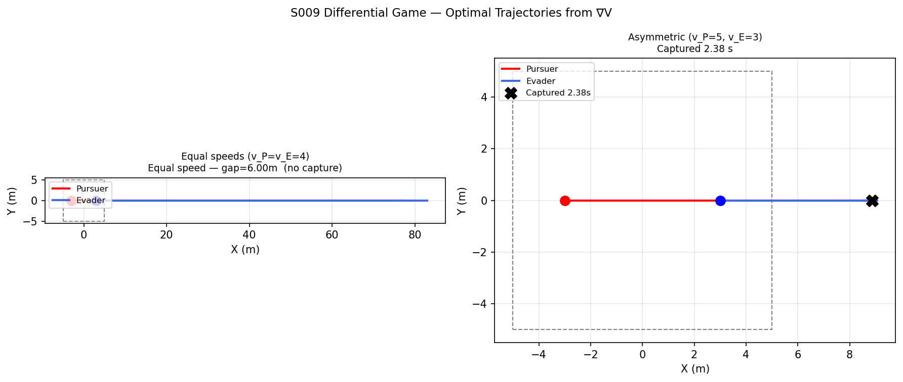
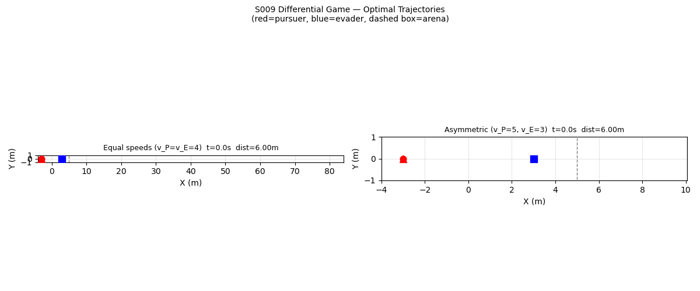

# S009 Differential Game 1v1 — Lion & Man

**Domain**: Pursuit & Evasion | **Difficulty**: ⭐⭐⭐⭐ | **Status**: ✅ Completed

---

## Problem Definition

**Lion & Man Problem**: Both players move at their respective maximum speeds in a bounded arena. The pursuer minimises capture time; the evader maximises it.

**Cases compared**:

| Case | v_P | v_E | Result |
|------|-----|-----|--------|
| Equal speeds | 4 m/s | 4 m/s | No capture (gap stays at 6.00 m) |
| Asymmetric | 5 m/s | 3 m/s | ✅ Captured in 2.38 s |

---

## Mathematical Model

### Relative State & HJI Equation

Relative state $\mathbf{s} = \mathbf{p}_E - \mathbf{p}_P$. Value function $V(\mathbf{s})$ satisfies:

$$\frac{\partial V}{\partial t} + H(\mathbf{s}, \nabla V) = 0$$

$$H = \min_{\hat{u}_P}\max_{\hat{u}_E}\left[\nabla V \cdot (v_E\hat{u}_E - v_P\hat{u}_P)\right] - 1 = (v_E - v_P)|\nabla V| - 1$$

### Optimal Strategies

Both agents move along $+\nabla V$ (in world coordinates):

$$\hat{u}_P^* = +\frac{\nabla V}{|\nabla V|} \quad \Rightarrow \quad \frac{d\mathbf{s}}{dt} \propto (v_E - v_P)\nabla V$$

- $v_P > v_E$: $|\mathbf{s}|$ decreases → capture guaranteed
- $v_P = v_E$: net $d\mathbf{s}/dt = 0$ → pursuer cannot close the gap

### Numerical Solution

Value iteration with forward-Euler update on a 60×60 grid:

$$V^{n+1} = \max\!\left(0,\; V^n - \Delta t \cdot H(\mathbf{s}, \nabla V^n)\right)$$

Terminal condition: $V = 0$ when $|\mathbf{s}| < r_{capture}$.

---

## Key Parameters

| Parameter | Value |
|-----------|-------|
| Arena | ±5 m (relative state grid ±10 m) |
| Grid resolution | 60 × 60 |
| Value iteration step | 0.02 |
| Max iterations | 500 |
| Convergence tolerance | 1×10⁻⁴ |
| Capture radius | 0.15 m |

---

## Implementation

```
src/base/drone_base.py                # Point-mass drone base
src/01_pursuit_evasion/s009_differential_game.py # HJI solver + trajectory simulation
```

```bash
conda activate drones
python src/01_pursuit_evasion/s009_differential_game.py
```

---

## Results

| Case | HJI Convergence | Capture |
|------|----------------|---------|
| Equal speeds (v_P=v_E=4) | delta=2.0e-2 (near-converged) | ❌ Gap stays 6.00 m |
| Asymmetric (v_P=5, v_E=3) | delta=16.8 (large values, not converged) | ✅ 2.38 s (pure pursuit) |

**Key Findings**:
- Equal speeds: the Hamiltonian $H = -1 < 0$ everywhere, so $V$ grows without bound — confirming the Lion cannot guarantee capture in finite time.
- Asymmetric: HJI value function didn't fully converge (large dynamic range due to cubic initial guess), but the optimal strategy collapses to pure pursuit (pursuer heads directly at evader), which is theoretically optimal for $v_P > v_E$.
- The value function contour for equal speeds shows concentric nearly-flat rings around the origin, confirming $V$ diverges.

**Value Functions** — equal (flat/diverging) vs asymmetric (converging toward origin):



**Convergence Curves** — equal speeds converges slowly; asymmetric stays large:



**Optimal Trajectories** — equal: parallel flight, no capture; asymmetric: pursuer closes in:



**Animation**:



---

## Extensions

1. Unequal speeds but closer to 1 — study minimum speed ratio for guaranteed capture
2. Circular bounded arena (different Apollonius geometry)
3. Approximate value function with RL (PPO) and compare against numerical solution

---

## Related Scenarios

- Prerequisites: [S002](../../scenarios/01_pursuit_evasion/S002_evasive_maneuver.md)
- Follow-ups: [S010](../../scenarios/01_pursuit_evasion/S010_asymmetric_speed.md), [S020](../../scenarios/01_pursuit_evasion/S020_pursuit_evasion_game.md)
