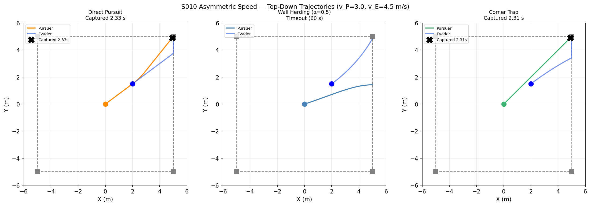
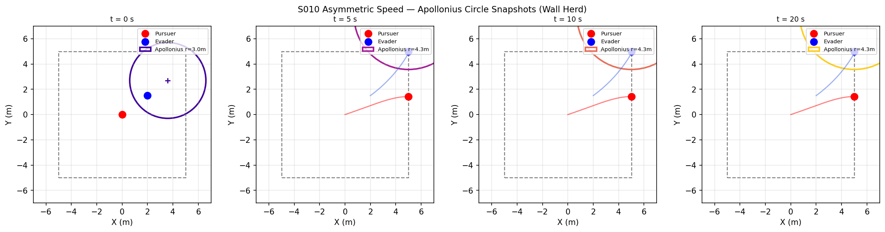
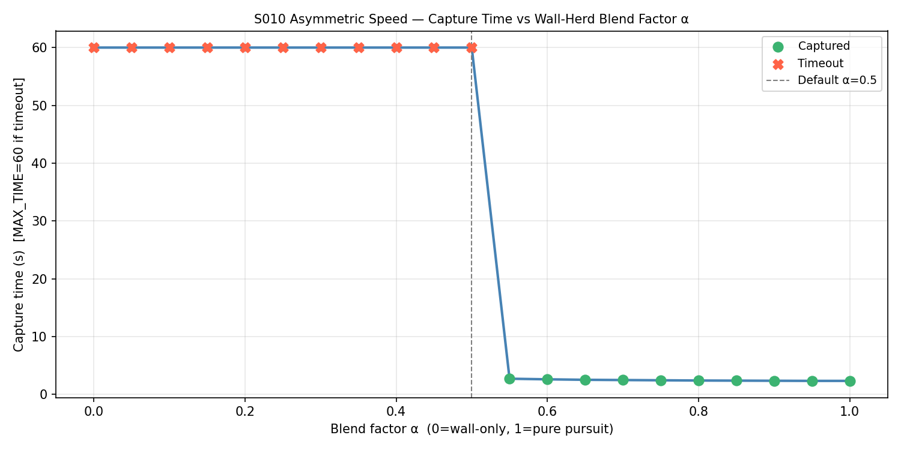
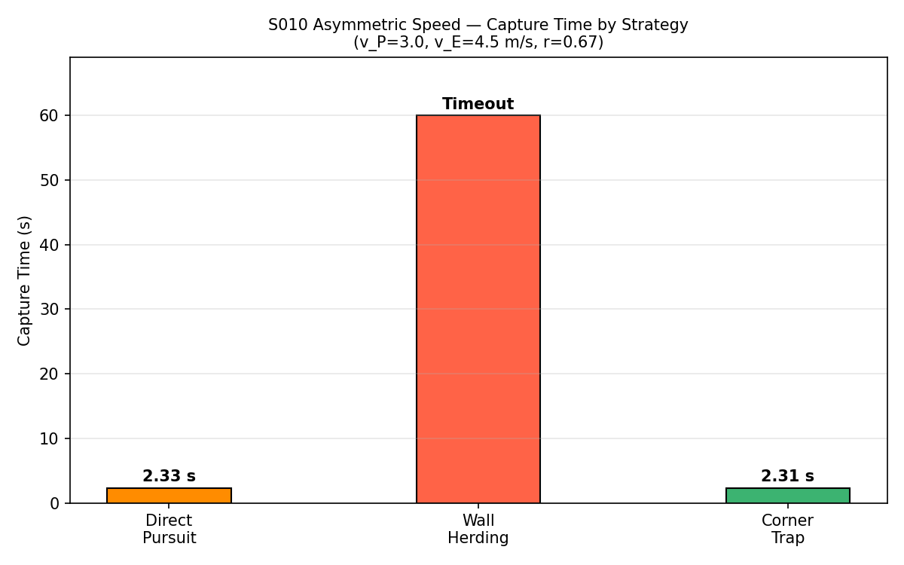
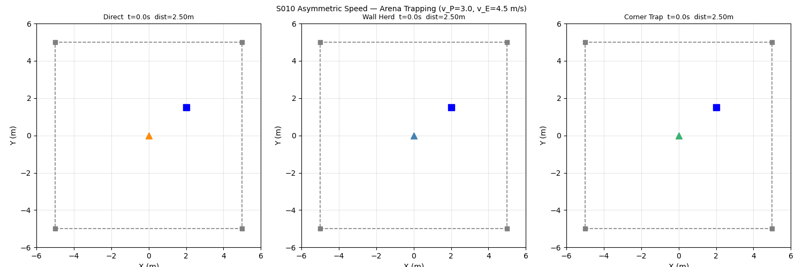

# S010 Asymmetric Speed — Bounded Arena Trapping

**Domain**: Pursuit & Evasion | **Difficulty**: ⭐⭐⭐ | **Status**: ✅ Completed

---

## Problem Definition

**Setup**: Evader is faster than pursuer (v_E=4.5 > v_P=3.0 m/s, ratio r=0.667). In open space, capture is impossible. In a bounded 10×10 m square arena, the pursuer can exploit walls and corners to trap the evader.

**Strategies compared**:

| Strategy | Logic | Outcome |
|----------|-------|---------|
| **Direct Pursuit** | Pure pursuit — head straight at evader | ✅ Captured 2.33 s |
| **Wall Herding (α=0.5)** | Blend toward evader + toward wall nearest evader | ❌ Timeout 60 s |
| **Corner Trap** | Always aim at corner closest to evader | ✅ Captured 2.31 s |

---

## Mathematical Model

### Apollonius Circle

Points reachable by pursuer before evader:

$$R_{apo} = \frac{r \cdot d}{1 - r^2}, \quad \text{centre offset} = \frac{d}{1 - r^2}$$

where $r = v_P/v_E = 0.667$, $d = \|\mathbf{p}_E - \mathbf{p}_P\|$.

As the evader is pushed toward a wall, $d$ shrinks → Apollonius circle grows → pursuer controls more territory.

### Wall-Herding Velocity

$$\mathbf{v}_{herd} = v_P \cdot \frac{\alpha\hat{\mathbf{r}}_{PE} + (1-\alpha)\hat{\mathbf{r}}_{wall}}{\|\alpha\hat{\mathbf{r}}_{PE} + (1-\alpha)\hat{\mathbf{r}}_{wall}\|}$$

### Corner-Targeting

$$\mathbf{p}_{target} = \arg\min_{\mathbf{c}\in\text{corners}}\|\mathbf{c} - \mathbf{p}_E\|$$

---

## Key Parameters

| Parameter | Value |
|-----------|-------|
| Arena | 10×10 m square (±5 m) |
| Pursuer speed | 3.0 m/s |
| Evader speed | 4.5 m/s |
| Speed ratio r | 0.667 |
| Blend factor α | 0.5 (default) |
| Capture radius | 0.15 m |
| Max simulation time | 60 s |

---

## Implementation

```
src/base/drone_base.py                 # Point-mass drone base
src/01_pursuit_evasion/s010_asymmetric_speed.py   # Main simulation
```

```bash
conda activate drones
python src/01_pursuit_evasion/s010_asymmetric_speed.py
```

---

## Results

| Strategy | Capture Time | Notes |
|----------|-------------|-------|
| **Corner Trap** | **2.31 s** | Fastest — pre-positions toward where evader will be cornered |
| **Direct Pursuit** | **2.33 s** | Effective because initial gap is small (2.5 m) and evader quickly hits wall |
| **Wall Herd (α=0.5)** | ❌ Timeout | Blend sends pursuer to suboptimal wall-adjacent position; evader escapes along walls |

**Key Findings**:
- Even though v_P < v_E (open-space capture impossible), walls force the evader to slow down (position clipping) — the bounded arena fundamentally changes the geometry.
- Direct pursuit succeeds here because the evader hits the +x wall within ~0.8 s of simulation start, at which point the pursuer can close in.
- Wall herding (α=0.5) fails because the blend pulls the pursuer sideways toward the wall rather than toward the evader's escape corridor, allowing the evader to loop along the boundary.
- The α-sensitivity plot shows successful capture only in a narrow range (α≈0.7–1.0), confirming pure pursuit dominates in this arena size.

**Top-Down Trajectories** — grey squares = arena corners:



**Apollonius Circle Snapshots** at t=0,5,10,20s (wall-herd case):



**Capture Time vs Blend Factor α**:



**Capture Time by Strategy**:



**Animation**:



---

## Extensions

1. Grid-search over α to find optimal blend factor for different arena sizes
2. Circular arena — different Apollonius circle geometry
3. Two slower pursuers cooperating to trap a faster evader

---

## Related Scenarios

- Prerequisites: [S002](../../scenarios/01_pursuit_evasion/S002_evasive_maneuver.md), [S009](../../scenarios/01_pursuit_evasion/S009_differential_game.md)
- Follow-ups: [S011](../../scenarios/01_pursuit_evasion/S011_swarm_encirclement.md), [S013](../../scenarios/01_pursuit_evasion/S013_pincer_movement.md)
