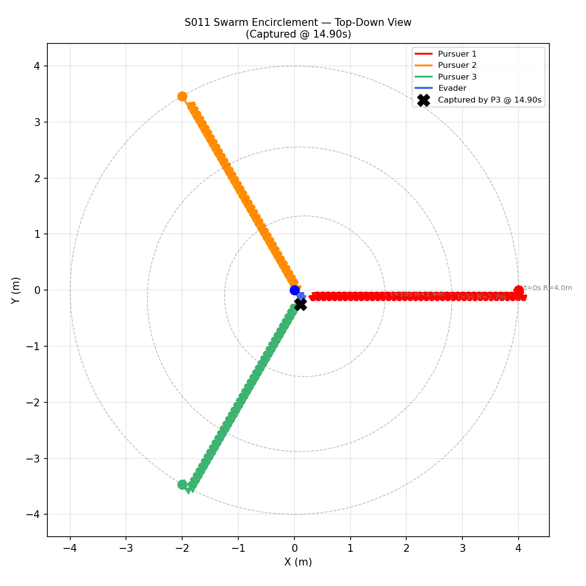
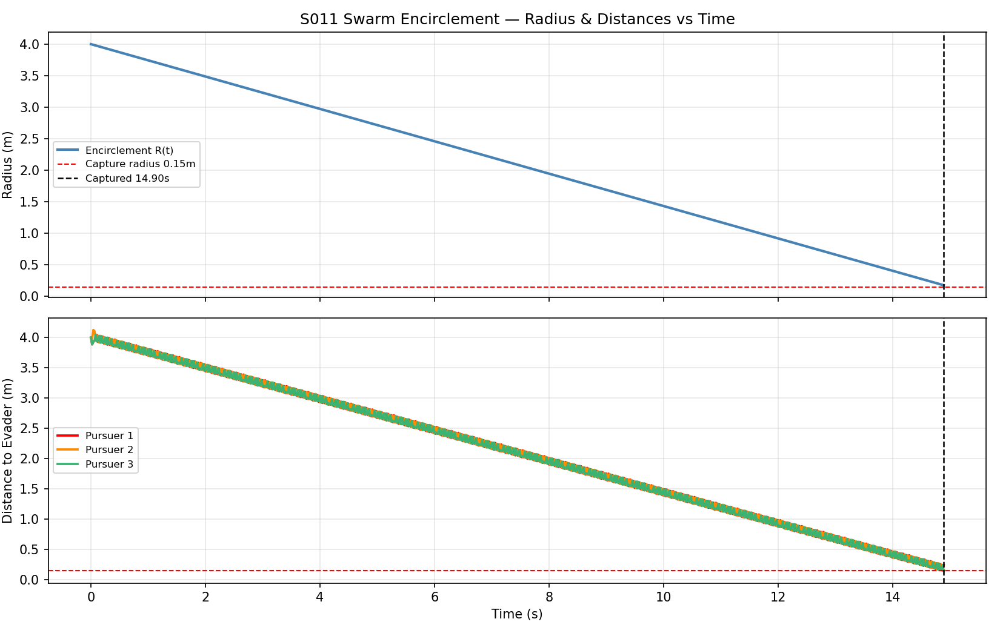
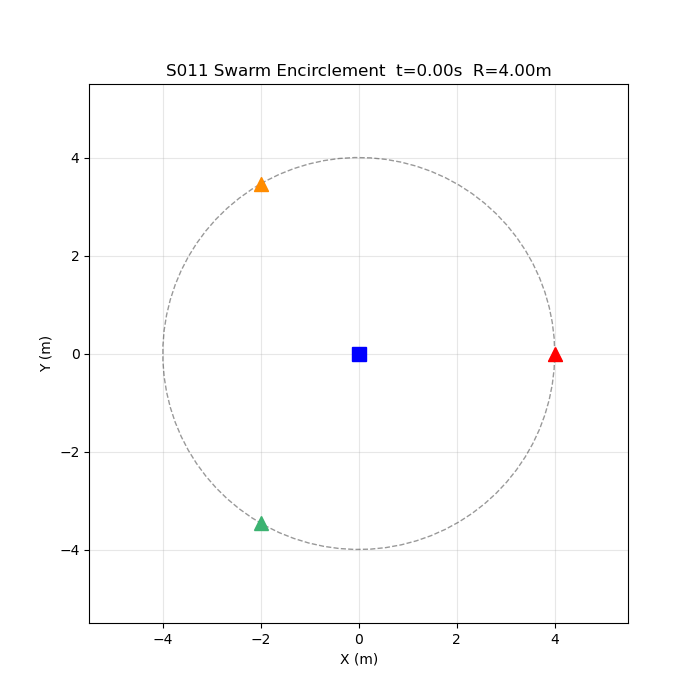

# S011 Swarm Encirclement

**Domain**: Pursuit & Evasion | **Difficulty**: ⭐⭐ | **Status**: ✅ Completed

---

## Problem Definition

**Setup**: 3 pursuer drones simultaneously encircle 1 evader, synchronously shrinking the encirclement radius R(t). The evader attempts to break through the widest angular gap between adjacent pursuers.

**Key question**: Can a coordinated shrinking-ring formation guarantee capture even when the evader exploits the largest gap?

---

## Mathematical Model

### Encirclement Radius

$$R(t) = \max\!\left(R_0 - \frac{(R_0 - R_{min})}{T_{conv}} \cdot t,\; R_{min}\right)$$

where R₀=4 m, R_min=0.15 m, T_conv=15 s.

### Pursuer Target Positions

Pursuer i targets:

$$\mathbf{p}_{target,i}(t) = \mathbf{p}_E(t) + R(t)\left[\cos\!\tfrac{2\pi i}{N},\; \sin\!\tfrac{2\pi i}{N},\; 0\right]$$

### Evader Breakout Strategy

Evader moves toward the midpoint of the widest angular gap between adjacent pursuers:

$$\theta^* = \arg\max_i (\theta_{i+1} - \theta_i), \quad \mathbf{v}_E = V_E \left[\cos\!\left(\theta_{i^*} + \tfrac{\Delta\theta}{2}\right),\; \sin(\cdots),\; 0\right]$$

---

## Key Parameters

| Parameter | Value |
|-----------|-------|
| N pursuers | 3 |
| Initial radius R₀ | 4.0 m |
| Convergence time T_conv | 15 s |
| Pursuer speed | 4.0 m/s |
| Evader speed | 3.0 m/s |
| Capture radius | 0.15 m |
| Max simulation time | 20 s |

---

## Implementation

```
src/base/drone_base.py                   # Point-mass drone base
src/pursuit/s011_swarm_encirclement.py   # Main simulation
```

```bash
conda activate drones
python src/pursuit/s011_swarm_encirclement.py
```

---

## Results

| Result | Value |
|--------|-------|
| **Outcome** | ✅ Captured by P3 @ **14.90 s** |
| Max gap the evader could exploit | ~120° initially → collapses to 0° |

**Key Findings**:
- The coordinated shrinking ring successfully closes all escape routes despite the evader optimally targeting the widest gap.
- As R shrinks, the arc length between adjacent pursuers decreases, limiting the evader's lateral escape options.
- With V_P > V_E (4 vs 3 m/s), pursuers can maintain ring formation while still advancing faster than the evader can flee.

**Top-Down Trajectories**:



**Encirclement Radius & Distances vs Time**:



**Animation**:



---

## Extensions

1. 4 or 5 pursuers — does capture time scale with N?
2. Allow evader to predict ring shrinkage and pre-position for gap exploitation
3. Non-uniform ring: assign pursuer roles (leader vs follower)

---

## Related Scenarios

- Prerequisites: [S010](../../scenarios/01_pursuit_evasion/S010_asymmetric_speed.md)
- Follow-ups: [S012](../../scenarios/01_pursuit_evasion/S012_relay_pursuit.md), [S013](../../scenarios/01_pursuit_evasion/S013_pincer_movement.md)
