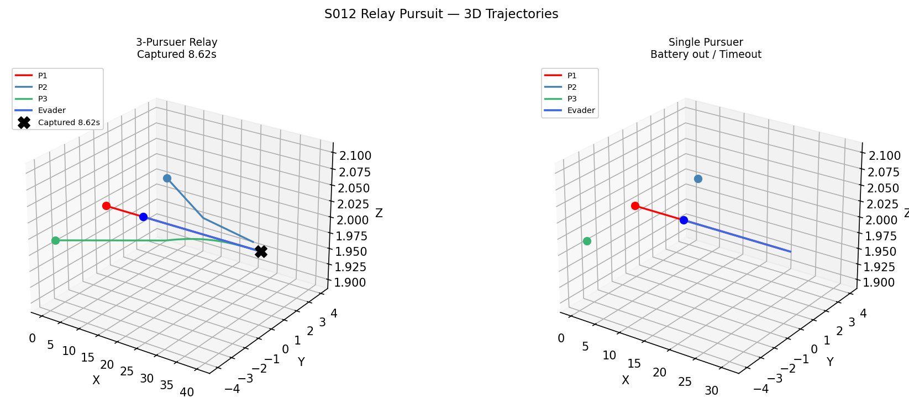
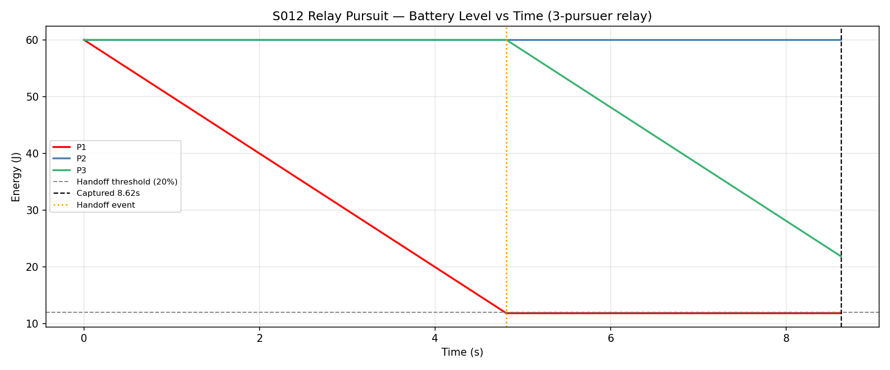
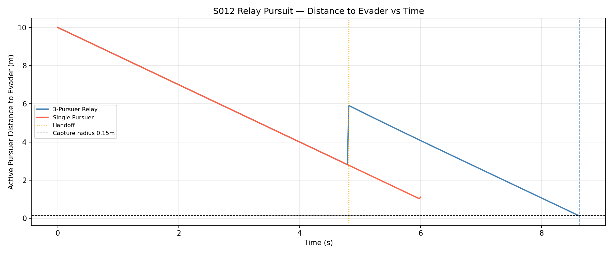
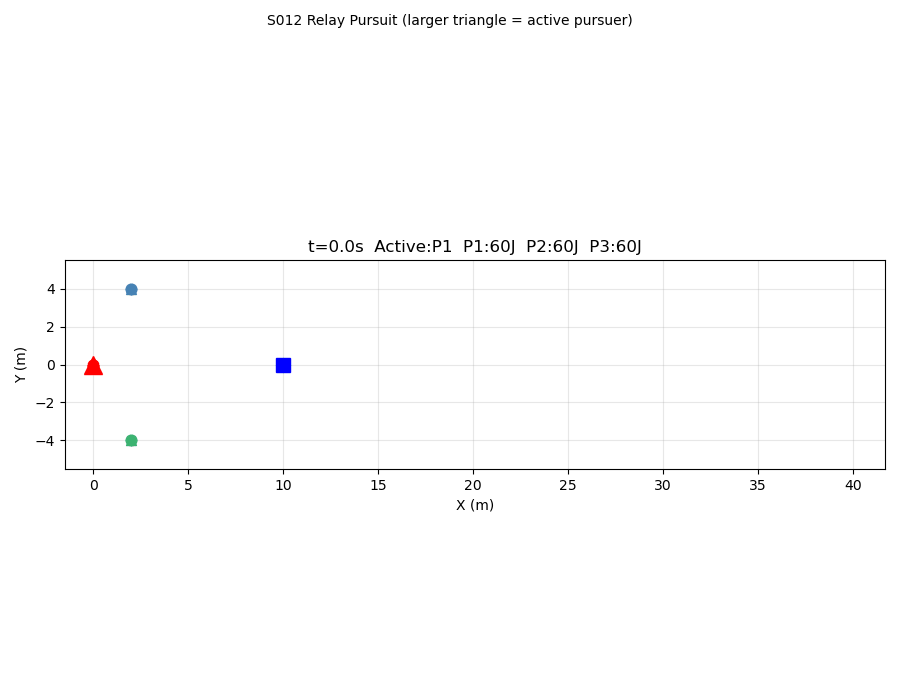

# S012 Relay Pursuit

**Domain**: Pursuit & Evasion | **Difficulty**: ⭐⭐⭐ | **Status**: ✅ Completed

---

## Problem Definition

**Setup**: 3 pursuers take turns chasing an evader; each has limited battery. When the active pursuer's battery drops below a handoff threshold (20%), the standby with the highest remaining energy takes over. Standby drones fly toward the predicted intercept position to be ready.

**Comparison**: 3-pursuer relay vs single pursuer (battery dies before capture).

---

## Mathematical Model

### Energy Model

$$E(t) = E_0 - k \cdot v^2 \cdot t, \quad P = k v^2$$

where k=0.4 W·s²/m², E₀=60 J, v=5 m/s → T_max = 60/(0.4×25) = 6 s.

### Handoff Condition

$$\frac{E_{active}}{E_0} < \tau_{handoff} = 0.20$$

### Intercept Prediction (Standby Drones)

$$\mathbf{p}_{intercept} = \mathbf{p}_E + \hat{\mathbf{v}}_E \cdot V_E \cdot t_{handoff}$$

where $t_{handoff} = E_{active} / (k V_P^2)$.

---

## Key Parameters

| Parameter | Value |
|-----------|-------|
| N pursuers | 3 |
| Initial energy E₀ | 60 J each |
| Energy constant k | 0.4 W·s²/m² |
| Handoff threshold | 20% |
| Active speed | 5.0 m/s |
| Standby speed | 4.0 m/s |
| Evader speed | 3.5 m/s |
| Capture radius | 0.15 m |

---

## Implementation

```
src/base/drone_base.py                 # Point-mass drone base
src/01_pursuit_evasion/s012_relay_pursuit.py      # Main simulation
```

```bash
conda activate drones
python src/01_pursuit_evasion/s012_relay_pursuit.py
```

---

## Results

| Strategy | Outcome | Handoffs |
|----------|---------|----------|
| **3-Pursuer Relay** | ✅ Captured @ **8.62 s** | 1 (@ t=4.80 s, P0→P1) |
| **Single Pursuer** | ❌ Battery out @ 6.0 s | — |

**Key Findings**:
- Single pursuer P0 runs out of energy at t≈6 s, closing from 10 m but not finishing capture.
- Relay P0 hands off to P1 at 20% battery (t=4.80 s). P1/P2 have been pre-positioning toward the predicted intercept during P0's active phase.
- P1 closes the gap and captures at 8.62 s — total mission success that was impossible for a single drone.

**3D Trajectories**:



**Battery Level vs Time (relay)**:



**Distance to Evader Comparison**:



**Animation** (larger triangle = active pursuer):



---

## Extensions

1. Optimize standby drone starting positions to minimize handoff latency
2. Variable pursuit speed — trade battery life for pursuit aggressiveness
3. Evader aware of handoff timing — exploit brief transition window

---

## Related Scenarios

- Prerequisites: [S006](../../scenarios/01_pursuit_evasion/S006_energy_race.md), [S011](../../scenarios/01_pursuit_evasion/S011_swarm_encirclement.md)
- Follow-ups: [S013](../../scenarios/01_pursuit_evasion/S013_pincer_movement.md), [S017](../../scenarios/01_pursuit_evasion/S017_swarm_vs_swarm.md)
