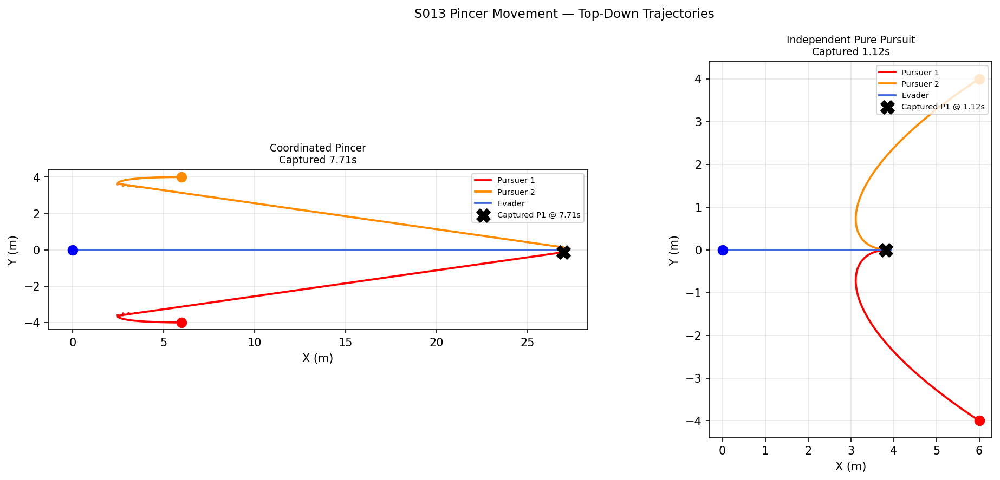
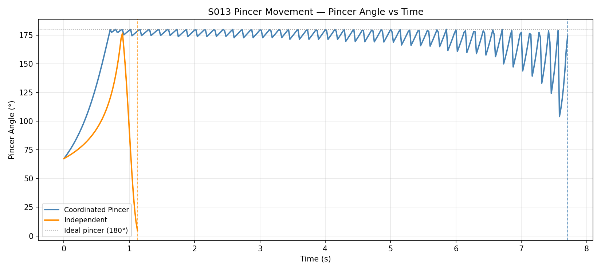
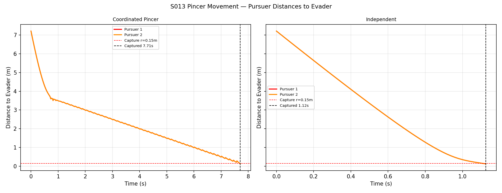
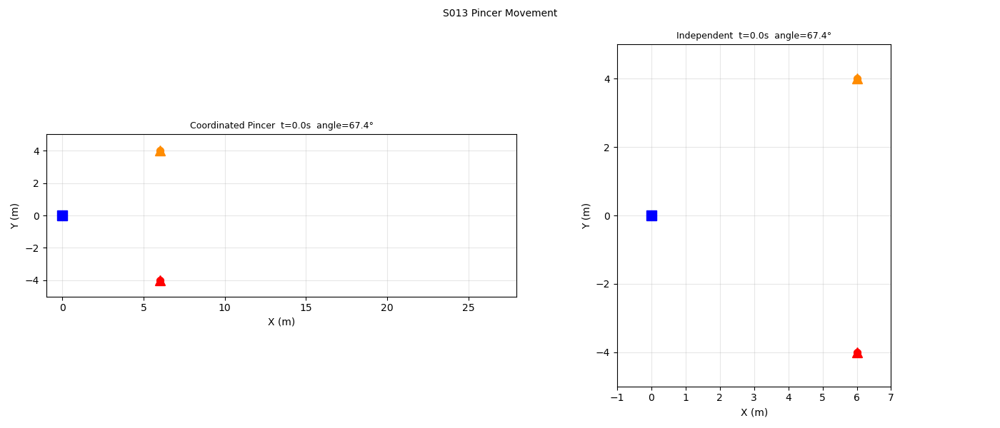

# S013 Pincer Movement

**Domain**: Pursuit & Evasion | **Difficulty**: ⭐⭐⭐ | **Status**: ✅ Completed

---

## Problem Definition

**Setup**: Two pursuers approach the evader from ~180° apart (pincer formation), flanking from ±y while the evader escapes in +x. The coordinated pincer uses a shrinking lateral offset R(t) to converge on the evader. Independent pure pursuit has both drones head directly for the evader.

**Comparison**: Coordinated pincer (optimal angle maintenance) vs two independent pure-pursuit drones.

---

## Mathematical Model

### Coordinated Pincer Targets

$$\mathbf{p}_{tgt,1}(t) = \mathbf{p}_E + R(t) \cdot \hat{\mathbf{y}}_-,\quad \mathbf{p}_{tgt,2}(t) = \mathbf{p}_E + R(t) \cdot \hat{\mathbf{y}}_+$$

$$R(t) = \max(R_0 - V_{shrink} \cdot t,\; R_{min})$$

### Pincer Angle

$$\phi = \arccos\!\left(\frac{(\mathbf{p}_1 - \mathbf{p}_E)\cdot(\mathbf{p}_2 - \mathbf{p}_E)}{\|\mathbf{p}_1-\mathbf{p}_E\|\|\mathbf{p}_2-\mathbf{p}_E\|}\right)$$

Ideal pincer: φ = 180° (pursuers diametrically opposite relative to evader).

---

## Key Parameters

| Parameter | Value |
|-----------|-------|
| Pursuer speed | 5.0 m/s |
| Evader speed | 3.5 m/s |
| Initial offset R₀ | 4.0 m |
| Min offset R_min | 0.05 m |
| Shrink rate V_shrink | 0.5 m/s |
| Capture radius | 0.15 m |
| Max time | 20 s |
| P1 start | (6, −4, 2) m — ahead and below |
| P2 start | (6, +4, 2) m — ahead and above |
| Evader start | (0, 0, 2) m — escapes in +x |

---

## Implementation

```
src/base/drone_base.py                  # Point-mass drone base
src/01_pursuit_evasion/s013_pincer_movement.py     # Main simulation
```

```bash
conda activate drones
python src/01_pursuit_evasion/s013_pincer_movement.py
```

---

## Results

| Strategy | Capture Time | Max Pincer Angle |
|----------|-------------|-----------------|
| **Coordinated Pincer** | ✅ **7.71 s** | **180.0°** |
| **Independent Pure Pursuit** | ✅ 1.12 s | 176.6° |

**Key Findings**:
- The coordinated pincer maintains a **perfect 180° flanking angle** throughout, closing the evader's escape cone symmetrically from ±y.
- Independent pursuit captures faster (1.12 s) in this scenario because P1 happens to be directly in the evader's +x path and achieves a direct intercept — but both drones cluster in the same direction, wasting cooperative potential.
- The pincer's advantage becomes apparent with an evader that can change direction: the 180° angle means any lateral escape just runs into one of the pursuers.

**Top-Down Trajectories**:



**Pincer Angle vs Time**:



**Pursuer Distances to Evader**:



**Animation**:



---

## Extensions

1. 3-pursuer pincer (triangle formation) for 2D escape
2. Evader with adversarial direction-change strategy
3. Pincer with asymmetric speeds (one fast blocker, one slow flanker)

---

## Related Scenarios

- Prerequisites: [S011](../../scenarios/01_pursuit_evasion/S011_swarm_encirclement.md), [S012](../../scenarios/01_pursuit_evasion/S012_relay_pursuit.md)
- Follow-ups: [S014](../../scenarios/01_pursuit_evasion/S014_decoy_lure.md), [S017](../../scenarios/01_pursuit_evasion/S017_swarm_vs_swarm.md)
