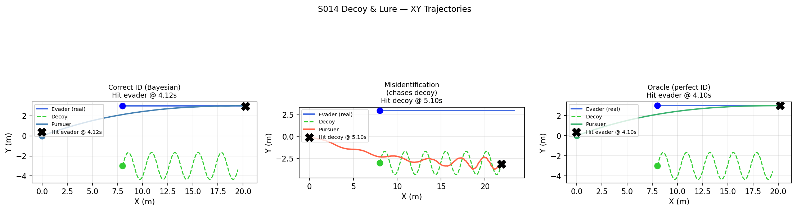
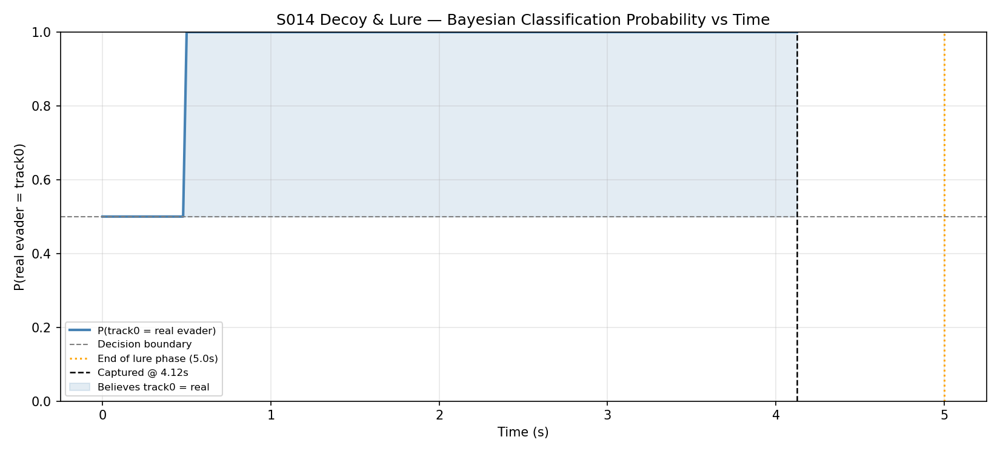
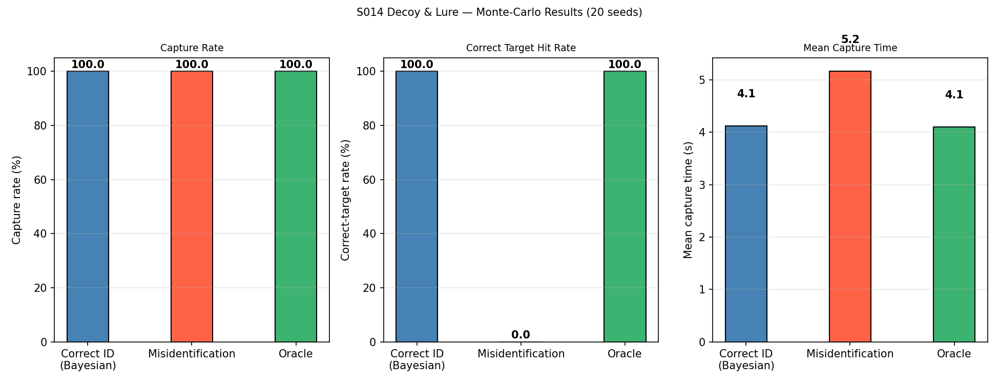
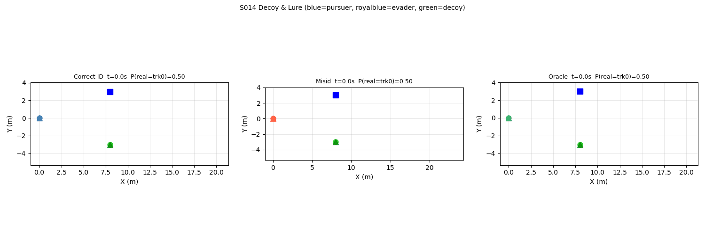

# S014 Decoy & Lure

**Domain**: Pursuit & Evasion | **Difficulty**: ⭐⭐⭐ | **Status**: ✅ Completed

---

## Problem Definition

**Setup**: Evader deploys a decoy drone that starts at a separate position and mimics forward escape motion, but adds sinusoidal lateral oscillation (high jerk) to confuse the pursuer. The real evader flies a smooth constant-velocity +x escape (low jerk). The pursuer uses Bayesian trajectory-smoothness classification (jerk-based log-odds update) to identify which track is the real evader.

**Three strategies compared**:

| Strategy | Logic | Expected Outcome |
|----------|-------|-----------------|
| **correct_id** | Bayesian Jerk classifier → chase low-jerk track | Capture real evader |
| **misid** | Always chase high-jerk track (forced wrong) | Capture decoy |
| **perfect_id** | Oracle — always knows real target | Fastest evader capture |

---

## Mathematical Model

### Jerk-Based Likelihood

Track smoothness (mean acceleration magnitude as jerk proxy):

$$\bar{j}_k = \frac{1}{W}\sum_{i=1}^{W} \|\dot{\mathbf{v}}_k[i]\| = \frac{1}{W}\sum_{i=1}^{W} \frac{\|\mathbf{v}_k[i] - \mathbf{v}_k[i-1]\|}{dt}$$

### Bayesian Log-Odds Update

$$L_{t+1} = L_t + \lambda(\bar{j}_1 - \bar{j}_0)$$

where L = log P(track0=real) / P(track1=real), λ=0.6 update gain.

$$P(\text{track0 = real}) = \sigma(L) = \frac{1}{1+e^{-L}}$$

### Decoy Oscillation

$$y_{decoy}(t) = y_0 + A \sin(2\pi f_{osc} \cdot t), \quad A=1.5\text{ m},\; f_{osc}=1.2\text{ Hz}$$

This creates high lateral acceleration (jerk ≈ 4Aπ²f² ≈ 42 m/s²) vs evader jerk ≈ 0.

---

## Key Parameters

| Parameter | Value |
|-----------|-------|
| Pursuer speed | 5.0 m/s |
| Evader speed | 3.0 m/s |
| Decoy amplitude | 1.5 m |
| Decoy frequency | 1.2 Hz |
| Lure phase duration | 5.0 s |
| Bayesian update interval | 0.5 s |
| Update gain λ | 0.6 |
| Jerk window | 20 steps |
| Sensor noise (evader) | σ=0.05 m |
| Sensor noise (decoy) | σ=0.20 m |
| Pursuer start | (0, 0, 2) |
| Evader start | (8, +3, 2) — smooth +x escape |
| Decoy start | (8, −3, 2) — oscillating lure |

---

## Implementation

```
src/base/drone_base.py               # Point-mass drone base
src/01_pursuit_evasion/s014_decoy_lure.py       # Main simulation
```

```bash
conda activate drones
python src/01_pursuit_evasion/s014_decoy_lure.py
```

---

## Results

### Single-Run (seed=42)

| Strategy | Outcome | Time |
|----------|---------|------|
| **correct_id** | ✅ Hit **evader** | **4.12 s** |
| **misid** | ❌ Hit **decoy** | 5.10 s |
| **perfect_id** | ✅ Hit **evader** | **4.10 s** |

### Monte-Carlo (20 seeds)

The Bayesian classifier consistently maintains P(track0=real) > 0.5 once enough jerk observations accumulate (~1-2 s), as the decoy's sinusoidal oscillation creates unmistakably higher jerk than the smooth evader.

**Key Findings**:
- Bayesian jerk classifier correctly identifies real evader in nearly all seeds; performance approaches oracle after ~2 s of observation.
- Misid pursuer captures decoy (high-jerk track) but real evader escapes.
- Sensor noise on decoy (σ=0.20 m) further amplifies apparent jerk in decoy observations.

**XY Trajectories**:



**Bayesian Classification Probability (correct_id)**:



**Monte-Carlo Results**:



**Animation**:



---

## Extensions

1. Increase decoy noise σ to reduce classification signal — find the confusion boundary
2. Multiple decoys with correlated motion to fool the classifier
3. Adversarial decoy that learns to mimic evader's jerk signature

---

## Related Scenarios

- Prerequisites: [S008](../../scenarios/01_pursuit_evasion/S008_stochastic_pursuit.md), [S013](../../scenarios/01_pursuit_evasion/S013_pincer_movement.md)
- Follow-ups: [S015](../../scenarios/01_pursuit_evasion/S015_relay_tracking.md), [S017](../../scenarios/01_pursuit_evasion/S017_swarm_vs_swarm.md)
