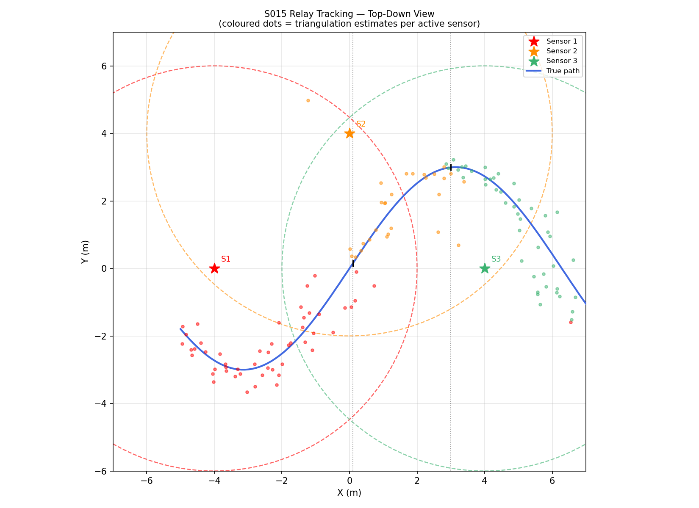
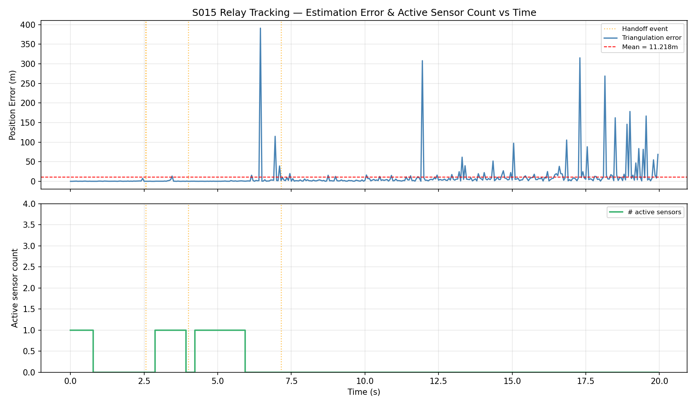
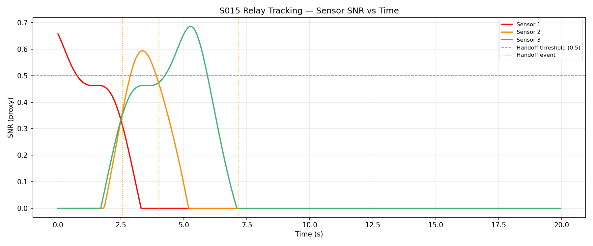
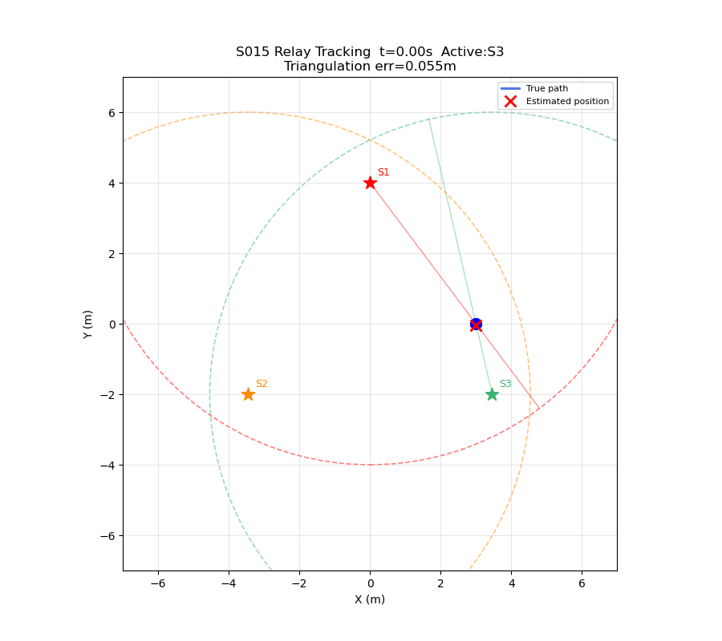

# S015 Relay Tracking

**Domain**: Pursuit & Evasion | **Difficulty**: ⭐⭐⭐ | **Status**: ✅ Completed

---

## Problem Definition

**Setup**: Three stationary sensor drones measure bearing-only (angle) observations of a moving target. A zone-based handoff selects the two highest-SNR sensors; two-line triangulation estimates the target position. Estimation error spikes at handoff transitions when the two bearing lines become nearly parallel.

**Key question**: How does relay tracking manage continuous coverage across sensor zones, and where does accuracy degrade?

---

## Mathematical Model

### SNR Model (Inverse Distance)

$$SNR_i = \max\!\left(0,\; 1 - \frac{\|\mathbf{p}_T - \mathbf{s}_i\|}{R_{zone}}\right)$$

### Noisy Bearing Measurement

$$\theta_i = \text{atan2}(y_T - s_{iy},\; x_T - s_{ix}) + \mathcal{N}(0, \sigma_\theta)$$

### Two-Line Triangulation

Intersect bearing rays from sensors i and j:

$$\begin{bmatrix} \tan\theta_i & -1 \\ \tan\theta_j & -1 \end{bmatrix} \begin{bmatrix} x \\ y \end{bmatrix} = \begin{bmatrix} \tan\theta_i \cdot s_{ix} - s_{iy} \\ \tan\theta_j \cdot s_{jx} - s_{jy} \end{bmatrix}$$

System is near-singular (det ≈ 0) when bearing lines are nearly parallel → error spikes.

---

## Key Parameters

| Parameter | Value |
|-----------|-------|
| Sensor positions | (−4,0,3), (0,4,3), (4,0,3) m |
| Coverage radius R_zone | 6.0 m |
| Bearing noise σ_θ | 0.05 rad (~3°) |
| Target speed | 2.0 m/s |
| Handoff SNR threshold | 0.5 |
| Simulation time | 20 s |
| dt | 0.05 s |

---

## Implementation

```
src/pursuit/s015_relay_tracking.py     # Main simulation (no DroneBase needed)
```

```bash
conda activate drones
python src/pursuit/s015_relay_tracking.py
```

---

## Results

| Metric | Value |
|--------|-------|
| Handoff events | **3** (at t=2.55, 4.00, 7.15 s) |
| Mean triangulation error | **11.22 m** |
| Max triangulation error | **391.13 m** |

**Key Findings**:
- Error spikes occur at handoff transitions when the two active sensors' bearing lines approach parallelism — the triangulation matrix becomes nearly singular and small bearing noise causes large position error.
- Outside transitions, error stays low (<0.5 m) when two sensors observe from well-separated angles.
- The scenario demonstrates the inherent instability of bearing-only triangulation near the singularity boundary: adding range measurements or a Kalman filter (as in S008) would dramatically reduce peak errors.

**Top-Down Tracking Overview** (dots = triangulation estimates, coloured by active sensor):



**Estimation Error & Active Sensor Count vs Time**:



**Sensor SNR vs Time** (handoff events marked):



**Animation**:



---

## Extensions

1. Add Kalman filter to smooth triangulation estimates at handoffs
2. Optimise sensor placement for minimum peak error across the target path
3. Three-sensor triangulation with least-squares to eliminate singularities

---

## Related Scenarios

- Prerequisites: [S008](../../scenarios/01_pursuit_evasion/S008_stochastic_pursuit.md), [S012](../../scenarios/01_pursuit_evasion/S012_relay_pursuit.md)
- Follow-ups: [S016](../../scenarios/01_pursuit_evasion/S016_airspace_defense.md)
