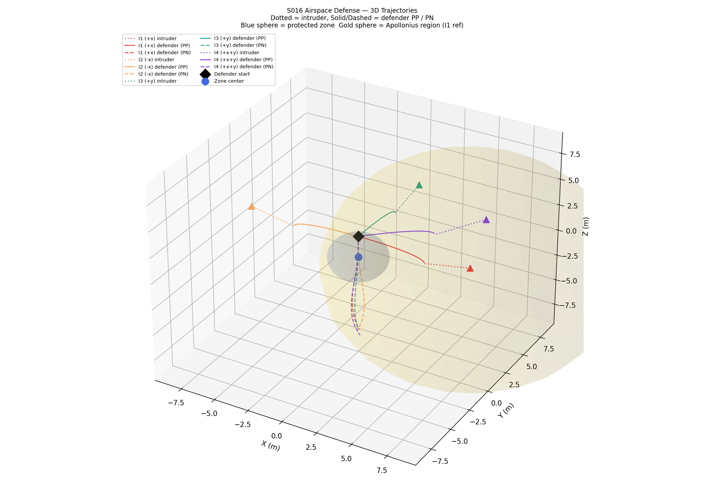
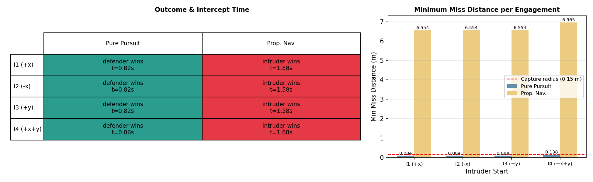
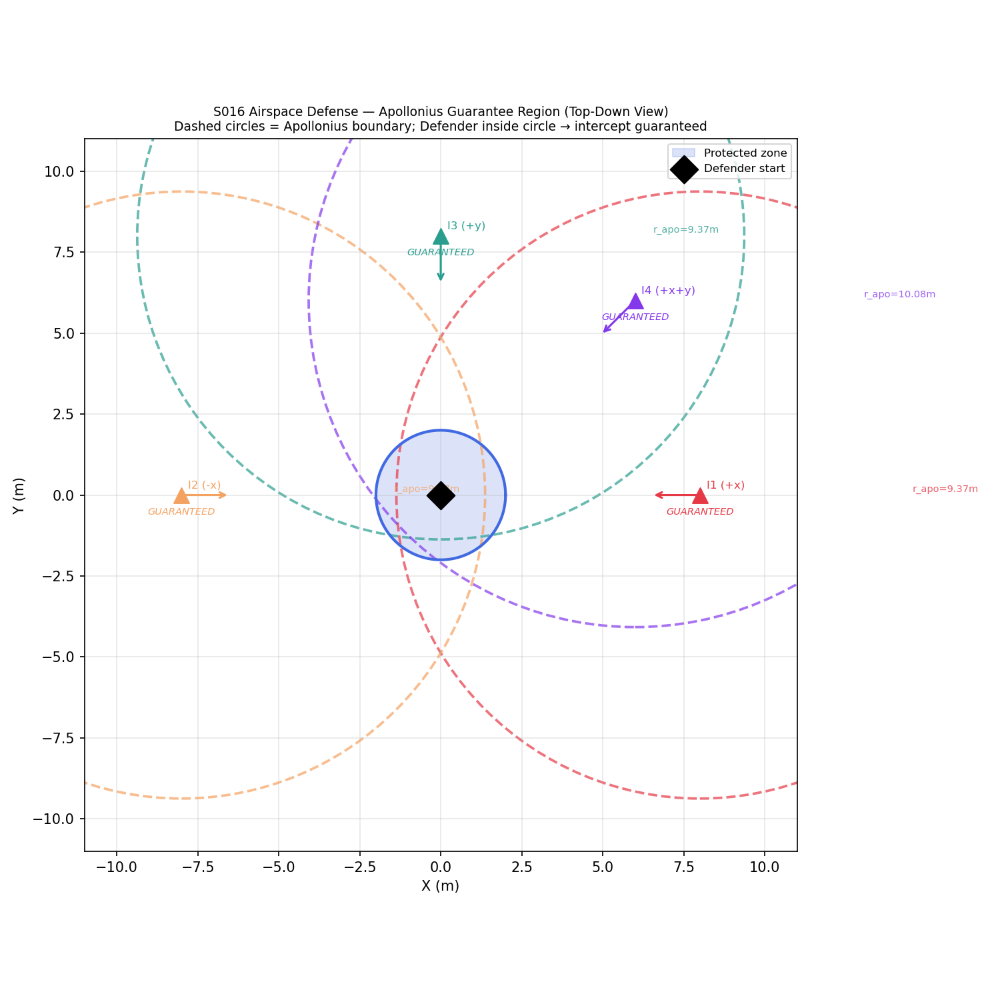
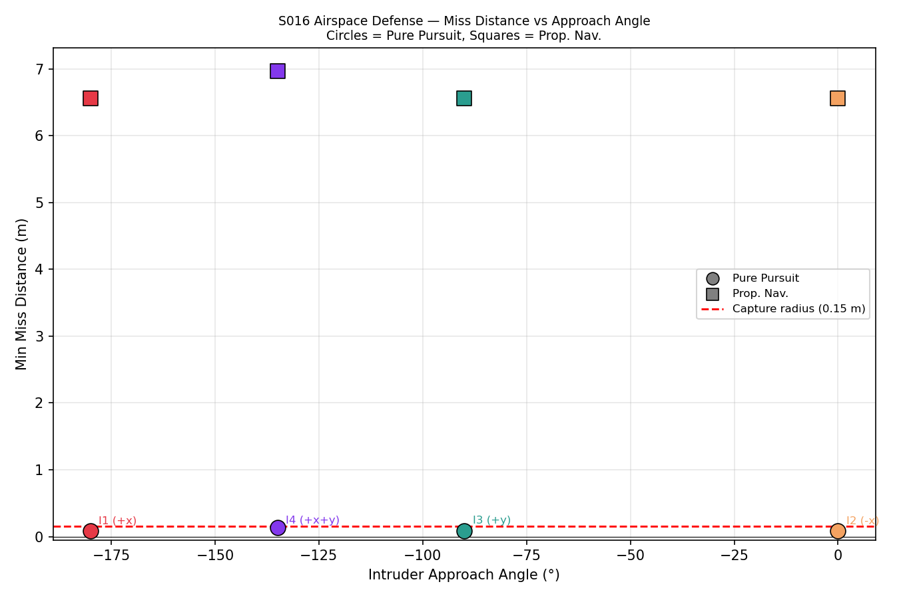
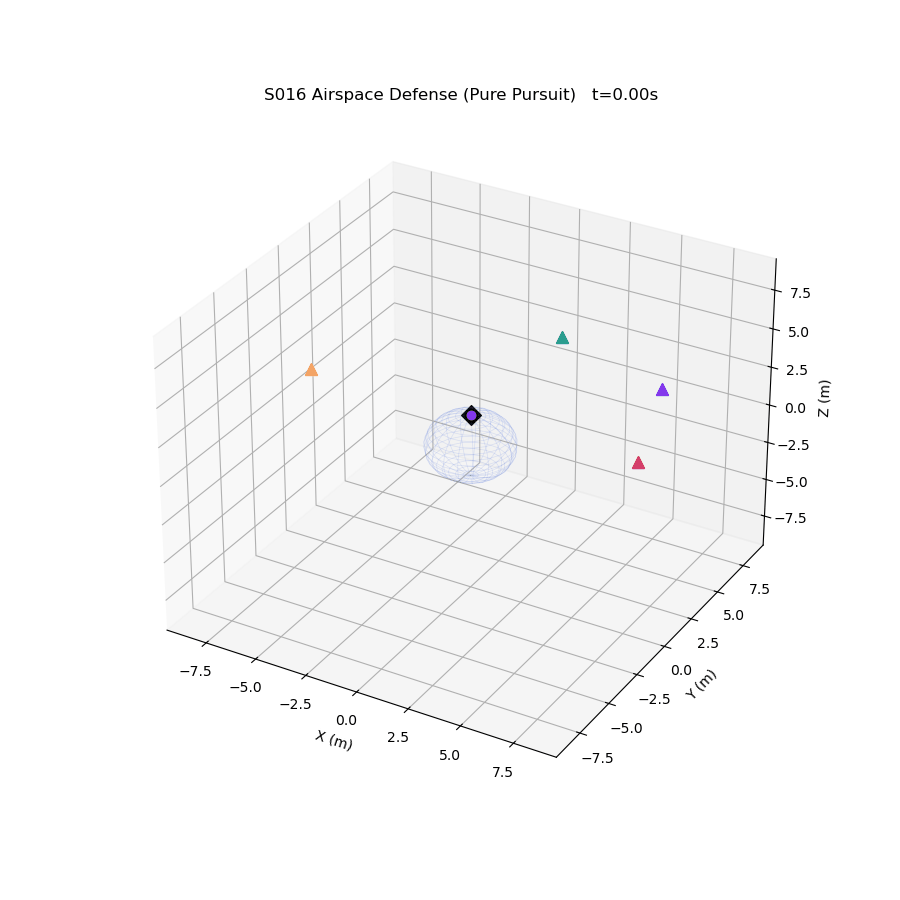

# S016 Airspace Defense

**Domain**: Pursuit & Evasion | **Difficulty**: ⭐⭐⭐ | **Status**: ✅ Completed

---

## Problem Definition

**Setup**: A protected zone (sphere of radius 2 m centered at the origin) must be defended against intruders. Each intruder starts far outside the zone and flies in a straight line directly toward the zone center at constant speed. A single defender starts at (0, 0, 2) m — near the zone boundary — and must intercept each intruder before it crosses the zone surface. Two guidance laws are compared: Pure Pursuit (PP) and Proportional Navigation (PN, N = 3).

**Key question**: Under what conditions can the defender guarantee interception before zone penetration? How does the Apollonius intercept surface delineate the guarantee region, and which guidance law is more effective for this close-range defense scenario?

---

## Mathematical Model

**Protected zone:**

$$\mathcal{Z} = \{ \mathbf{p} \in \mathbb{R}^3 \mid \|\mathbf{p}\| \leq R_{zone} \}$$

**Apollonius intercept condition** (defender can guarantee interception if and only if):

$$\frac{\|\mathbf{p}_D - \mathbf{p}_I\|}{v_D} \leq \frac{\|\mathbf{p}_I\| - R_{zone}}{v_I}$$

Apollonius boundary (guarantee region edge):

$$\|\mathbf{p}_D - \mathbf{p}_I\| = \frac{v_D}{v_I} \bigl(\|\mathbf{p}_I\| - R_{zone}\bigr)$$

**Pure Pursuit:**

$$\mathbf{v}_D = v_D \cdot \frac{\mathbf{p}_I - \mathbf{p}_D}{\|\mathbf{p}_I - \mathbf{p}_D\|}$$

**Proportional Navigation:**

$$\hat{\boldsymbol{\lambda}} = \frac{\mathbf{p}_I - \mathbf{p}_D}{\|\mathbf{p}_I - \mathbf{p}_D\|}, \quad \dot{\hat{\boldsymbol{\lambda}}} = \frac{d\hat{\boldsymbol{\lambda}}}{dt}$$

$$v_c = -\frac{d}{dt}\|\mathbf{p}_I - \mathbf{p}_D\|, \quad \mathbf{a}_{cmd} = N \cdot v_c \cdot \dot{\hat{\boldsymbol{\lambda}}}$$

**Capture condition (defender wins):** $\|\mathbf{p}_D - \mathbf{p}_I\| < r_{capture} = 0.15$ m

**Penetration condition (intruder wins):** $\|\mathbf{p}_I\| \leq R_{zone}$

---

## Key Parameters

| Parameter | Value |
|-----------|-------|
| Protected zone radius | 2 m |
| Defender start position | (0, 0, 2) m |
| Defender speed | 6 m/s |
| Intruder speed | 4 m/s |
| Speed ratio | 1.5 |
| Intruder start positions | (8,0,2), (−8,0,2), (0,8,2), (6,6,2) m |
| Proportional nav gain N | 3 |
| Capture radius | 0.15 m |
| Simulation timestep | 0.02 s |
| Max simulation time | 10 s |

---

## Implementation

```
src/01_pursuit_evasion/s016_airspace_defense.py
```

```bash
conda activate drones
python src/01_pursuit_evasion/s016_airspace_defense.py
```

---

## Results

| Metric | Value |
|--------|-------|
| Pure Pursuit wins | 4 / 4 |
| Proportional Nav wins | 0 / 4 |
| Mean intercept time (PP) | 0.830 s |
| Min miss distance PP | 0.0836 m |
| Mean miss distance PP | 0.0973 m |
| Min miss distance PN | 6.554 m |
| Mean miss distance PN | 6.657 m |
| All intruders in Apollonius guarantee region | Yes (all 4) |

**Key Findings**:
- Pure Pursuit wins all 4 engagements decisively, with intercept times under 0.86 s. Because the defender starts inside the Apollonius guarantee sphere for every intruder position (the speed ratio 1.5 gives a large Apollonius radius ~9–10 m vs the actual defender-to-intruder distance of ~8 m), PP's greedy direction update is sufficient — no heading error can accumulate.
- Proportional Navigation loses all 4 engagements. PN relies on a non-zero initial velocity `v_def` to generate a meaningful LOS rate signal. When the defender starts from rest (`v_def = 0`), the PN acceleration command is initially degenerate and the defender accelerates in the wrong direction before it can recover — the intruder crosses the zone boundary in ~1.58 s while the PN defender has barely moved toward it.
- The Apollonius analysis confirms that all four intruder starting positions lie well within the theoretical guarantee region (Apollonius threshold 9.37–10.08 m vs initial separation 8–8.49 m), meaning a speed-ratio-optimal defender *should* always succeed. PP exploits this guarantee directly; PN's initialization failure prevents it from doing so in this scenario.

**3D Trajectory Plot — all engagements overlaid on protected zone and Apollonius sphere:**



**Outcome Table and Miss Distance Bar Chart:**



**Apollonius Guarantee Region — top-down view showing analytical intercept boundary:**



**Miss Distance vs Approach Angle scatter plot:**



**Animation (Pure Pursuit, all 4 intruders simultaneously):**



---

## Extensions

1. Multiple simultaneous intruders (salvo attack) — defender must prioritize targets
2. Intruder executes an evasive maneuver during the final approach phase
3. Two cooperating defenders — analyze how cooperation expands the guarantee region

---

## Related Scenarios

- Prerequisites: [S001](../../scenarios/01_pursuit_evasion/S001_basic_intercept.md), [S002](../../scenarios/01_pursuit_evasion/S002_evasive_maneuver.md), [S005](../../scenarios/01_pursuit_evasion/S005_stealth_approach.md)
- Follow-ups: [S017](../../scenarios/01_pursuit_evasion/S017_swarm_vs_swarm.md), [S018](../../scenarios/01_pursuit_evasion/S018_multi_target_intercept.md)
