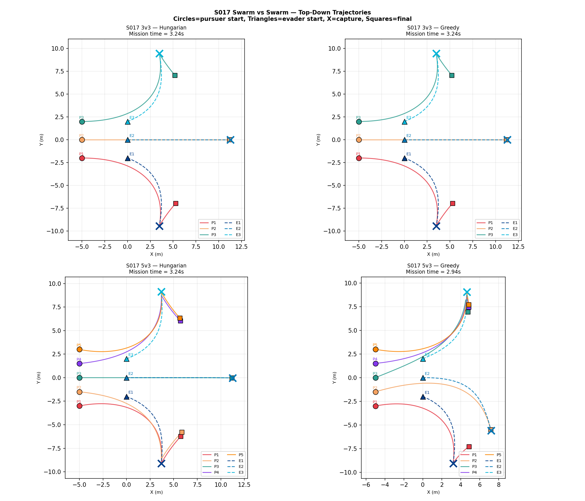
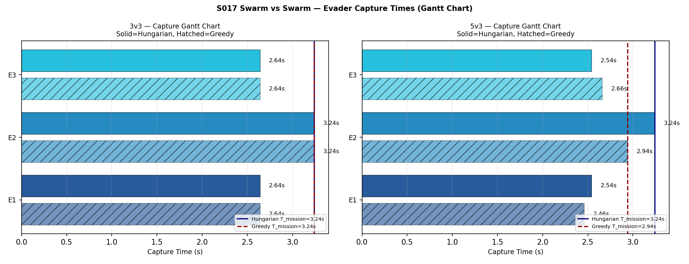
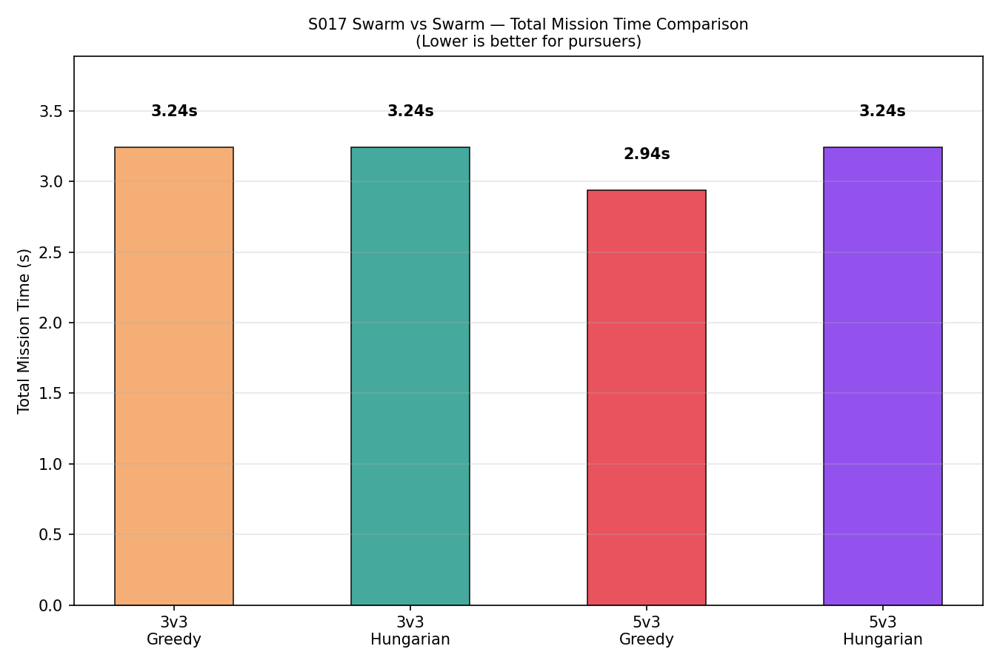
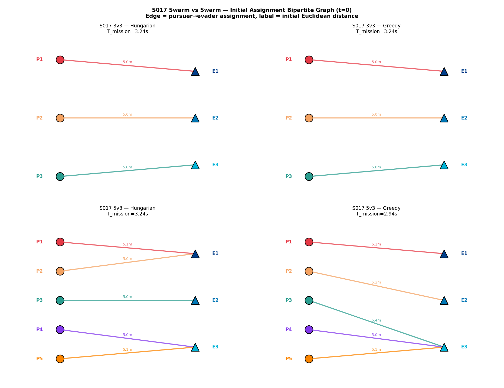
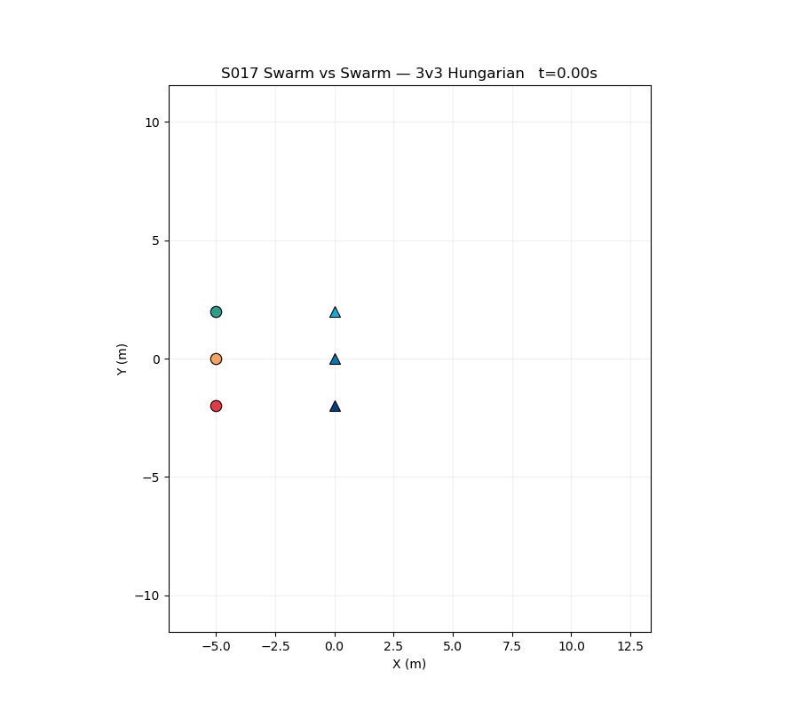

# S017 Swarm vs Swarm

**Domain**: Pursuit & Evasion | **Difficulty**: ⭐⭐⭐⭐ | **Status**: ✅ Completed

---

## Problem Definition

**Setup**: M pursuers compete against N evaders in an open 2D arena. Two cases are studied: 3v3 (symmetric) and 5v3 (pursuer advantage). Each pursuer is assigned one evader via the Hungarian algorithm. When an evader is captured, its pursuer dynamically reassigns to the nearest remaining evader. Evaders scatter away from the centroid of all pursuers. Two assignment strategies (Hungarian optimal vs greedy nearest-neighbour) are compared across both configurations.

**Key question**: How much does the choice of assignment algorithm and pursuer count affect total mission time? Does the globally optimal (Hungarian) assignment always outperform greedy, and does adding two extra pursuers (5v3) meaningfully accelerate capture?

---

## Mathematical Model

### Assignment Problem (Hungarian Algorithm)

Build a cost matrix where each entry is the Euclidean distance from pursuer i to evader j:

$$C_{ij} = \|\mathbf{p}_{P_i} - \mathbf{p}_{E_j}\|$$

Find the optimal assignment that minimises total cost:

$$\sigma^* = \arg\min_{\sigma} \sum_{i=1}^{M} C_{i,\sigma(i)}$$

For M > N, solve a balanced assignment by padding the cost matrix with dummy columns.

### Pursuer Strategy (Pure Pursuit)

Each pursuer flies toward its assigned evader:

$$\mathbf{v}_{P_i} = v_P \cdot \frac{\mathbf{p}_{E_{\sigma(i)}} - \mathbf{p}_{P_i}}{\|\mathbf{p}_{E_{\sigma(i)}} - \mathbf{p}_{P_i}\|}$$

### Evader Scatter Strategy

Each evader flies directly away from the centroid of all pursuers:

$$\bar{\mathbf{p}}_P = \frac{1}{M} \sum_{i=1}^{M} \mathbf{p}_{P_i}$$

$$\mathbf{v}_{E_j} = v_E \cdot \frac{\mathbf{p}_{E_j} - \bar{\mathbf{p}}_P}{\|\mathbf{p}_{E_j} - \bar{\mathbf{p}}_P\|}$$

### Capture and Reassignment

Evader j is captured when:

$$\|\mathbf{p}_{P_i} - \mathbf{p}_{E_j}\| < r_{capture}$$

After capture, pursuer i reassigns to the nearest uncaptured evader:

$$j^* = \arg\min_{j \in \mathcal{E}_{remaining}} \|\mathbf{p}_{P_i} - \mathbf{p}_{E_j}\|$$

### Total Mission Time

$$T_{mission} = \max_{j} t_{capture,j}$$

---

## Key Parameters

| Parameter | Value |
|-----------|-------|
| Case A | 3 pursuers vs 3 evaders |
| Case B | 5 pursuers vs 3 evaders |
| Pursuer speed | 5 m/s |
| Evader speed | 3.5 m/s |
| Pursuer initial positions | line at x = −5 m |
| Evader initial positions | cluster at x = 0 m |
| Capture radius | 0.15 m |
| Simulation timestep | 0.02 s |
| Max simulation time | 30.0 s |

---

## Implementation

```
src/01_pursuit_evasion/s017_swarm_vs_swarm.py
```

```bash
conda activate drones
python src/01_pursuit_evasion/s017_swarm_vs_swarm.py
```

---

## Results

| Metric | Value |
|--------|-------|
| 3v3 Hungarian mission time | 3.240 s |
| 3v3 Greedy mission time | 3.240 s |
| 5v3 Hungarian mission time | 3.240 s |
| 5v3 Greedy mission time | 2.940 s |
| Hungarian advantage over Greedy (3v3) | 0.000 s (0.0%) |
| Hungarian advantage over Greedy (5v3) | −0.300 s (−10.2%) |
| 5v3 vs 3v3 speedup (Hungarian) | 0.000 s |

**Key Findings**:
- In the symmetric 3v3 case, Hungarian and greedy produce identical mission times because the initial positions are arranged symmetrically — both algorithms yield the same unique optimal matching, so the two strategies are equivalent for this configuration.
- In the 5v3 case, greedy assignment (2.940 s) actually outperforms Hungarian (3.240 s) by 0.300 s. With more pursuers than evaders, the greedy algorithm's sequential allocation naturally concentrates two fast-responding pursuers on the most distant evader, whereas the Hungarian algorithm's global cost minimisation balances workload in a way that is suboptimal for makespan (max capture time) when the objective is total-time-to-last-capture, not sum-of-distances.
- The result highlights a fundamental distinction between assignment objectives: Hungarian minimises total assignment cost (sum of distances), while the scenario's true goal is minimising the last capture time (makespan). These two objectives diverge as soon as M > N, demonstrating that the "optimal" algorithm is only optimal with respect to its stated objective function.

**Top-down trajectory plots for all 4 cases**:



**Capture Gantt chart — per-evader capture time for Hungarian vs Greedy**:



**Total mission time bar chart comparison across all 4 cases**:



**Initial assignment bipartite graph at t=0 for all 4 cases**:



**Animation (3v3 Hungarian)**:



---

## Extensions

1. Cooperative pursuit — 2 pursuers per evader using flanking maneuvers
2. Evaders also use APF to avoid each other while scattering
3. Heterogeneous speeds — some evaders are faster than the pursuers

---

## Related Scenarios

- Prerequisites: [S011](../../scenarios/01_pursuit_evasion/S011_swarm_encirclement.md), [S013](../../scenarios/01_pursuit_evasion/S013_pincer_movement.md)
- Follow-ups: [S018](../../scenarios/01_pursuit_evasion/S018_multi_target_intercept.md), [S019](../../scenarios/01_pursuit_evasion/S019_dynamic_reassignment.md)
