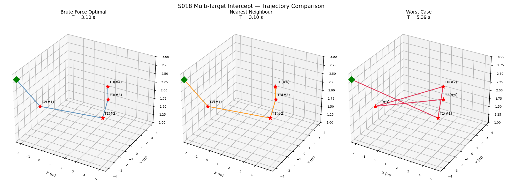
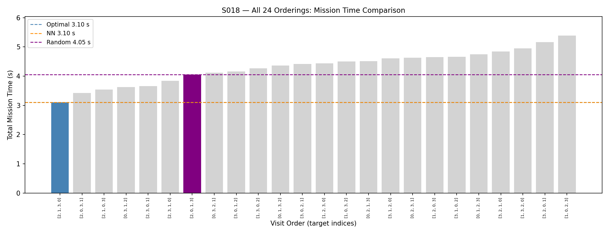
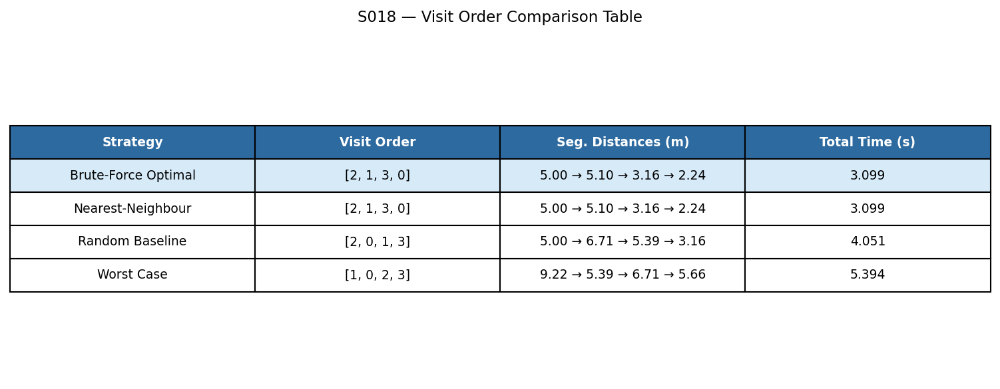
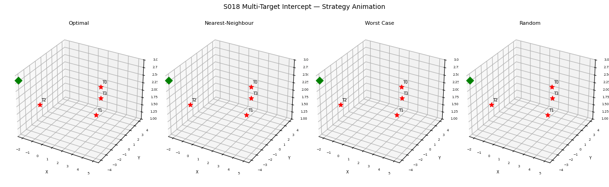

# S018 Multi-Target Intercept

**Domain**: Pursuit & Evasion | **Difficulty**: ⭐⭐⭐ | **Status**: ✅ Completed

---

## Problem Definition

**Setup**: A single pursuer starting at (-5, 0, 2) m must intercept four stationary targets at fixed 3D positions. All motion occurs at constant altitude z = 2 m. The pursuer flies at a constant speed of 5 m/s and must visit every target within a capture radius of 0.15 m.

**Key question**: What is the visit ordering that minimises total flight time, and how well does the greedy nearest-neighbour heuristic approximate the brute-force optimum across all 4! = 24 possible orderings?

---

## Mathematical Model

### Total Mission Time

For visit ordering $\sigma = (\sigma_1, \sigma_2, \sigma_3, \sigma_4)$:

$$T_{\text{total}}(\sigma) = \sum_{k=1}^{N} \frac{\|\mathbf{p}_{\sigma_k} - \mathbf{p}_{\sigma_{k-1}}\|}{v_P}$$

where $\mathbf{p}_{\sigma_0} = \mathbf{p}_P(0)$ is the pursuer start position.

### Optimal Ordering (Brute Force)

$$\sigma^* = \arg\min_{\sigma \in S_N} T_{\text{total}}(\sigma)$$

### Nearest-Neighbour Heuristic

$$\sigma_{k+1} = \arg\min_{j \notin \{\sigma_1,\ldots,\sigma_k\}} \|\mathbf{p}_j - \mathbf{p}_{\sigma_k}\|$$

### Optimality Gap

$$\text{gap} = \frac{T_{NN} - T^*}{T^*} \times 100\%$$

---

## Key Parameters

| Parameter | Value |
|-----------|-------|
| Pursuer start | (-5, 0, 2) m |
| Target 0 | (2, 3, 2) m |
| Target 1 | (4, -2, 2) m |
| Target 2 | (-1, -3, 2) m |
| Target 3 | (3, 1, 2) m |
| Pursuer speed | 5 m/s |
| Capture radius | 0.15 m per target |
| Timestep DT | 0.05 s |
| Orderings evaluated | 24 (4!) |

---

## Implementation

```
src/01_pursuit_evasion/s018_multi_target_intercept.py
```

```bash
conda activate drones
python src/01_pursuit_evasion/s018_multi_target_intercept.py
```

---

## Results

| Metric | Value |
|--------|-------|
| Optimal order | [2, 1, 3, 0] |
| Optimal mission time | 3.099 s |
| Optimal total distance | 15.497 m |
| Nearest-Neighbour time | 3.099 s |
| NN optimality gap | 0.0% |
| Random baseline time | 4.051 s |
| Random optimality gap | 30.7% |
| Worst-case order | [1, 0, 2, 3] |
| Worst-case time | 5.394 s |
| Total orderings evaluated | 24 |

**Key Findings**:
- The nearest-neighbour heuristic finds the globally optimal ordering [2, 1, 3, 0] with a 0% optimality gap, achieving the best possible mission time of 3.099 s. This is not guaranteed in general, but holds here because the geometry of the target layout is favourable to greedy selection — each locally closest target also happens to extend the globally best route.
- The worst-case ordering [1, 0, 2, 3] results in a mission time of 5.394 s — 74% longer than optimal — demonstrating that uninformed ordering can dramatically increase travel cost. The pursuer zig-zags across the arena instead of sweeping efficiently.
- The random baseline [2, 0, 1, 3] is 30.7% slower than optimal, confirming that even modest permutation choices have a significant effect on mission cost at this scale. With N = 4, brute-force enumeration of all 24 orderings is trivial; for N ≥ 12 heuristics or metaheuristics become necessary.

**3D trajectory comparison (optimal, nearest-neighbour, worst case)**:



**Bar chart of all 24 orderings ranked by mission time**:



**Visit order summary table with segment distances**:



**Animation**:



---

## Extensions

1. Moving targets — greedy NN still applicable; optimal becomes intractable as target positions shift each decision step
2. N = 10 targets: compare NN vs 2-opt local search vs optimal timing; brute-force requires 10! = 3.6 M evaluations
3. Return-to-base variant: pursuer must end at start position (classical TSP with depot), adding a fifth edge to every tour

---

## Related Scenarios

- Prerequisites: [S001](../../scenarios/01_pursuit_evasion/S001_basic_intercept.md), [S011](../../scenarios/01_pursuit_evasion/S011_swarm_encirclement.md)
- Follow-ups: [S019](../../scenarios/01_pursuit_evasion/S019_dynamic_reassignment.md)
