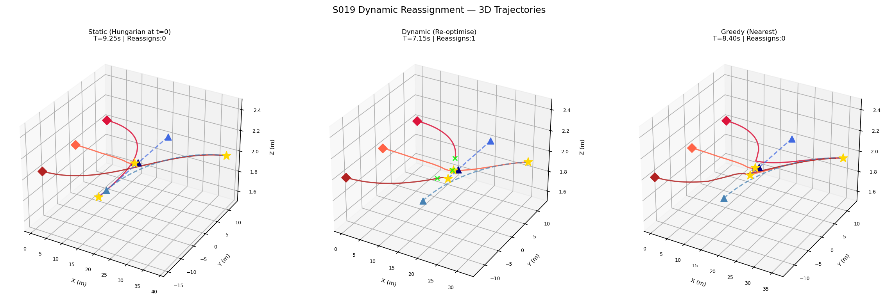
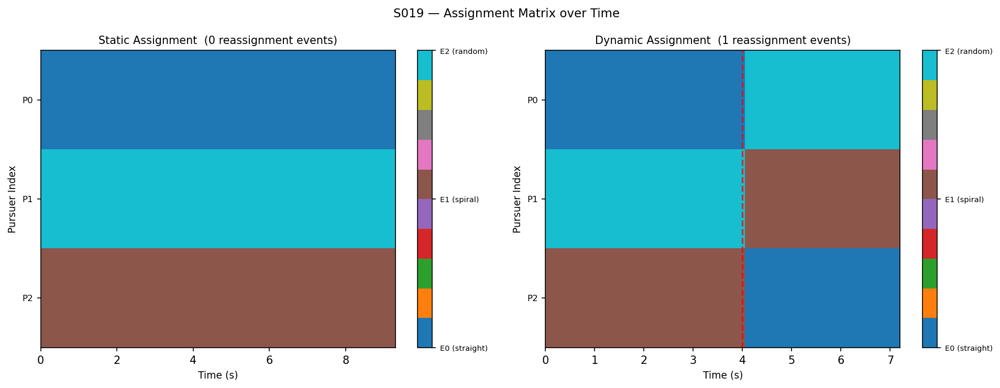
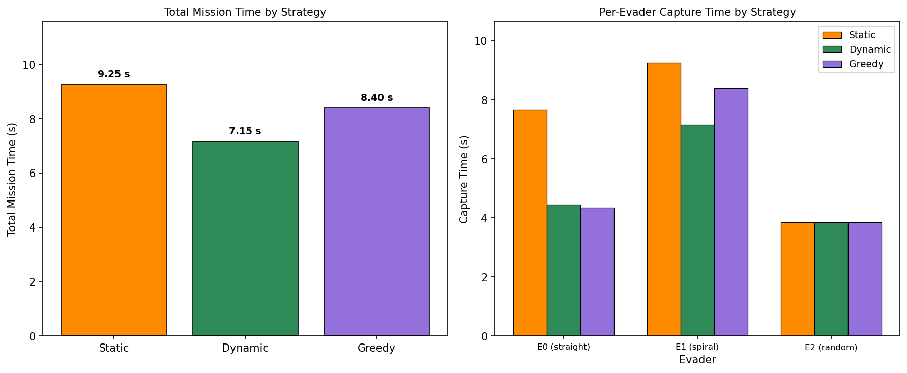
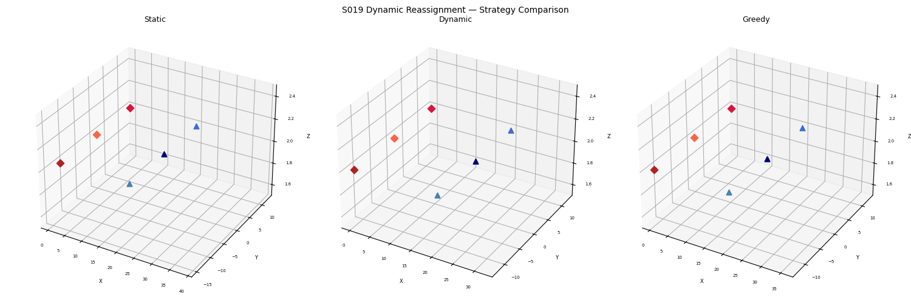

# S019 Dynamic Target Reassignment

**Domain**: Pursuit & Evasion | **Difficulty**: ⭐⭐⭐⭐ | **Status**: ✅ Completed

---

## Problem Definition

**Setup**: 3 pursuers vs 3 evaders with mixed evasion strategies. An initial optimal assignment is computed using the Hungarian algorithm. Every T_CHECK = 1 s the assignment is re-evaluated; if the improvement in total estimated intercept time exceeds the switching cost DC_SWITCH = 0.5 s, the pursuers are reassigned.

**Evader strategies**:
- **E0 (straight)**: runs in a fixed direction (downward), moving toward another pursuer's zone
- **E1 (spiral)**: sweeps upward with a slowly curving trajectory, crossing into a different pursuer's zone
- **E2 (random)**: random walk — unpredictable, creates secondary assignment pressure

**Three strategies compared**:
1. **Static** — Hungarian assignment at t = 0, never updated
2. **Dynamic** — re-optimise every T_CHECK seconds; update only if improvement > DC_SWITCH
3. **Greedy** — each pursuer always chases its nearest evader (no global coordination)

**Key question**: How much mission time does periodic global re-optimisation save compared to a fixed initial assignment, when evaders move unpredictably?

---

## Mathematical Model

**Cost matrix** (time-to-intercept estimate for pursuer $i$ vs evader $j$):

$$C[i,j] = \frac{\|\mathbf{p}_{P_i} - \mathbf{p}_{E_j}\|}{v_P}$$

**Hungarian algorithm** (optimal assignment):

$$\sigma^* = \arg\min_{\sigma \in S_M} \sum_i C[i, \sigma(i)]$$

**Reassignment condition** — switch only when improvement exceeds switching cost:

$$\text{improvement} = \sum_i C[i, \sigma_{\text{current}}(i)] - \sum_i C[i, \sigma^*_{\text{new}}(i)]$$

$$\text{Reassign if: } \text{improvement} > \Delta C_{\text{switch}}$$

---

## Key Parameters

| Parameter | Value |
|-----------|-------|
| Pursuers (M) | 3 |
| Evaders (N) | 3 |
| Pursuer speed | 5.0 m/s |
| Evader speed | 3.5 m/s |
| Capture radius | 0.30 m |
| Timestep DT | 0.05 s |
| Reassignment check period T_CHECK | 1.0 s |
| Switching cost DC_SWITCH | 0.5 s |
| Max simulation time | 120.0 s |
| Evader strategies | straight, spiral, random |

---

## Implementation

```
src/01_pursuit_evasion/s019_dynamic_reassignment.py
```

```bash
conda activate drones
python src/01_pursuit_evasion/s019_dynamic_reassignment.py
```

---

## Results

| Metric | Value |
|--------|-------|
| Static total mission time | 9.25 s |
| Dynamic total mission time | 7.15 s |
| Greedy total mission time | 8.40 s |
| Dynamic improvement vs Static | +22.7% |
| Dynamic improvement vs Greedy | +14.9% |
| Dynamic reassignment events | 1 |
| Static E0 capture time | 7.65 s |
| Static E1 capture time | 9.25 s |
| Dynamic E0 capture time | 4.45 s |
| Dynamic E1 capture time | 7.15 s |
| E2 capture time (all strategies) | 3.85 s |

**Key Findings**:

- **Dynamic reassignment saves 22.7% of total mission time over static**: E0 and E1 swap zones mid-flight (E0 runs downward, E1 spirals upward). Static keeps P0 chasing E0 further downward while P1 laboriously pursues E1 upward; both pursuer-evader pairs are mismatched. Dynamic detects that P1 is now closer to E0 (which crossed to P1's zone) and P0 is closer to E1 (which is spiraling into P0's zone) — it reassigns once and both captures complete much sooner.

- **The DC_SWITCH threshold prevents oscillation**: without the switching cost gate, the Hungarian algorithm would reassign at nearly every timestep as pursuers close in and distances fluctuate. The threshold of 0.5 s ensures only genuinely profitable reassignments are enacted, keeping assignment stable once the match is close.

- **Greedy is better than Static but worse than Dynamic**: greedy adapts instantly to proximity at each step and captures E0 quickly (4.35 s vs 7.65 s), but its lack of global coordination means it wastes P1 on a sub-optimal chase for E1. Dynamic's one well-timed global reassignment outperforms greedy's myopic per-step decisions.

**3D trajectory comparison — Static vs Dynamic vs Greedy**:



**Assignment matrix over time — Static (left) vs Dynamic (right)**:



**Per-strategy capture time comparison**:



**Animation**:



---

## Extensions

1. Auction algorithm — decentralised, scalable alternative to Hungarian
2. Market-based assignment: pursuers bid for evaders based on expected capture value
3. RL policy for reassignment decisions (replace rule-based switching cost)

---

## Related Scenarios

- Prerequisites: [S011](../../scenarios/01_pursuit_evasion/S011_swarm_encirclement.md), [S017](../../scenarios/01_pursuit_evasion/S017_swarm_vs_swarm.md)
- Follow-ups: [S020](../../scenarios/01_pursuit_evasion/S020_pursuit_evasion_game.md)
