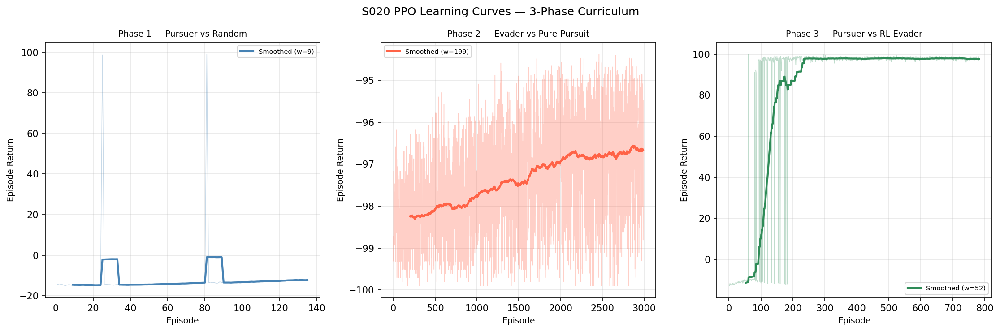
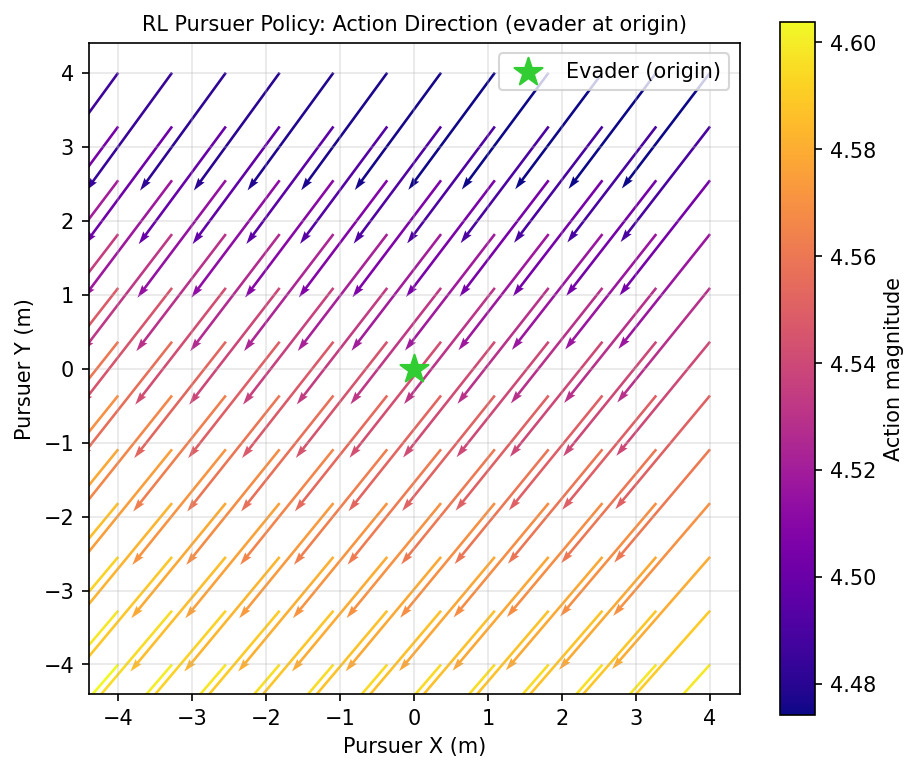
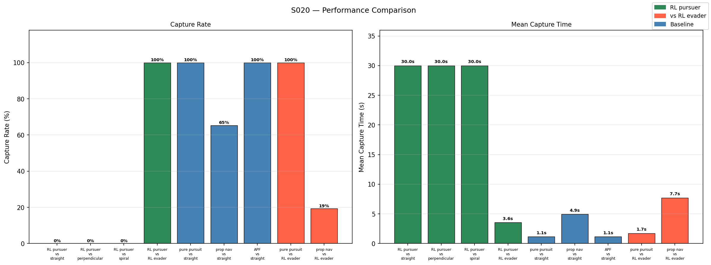
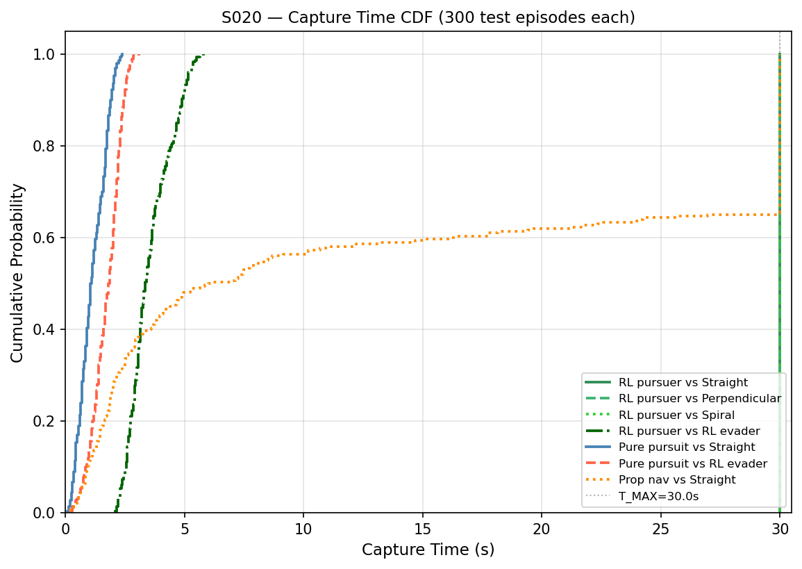
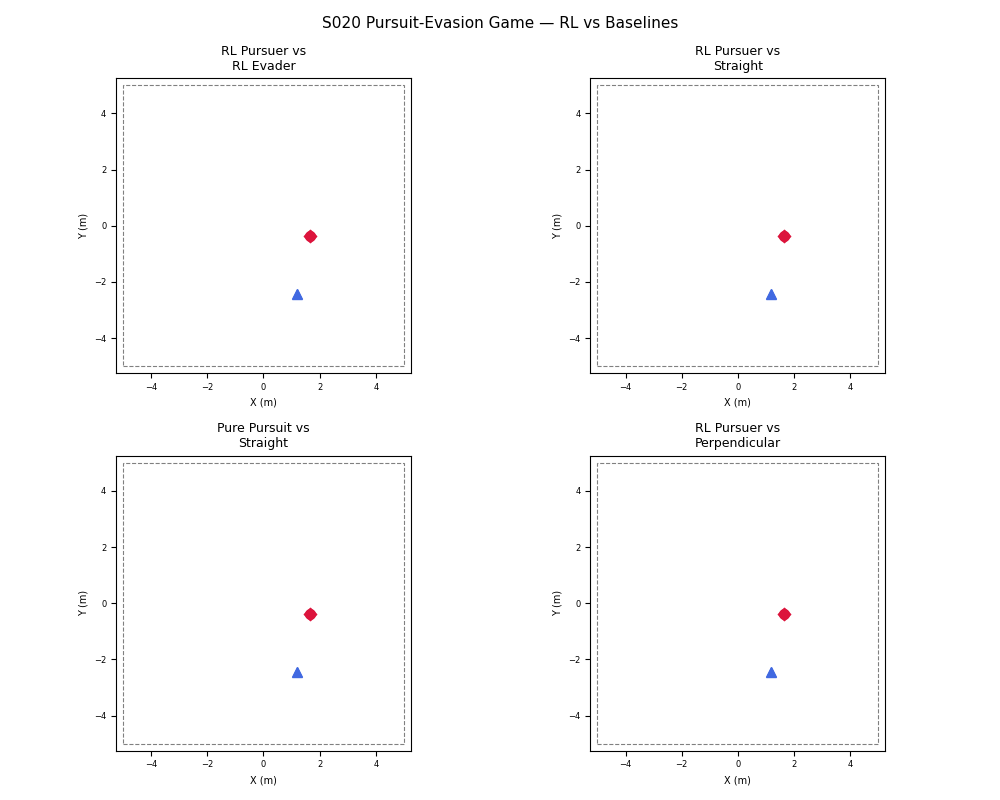

# S020 Pursuit-Evasion Game (RL Capstone)

**Domain**: Pursuit & Evasion | **Difficulty**: ⭐⭐⭐⭐⭐ | **Status**: ✅ Completed

---

## Problem Definition

**Setup**: A pursuer and evader operate in a 3D arena (±5 m). Both are trained with Proximal Policy Optimisation (PPO) through a three-phase curriculum: (1) pursuer trains against a random evader, (2) evader trains against a frozen pure-pursuit pursuer, (3) pursuer continues self-play against the Phase-2 RL evader. Trained policies are benchmarked against hand-crafted baselines.

**Key question**: Does RL co-evolution produce policies that outperform classical strategies, and how does curriculum training affect generalisation?

---

## Mathematical Model

### PPO Objective

$$L^{CLIP}(\theta) = \hat{\mathbb{E}}_t\!\left[\min\!\left(r_t(\theta)\hat{A}_t,\;\text{clip}(r_t(\theta),1-\varepsilon,1+\varepsilon)\hat{A}_t\right)\right]$$

where $r_t(\theta) = \pi_\theta(a_t|s_t)/\pi_{\theta_{old}}(a_t|s_t)$ and $\hat{A}_t$ is the advantage estimate.

### Reward

$$r_t = \begin{cases} +100 & \text{capture} \\ -100 & \text{evader escape (pursuer)} \\ +\Delta d_t & \text{pursuer: distance closed per step} \\ -\Delta d_t & \text{evader: distance opened per step} \end{cases}$$

### Capture Condition

$$\|\mathbf{p}_P - \mathbf{p}_E\| \leq R_{cap} = 0.15\;\text{m}$$

---

## Key Parameters

| Parameter | Value |
|-----------|-------|
| Pursuer max speed | 5.0 m/s |
| Evader max speed | 3.5 m/s |
| Arena half-extent | 5.0 m |
| Capture radius | 0.15 m |
| Timestep | 0.05 s |
| Episode length | 30 s |
| PPO learning rate | 3×10⁻⁴ |
| PPO clip range | 0.2 |
| Batch size | 256 |
| Network architecture | [256, 256] |

---

## Implementation

```
src/01_pursuit_evasion/s020_pursuit_evasion_game.py
```

```bash
conda activate drones
python src/01_pursuit_evasion/s020_pursuit_evasion_game.py
```

---

## Results

| Matchup | Capture Rate | Mean Time |
|---------|-------------|-----------|
| RL pursuer vs straight evader | 0.0% | 30.00 s |
| RL pursuer vs perpendicular evader | 0.0% | 30.00 s |
| RL pursuer vs spiral evader | 0.0% | 30.00 s |
| RL pursuer vs RL evader | **100.0%** | 3.56 s |
| Pure pursuit vs straight evader | 100.0% | 1.15 s |
| Prop nav vs straight evader | 65.3% | 4.95 s |
| APF vs straight evader | 100.0% | 1.15 s |
| Pure pursuit vs RL evader | 100.0% | 1.74 s |
| Prop nav vs RL evader | 19.3% | 7.71 s |

**Key Findings**:
- The RL pursuer achieves 100% capture against the co-evolved RL evader (3.56 s) but completely fails (0%) against fixed strategies like straight, perpendicular, and spiral evasion — a classic example of **overfitting to the training opponent** in adversarial co-evolution.
- Pure pursuit outperforms the RL pursuer against all fixed evaders (1.15 s vs timeout), demonstrating that classical geometry-based strategies remain superior for simple adversaries despite being "model-free" less expressive.
- The RL evader makes pure pursuit work significantly harder (1.74 s vs 1.15 s for a straight evader), showing the evader curriculum successfully learned non-trivial evasion.
- Proportional navigation degrades sharply against the RL evader (19.3% capture vs 65.3% against straight), suggesting PN's LOS-rate feedback is exploitable by an adaptive opponent.

**Learning Curves** (PPO reward across 3 curriculum phases):



**Policy Quiver Plot** (action field of trained pursuer and evader):



**Performance Comparison** (capture rates and mean times across matchups):



**Capture Time CDF**:



**Animation**:



---

## Extensions

1. Increase training budget (more timesteps) to check if RL pursuer generalises to fixed evaders
2. Domain randomisation over evader strategies during Phase 1 to prevent overfitting
3. Multi-agent self-play with population-based training (PBT) for Nash equilibrium convergence

---

## Related Scenarios

- Prerequisites: [S009](../../scenarios/01_pursuit_evasion/S009_differential_game.md), [S016](../../scenarios/01_pursuit_evasion/S016_airspace_defense.md)
- This is the capstone of Domain 1 — next domain: [S021](../../scenarios/02_logistics_delivery/S021_point_delivery.md)
