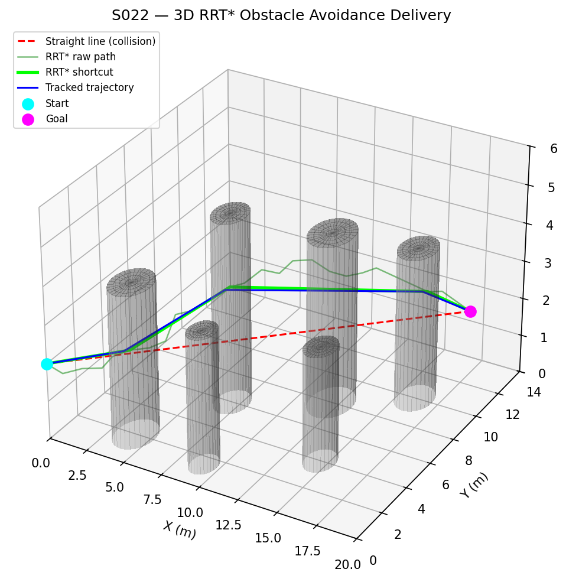
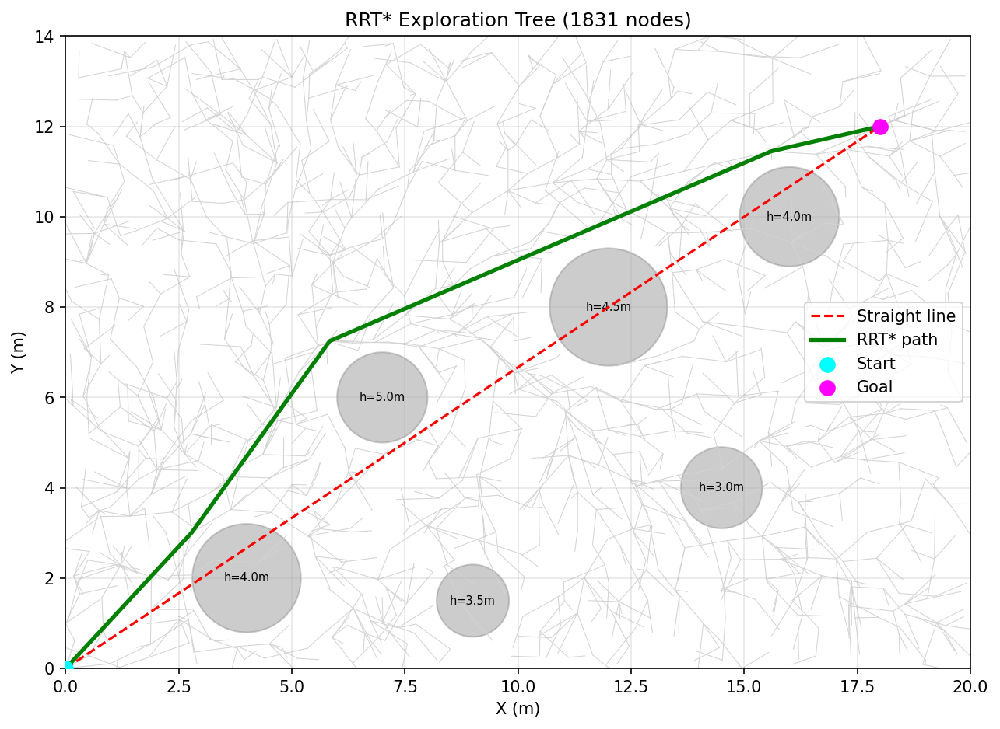
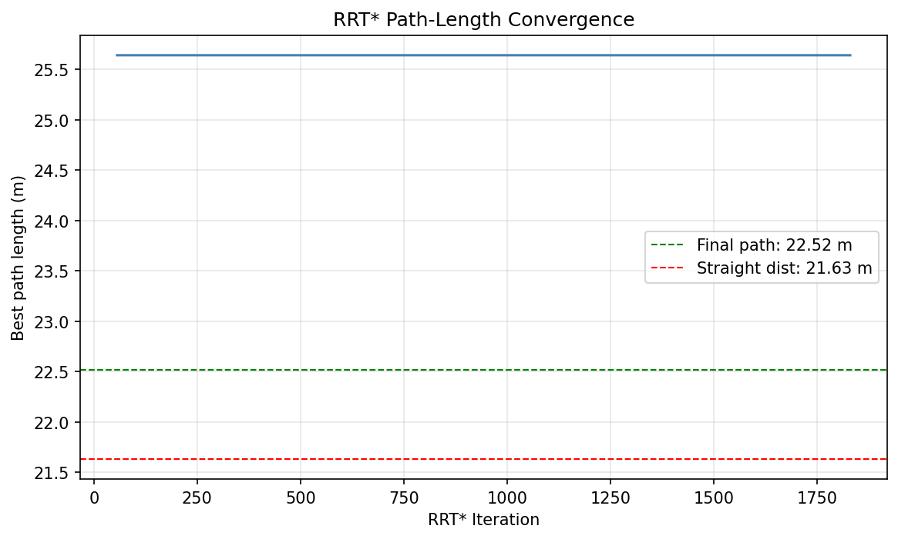
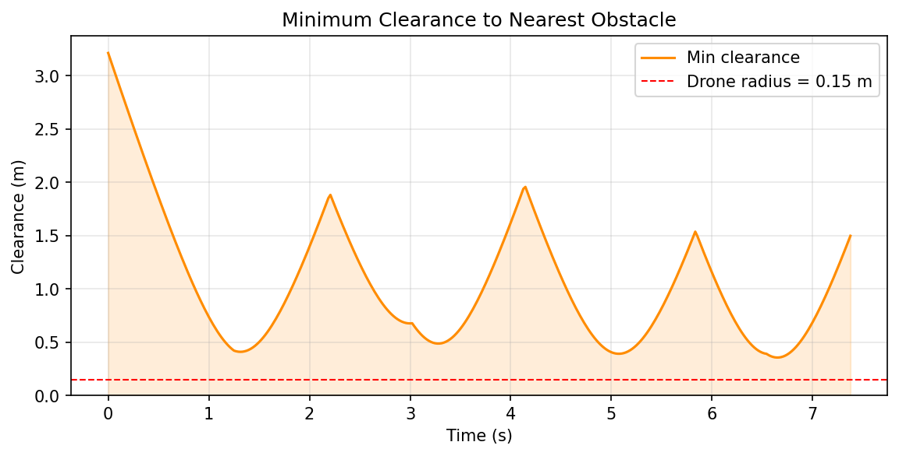
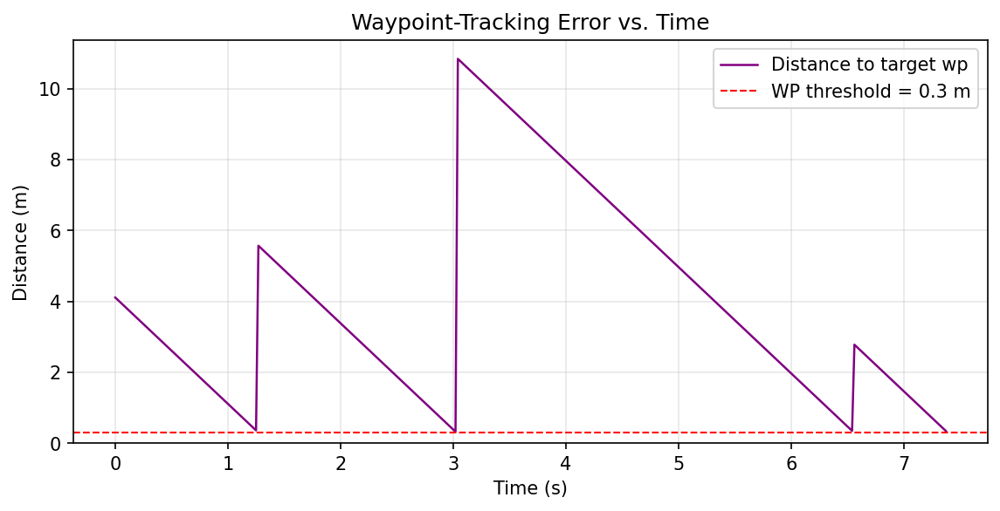
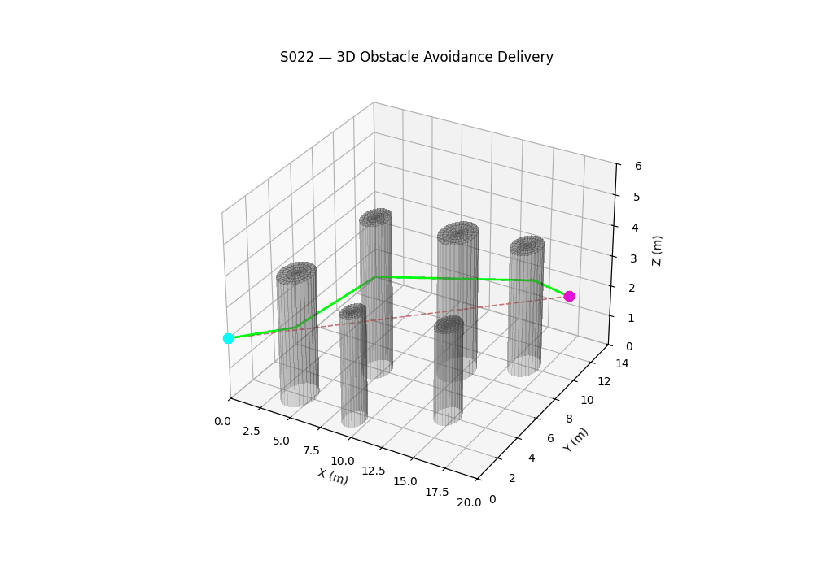

# S022 3D Obstacle Avoidance Delivery

**Domain**: Logistics & Delivery | **Status**: ✅ Completed

---

## Problem Definition

3D RRT* path planning with finite-height cylindrical obstacles. Drone navigates from (0,0,2) to (10,10,8) m — can fly over short obstacles or around tall ones.

---

## Simulation Results

**3D Path**:

**RRT Tree**:

**Path Convergence**:

**Obstacle Clearance**:

**Tracking Error**:

**Animation**:

---

## Related Scenarios

- Original: [S022](../../../../scenarios/02_logistics_delivery/S022_obstacle_avoidance_delivery.md)
