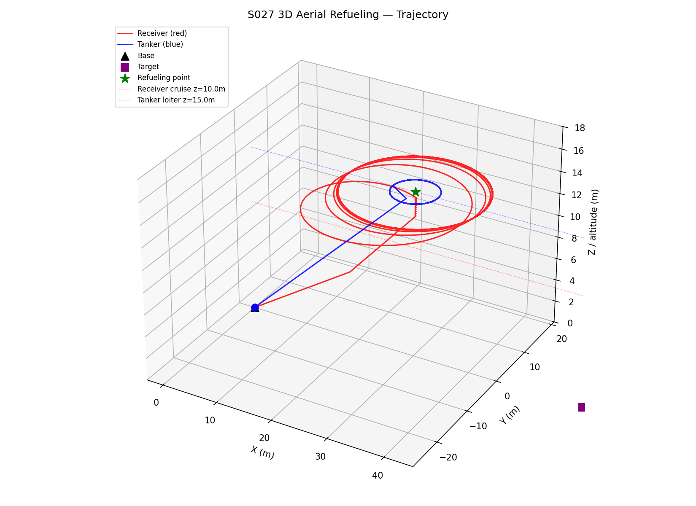
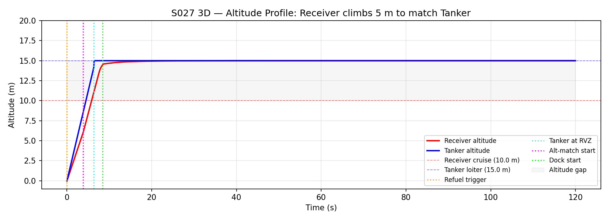
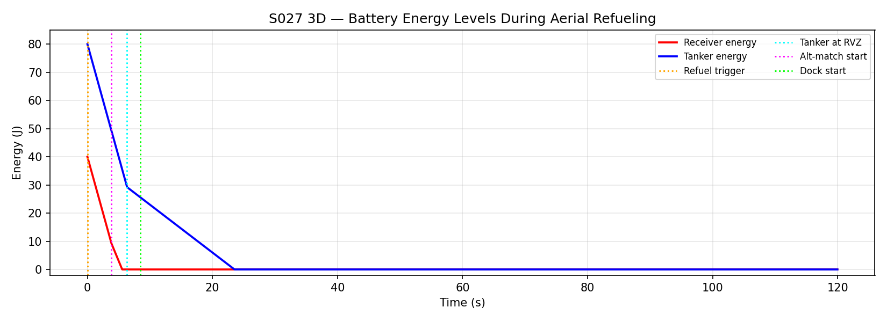

# S027 3D Aerial Refueling Relay

**Domain**: Logistics & Delivery | **Difficulty**: ⭐⭐⭐ | **Status**: ✅ Completed

---

## Problem Definition

Two drones operate in 3D space: a low-battery Receiver at 10 m altitude and a Tanker at 15 m. The Receiver must rendezvous with the Tanker — requiring altitude matching and 3D position matching — before energy runs out. After docking, the Receiver resumes its 3D waypoint mission.

---

## Key Parameters

| Parameter | Value |
|-----------|-------|
| Receiver start altitude | 10 m |
| Tanker altitude | 15 m |
| Simulation duration | 120 s |
| Docking tolerance | 0.5 m |

---

## Simulation Results

| Metric | Value |
|--------|-------|
| Dock success | False |
| Tanker at RVZ | 6.4 s |
| Altitude match start | 3.8 s |
| Docking start | 8.5 s |
| Altitude gap at RVZ | 5.0 m (10 → 15 m) |

**3D Trajectory**:

**Altitude Profile**:

**Energy Levels**:

**Animation**:

---

## Related Scenarios

- Original: [S027 Aerial Refueling Relay](../../../scenarios/02_logistics_delivery/S027_aerial_refueling_relay.md)
