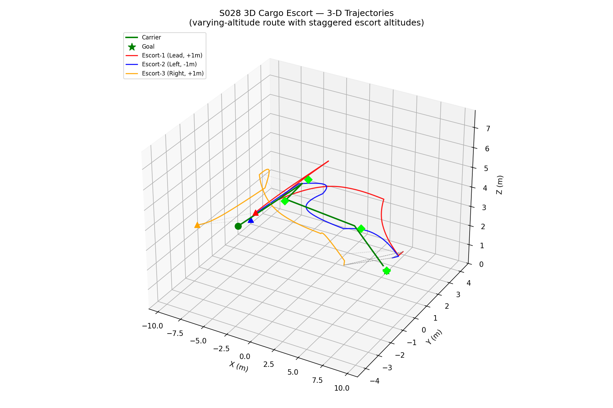
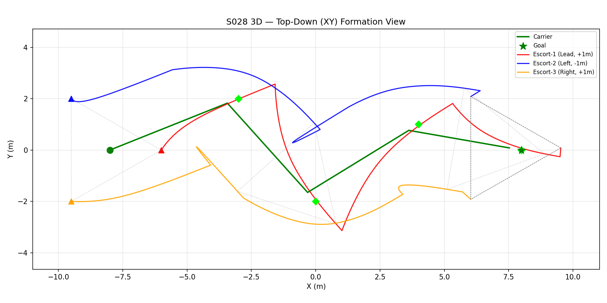
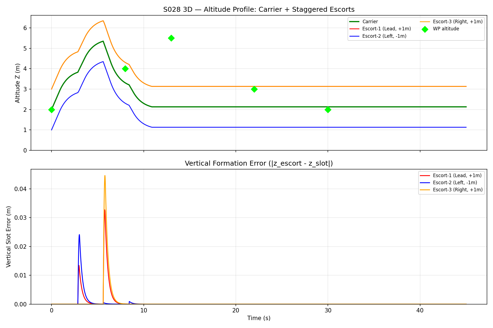
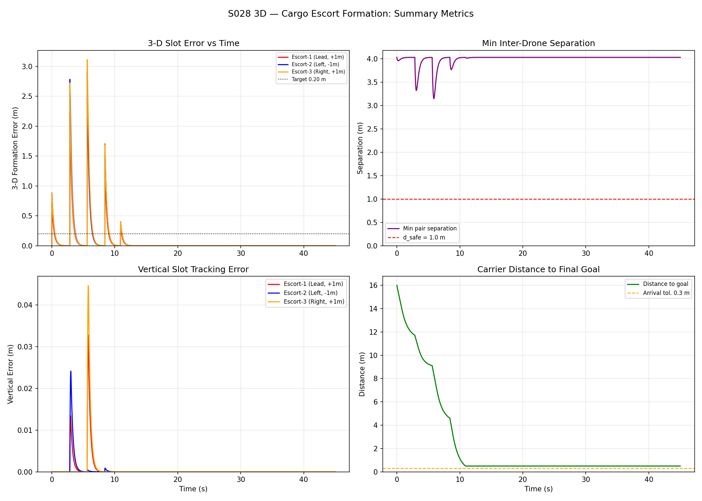
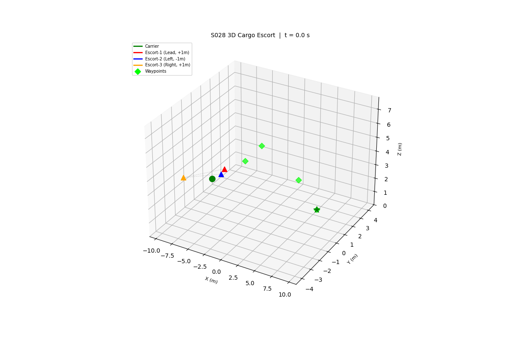

# S028 3D Cargo Escort Formation

**Domain**: Logistics & Delivery | **Status**: ✅ Completed

---

## Problem Definition

Cargo drone flies 3D waypoint mission with varying altitude. Four escort drones maintain a 3D diamond formation, dynamically adjusting as cargo drone climbs/descends.

---

## Simulation Results

**3D Trajectory**:

**Top-down XY view**:

**Altitude Profile**:

**Formation Metrics**:

**Animation**:

---

## Related Scenarios

- Original: [S028](../../../../scenarios/02_logistics_delivery/S028_cargo_escort_formation.md)
