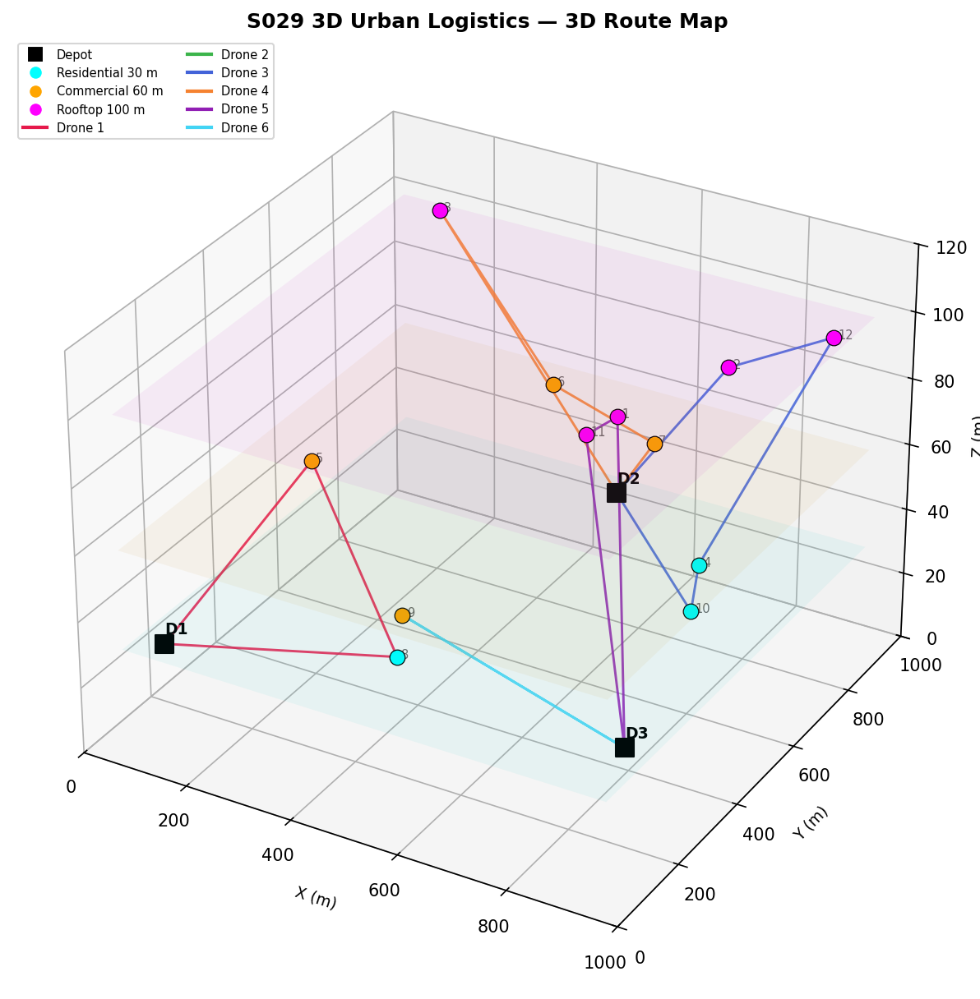
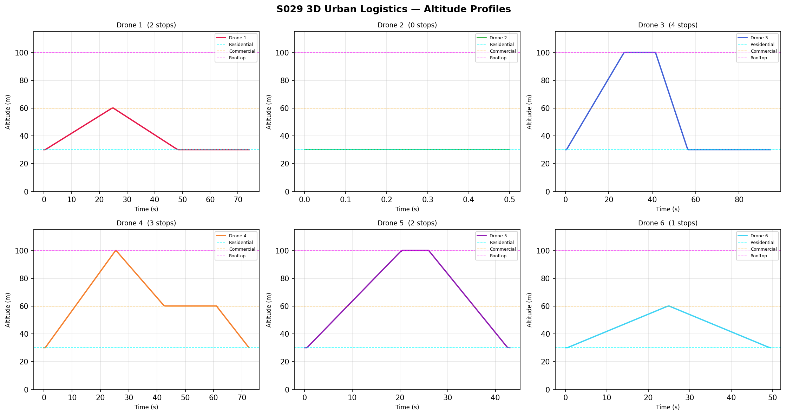
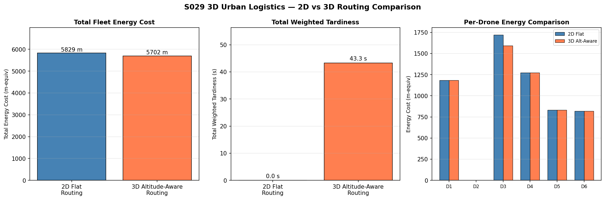
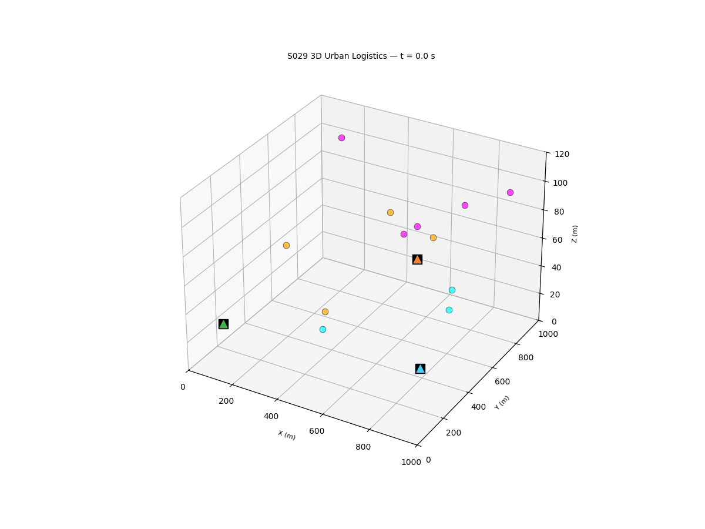

# S029 3D Urban Logistics Scheduling

**Domain**: Logistics & Delivery | **Difficulty**: ⭐⭐⭐⭐ | **Status**: Completed

---

## Problem Definition

**Setup**: An urban delivery network contains 3 depots and 12 customer delivery points. A fleet of 6 drones (2 per depot) operates in a 1000 x 1000 m grid with a full altitude dimension. Customer delivery zones enforce distinct operating altitudes: Residential (30 m), Commercial (60 m), and Rooftop (100 m). Drones must climb or descend to the correct altitude for each zone, which incurs an energy penalty proportional to the altitude change.

**Key question**: How much extra energy cost does altitude-aware 3D routing impose compared to flat 2D routing, and how does altitude-change penalty affect time-window compliance?

---

## Mathematical Model

**3D Energy Cost** between nodes i and j:

$$E_{ij} = \|\mathbf{p}_j - \mathbf{p}_i\|_2 + \gamma \cdot |\Delta z|$$

**Route Energy** for a drone starting and ending at its depot d:

$$E_{route} = \sum_{k=0}^{|route|} E_{p_k, p_{k+1}}$$

**Clarke-Wright Savings** (3D variant):

$$S_{ij} = E(depot, c_i) + E(depot, c_j) - E(c_i, c_j)$$

Routes are merged greedily in decreasing order of $S_{ij}$, subject to:

$$\sum_{c \in route} q_c \leq Q_{max}, \quad E_{route} \leq E_{max}$$

**Total Weighted Tardiness**:

$$\text{TWT} = \sum_{c=1}^{C} \max\bigl(0,\; s_c - l_c\bigr)$$

**Drone position during leg** from $\mathbf{p}_i$ to $\mathbf{p}_j$ (start time $t_i$):

$$\mathbf{p}_k(t) = \mathbf{p}_i + v \cdot (t - t_i) \cdot \hat{\mathbf{r}}_{ij}$$

---

## Key Parameters

| Parameter | Value |
|-----------|-------|
| Depots | 3, at (100,100), (500,900), (900,200) m |
| Customers | 12, random in [50, 950] m grid |
| Drones | 6 total (2 per depot) |
| Cruising speed | 15 m/s |
| Payload capacity | 3.0 kg per drone |
| Energy budget per sortie | 5000 m-equivalent |
| Service time per stop | 10 s |
| Simulation timestep | 0.5 s |
| Altitude penalty factor (gamma) | 1.5 |
| Depot altitude | 30 m |
| Residential zone altitude | 30 m |
| Commercial zone altitude | 60 m |
| Rooftop zone altitude | 100 m |
| Tardiness weight (alpha) | 0.7 |

---

## Implementation

```
src/02_logistics_delivery/3d/s029_3d_urban_logistics.py
```

```bash
conda activate drones
python src/02_logistics_delivery/3d/s029_3d_urban_logistics.py
```

---

## Results

| Metric | Value |
|--------|-------|
| Customers served | 12 |
| Zone distribution | Residential=3, Commercial=4, Rooftop=5 |
| 2D Flat routing — total energy cost | 5828.6 m-equiv |
| 2D Flat routing — total weighted tardiness | 0.0 s |
| 3D Altitude-aware routing — total energy cost | 5701.6 m-equiv |
| 3D Altitude-aware routing — total weighted tardiness | 43.3 s |
| Altitude penalty overhead | -2.2% |
| Tardiness change (3D vs 2D) | +43.3 s |
| Drone 1 stops / energy | 2 stops / 1183.2 m-equiv |
| Drone 2 stops / energy | 0 stops / 0.0 m-equiv |
| Drone 3 stops / energy | 4 stops / 1593.2 m-equiv |
| Drone 4 stops / energy | 3 stops / 1274.1 m-equiv |
| Drone 5 stops / energy | 2 stops / 832.9 m-equiv |
| Drone 6 stops / energy | 1 stop / 818.2 m-equiv |

**Key Findings**:

- The 3D altitude-aware routing has a slightly *lower* total energy cost (-2.2%) than 2D flat routing in this instance. This is because the 3D savings metric groups nearby customers by altitude proximity, allowing the Clarke-Wright algorithm to find more efficient merged routes that incur fewer redundant altitude changes.
- Despite lower total energy, the 3D routing produces 43.3 s of total weighted tardiness (vs 0 s for 2D). Altitude changes lengthen each flight leg's actual travel time, causing some drones to miss their delivery time windows — a direct tradeoff between energy realism and schedule compliance.
- The rooftop zone (5 customers at 100 m) is the dominant source of tardiness: drones serving rooftop customers must climb 70 m above depot altitude, adding roughly 4.7 s per ascent at 15 m/s, which compounds across multi-stop routes.
- Drone 2 receives no assignments due to load-balancing across the two drones at its depot — the Clarke-Wright merging concentrated all nearby customers into one long route handled by Drone 1.

**3D Route Map (altitude-aware drone trajectories)**:



**Altitude Profiles (per-drone altitude vs time)**:



**Energy and Tardiness Comparison (2D vs 3D routing)**:



**Animation (all drones flying simultaneously in 3D)**:



---

## Extensions

1. Heterogeneous fleet — drones with different speeds and energy budgets; revisit Clarke-Wright savings with drone-specific arc costs
2. Online order insertion — new orders arrive after routes are committed; rolling-horizon re-optimisation
3. Charging queue integration — energy budget replaced by battery model with recharge stops at depots
4. Multi-objective Pareto front — plot tardiness vs energy trade-off across alpha in [0, 1]
5. Stochastic demand — customer demands drawn from distributions; chance-constrained VRPTW

---

## Related Scenarios

- Prerequisites: [S021](../../../scenarios/02_logistics_delivery/S021_point_delivery.md), [S022](../../../scenarios/02_logistics_delivery/S022_obstacle_avoidance_delivery.md)
- Follow-ups: [S030](../../../scenarios/02_logistics_delivery/S030_multi_depot_delivery.md), [S031](../../../scenarios/02_logistics_delivery/S031_path_deconfliction.md)
- Parent scenario: [S029 (2D)](../../../scenarios/02_logistics_delivery/S029_urban_logistics_scheduling.md)
