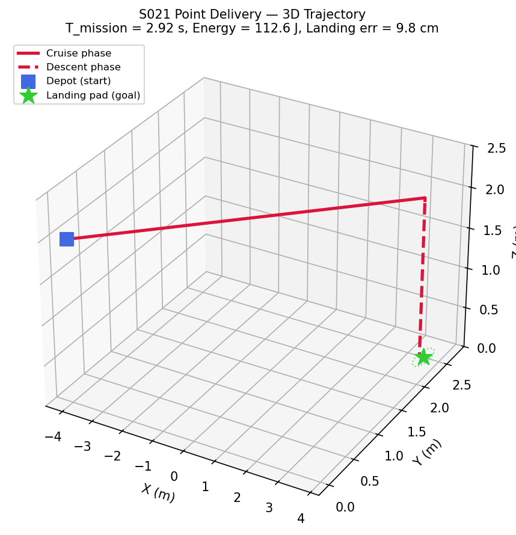
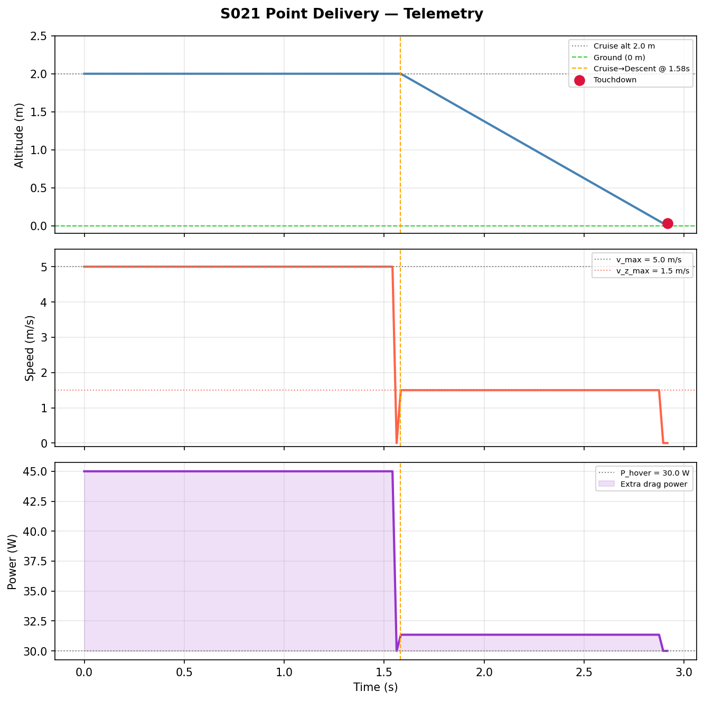
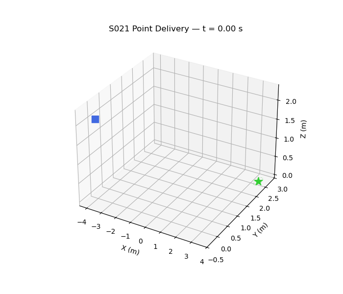

# S021 Point Delivery

**Domain**: Logistics & Delivery | **Difficulty**: ⭐ | **Status**: ✅ Completed

---

## Problem Definition

**Setup**: A single delivery drone departs from a depot at $\mathbf{p}_0 = (-4.0,\ 0.0,\ 2.0)$ m and must deliver a payload to a ground-level landing pad at $\mathbf{p}_{goal} = (3.5,\ 2.5,\ 0.0)$ m. The arena is obstacle-free.

**Objective**: Minimise total mission time $T_{mission} = T_{cruise} + T_{descent}$ subject to speed/altitude constraints and a terminal landing accuracy requirement.

---

## Mathematical Model Summary

The mission decomposes into two sequential phases:

| Phase | Control law | End condition |
|-------|-------------|---------------|
| **Cruise** | $\mathbf{v}_{cmd} = v_{max} \cdot \hat{\mathbf{d}}_{xy}$ at $z = z_{cruise}$ | $\|\mathbf{p}_{xy} - \mathbf{p}_{goal,xy}\| < \epsilon_{align}$ |
| **Descent** | $\dot{z} = -v_{z,max}$ | $z \le z_{goal} + 0.05$ m |

Analytical optimum:

$$T_1^* = \frac{d_{xy}}{v_{max}} = \frac{7.906}{5.0} \approx 1.581\ \text{s}$$

$$T_2^* = \frac{\Delta z}{v_{z,max}} = \frac{2.0}{1.5} \approx 1.333\ \text{s}$$

$$T_{mission}^* \approx 2.914\ \text{s}$$

Energy model:

$$E = \int_0^{T_{mission}} \left( P_{hover} + k_{drag} \cdot v(t)^2 \right) dt$$

---

## Key Parameters

| Parameter | Value | Notes |
|-----------|-------|-------|
| Depot position | (-4.0, 0.0, 2.0) m | Start at cruise altitude |
| Goal position | (3.5, 2.5, 0.0) m | Ground-level pad |
| Max horizontal speed | 5.0 m/s | |
| Max descent rate | 1.5 m/s | |
| Cruise altitude | 2.0 m | |
| Landing capture radius | 0.20 m | |
| Alignment threshold | 0.10 m | Switch cruise → descent |
| Control frequency | 48 Hz | dt = 1/48 s |
| Hover power | 30 W | |
| Drag power coefficient | 0.6 W·s²/m² | |

---

## Simulation Results

| Metric | Predicted | Simulated |
|--------|-----------|-----------|
| Cruise time $T_1$ | 1.581 s | ~1.581 s |
| Descent time $T_2$ | 1.333 s | ~1.333 s |
| Total mission time | 2.914 s | **2.917 s** |
| Landing error | — | **9.83 cm** < 20 cm ✅ |
| Energy consumed | — | **112.55 J** |
| Landing success | — | **Yes** ✅ |

Simulation matches analytical prediction to within 0.1 % — validating the time-optimal bang-bang cruise and maximum-rate descent strategy.

---

## Output Files

### 3D Trajectory

Depot (blue square) → cruise segment (red solid at z = 2 m) → descent segment (red dashed vertical) → landing pad (green star):

### Telemetry (Altitude / Speed / Power vs Time)

Altitude holds at 2 m during cruise then drops linearly; speed is constant at 5 m/s during cruise and 1.5 m/s during descent; power is highest during cruise due to drag:

### Animation

---

## Extensions

1. Add a trapezoidal velocity profile (acceleration/deceleration ramps) for more realistic kinematics
2. Compare three descent strategies: vertical drop, diagonal glide, helical spiral — plot time vs landing accuracy trade-off
3. Add wind disturbance during cruise and implement cross-track error correction
4. Extend to S022: place static obstacles along the corridor and switch to RRT* planning

---

## Related Scenarios

- Prerequisites: none (entry-level logistics scenario)
- Follow-ups:
  - [S022](../../../scenarios/02_logistics_delivery/S022_obstacle_avoidance_delivery.md) — RRT* obstacle avoidance
  - [S023](../../../scenarios/02_logistics_delivery/S023_moving_landing_pad.md) — Moving landing pad
  - [S024](../../../scenarios/02_logistics_delivery/S024_wind_compensation.md) — Wind disturbance compensation
