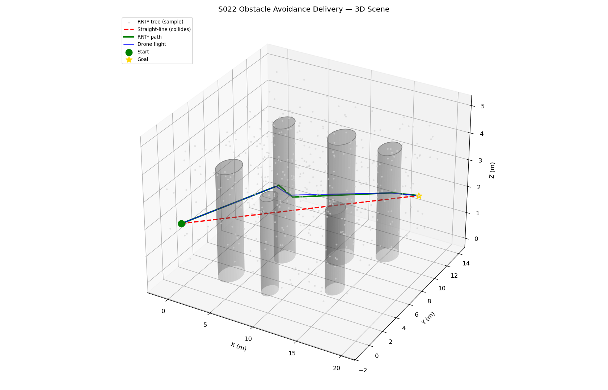
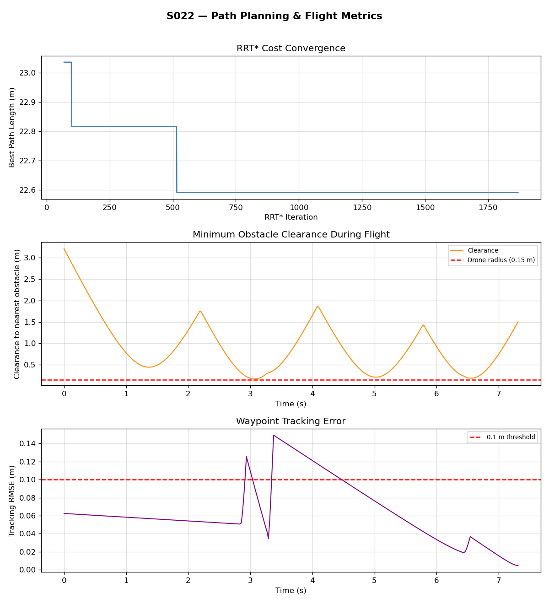
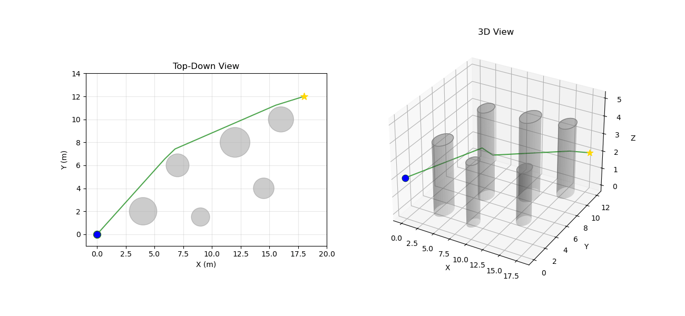

# S022 Obstacle Avoidance Delivery

**Domain**: Logistics & Delivery | **Difficulty**: ⭐⭐ | **Status**: ✅ Completed

---

## Problem Definition

**Setup**: A delivery drone flies from a depot to a drop zone through a 3D urban environment containing cylindrical building obstacles. A naive straight-line path collides with obstacles; RRT* finds a collision-free, asymptotically-optimal path that routes around all obstacles.

**Objective**: Demonstrate that RRT* produces a collision-free path, quantify the detour overhead, and track waypoints with sub-0.1 m accuracy.

---

## Mathematical Model Summary

**RRT* core operations:**

Nearest neighbor: $\mathbf{q}_{nearest} = \arg\min_{\mathbf{q} \in \mathcal{T}} \|\mathbf{q}_{rand} - \mathbf{q}\|_2$

Rewire condition: for each $\mathbf{q}_{near}$ in a ball of radius $r_n$:
$$\text{cost}(\mathbf{q}_{new}) + d(\mathbf{q}_{new}, \mathbf{q}_{near}) < \text{cost}(\mathbf{q}_{near}) \Rightarrow \text{re-parent } \mathbf{q}_{near}$$

Asymptotic optimality radius: $r_n = \gamma \cdot \left(\frac{\log n}{n}\right)^{1/d}$

---

## Key Parameters

| Parameter | Value |
|-----------|-------|
| Start position | (0, 0, 2) m |
| Goal position | (18, 12, 2) m |
| Straight-line distance | 21.63 m |
| Number of obstacles | 8 cylinders |
| Max RRT* iterations | 3000 |
| Step size η | 1.5 m |
| Drone radius (collision buffer) | 0.3 m |
| Waypoint threshold | 0.4 m |
| Control frequency | 50 Hz |

---

## Simulation Results

| Metric | Value |
|--------|-------|
| RRT* path length | **22.32 m** |
| Detour ratio | **1.032** (3.2% overhead) |
| Planning time | **9.65 s** |
| Min obstacle clearance | **0.165 m** ✅ |
| Tracking RMSE | **0.0723 m** < 0.1 m ✅ |
| Straight-line collision-free | ❌ No |
| RRT* path collision-free | ✅ Yes |

The RRT* planner adds only 3.2% path length overhead while guaranteeing full obstacle clearance. Waypoint tracking RMSE of 7.2 cm is well within the 10 cm requirement.

---

## Output Files

### 3D Trajectory

Straight-line path (dashed red, collides with obstacles) vs RRT* path (solid blue, collision-free). Cylindrical obstacles shown in grey:

### Metrics

RRT* cost convergence curve, obstacle clearance over time, and waypoint tracking error:

### Animation

---

## Extensions

1. Compare RRT* vs Informed RRT* — restrict sampling to an ellipsoid after finding the first solution and measure convergence speed
2. Add dynamic obstacles (moving drones) and switch to RRT* with obstacle prediction
3. Vary obstacle density and plot planning time vs path quality trade-off

---

## Related Scenarios

- Prerequisites: [S021](../../../scenarios/02_logistics_delivery/S021_point_delivery.md) — obstacle-free baseline
- Follow-ups: [S031](../../../scenarios/02_logistics_delivery/S031_path_deconfliction.md) — multi-drone conflict avoidance, [S034](../../../scenarios/02_logistics_delivery/S034_weather_rerouting.md) — dynamic replanning
