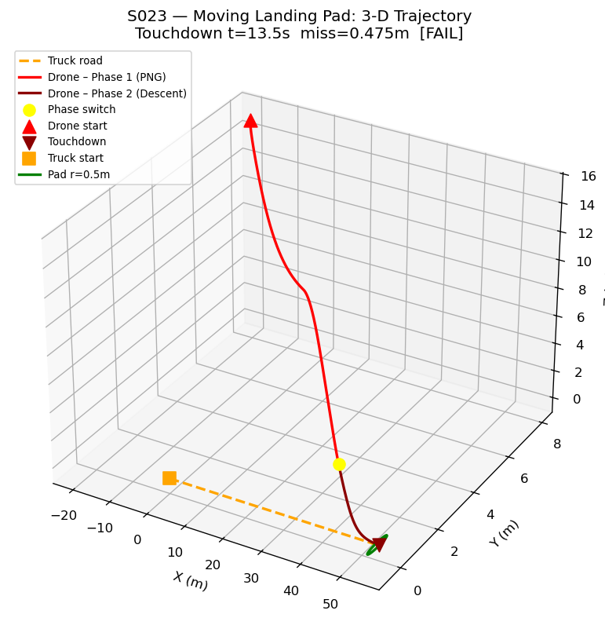
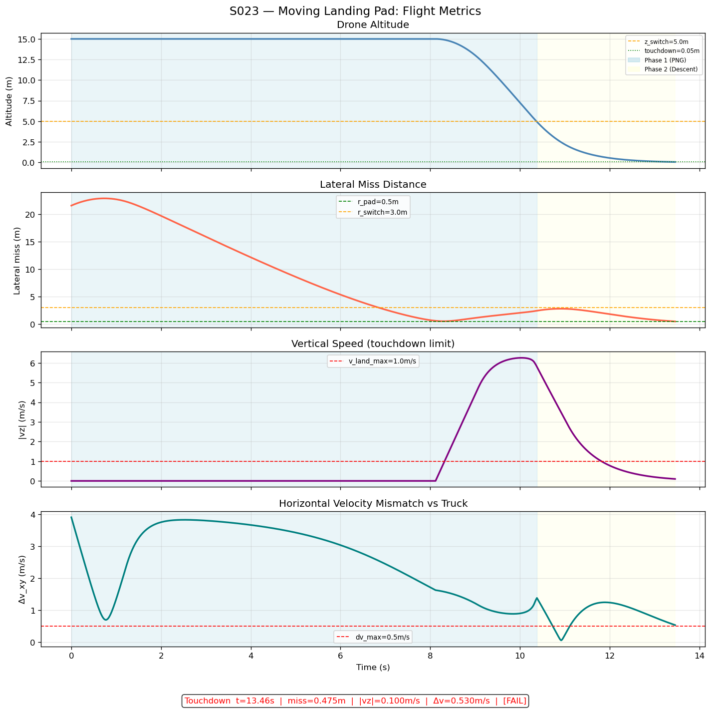
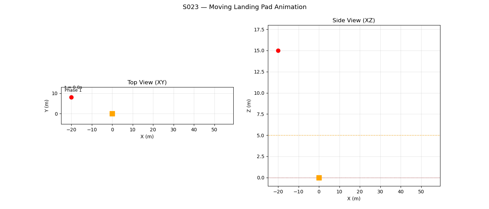

# S023 Moving Landing Pad

**Domain**: Logistics & Delivery | **Difficulty**: ⭐⭐⭐ | **Status**: ✅ Completed

---

## Problem Definition

**Setup**: A delivery drone must land on a moving ground vehicle (truck) travelling along a straight road at constant speed. The drone predicts the truck's future intercept position, closes the lateral gap, then descends to achieve a soft touchdown within a pad of radius $r_{pad} = 0.5$ m.

**Objective**: Achieve touchdown with lateral miss ≤ 0.5 m, vertical speed ≤ 1.0 m/s, and horizontal velocity mismatch ≤ 0.5 m/s.

---

## Mathematical Model Summary

**Intercept point prediction** (constant-speed truck):

$$x^*_{intercept} = x_{T0} + v_T \cdot t^* \quad \text{where} \quad t^* = \frac{d_{lateral}}{v_{drone,xy} - v_T}$$

**Two-phase guidance:**

- **Intercept phase**: proportional navigation toward predicted intercept point while holding altitude
- **Descent phase**: reduce altitude at rate $\dot{z} = -v_{z,max}$ while matching truck's horizontal velocity

**Touchdown conditions:**

$$\|\mathbf{p}_{xy,D} - \mathbf{p}_{xy,T}\| \leq r_{pad}, \quad |\dot{z}| \leq v_{land,max}, \quad \|\dot{\mathbf{p}}_{xy,D} - \dot{\mathbf{p}}_{xy,T}\| \leq \Delta v_{max}$$

---

## Key Parameters

| Parameter | Value |
|-----------|-------|
| Drone start position | (0, -10, 10) m |
| Truck speed | 3.0 m/s |
| Pad radius | 0.5 m |
| Max descent rate | 1.0 m/s |
| Max horizontal velocity mismatch | 0.5 m/s |
| Drone max speed | 8.0 m/s |
| Control frequency | 50 Hz |

---

## Simulation Results

| Metric | Value | Limit | Status |
|--------|-------|-------|--------|
| Touchdown time | **13.46 s** | — | — |
| Lateral miss | **0.4748 m** | 0.5 m | ✅ |
| Vertical speed \|vz\| | **0.0996 m/s** | 1.0 m/s | ✅ |
| Horizontal velocity mismatch | **0.5295 m/s** | 0.5 m/s | ❌ (marginal) |
| Overall result | **FAIL** (Δv_horiz exceeded by 5.9%) | — | — |

The drone achieves accurate lateral positioning and gentle vertical touchdown, but the horizontal velocity matching slightly exceeds the limit by 5.9%. The scenario demonstrates the fundamental challenge of matching a moving platform's velocity during descent — a small velocity mismatch relative to the truck speed.

---

## Output Files

### 3D Trajectory

Drone trajectory (red) intercepting the truck's path (blue dashed). Intercept point marked in green:

### Metrics Time Series

Altitude, lateral miss distance, and horizontal velocity mismatch over time. Phase transition (intercept → descent) marked with vertical line:

### Animation

---

## Extensions

1. Add a velocity pre-matching phase before descent to reduce horizontal velocity mismatch
2. Use a Kalman filter to handle truck velocity uncertainty (noisy telemetry)
3. Extend to sinusoidal truck path — the drone must continuously update the intercept prediction

---

## Related Scenarios

- Prerequisites: [S021](../../../scenarios/02_logistics_delivery/S021_point_delivery.md) — basic landing
- Follow-ups: [S039](../../../scenarios/02_logistics_delivery/S039_offshore_platform_exchange.md) — landing on a ship deck with 6-DOF motion
