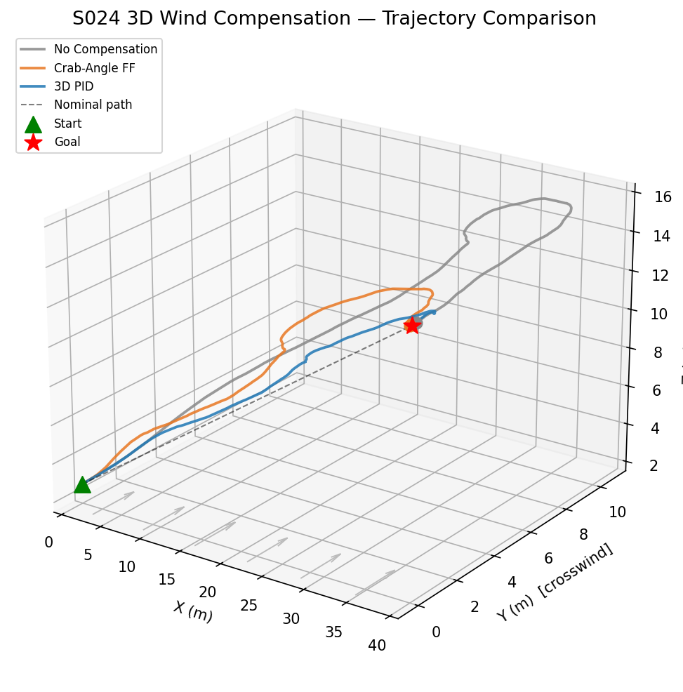
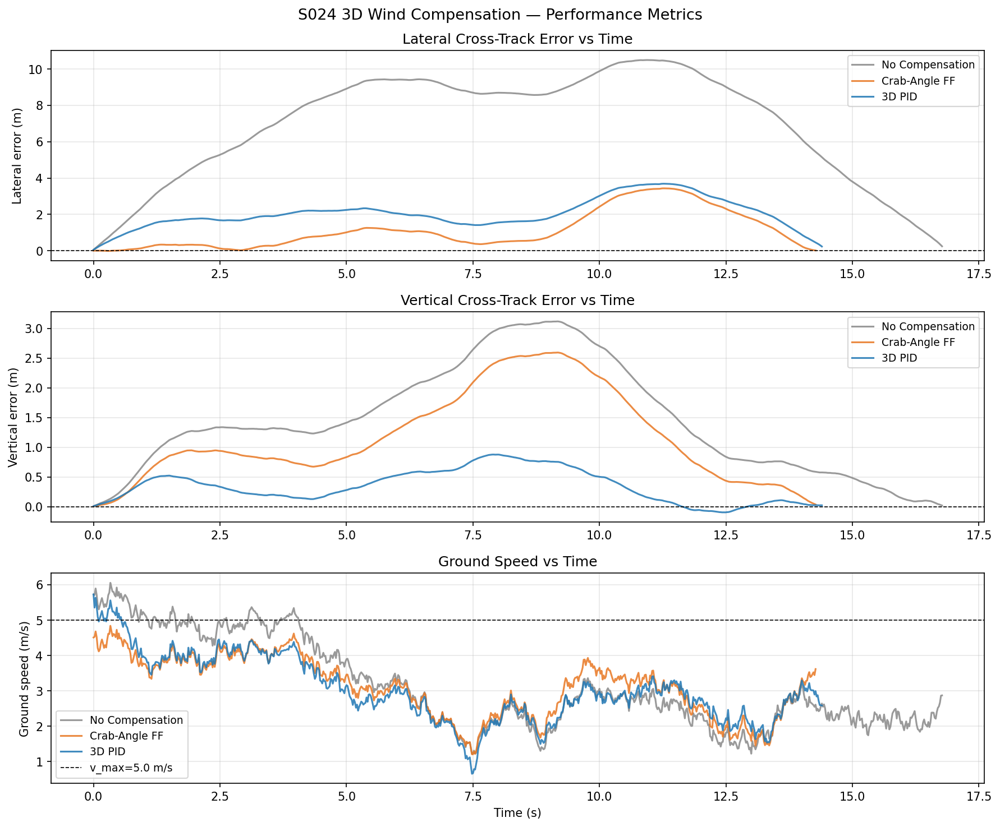
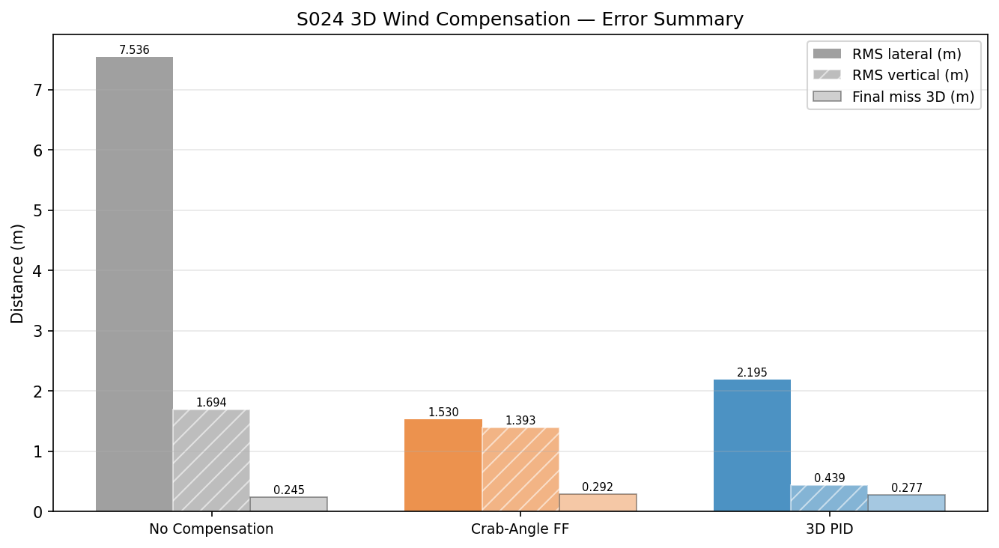
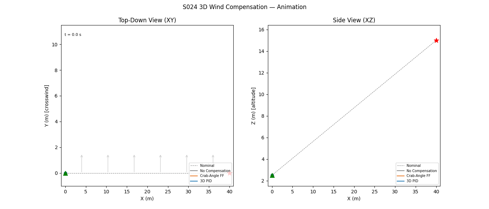

# S024 3D Wind Compensation

**Domain**: Logistics & Delivery | **Difficulty**: ⭐⭐ | **Status**: Completed

---

## Problem Definition

**Setup**: A delivery drone flies from a ground-level start (0, 0, 2.5 m) to a rooftop waypoint (40, 0, 15 m) in full 3D under a persistent crosswind field. The wind has both a horizontal crosswind component (+y, 2.5 m/s mean) and a small vertical updraft component (+z, 0.4 m/s mean), plus correlated Gauss-Markov gusts in all axes. Three guidance strategies are compared:

1. **No Compensation** — aim directly at the goal in 3D, ignore wind entirely
2. **Crab-Angle FF** — analytically correct horizontal heading to cancel mean horizontal crosswind; also pre-tilts the pitch to oppose the mean updraft
3. **3D PID** — closed-loop proportional-integral-derivative controller on both lateral and vertical cross-track errors

**Key question**: How much does each strategy reduce lateral and vertical drift when the drone must climb while fighting a persistent crosswind?

---

## Mathematical Model

### Ground Velocity Kinematics (3D)

$$\dot{\mathbf{p}} = \mathbf{v}_{air} + \mathbf{w}(t), \quad \mathbf{p}, \mathbf{v}_{air}, \mathbf{w} \in \mathbb{R}^3$$

### Wind Model (extended to 3D)

$$\mathbf{w}(t) = \bar{\mathbf{w}} + \mathbf{w}_g(t), \quad \bar{\mathbf{w}} = [0,\; w_{0y},\; w_{0z}]^\top$$

$$\mathbf{w}_{g,k+1} = e^{-\Delta t/\tau_g}\,\mathbf{w}_{g,k} + \sqrt{1 - e^{-2\Delta t/\tau_g}}\begin{bmatrix}\sigma_h\,\varepsilon_x\\\sigma_h\,\varepsilon_y\\\sigma_v\,\varepsilon_z\end{bmatrix}$$

### Strategy 1 — No Compensation

$$\mathbf{v}_{air} = v_{max}\,\hat{\mathbf{d}}, \quad \hat{\mathbf{d}} = \frac{\mathbf{p}_{goal} - \mathbf{p}}{\|\mathbf{p}_{goal} - \mathbf{p}\|}$$

### Strategy 2 — Feed-Forward Crab Angle (3D)

Horizontal heading correction:

$$\sin\alpha = -\frac{\bar{w}_y}{v_{max}}, \quad \psi_{corrected} = \psi_0 + \arcsin\!\left(-\frac{\bar{w}_y}{v_{max}}\right)$$

Pitch correction to oppose mean updraft:

$$\sin\beta = -\frac{\bar{w}_z}{v_{max}}, \quad \theta_{corrected} = \theta_0 + \arcsin\!\left(-\frac{\bar{w}_z}{v_{max}}\right)$$

### Strategy 3 — 3D PID Cross-Track

Signed lateral and vertical cross-track errors:

$$e_{lat} = (\mathbf{p} - \mathbf{p}_0 - \langle\mathbf{p}-\mathbf{p}_0,\hat{d}\rangle\hat{d})_y$$
$$e_{vert} = (\mathbf{p} - \mathbf{p}_0 - \langle\mathbf{p}-\mathbf{p}_0,\hat{d}\rangle\hat{d})_z$$

Full airspeed command:

$$\mathbf{v}_{air} = \mathrm{clip}\!\left(v_{max}\hat{\mathbf{d}} - u_{lat}\hat{\mathbf{n}}_{lat} - u_{vert}\hat{\mathbf{n}}_{vert},\; v_{max}\right)$$

$$u_{lat} = k_p^{lat}\,e_{lat} + k_i^{lat}\!\int e_{lat}\,dt + k_d^{lat}\,\dot{e}_{lat}$$

---

## Key Parameters

| Parameter | Value |
|-----------|-------|
| Max airspeed $v_{max}$ | 5.0 m/s |
| Mean horizontal crosswind $w_{0y}$ | 2.5 m/s |
| Mean updraft $w_{0z}$ | 0.4 m/s |
| Horizontal gust std $\sigma_h$ | 0.8 m/s |
| Vertical gust std $\sigma_v$ | 0.3 m/s |
| Gust correlation time $\tau_g$ | 1.5 s |
| Control frequency | 48 Hz (DT = 1/48 s) |
| Start position | (0, 0, 2.5) m |
| Goal position | (40, 0, 15) m |
| Arrival radius $r_{land}$ | 0.3 m |
| Lateral PID gains $(k_p, k_i, k_d)$ | 1.2, 0.05, 0.3 |
| Vertical PID gains $(k_p, k_i, k_d)$ | 1.5, 0.04, 0.2 |

---

## Implementation

```
src/02_logistics_delivery/3d/s024_3d_wind_compensation.py
```

```bash
conda activate drones
python src/02_logistics_delivery/3d/s024_3d_wind_compensation.py
```

---

## Results

| Metric | No Compensation | Crab-Angle FF | 3D PID |
|--------|----------------|---------------|--------|
| Flight time | 16.79 s | 14.29 s | 14.42 s |
| Final miss distance | 0.245 m | 0.292 m | 0.277 m |
| RMS lateral error | 7.536 m | 1.530 m | 2.195 m |
| RMS vertical error | 1.694 m | 1.393 m | 0.439 m |

**Key Findings**:

- No compensation drifts ~7.5 m laterally because the drone spends 16.8 s fighting a 2.5 m/s crosswind — the accumulated lateral displacement is simply wind speed times flight time with no corrective action.
- The crab-angle feed-forward reduces lateral RMS error by 80% (7.5 m → 1.5 m) by pre-rotating the heading to cancel the mean crosswind, confirming the analytic result $v_g = \sqrt{v_{max}^2 - \bar{w}_y^2}$. It also achieves the shortest flight time because the full along-track ground speed is available once lateral drift is neutralised.
- The 3D PID achieves the best vertical tracking (RMS vertical error 0.44 m vs 1.39–1.69 m for the other strategies) because it actively corrects altitude deviations from the climbing nominal path that the feed-forward pitch correction cannot fully suppress under gusts.
- All three strategies arrive within the 0.3 m landing radius, demonstrating that even no-compensation eventually reaches the goal in still-manageable wind; the difference is path quality and efficiency.

**3D trajectory comparison** showing horizontal crosswind drift for no-compensation vs. the corrected strategies:



**Cross-track error and ground speed time series** for all three strategies:



**RMS error and final miss distance summary bar chart**:



**Animation** (top-down XY and side-view XZ panels):



---

## Extensions

1. Wind estimation with an online least-squares wind observer and adaptive feed-forward update
2. 3D wind-field with spatial variation (Dryden turbulence model); replan path if wind exceeds $v_{max}$
3. Energy-optimal cruise speed selection accounting for headwind/tailwind components
4. Combine with S022 obstacle avoidance to handle wind + obstacles simultaneously in 3D

---

## Related Scenarios

- Prerequisites: [S021](../../scenarios/02_logistics_delivery/S021_point_delivery.md), [S022](../../scenarios/02_logistics_delivery/S022_obstacle_avoidance_delivery.md)
- Base 2D version: [S024](../../scenarios/02_logistics_delivery/S024_wind_compensation.md)
- Follow-ups: [S025](../../scenarios/02_logistics_delivery/S025_payload_cog_offset.md), [S034](../../scenarios/02_logistics_delivery/S034_weather_rerouting.md)
