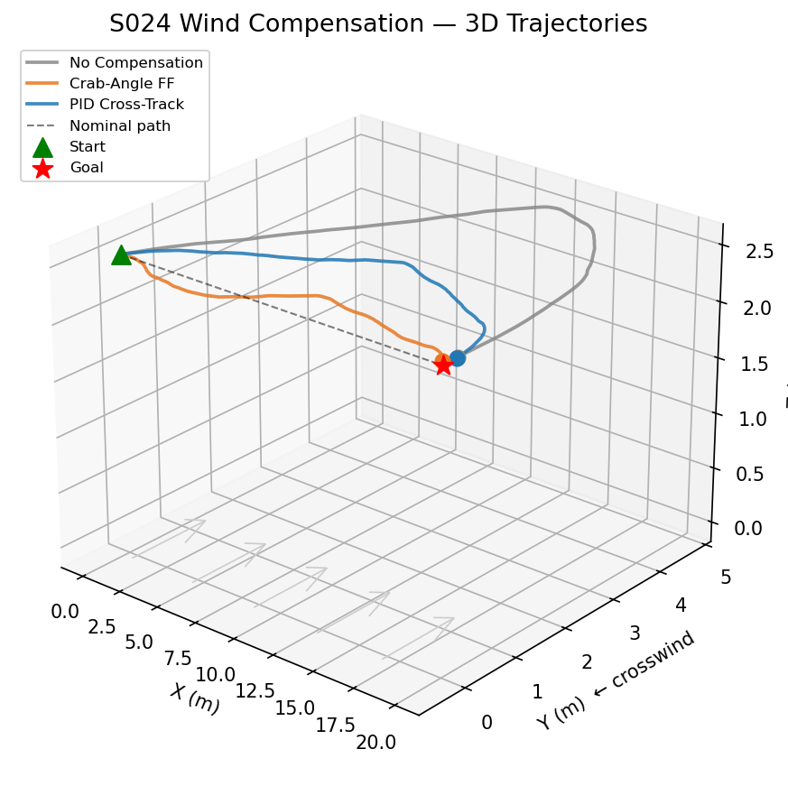
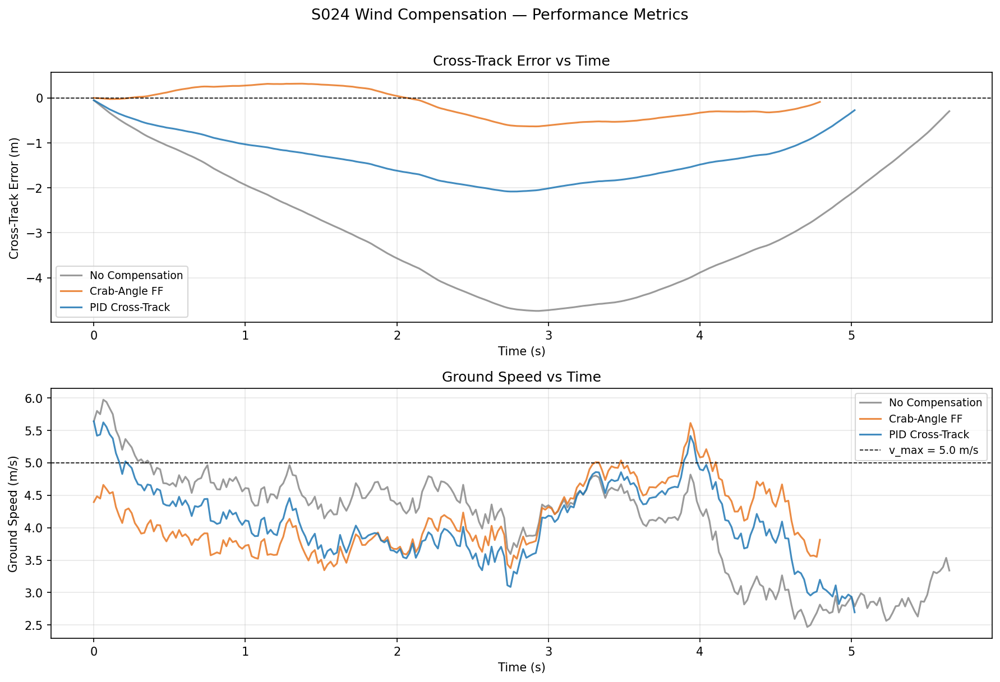
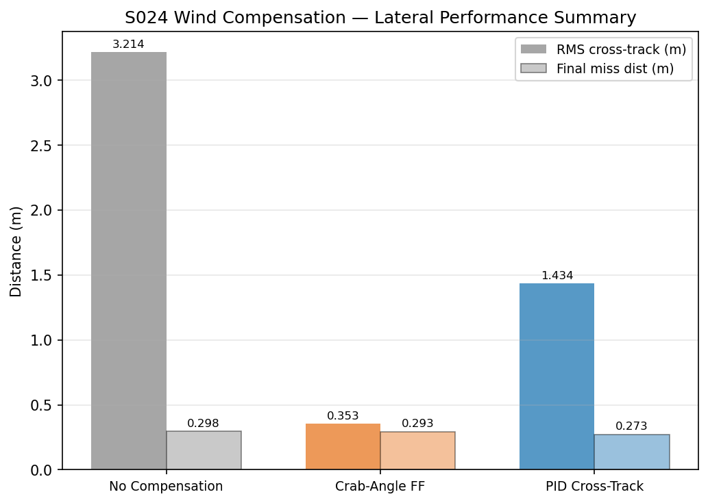
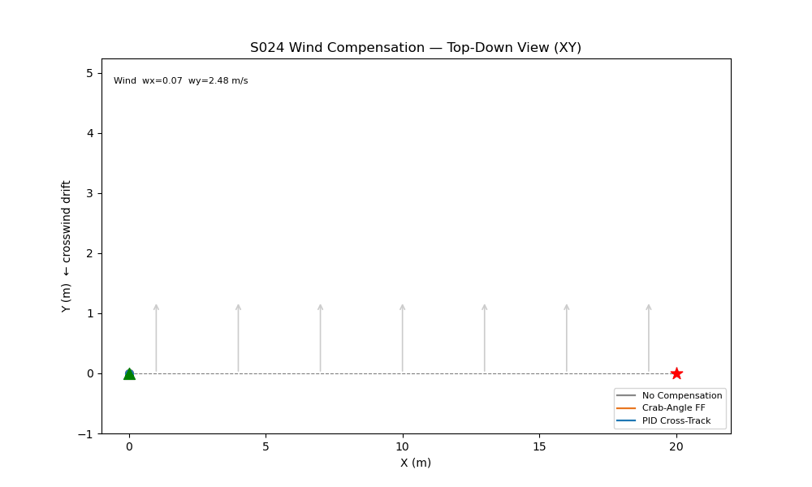

# S024 Wind Compensation

**Domain**: Logistics & Delivery | **Difficulty**: ⭐⭐ | **Status**: ✅ Completed

---

## Problem Definition

**Setup**: A delivery drone flies a straight-line route under a constant crosswind. Three control strategies are compared: no compensation, crab-angle feedforward, and PID cross-track correction. The goal is to minimize cross-track error and reach the target with minimum lateral miss.

**Objective**: Reduce RMS cross-track error (ECT) and final lateral miss using wind compensation, demonstrating the feedforward advantage over pure reactive control.

---

## Mathematical Model Summary

**Dryden wind model** (low-frequency gust component):

$$W(s) = \sigma \cdot \sqrt{\frac{2L}{\pi V}} \cdot \frac{1}{1 + \frac{L}{\pi V} s}$$

**Crab-angle feedforward**: correct heading to cancel wind drift

$$\sin\delta = \frac{w_y}{v_{max}}, \quad \mathbf{v}_{cmd} = v_{max} \cdot R(\delta) \cdot \hat{\mathbf{d}}$$

**PID cross-track correction**: reactive lateral correction proportional to drift error

$$u_{ct} = K_p \cdot e_{ct} + K_i \int e_{ct}\, dt + K_d \dot{e}_{ct}$$

---

## Key Parameters

| Parameter | Value |
|-----------|-------|
| Start position | (0, 0, 2) m |
| Goal position | (20, 0, 2) m |
| Wind speed | 3.0 m/s (y-direction) |
| Drone max speed | 5.0 m/s |
| Control frequency | 50 Hz |
| PID gains | Kp=2.0, Ki=0.1, Kd=0.3 |

---

## Simulation Results

| Strategy | Flight Time | Final Miss | RMS Cross-Track Error |
|----------|------------|------------|----------------------|
| No Compensation | 5.67 s | 0.298 m | **3.214 m** |
| Crab-Angle FF | **4.81 s** | 0.293 m | **0.353 m** ✅ |
| PID Cross-Track | 5.04 s | **0.273 m** | 1.434 m |

Crab-angle feedforward reduces RMS cross-track error by 89% vs no compensation and is 14% faster. PID reactive control achieves the smallest final miss but accumulates more drift during flight. The combination of feedforward + PID would give optimal performance.

---

## Output Files

### 3D Trajectory

Three trajectory paths showing lateral drift under no compensation (red), crab-angle correction (blue), and PID correction (green):

### Cross-Track Error and Speed

Cross-track error over time for all three strategies, plus speed profiles:

### Lateral Bar Chart

Final lateral miss comparison across strategies:

### Animation

---

## Extensions

1. Combine crab-angle feedforward + PID cross-track for best-of-both performance
2. Add time-varying wind (Dryden turbulence model) and compare disturbance rejection
3. Implement Extended Kalman Filter wind estimation for unknown wind scenarios

---

## Related Scenarios

- Prerequisites: [S021](../../../scenarios/02_logistics_delivery/S021_point_delivery.md) — baseline delivery
- Follow-ups: [S034](../../../scenarios/02_logistics_delivery/S034_weather_rerouting.md) — dynamic rerouting around storm zones
