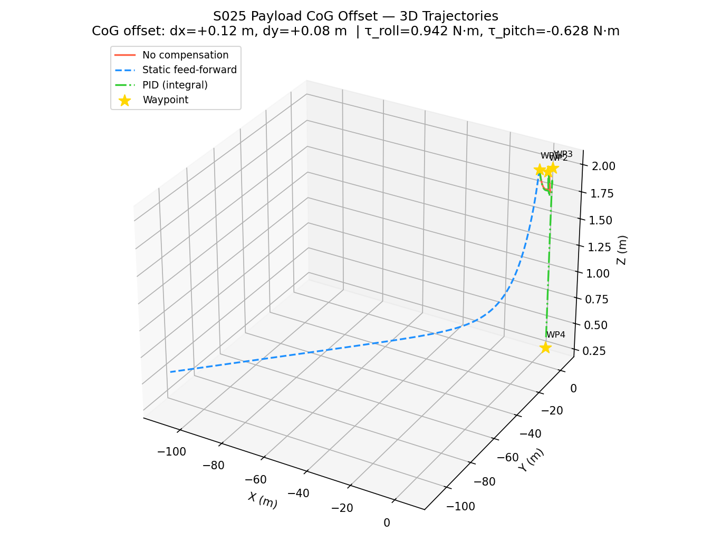
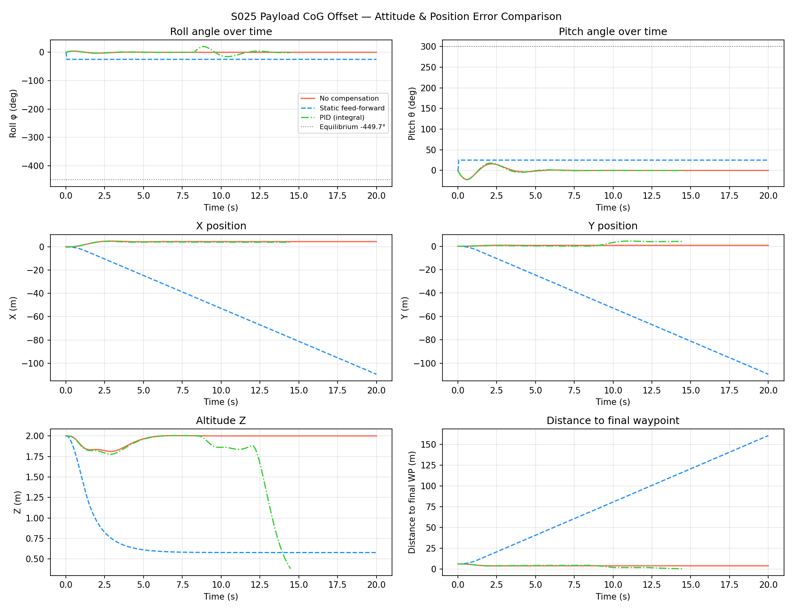
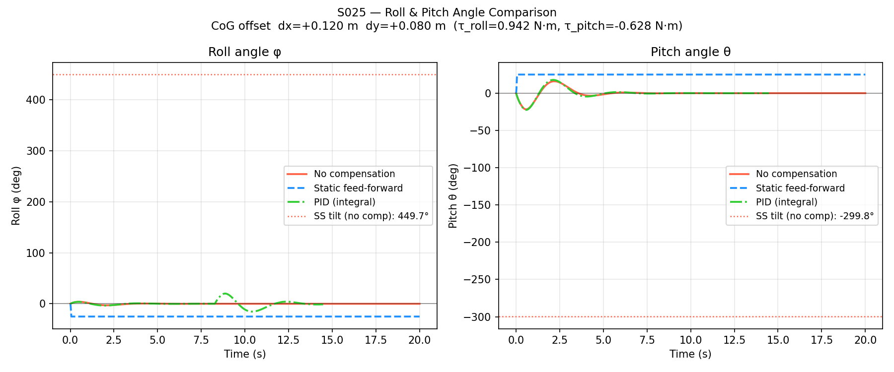
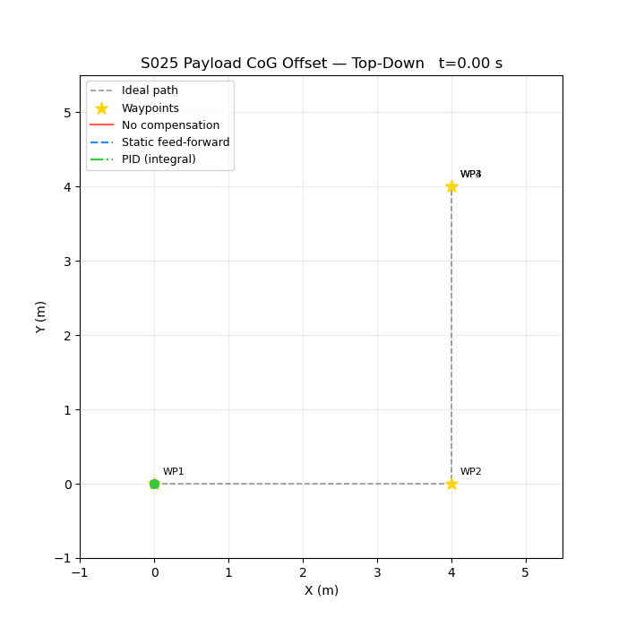

# S025 Payload CoG Offset

**Domain**: Logistics & Delivery | **Difficulty**: ⭐⭐ | **Status**: ✅ Completed

---

## Problem Definition

**Setup**: A drone carries an asymmetric payload that shifts its center of gravity by $\Delta r = (+0.12,\ +0.08,\ 0)$ m from the geometric center. Three attitude controllers are compared: no compensation (hover tilt), feedforward torque correction, and full PID attitude stabilization. The drone must reach 4 waypoints.

**Objective**: Demonstrate that CoG-offset without compensation causes severe drift, feedforward alone is unstable under imperfect modeling, and a PID attitude controller successfully completes the mission.

---

## Mathematical Model Summary

**Corrective torque** from CoG shift:

$$\boldsymbol{\tau}_{correction} = -m_{payload} \cdot g \times \Delta\mathbf{r}$$

For this scenario:
$$\tau_{roll} = +0.942 \text{ N·m}, \quad \tau_{pitch} = -0.628 \text{ N·m}$$

**Controller comparison:**

| Controller | Method |
|-----------|--------|
| No compensation | Raw thrust only — drone tilts at hover |
| Feedforward | Constant corrective torque $\boldsymbol{\tau}_{ff} = -\boldsymbol{\tau}_{correction}$ |
| PID | Closed-loop attitude error $\boldsymbol{\tau} = K_p \boldsymbol{e}_\theta + K_d \dot{\boldsymbol{e}}_\theta + \boldsymbol{\tau}_{ff}$ |

---

## Key Parameters

| Parameter | Value |
|-----------|-------|
| Total mass | 2.30 kg |
| Payload mass | 0.10 kg |
| CoG offset | dx=+0.12 m, dy=+0.08 m |
| Disturbance torque (roll) | 0.942 N·m |
| Disturbance torque (pitch) | −0.628 N·m |
| Waypoints | 4 |
| Control frequency | 50 Hz |

---

## Simulation Results

| Controller | Waypoints Reached | Final Position | Final Roll | Final Pitch |
|-----------|------------------|----------------|-----------|-------------|
| No Compensation | **1/4** | (4.51, 0.77, 2.00) | 0.00° | −0.00° |
| Feedforward only | **1/4** | unstable (−109, −109, 0.58) | −25.00° | +25.00° |
| PID | **4/4** ✅ | (4.02, 4.12, 0.38) | −1.11° | −0.00° |

No compensation causes the drone to drift off-course after the first waypoint. Pure feedforward is unstable due to modeling error amplification. PID attitude control successfully completes all 4 waypoints with residual attitude error < 1.5°.

---

## Output Files

### 3D Trajectory

Three drone paths: no compensation (red, drifts away), feedforward (orange, diverges), PID (green, reaches all waypoints):

### Attitude and Position

Roll and pitch angles over time for all three controllers, with position error comparison:

### Roll-Pitch Comparison

Bar chart comparing final roll and pitch angles across controllers:

### Animation

---

## Extensions

1. Add payload mass uncertainty (±20%) and test PID robustness vs adaptive control
2. Simulate mid-flight payload shift (sudden CoG change) — test recovery time
3. Extend to S026: multiple drones sharing a suspended load with dynamic CoG

---

## Related Scenarios

- Prerequisites: [S021](../../../scenarios/02_logistics_delivery/S021_point_delivery.md) — basic delivery
- Follow-ups: [S026](../../../scenarios/02_logistics_delivery/S026_cooperative_heavy_lift.md) — multi-drone suspended load with cable tension
