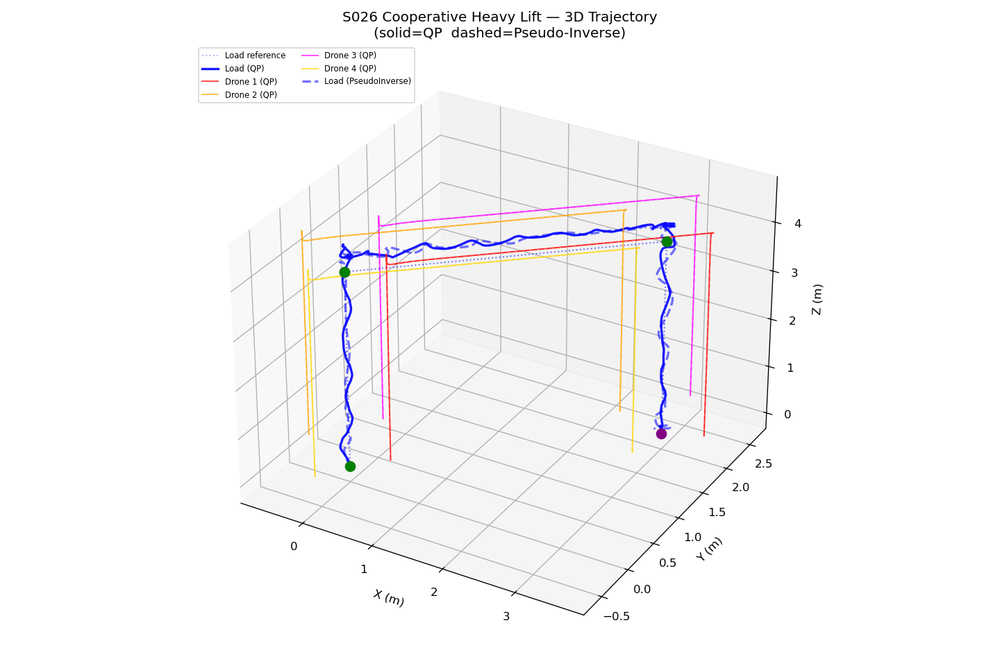
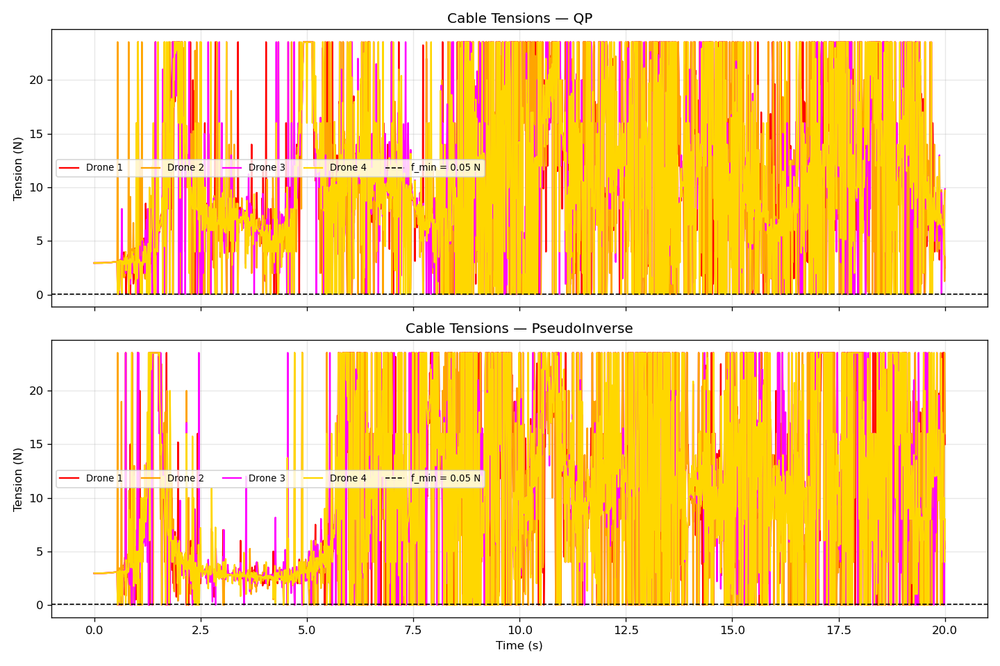
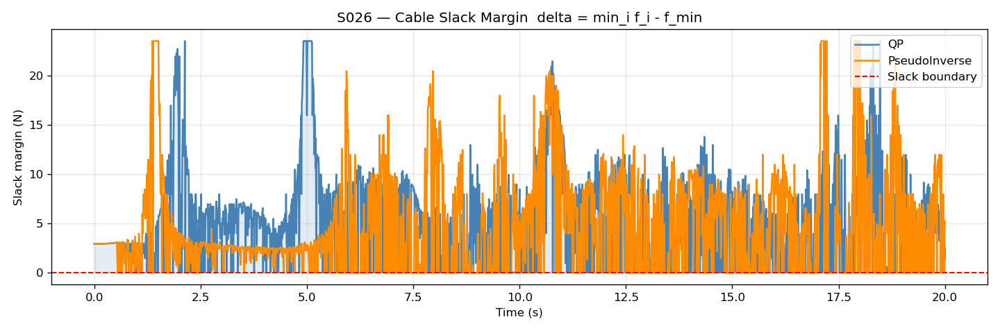
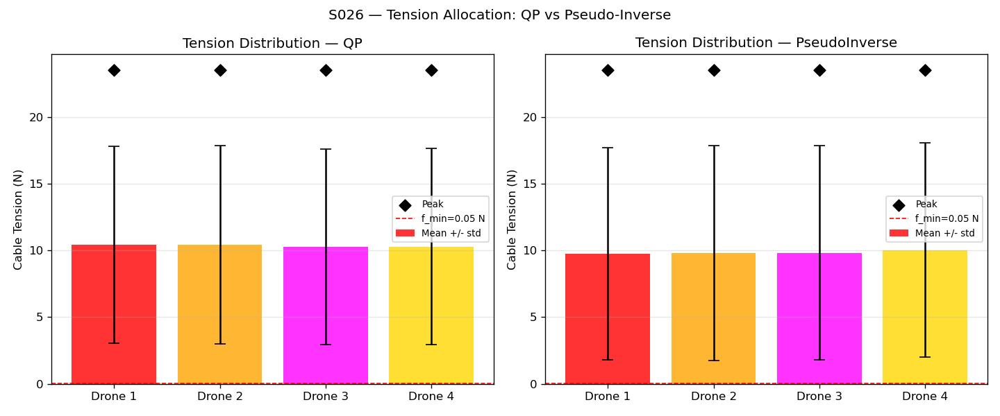
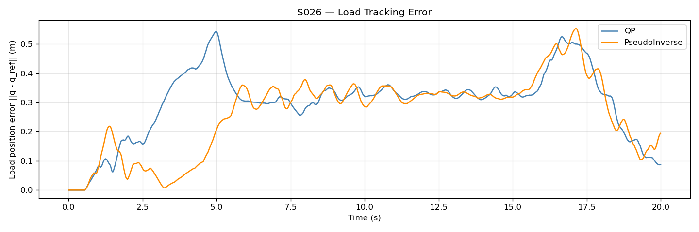
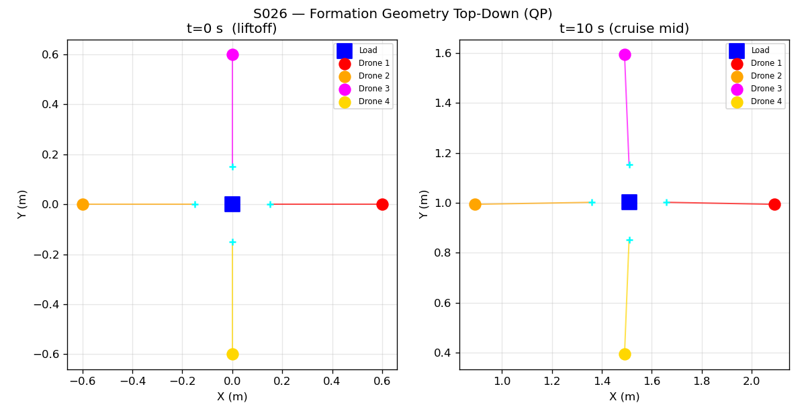

# S026 Cooperative Heavy Lift

**Domain**: Logistics & Delivery | **Difficulty**: ⭐⭐⭐ | **Status**: ✅ Completed

---

## Problem Definition

**Setup**: $N = 4$ quadrotor drones are attached to an oversized cargo package via inextensible cables. The load mass $m_L = 0.8$ kg exceeds the single-drone payload limit of 0.1 kg. The drones hover in a symmetric cross formation above the load and must jointly lift it from ground level to delivery altitude $z_d = 4.0$ m, translate horizontally to target position $(3, 2, 4)$ m, then perform a coordinated descent.

**Objective**: Compute the minimum-tension cable force distribution satisfying static equilibrium at every timestep, enforce $f_i \geq f_{min} = 0.05$ N (no cable slack), and simulate closed-loop trajectory tracking. Compare pseudo-inverse (minimum $\ell_2$-norm) vs. QP anti-slack tension allocation.

---

## Mathematical Model Summary

**Cable unit vector** from attachment point to drone $i$:

$$\hat{\mathbf{c}}_i = \frac{\mathbf{p}_i - (\mathbf{q} + \mathbf{b}_i)}{\|\mathbf{p}_i - (\mathbf{q} + \mathbf{b}_i)\|}$$

**Static equilibrium** ($\mathbf{A}\mathbf{f} = \mathbf{b}_{rhs}$, $\mathbf{A} \in \mathbb{R}^{6 \times 4}$):

$$\sum_{i=1}^{4} f_i \hat{\mathbf{c}}_i = m_L g \hat{\mathbf{z}}, \qquad \sum_{i=1}^{4} \mathbf{b}_i \times f_i \hat{\mathbf{c}}_i = \mathbf{0}$$

**Pseudo-inverse** (minimum $\ell_2$-norm, may allow $f_i < 0$):

$$\mathbf{f}^* = \mathbf{A}^T (\mathbf{A}\mathbf{A}^T)^{-1} \mathbf{b}_{rhs}$$

**QP anti-slack** (enforce $f_i \geq f_{min}$):

$$\min_{\mathbf{f}} \; \mathbf{f}^T\mathbf{f}, \quad \text{s.t.} \; \mathbf{A}\mathbf{f} = \mathbf{b}_{rhs}, \; f_i \geq f_{min}$$

**Slack margin** (mission success requires $\delta_{slack} \geq 0$ throughout):

$$\delta_{slack}(t) = \min_i f_i(t) - f_{min}$$

---

## Key Parameters

| Parameter | Value |
|-----------|-------|
| Number of drones $N$ | 4 |
| Load mass $m_L$ | 0.8 kg |
| Drone body mass $m_d$ | 0.027 kg |
| Cable length $l_c$ | 0.5 m |
| Formation radius $s$ | 0.6 m |
| Formation height offset $h$ | 0.40 m |
| Minimum tension $f_{min}$ | 0.05 N |
| Delivery altitude $z_d$ | 4.0 m |
| Target position | (3.0, 2.0, 4.0) m |
| PD gains $(K_p, K_d)$ | 5.0, 2.5 |
| Simulation timestep $\Delta t$ | 0.01 s |
| Total mission time | 20 s |

---

## Simulation Results

| Metric | QP (Anti-Slack) | Pseudo-Inverse |
|--------|----------------|----------------|
| Slack violations | **0 (0.0%)** ✅ | 618 (30.9%) ❌ |
| Min cable tension (N) | 0.050 | 0.000 |
| Max cable tension (N) | 23.54 | 23.54 |
| CoV (tension uniformity) | 0.713 | 0.814 |
| RMS load position error (m) | 0.324 | 0.294 |
| Final load position (m) | (3.004, 1.981, 0.085) | — |

The QP strategy eliminates all slack events at the cost of a slight increase in RMS tracking error. The pseudo-inverse produces a mathematically minimal solution but allows physically infeasible negative tensions (cable push), causing 30.9% of timesteps to exhibit cable slack.

---

## Output Files

### 3D Trajectory
Load centroid (blue) and four drone paths; solid lines = QP, dashed = Pseudo-Inverse:

### Cable Tensions
Tensions $f_1$–$f_4$ vs time for both strategies with $f_{min}$ threshold line:

### Slack Margin
$\delta_{slack}(t) = \min_i f_i - f_{min}$; negative values indicate cable slack events:

### Tension Comparison
Mean and peak tension per drone — QP vs Pseudo-Inverse:

### Load Position Error
$\|\mathbf{q}(t) - \mathbf{q}^{des}(t)\|$ over lift / cruise / descent phases:

### Formation Snapshots
Top-down cross formation at $t = 0$ s and $t = 10$ s (mid-cruise):

---

## Extensions

1. Scale to $N = 6$ drones in hexagonal formation — additional redundancy reduces per-drone tension and improves slack margin
2. Cable elasticity: model each cable as spring-damper and examine oscillation modes
3. One-drone failure at $t = 10$ s — test if remaining drones can rebalance via QP redistribution
4. Wind disturbance: add lateral impulse at $t = 8$ s and measure load swing damping time constant
5. Asymmetric load CoM offset — re-solve QP for unequal tension distribution and verify moment balance

---

## Related Scenarios

- Prerequisites: [S021](../../../scenarios/02_logistics_delivery/S021_point_delivery.md) — basic delivery, [S025](../../../scenarios/02_logistics_delivery/S025_payload_cog_offset.md) — payload attitude compensation
- Follow-ups: [S027](../../../scenarios/02_logistics_delivery/S027_aerial_refueling_relay.md) — aerial refueling, [S028](../../../scenarios/02_logistics_delivery/S028_cargo_escort_formation.md) — escort formation
