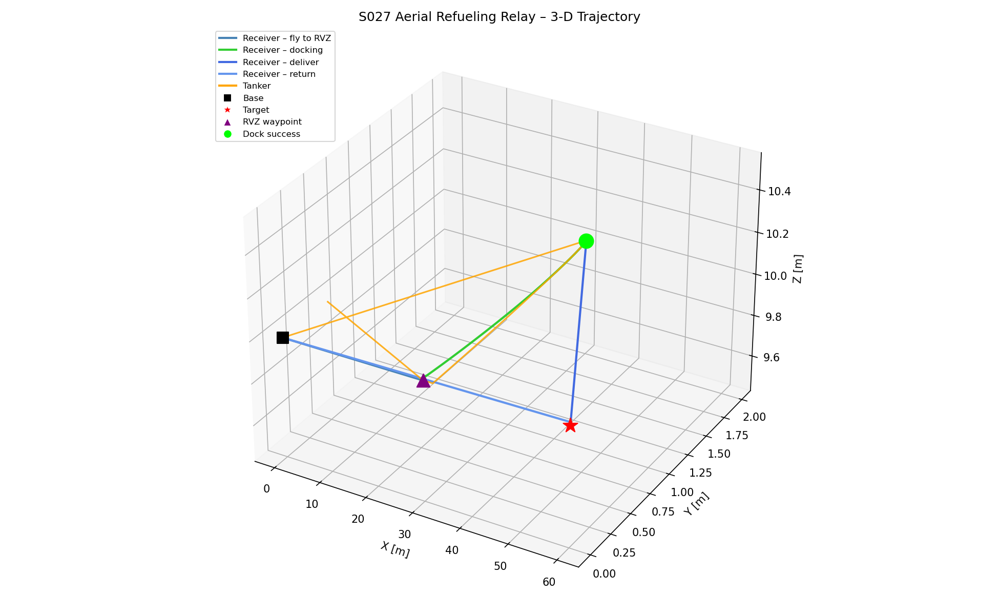
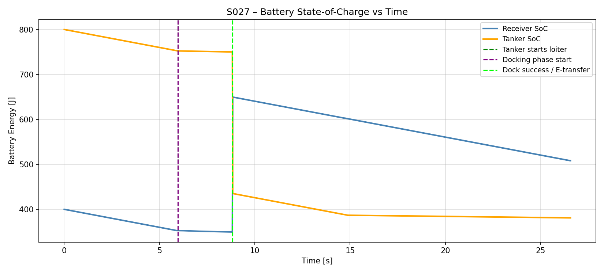
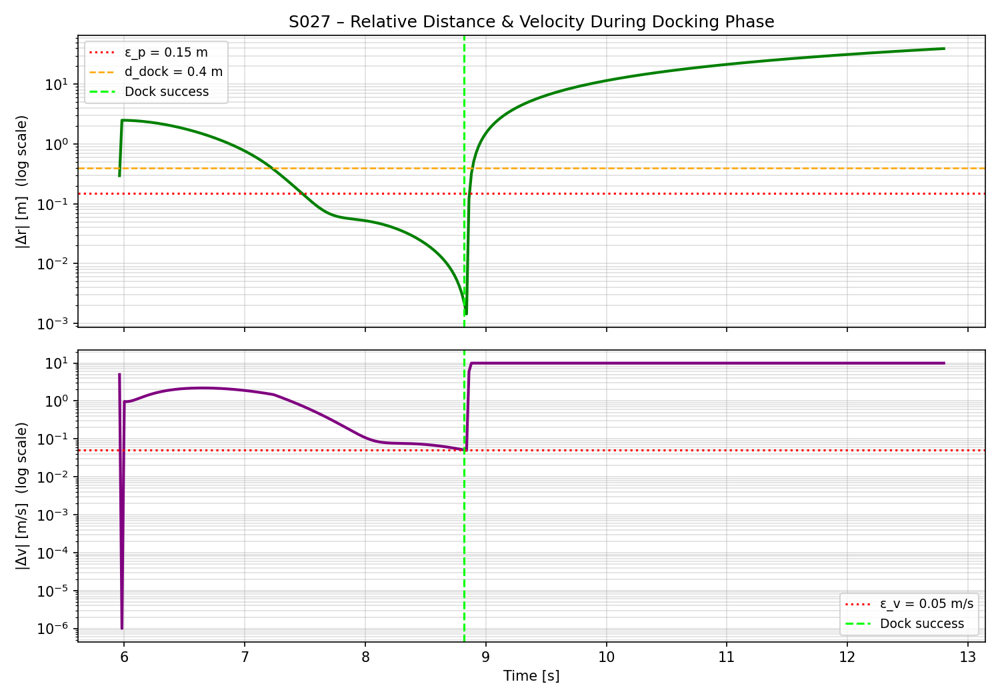
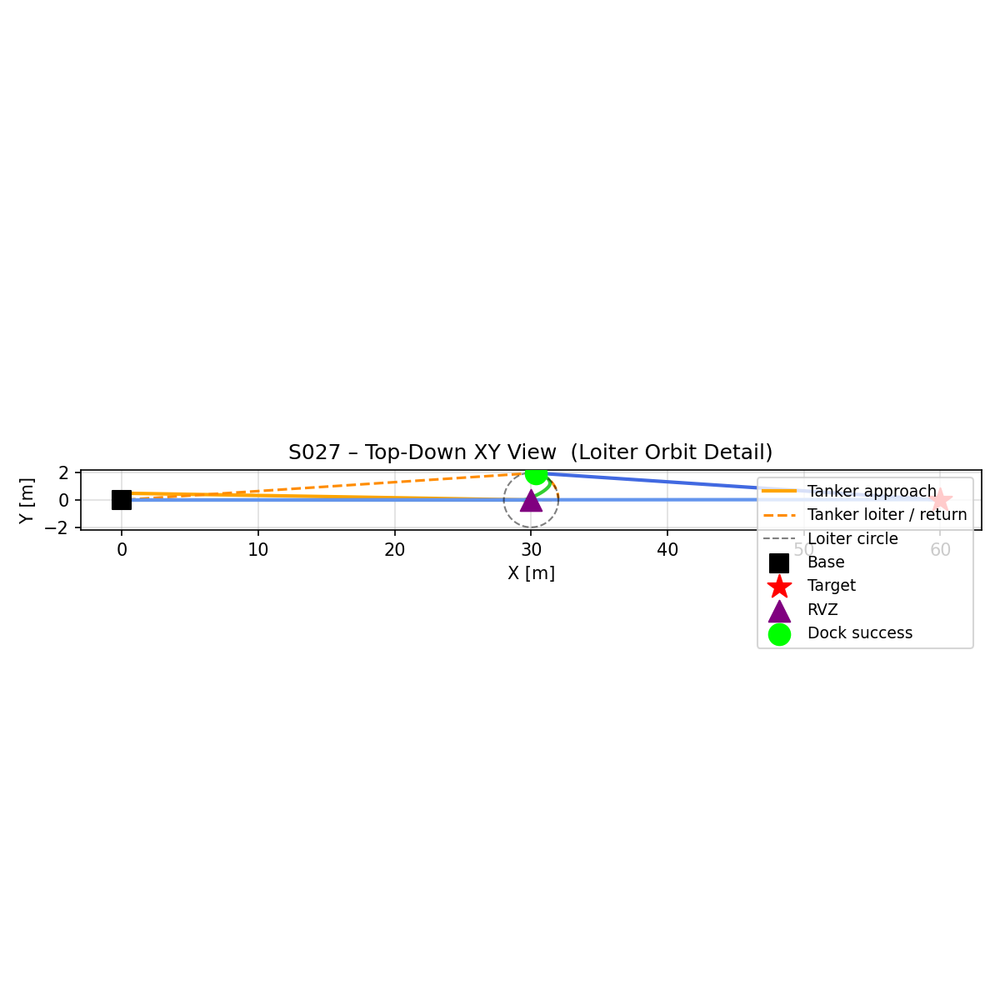
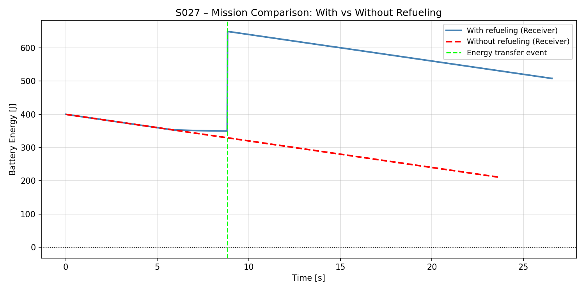

# S027 Aerial Refueling Relay — Simulation Outputs

## Problem Definition

A delivery drone (Receiver) departs from a base station toward a target 60 m away. Its battery alone is insufficient for the full round trip. A tanker drone launches simultaneously, flies ahead to a rendezvous waypoint at the mission midpoint, holds a loiter orbit, and waits for the Receiver. When the Receiver achieves soft-docking (relative position < ε_p, relative velocity < ε_v), an energy transfer is executed. The Receiver then resumes delivery; the Tanker returns to base.

## Mathematical Model Summary

| Component | Model |
|---|---|
| Battery drain | E_dot = -(k_f * v^2 + k_h) |
| Remaining range | d_rem = (E / power) * v |
| Rendezvous waypoint | w_rvz = (1-alpha)*base + alpha*target |
| Loiter orbit | p_T = w_rvz + R_orb * [cos(omega*t), sin(omega*t), 0] |
| Approach control (Phase 1) | u_R = -Kp*dr - Kd*dv + a_T (feedforward) |
| Soft-dock control (Phase 2) | u_R = -Kp2*dr - Kd2*dv |
| Energy transfer | E_R += dE_xfer; E_T -= dE_xfer*(1+eta_loss) |

## Key Parameters

| Parameter | Value |
|---|---|
| Cruise speed (both drones) | 5.0 m/s |
| Tanker loiter speed | 1.0 m/s |
| Loiter radius | 2.0 m |
| Flight power coefficient k_f | 0.3 W·s²/m² |
| Hover baseline drain k_h | 0.5 W |
| Receiver initial battery E0_R | 400 J |
| Tanker initial battery E0_T | 800 J |
| Energy transferred dE_xfer | 300 J |
| Transfer loss fraction eta_loss | 5% |
| Docking engagement radius d_dock | 0.4 m |
| Position dock tolerance eps_p | 0.15 m |
| Velocity dock tolerance eps_v | 0.05 m/s |
| Approach PD gains (Kp, Kd) | (3.0, 2.0) |
| Soft-dock PD gains (Kp2, Kd2) | (6.0, 4.0) |
| Rendezvous fraction alpha | 0.5 (midpoint) |
| Base-to-target distance | 60.0 m |
| Simulation time-step DT | 0.02 s |

## Simulation Results

| Metric | Value |
|---|---|
| Simulation duration | 26.56 s |
| Rendezvous waypoint | [30.0, 0.0, 10.0] m |
| Tanker loiter start | 5.96 s |
| Docking phase start | 5.96 s |
| Docking success time | 8.82 s |
| Docking duration | 2.86 s |
| Position error at dock | 0.0023 m (tol 0.15 m) |
| Velocity error at dock | 0.0496 m/s (tol 0.05 m/s) |
| Energy transferred | 300.0 J (5% loss) |
| Receiver final SoC | 508.23 J |
| Tanker final SoC | 381.01 J |
| Mission status | SUCCESS |

## Output Files

| File | Description |
|---|---|
| `trajectory_3d.png` | 3D trajectory of Receiver (colour-coded by FSM phase) and Tanker; rendezvous waypoint, docking success point, base and target marked |
| `battery_plot.png` | Battery SoC vs time for both drones with vertical event markers (loiter start, docking start, dock success) |
| `battery_soc.png` | Same as battery_plot.png |
| `docking_relative_motion.png` | Semi-log plots of relative distance and relative velocity during docking phase |
| `loiter_orbit_topdown.png` | Top-down XY view showing the tanker loiter orbit and Receiver spiral approach |
| `mission_comparison.png` | Battery energy comparison: mission with refueling vs mission without refueling (forced landing scenario) |

### trajectory_3d.png

### battery_plot.png

### docking_relative_motion.png

### loiter_orbit_topdown.png

### mission_comparison.png

## Extensions

1. Optimal rendezvous fraction: sweep alpha in [0.3, 0.7] and minimise total mission time
2. Wind disturbance during docking: add turbulence model and re-tune PD gains
3. Multi-hop refueling chain: add a second Tanker for ultra-long-range delivery
4. Partial transfer strategy: transfer only the minimum required energy
5. Moving refueling platform: Tanker flies straight segment, Receiver intercepts a moving target

## Related Scenarios

- Prerequisites: [S021 Point Delivery](../s021_point_delivery/), [S024 Wind Compensation](../s024_wind_compensation/)
- Follow-ups: [S028 Cargo Escort Formation](../s028_cargo_escort_formation/), [S036 Last Mile Relay](../s036_last_mile_relay/)
- Cross-domain: S012 Relay Pursuit — relay handoff state machine pattern
